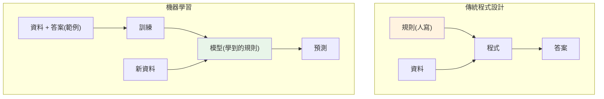

# 機器學習概論

> 傳統程式設計是「**你寫規則,程式套用規則**」——if 這樣就那樣。但有些問題規則寫不出來:怎麼寫「規則」判斷一張圖是不是貓?怎麼寫死「規則」預測房價?**機器學習(machine learning)** 反轉了這件事:**你給資料和答案,程式自己學出規則**。這章講機器學習到底是什麼、和傳統程式差在哪、有哪些類型、以及最重要的——**什麼時候該用、什麼時候不該用**。

## Why(為什麼)

先破除一個迷思:**機器學習不是萬能,也不總是最好的選擇**。理解它「解決什麼問題、代價是什麼」,比急著 `import sklearn` 重要得多。

傳統程式設計要你**明確寫出規則**:「若溫度 > 30 且濕度 > 70,就開除濕機」。這對規則清楚的問題很好。但很多問題**規則寫不出來或太複雜**:

- **規則太複雜/寫不完**:判斷 email 是不是垃圾信——垃圾信的花樣無窮,你寫幾百條 if 也追不完,而且攻擊者一變你就失效。
- **規則說不清**:辨識手寫數字、判斷圖片內容、預測明天銷量——這些**人類會做但說不出精確規則**(你怎麼「規則化」認出數字 7?)。
- **規則會變**:使用者偏好、市場趨勢一直變,寫死的規則很快過時。

**機器學習**的核心洞見:**與其寫規則,不如給模型大量「輸入 + 正確答案」的範例,讓它自己找出從輸入到答案的規律(規則)**。學到的規律(模型)再拿去對**新資料**做預測。這讓我們能解決「規則寫不出來、但有很多範例資料」的問題——這正是垃圾信過濾、影像辨識、推薦系統、[LLM](../28-llm-genai/README.md) 背後的範式。

但 ML 有代價:**需要大量資料、結果不保證正確(是機率性的)、是黑箱(難解釋)、要持續維護**。**能用簡單規則解決的,別上 ML**——這是 ML Engineer 的第一課(呼應 [LLMOps 的「該不該用」](../30-production-ai/01-llmops-intro.md))。

## Theory(理論:ML 的範式與類型)

**傳統程式 vs 機器學習**:

```text
傳統程式:  規則 + 資料 → 答案      (你寫規則)
機器學習:  資料 + 答案 → 規則(模型) (程式學規則)
           模型 + 新資料 → 預測
```

ML 是「**從資料歸納出規律**」的過程,分兩階段:**訓練(training)**——用「輸入 + 答案」的資料學出模型;**推論(inference)**——用模型對新輸入做預測。

**三大類型**:

- **監督式學習(supervised)**:資料有「正確答案(標籤,label)」。學「輸入 → 輸出」的對應。兩子類:
  - **回歸(regression)**:預測**連續數值**(房價、銷量、溫度)。
  - **分類(classification)**:預測**類別**(垃圾信/正常、貓/狗、及格/不及格)。
  - 本 Part 主軸([回歸](04-linear-regression.md)、[分類](05-classification.md))。
- **非監督式學習(unsupervised)**:資料**沒有標籤**,找資料本身的結構。如**聚類**(把相似的分群,[Part 26](../26-advanced-ml/README.md))、**降維**(壓縮特徵)。
- **強化學習(reinforcement)**:透過**與環境互動、獎懲回饋**學策略(遊戲 AI、機器人)。本書不深入。

**核心術語**:**特徵(feature)**——輸入變數(讀書時數、房屋坪數);**標籤(label/target)**——要預測的答案;**模型(model)**——學到的從特徵到標籤的映射;**訓練/推論**——學 vs 用。

## Specification(規範:何時用 ML)

**適合用 ML 的問題**(全都滿足才划算):

- [ ] **規則複雜到寫不出來/寫不完**(垃圾信、影像辨識)。
- [ ] **有足夠的、有代表性的資料**(尤其監督式需要**帶標籤**的資料,常是最大瓶頸)。
- [ ] **模式是穩定、可學習的**(輸入與輸出間確實有規律)。
- [ ] **容忍機率性錯誤**(ML 預測不保證 100% 正確;高風險場景要謹慎)。
- [ ] **值得這代價**(資料、運算、維護、可解釋性的成本)。

**不該用 ML 的情況**:

- **簡單規則就能解**:「滿 18 歲可註冊」寫個 `if age >= 18` 就好,別訓練模型。
- **沒有足夠資料**:ML 靠資料學習,資料太少學不出東西(garbage in garbage out)。
- **需要 100% 正確或完全可解釋**:ML 是機率性、常是黑箱,不適合零容錯或強監管場景(除非用可解釋模型)。
- **模式不穩定**:規律一直變,學了也很快失效。

**判準**:能寫簡單規則就寫規則;規則寫不出來、有資料、容忍機率錯誤,才考慮 ML。

## Implementation(底層:ML 如何「學」、泛化才是目的)

**ML 怎麼「學規則」**:以最簡單的例子——從「讀書時數 → 及格與否」學一個閾值。**學習**的本質是:定義一個**帶參數的模型**(這裡是「時數 ≥ t 就及格」,參數是 t)、定義一個**衡量好壞的目標**(預測對幾個),然後**調整參數讓目標最佳**(試各種 t,選訓練準確率最高的)。真實 ML 用[梯度下降](../27-deep-learning/02-backpropagation.md)等最佳化方法自動調數百萬個參數,但**核心邏輯一樣:模型 + 目標函式 + 最佳化**。下面範例用「學閾值」示範這個縮影——對比「人猜閾值」與「從資料學閾值」。

**關鍵目的是「泛化(generalization)」而非「記住」**:ML 的目標**不是**在訓練資料上表現好,而是在**沒見過的新資料**上表現好。一個模型若只是「背下」訓練資料(死記每個範例的答案),遇到新資料就完蛋——這叫**過擬合([overfitting](07-overfitting-regularization.md))**。真正有用的模型要學到**可推廣的規律**。這就是為什麼[一定要用沒見過的資料評估](02-ml-workflow.md)(train/test split)——在訓練資料上看準確率是**自欺欺人**。**「泛化到新資料」是 ML 的終極目標**,貫穿整個 Part。

**ML 是機率性、非確定性**:傳統程式同輸入同輸出;ML 模型的預測是**基於學到的統計規律的最佳猜測**,會錯。所以[評估要看統計指標](06-model-evaluation.md)(準確率、[precision/recall](06-model-evaluation.md))而非「對或錯」,且要接受「一定比例的錯誤」。下面範例示範「從資料學規則」勝過「人猜規則」。

## Code Example(可執行的 Python 範例)

```python
# ml_intro.py — 規則式 vs 學習式:從資料學規則(純標準庫,ML 的縮影)
from __future__ import annotations


def rule_based(hours: float) -> int:
    """規則式:人手動猜一個閾值(5 小時)。"""
    return 1 if hours >= 5 else 0


def learn_threshold(features: list[float], labels: list[int]) -> tuple[float, float]:
    """學習式:試各種閾值,選訓練準確率最高的(『學習』的縮影:模型+目標+最佳化)。"""
    best_threshold, best_acc = 0.0, -1.0
    for t in sorted(set(features)):
        preds = [1 if x >= t else 0 for x in features]
        acc = sum(p == y for p, y in zip(preds, labels, strict=True)) / len(labels)
        if acc > best_acc:
            best_acc, best_threshold = acc, t
    return best_threshold, best_acc


def accuracy(preds: list[int], labels: list[int]) -> float:
    return sum(p == y for p, y in zip(preds, labels, strict=True)) / len(labels)


def main() -> None:
    # 訓練資料:(讀書時數, 是否及格),實際約 4 小時就會及格
    hours = [1, 2, 3, 4, 6, 7, 8, 9]
    passed = [0, 0, 0, 1, 1, 1, 1, 1]

    # 規則式:人猜閾值 5
    rule_preds = [rule_based(h) for h in hours]
    print(f"規則式:人猜閾值 5 → 準確率 {accuracy(rule_preds, passed):.0%}")

    # 學習式:從資料學出閾值
    learned_t, learned_acc = learn_threshold(hours, passed)
    print(f"學習式:從資料學到閾值 {learned_t} → 準確率 {learned_acc:.0%}")
    print("→ 學習式從資料找出更好的規則,不靠人猜;真實 ML 學的是數百萬參數")


if __name__ == "__main__":
    main()
```

**預期輸出**:

```pycon
$ python ml_intro.py
規則式:人猜閾值 5 → 準確率 88%
學習式:從資料學到閾值 4 → 準確率 100%
→ 學習式從資料找出更好的規則,不靠人猜;真實 ML 學的是數百萬參數
```

逐段解說:

- **規則式**:人**主觀猜**「讀 5 小時會及格」寫死。但這是猜的——實際上約 4 小時就及格,所以人猜的閾值 5 會**誤判**讀 4 小時的那筆(它其實及格了但被判不及格),準確率只 88%。**規則式受限於人的先驗知識,常不夠準。**
- **學習式**:`learn_threshold` **從資料自己找**——試每個可能閾值,選「在訓練資料上預測最準」的。它找到 `t=4`(資料真正的分界),準確率 100%。**這就是 ML 的本質:不靠人猜規則,而是定義「模型(閾值判斷)+ 目標(準確率)+ 最佳化(試選最佳)」,讓程式從資料學出規則。**
- **這是 ML 的縮影**:真實 ML 的模型有數百萬參數([神經網路](../27-deep-learning/README.md))、用[梯度下降](../27-deep-learning/02-backpropagation.md)自動最佳化,但**核心三件事一樣:模型、目標函式、最佳化**。理解這個縮影,你就懂了 ML 在做什麼。
- **重要提醒(泛化)**:這裡的 100% 是在**訓練資料**上——真正該問的是「對**新學生**準不準」。若只在訓練資料上調到完美卻對新資料很差,就是[過擬合](07-overfitting-regularization.md)。**下一章就講怎麼用 train/test split 誠實評估泛化能力**。

## Diagram(圖解:傳統程式 vs ML)



## Best Practice(最佳實踐)

- **先問「能不能用簡單規則」**:能就別上 ML(維護簡單、可解釋、可靠)。
- **確認有足夠且有代表性的資料**:監督式需要帶標籤資料,常是最大瓶頸。
- **記住目的是泛化**:對新資料表現好才算數,別在訓練資料上自我感覺良好。
- **接受 ML 是機率性**:會錯,用統計指標評估、容忍一定錯誤率。
- **從簡單模型開始**:[線性/邏輯回歸](04-linear-regression.md)當 baseline,別一開始就上複雜模型。
- **釐清是回歸還是分類**:預測數值 vs 類別,決定用什麼模型與指標。
- **考慮可解釋性與維護成本**:黑箱模型在高風險/強監管場景要謹慎。
- **ML 是手段不是目的**:為了解決問題,別為了用 ML 而用 ML。

## Common Mistakes(常見誤解)

- **簡單問題硬上 ML**:`if age >= 18` 的事訓練個模型,徒增複雜與不可靠。
- **以為 ML 萬能**:規則寫不出、資料不足、要 100% 正確的場景,ML 不一定適合。
- **在訓練資料上評估就宣稱成功**:沒測泛化,可能嚴重過擬合。
- **資料不足硬訓練**:garbage in garbage out,學不出有用規律。
- **混淆回歸與分類**:預測數值用了分類、預測類別用了回歸,指標與模型都錯。
- **忽略 ML 的機率性**:期待每次都對,用在零容錯場景出事。
- **忽略資料品質**:垃圾資料訓出垃圾模型,再好的演算法也救不回。
- **為用 ML 而用 ML**:履歷驅動開發,不是問題驅動。

## Interview Notes(面試重點)

- **能對比傳統程式 vs ML**:規則+資料→答案 vs 資料+答案→規則(模型)。
- **能講 ML 三大類型**:監督(回歸/分類)、非監督(聚類/降維)、強化學習。
- **能區分回歸 vs 分類**:預測連續數值 vs 類別。
- **能講何時該/不該用 ML**:規則寫不出+有資料+容忍機率錯誤才用;簡單規則能解就別用。
- **能講「泛化」是 ML 的目的**:對新資料表現好,而非記住訓練資料(過擬合)。
- **能講 ML 的核心三件事**:模型 + 目標函式 + 最佳化;知道 ML 是機率性、要看統計指標。

---

➡️ 下一章:[ML 工作流與 train/test split](02-ml-workflow.md)

[⬆️ 回 Part 25 索引](README.md)
