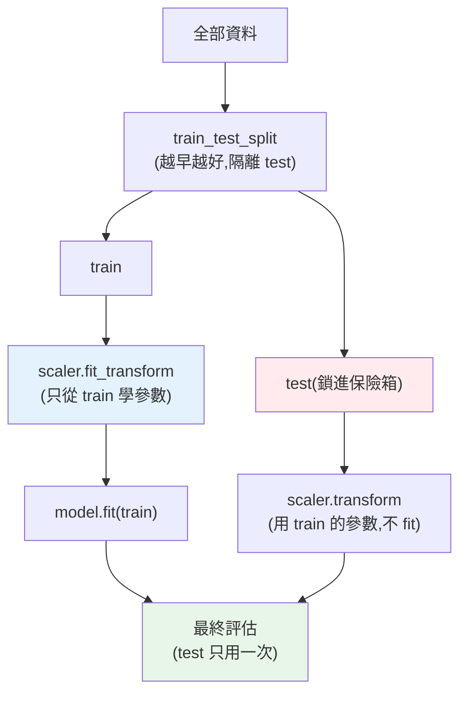

# ML 工作流與 train/test split

> [上一章](01-ml-intro.md)說「ML 的目的是**泛化到新資料**」——但你怎麼**知道**模型泛化得好?不能用訓練資料評估(那是自欺欺人)。答案是 **train/test split**:留一部分資料**完全不給模型看**,拿它當「新資料」來測。這個看似簡單的動作,是整個 ML 工作流的基石,而**破壞它(資料洩漏)** 是新手最常犯、最致命的錯。這章講完整 ML 工作流與正確的資料切分。

## Why(為什麼)

假設你訓練一個模型,在訓練資料上準確率 99%——**這代表模型很好嗎?完全不代表。** 一個把訓練資料**死記硬背**的模型,在訓練資料上也能 99%,但遇到新資料就一敗塗地([過擬合](07-overfitting-regularization.md))。就像學生把考古題答案背下來,考同樣的題滿分,換新題就不會——他沒**學會**,只是**記住**。

所以評估 ML 模型有一條鐵律:**必須用模型「沒見過」的資料評估**。做法是 **train/test split**——把資料分成兩份:**訓練集(train)** 給模型學,**測試集(test)** 藏起來、模型訓練時完全碰不到,最後拿它當「新資料」測模型的真實表現。測試集上的表現,才是**泛化能力**的誠實估計。

但這裡有個極其陰險的陷阱:**資料洩漏(data leakage)**——測試集的資訊**不小心洩漏進訓練過程**,讓模型「偷看」到本該藏起來的資料,評估分數虛高、上線後暴跌。最經典的洩漏是「在 split 之前做資料前處理(如標準化)」——前處理**看了整份資料(含測試集)** 的統計量,測試集就不再是「沒見過的」了。這個錯**不會報錯、分數還很漂亮**,但整個評估作廢。這章教你正確的工作流,避開這個坑。

## Theory(理論:ML 工作流與資料切分)

**完整 ML 工作流**:

```text
1. 定義問題 + 收集資料
2. 切分資料(train / validation / test)← 越早越好,先隔離 test
3. EDA + 特徵工程(只在 train 上學前處理的參數)
4. 訓練模型(在 train 上 fit)
5. 調參/選模型(用 validation 或交叉驗證)
6. 最終評估(用從未碰過的 test)
7. 部署 + 監控(見 Part 30 的 LLMOps 思維)
```

**三種資料集**:

- **訓練集(train)**:模型**學習**用(fit 參數)。
- **驗證集(validation)**:**調超參數、選模型**用(見 [交叉驗證](07-overfitting-regularization.md))。不能用 test 做這件事(否則 test 被「間接學習」)。
- **測試集(test)**:**最終、一次性**的泛化評估。**訓練與調參全程都不能碰**,只在最後看一次。

**常見比例**:train/test 70/30 或 80/20;有 validation 時 60/20/20。資料少用[交叉驗證](07-overfitting-regularization.md)替代固定 validation。

**分層抽樣(stratified split)**:分類問題若類別不平衡(如 90% 正常、10% 詐騙),隨機切可能讓某集的某類別過少。`stratify=y` 讓 train/test **保持相同的類別比例**,評估才有代表性。

## Specification(規範:split 與前處理順序)

**正確順序(關鍵)**:

```python
from sklearn.model_selection import train_test_split
from sklearn.preprocessing import StandardScaler

# 1. 先切分(test 立刻隔離)
X_train, X_test, y_train, y_test = train_test_split(
    X, y, test_size=0.3, random_state=42, stratify=y  # 固定 random_state 可重現
)

# 2. 前處理的參數「只從 train 學」
scaler = StandardScaler()
X_train_scaled = scaler.fit_transform(X_train)  # fit:算 train 的 mean/std
X_test_scaled = scaler.transform(X_test)        # transform:用 train 的 mean/std(不 fit!)

# 3. 訓練
model.fit(X_train_scaled, y_train)

# 4. 最終評估(test 只在此時用一次)
model.score(X_test_scaled, y_test)
```

**鐵律**:任何「從資料學參數」的前處理(標準化、填補缺值的平均、編碼、特徵選擇)——**參數只能從 train 學(`fit`),再套用到 test(`transform`)**。`fit` 絕不能看到 test。

**`random_state`**:固定它讓切分**可重現**(每次跑同樣的分法),便於除錯與比較。教學/測試必設。

## Implementation(底層:為何 leakage 致命、fit vs transform)

**資料洩漏為何讓分數虛高又難察覺**:標準化要算「平均和標準差」。若你在 split **之前**對整份資料 `fit_transform`,算出的平均/標準差**包含了測試集的資訊**——測試集的分布特徵「洩漏」進了前處理。於是模型評估時,測試集已經不是「純粹沒見過的資料」(它的統計特徵早已透過標準化參數影響了訓練)。結果:**測試分數虛高**(因為 test 沒那麼「陌生」),你以為模型很強,上線遇到真正的新資料才發現暴跌。**最陰險的是它不報錯、分數還很漂亮**——你根本不知道評估已經作廢。這是 ML 面試與實務的超高頻陷阱。

**`fit` vs `transform` 的分工正是防洩漏的機制**:`fit` = **學習前處理的參數**(算 train 的 mean/std);`transform` = **套用已學的參數**。正確流程是 `scaler.fit_transform(X_train)`(從 train 學 + 套用)然後 `scaler.transform(X_test)`(**只套用 train 學到的參數**,不重新 fit)。這樣測試集是用「訓練時就固定的規則」轉換——完全模擬「上線後遇到新資料時,你只能用訓練期學到的參數處理它」的真實情境。**這也是為什麼要用 [sklearn Pipeline](../26-advanced-ml/README.md)**:它把前處理和模型綁在一起,`fit` 時自動只在 train 上學前處理參數,從結構上杜絕洩漏。

**為何越早 split 越好**:一切前處理、EDA 的「學習性動作」都應在 split **之後**、**只在 train 上**做。所以工作流第一件事就是切分、隔離 test——之後 test 像鎖進保險箱,直到最終評估才拿出來。下面範例示範正確的 split → fit-on-train → 評估流程。

## Code Example(可執行的 Python 範例)

```python
# ml_workflow.py — 正確的 train/test split + 前處理順序(需要 scikit-learn)
from __future__ import annotations

from collections import Counter

from sklearn.datasets import make_classification
from sklearn.linear_model import LogisticRegression
from sklearn.model_selection import train_test_split
from sklearn.preprocessing import StandardScaler


def main() -> None:
    X, y = make_classification(n_samples=200, n_features=5, random_state=42)

    # 1. 先切分(test 立刻隔離),stratify 保持類別比例,固定 random_state 可重現
    X_train, X_test, y_train, y_test = train_test_split(
        X, y, test_size=0.3, random_state=42, stratify=y
    )
    print(f"切分:train {X_train.shape[0]} 筆, test {X_test.shape[0]} 筆")
    print(f"test 類別分布(stratify 保比例): {dict(Counter(y_test))}")

    # 2. 前處理的參數「只從 train 學」
    scaler = StandardScaler()
    X_train_scaled = scaler.fit_transform(X_train)  # fit:算 train 的 mean/std
    X_test_scaled = scaler.transform(X_test)  # 只 transform:用 train 的統計,不 fit!

    # 3. 訓練(只用 train)
    model = LogisticRegression(random_state=42, max_iter=1000)
    model.fit(X_train_scaled, y_train)

    # 4. 最終評估(test 只在此時用一次)
    train_acc = model.score(X_train_scaled, y_train)
    test_acc = model.score(X_test_scaled, y_test)
    print(f"\n訓練準確率: {train_acc:.3f}(僅供參考,不代表泛化)")
    print(f"測試準確率: {test_acc:.3f}(← 泛化能力的誠實估計)")
    print("\n關鍵:scaler 只 fit 在 train;若在 split 前 fit_transform 全部 = 資料洩漏")


if __name__ == "__main__":
    main()
```

**預期輸出**:

```pycon
$ python ml_workflow.py
切分:train 140 筆, test 60 筆
test 類別分布(stratify 保比例): {1: 30, 0: 30}

訓練準確率: 0.900(僅供參考,不代表泛化)
測試準確率: 0.867(← 泛化能力的誠實估計)

關鍵:scaler 只 fit 在 train;若在 split 前 fit_transform 全部 = 資料洩漏
```

逐段解說:

- **先切分(step 1)**:`train_test_split` 把 200 筆分成 train 140 / test 60。**`stratify=y` 讓 test 保持 30/30 的類別比例**(與整體一致),評估才有代表性——若隨機切可能變成 40/20 而失真。**`random_state=42` 讓切分可重現**。
- **前處理只 fit 在 train(step 2,核心)**:`scaler.fit_transform(X_train)` 從 **train** 算出 mean/std 並轉換;`scaler.transform(X_test)` **只用 train 學到的 mean/std** 轉換 test(**沒有 fit**)。這樣 test 完全沒有洩漏資訊給前處理——它才是真正「沒見過」的資料。**若寫成 `fit_transform(X)` 在 split 之前做,就是洩漏。**
- **訓練 vs 測試準確率**:train 0.900、test 0.867——**test 略低於 train 是正常的**(模型多少對訓練資料更貼合)。**只有 test 準確率代表泛化能力**;train 準確率高不代表模型好(可能[過擬合](07-overfitting-regularization.md))。若 train 很高但 test 很低 = 過擬合警訊。
- **為什麼 test 只看一次**:若你反覆用 test 調參(看 test 分數→改模型→再看),test 就被「間接學習」了,不再誠實——那是 validation 的工作,test 要留到最後。
- **要點**:先 split 隔離 test → 前處理只 fit 在 train → 訓練 → test 最終評估一次。這個順序保證評估誠實、杜絕洩漏。

## Diagram(圖解:正確的資料流)



## Best Practice(最佳實踐)

- **越早 split 越好**:第一件事就切分、隔離 test,之後所有學習性動作只在 train 上做。
- **前處理只 fit 在 train**:標準化/填補/編碼的參數從 train 學,`transform` 套到 test(絕不 fit test)。
- **用 [Pipeline](../26-advanced-ml/README.md) 防洩漏**:把前處理 + 模型綁一起,結構上杜絕洩漏。
- **test 只在最終用一次**:調參/選模型用 validation 或[交叉驗證](07-overfitting-regularization.md),別碰 test。
- **分類用 stratify**:保持類別比例,尤其[不平衡資料](../26-advanced-ml/README.md)。
- **固定 random_state**:切分可重現,便於除錯與公平比較。
- **對比 train vs test 分數**:差距大 = [過擬合](07-overfitting-regularization.md)警訊。
- **注意時間序列的 split**:時間資料不能隨機切(會用未來預測過去),要按時間切。

## Common Mistakes(常見誤解)

- **在 split 前做前處理(資料洩漏)**:最經典致命錯,分數虛高、上線暴跌、還不報錯。
- **用 test 調參**:test 被間接學習,不再誠實;調參用 validation。
- **在訓練資料上評估就宣稱成功**:沒測泛化,可能嚴重過擬合。
- **對 test 做 fit**:`scaler.fit_transform(X_test)` 或重新 fit,洩漏 + 邏輯錯。
- **不 stratify 不平衡資料**:某集某類別過少,評估不具代表性。
- **不固定 random_state**:結果無法重現,難除錯與比較。
- **時間序列隨機 split**:用未來資料訓練預測過去,嚴重洩漏。
- **反覆看 test 改模型**:等於慢慢過擬合到 test,泛化估計失真。

## Interview Notes(面試重點)

- **能講為何要 train/test split**:必須用沒見過的資料評估泛化,訓練資料上的分數會騙人。
- **能講三種資料集**:train(學)、validation(調參選模型)、test(最終一次評估)。
- **能講資料洩漏**:test 資訊洩漏進訓練(如 split 前標準化),分數虛高、上線暴跌、不報錯。
- **能講 fit vs transform**:前處理參數只 fit 在 train、transform 套 test;為何這防洩漏。
- **能講 stratify**:保持類別比例,不平衡資料尤其需要。
- **知道用 Pipeline 防洩漏、test 只用一次、時間序列不能隨機切。**

---

➡️ 下一章:[特徵工程](03-feature-engineering.md)

[⬆️ 回 Part 25 索引](README.md)
