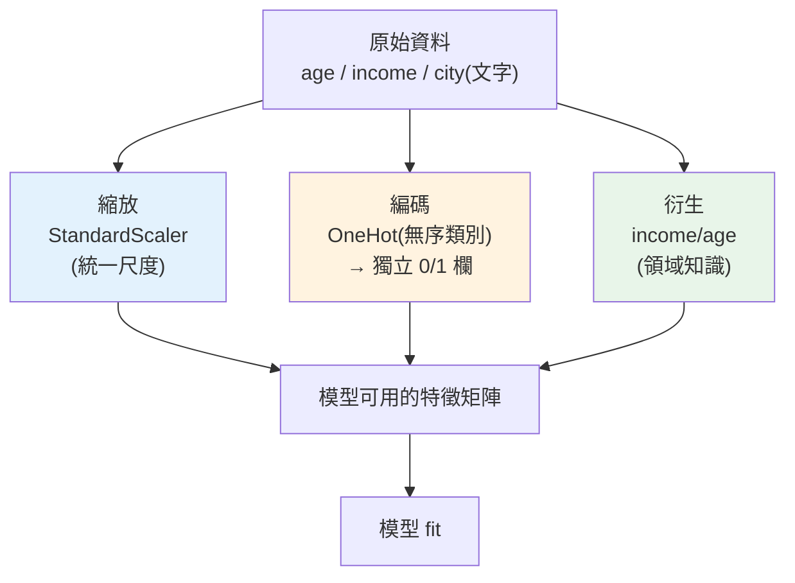

# 特徵工程

> 有句話在 ML 圈流傳:「**資料和特徵決定了機器學習的上限,模型和演算法只是逼近這個上限**」。換個花俏的模型,準確率可能只動 1%;但把特徵做對,可能動 10%。**特徵工程(feature engineering)** 就是把原始資料**轉換成模型能有效學習的形式**——標準化尺度、把類別變數變成數值、用領域知識造出有意義的新特徵。這章講分析師/ML 工程師最實用的特徵工程技巧,以及它們背後的原理。

## 💡 白話導讀(建議先讀)

ML 圈的一句老話:**「資料和特徵決定上限,模型只是逼近這個上限。」**
新手愛換更炫的模型,準確率常只動 1%;老手花工夫把**特徵**做好,
可能直接跳 10%。特徵工程就是「**把原始資料整理成模型好懂的樣子**」,
是實務中 CP 值最高的工。

三類最核心的轉換,這章逐一動手:

**1. 縮放(scaling)——統一單位。**
一個特徵是「年齡」(0~100),另一個是「年收入」(0~2000000)。
對「算距離」的模型(KNN、SVM)來說,收入的數字大,會**壓過**年齡的聲音——
不是因為它重要,只因為它數字大。標準化(減平均、除標準差)把大家拉到同一個尺度,
發言權才公平。(補充:樹模型不吃這套,它只看「大小順序」,不看絕對值。)

**2. 類別編碼(encoding)——把文字變數字。**
模型只吃數字,「城市=台北/台中/高雄」要編碼。
關鍵坑:別用 1/2/3 硬編(會被誤解成「高雄>台北」的大小關係),
無序類別用 **one-hot**(每個城市一個 0/1 欄)。

**3. 缺失與新特徵——補洞與造輪子。**
補缺失值(用訓練集的中位數,別用全體——又是資料洩漏)、
從既有欄位造新特徵(從生日算年齡、把日期拆出星期幾)——
**領域知識在這裡值錢**:你懂業務,就造得出模型看不出的關鍵特徵。

全程貫穿一條紀律:**所有轉換的參數只從訓練集學**,用 `Pipeline` 綁起來,
天然杜絕洩漏——這也是 [ch08 整合實戰](08-capstone-ml.md)的骨架。

## Why(為什麼)

模型不能直接吃原始資料,原因很實際:

- **模型看不懂類別文字**:`city = "Taipei"` 這種文字,線性回歸、神經網路都無法計算——它們只吃**數字**。要把類別**編碼**成數值(但不能亂編,見下)。
- **尺度差異會扭曲學習**:「年齡 25~60」和「收入 30000~120000」——收入的數值大幾千倍。很多模型(線性模型、[KNN、SVM、神經網路](../27-deep-learning/README.md))用「距離」或「梯度」學習,**大尺度的特徵會主宰結果**,讓收入淹沒年齡的影響。要**標準化**讓各特徵尺度可比。
- **原始特徵不夠有力**:模型能學的是你**給它的特徵**。「收入」和「年齡」分開看,可能不如「收入/年齡(每歲收入)」這個**衍生特徵**有洞察力。用**領域知識**造出好特徵,常比換模型更有效。
- **缺值、離群要處理**:模型多半不吃缺值([EDA](../23-data-analysis/08-eda.md)發現的),要填補或處理。

**特徵工程**就是這一連串「把原始資料變成好特徵」的轉換。它常是 ML 專案中**最花心力、也最能拉開差距**的部分——因為好特徵讓模型「事半功倍」。這章講最核心的三類:**縮放(scaling)、編碼(encoding)、衍生(derivation)**,並延續[上一章](02-ml-workflow.md)的鐵律——**所有前處理的參數只從 train 學**。

## Theory(理論:三類核心轉換)

**1. 數值縮放(scaling)——統一尺度**:

- **標準化(standardization / z-score)**:`(x − mean) / std`,轉成 mean=0、std=1。最常用,適合大多數模型。
- **正規化(normalization / min-max)**:`(x − min) / (max − min)`,壓到 [0, 1]。適合需要固定範圍的場景。
- **為何需要**:讓「距離/梯度」型模型不被大尺度特徵主宰(見 Implementation)。**樹模型(決策樹、[隨機森林](../26-advanced-ml/README.md))不需要縮放**(它們按閾值分割,尺度無關)。

**2. 類別編碼(encoding)——文字變數值**:

- **One-hot encoding**:每個類別變成一個 0/1 欄(`Taipei`→[0,0,1])。**無序類別**的標準做法。
- **Label encoding**:每個類別給一個整數(`Taipei`→2)。**⚠️ 危險**——對無序類別會**強加虛假的順序與大小**(讓模型以為 Kaohsiung=0 < Taipei=2,但城市沒有大小),只適合**有序類別**(如「小/中/大」)或[樹模型](../26-advanced-ml/README.md)。
- **其他**:目標編碼(target encoding)、頻率編碼等(進階)。

**3. 特徵衍生(derivation)——造新特徵**:

用領域知識組合/轉換出更有意義的特徵:比值(收入/年齡)、交互(特徵相乘)、時間拆解(從日期抽出星期幾、月份)、分箱(把連續值切成區間)、多項式特徵等。**好的衍生特徵能讓簡單模型表現超越複雜模型。**

## Specification(規範:sklearn 前處理)

```python
from sklearn.preprocessing import StandardScaler, OneHotEncoder

# 縮放(數值)—— 只 fit 在 train(見上一章)
scaler = StandardScaler()
X_train_scaled = scaler.fit_transform(X_train_num)
X_test_scaled = scaler.transform(X_test_num)     # 用 train 的 mean/std

# One-hot(無序類別)
encoder = OneHotEncoder(sparse_output=False, handle_unknown="ignore")
train_encoded = encoder.fit_transform(X_train_cat)
test_encoded = encoder.transform(X_test_cat)     # 用 train 學到的類別
```

**關鍵參數與原則**:

- **`handle_unknown="ignore"`**:test 出現 train 沒見過的類別時,編成全 0 而非報錯(生產必備)。
- **所有 `fit` 只在 train**([防洩漏](02-ml-workflow.md)):縮放的 mean/std、編碼的類別集,都從 train 學。
- **用 [`ColumnTransformer` + `Pipeline`](../26-advanced-ml/README.md)** 統一處理數值/類別欄,並綁進模型防洩漏。
- **樹模型可省縮放**、無序類別**別用 label encoding**。

## Implementation(底層:為何尺度影響距離/梯度、one-hot vs label)

**為何尺度差異會扭曲學習**:很多模型的核心運算對「數值大小」敏感。**距離型模型**(KNN、K-means、SVM)算樣本間歐氏距離 `√(Σ(xᵢ−xⱼ)²)`——收入差 10000 貢獻 `10000²=一億`,年齡差 10 貢獻 `100`,**收入的差異完全主宰了距離**,年齡形同被忽略。**梯度型模型**(線性回歸、神經網路)——大尺度特徵產生大梯度,讓最佳化震盪、收斂慢。**標準化**把所有特徵拉到可比的尺度,讓每個特徵**公平地**貢獻。這就是為什麼縮放對這些模型是必要前處理(而樹模型按單一特徵的閾值分割,不跨特徵算距離,所以不受尺度影響)。

**為何無序類別不能用 label encoding**:label encoding 把 `Kaohsiung/Tainan/Taipei` 編成 `0/1/2`。模型(尤其線性/距離模型)會把這些**當成有大小的數字**——認為「Taipei(2)是 Kaohsiung(0)的兩倍」「Tainan(1)在兩者中間」。但城市**沒有這種順序與距離**!這個**虛假的數值關係**會誤導模型。**one-hot** 把每個類別變成獨立的 0/1 維度,**彼此正交、無大小關係**——`Taipei=[0,0,1]`、`Tainan=[0,1,0]`,模型不會誤以為誰大誰小。代價是類別多時維度爆炸(1000 個類別→1000 欄),那時要用其他編碼(目標/頻率編碼)。**label encoding 只在「類別本身有序」(小<中<大)或用[樹模型](../26-advanced-ml/README.md)(按閾值分割,能處理)時才安全。**

**衍生特徵為何威力大**:模型只能從**你給的特徵**學。若真正的規律是「每歲收入」(income/age),但你只給 income 和 age 兩個獨立特徵,線性模型無法自己算出它們的比值(那是非線性關係)。**你用領域知識把比值算出來當特徵,等於把關鍵規律「餵」給模型**——簡單模型立刻能用。這是特徵工程勝過換模型的原因。下面範例示範縮放、one-hot、衍生。

## Code Example(可執行的 Python 範例)

```python
# feature_engineering.py — 縮放 / one-hot 編碼 / 特徵衍生(需要 sklearn + pandas)
from __future__ import annotations

import numpy as np
import pandas as pd
from sklearn.preprocessing import OneHotEncoder, StandardScaler


def main() -> None:
    df = pd.DataFrame(
        {
            "age": [25, 40, 35, 60],
            "income": [30000, 80000, 55000, 120000],
            "city": ["Taipei", "Tainan", "Taipei", "Kaohsiung"],
        }
    )

    # 1. 標準化(統一尺度:age 和 income 差幾千倍)
    scaler = StandardScaler()
    scaled = scaler.fit_transform(df[["age", "income"]])
    print("標準化後(每欄 mean=0, std=1):")
    print(np.round(scaled, 2))
    print(f"驗證 mean={np.round(scaled.mean(axis=0), 4)} std={np.round(scaled.std(axis=0), 2)}")

    # 2. One-hot 編碼(無序類別 city → 獨立 0/1 欄,無虛假大小)
    encoder = OneHotEncoder(sparse_output=False, handle_unknown="ignore")
    onehot = encoder.fit_transform(df[["city"]])
    print(f"\nOne-hot 類別順序: {list(encoder.categories_[0])}")
    print(onehot.astype(int))

    # 3. 特徵衍生(領域知識:每歲收入,比原始特徵更有洞察)
    df["income_per_age"] = (df["income"] / df["age"]).round(0)
    print(f"\n衍生特徵 income_per_age: {df['income_per_age'].tolist()}")
    print("→ 把『每歲收入』這個關鍵規律直接餵給模型,簡單模型立即能用")


if __name__ == "__main__":
    main()
```

**預期輸出**:

```pycon
$ python feature_engineering.py
標準化後(每欄 mean=0, std=1):
[[-1.18 -1.24]
 [ 0.    0.26]
 [-0.39 -0.49]
 [ 1.57  1.47]]
驗證 mean=[ 0. -0.] std=[1. 1.]

One-hot 類別順序: ['Kaohsiung', 'Tainan', 'Taipei']
[[0 0 1]
 [0 1 0]
 [0 0 1]
 [1 0 0]]

衍生特徵 income_per_age: [1200.0, 2000.0, 1571.0, 2000.0]
```

逐段解說:

- **標準化**:原始 age(25~60)和 income(30000~120000)尺度差幾千倍,標準化後**每欄都變成 mean=0、std=1**(驗證行證實)。現在兩個特徵**尺度可比**——距離/梯度型模型不會被 income 的大數值主宰,age 的影響也能被公平考慮。真實中 `fit` 只在 train(見[上一章](02-ml-workflow.md))。
- **One-hot 編碼**:`city` 有 3 個值,變成 3 個獨立 0/1 欄——`Taipei=[0,0,1]`、`Tainan=[0,1,0]`、`Kaohsiung=[1,0,0]`。**彼此正交、無大小關係**,模型不會誤以為某城市「比較大」。若用 label encoding 編成 0/1/2,模型會誤讀虛假順序。`handle_unknown="ignore"` 讓 test 出現新城市時不報錯。
- **特徵衍生**:`income_per_age` = 收入/年齡——**用領域知識造的新特徵**。60 歲收入 120000 的人「每歲收入」2000,和 40 歲收入 80000 的人相同(2000)——這個比值揭示了原始特徵看不出的關係。**把關鍵規律算出來當特徵,等於幫模型省下「自己發現」的難度**,簡單模型立刻能用。
- **要點**:數值縮放(統一尺度給距離/梯度型模型)、無序類別 one-hot(避免虛假順序)、領域知識衍生(把規律餵給模型)——三招覆蓋特徵工程大半日常。

## Diagram(圖解:特徵工程三類)



## Best Practice(最佳實踐)

- **數值特徵標準化**:給距離/梯度型模型(線性、KNN、SVM、[神經網路](../27-deep-learning/README.md));樹模型可省。
- **無序類別用 one-hot,別用 label encoding**:避免強加虛假順序;有序類別才用 label/ordinal。
- **善用領域知識衍生特徵**:比值、交互、時間拆解、分箱——常比換模型更有效。
- **所有前處理只 fit 在 train**([防洩漏](02-ml-workflow.md)),`handle_unknown="ignore"` 應對新類別。
- **用 [ColumnTransformer + Pipeline](../26-advanced-ml/README.md)**:統一處理數值/類別欄並綁進模型,防洩漏、可重現。
- **處理缺值與離群**([EDA](../23-data-analysis/08-eda.md)):填補(train 的統計)、標記、或依領域處理。
- **高基數類別謹慎**:one-hot 維度爆炸時改用目標/頻率編碼。
- **特徵選擇**:太多無用特徵增加過擬合與噪音,適度篩選(見 [Part 26](../26-advanced-ml/README.md))。

## Common Mistakes(常見誤解)

- **無序類別用 label encoding**:強加虛假大小/順序,誤導線性/距離模型。
- **忘記標準化**:大尺度特徵主宰距離/梯度型模型,小尺度特徵被淹沒。
- **前處理在 split 前做**:[資料洩漏](02-ml-workflow.md),評估虛高。
- **對 test 重新 fit scaler/encoder**:洩漏 + 邏輯錯;test 只 transform。
- **不處理 test 的新類別**:編碼報錯或崩潰(要 `handle_unknown`)。
- **對樹模型硬做標準化**:無害但多餘(樹不受尺度影響)。
- **忽略特徵衍生**:只丟原始特徵,錯失用領域知識大幅提升的機會。
- **高基數類別硬 one-hot**:維度爆炸、稀疏、過擬合。

## Interview Notes(面試重點)

- **能講「資料/特徵決定上限」**:特徵工程常比換模型更能提升表現。
- **能講縮放的必要與例外**:距離/梯度型模型需要(否則大尺度特徵主宰);樹模型不需要。
- **能講 one-hot vs label encoding**:無序類別用 one-hot(正交無大小),label 會強加虛假順序,只適合有序/樹模型。
- **能講特徵衍生**:用領域知識造比值/交互等,把規律餵給模型。
- **能連結防洩漏**:所有前處理只 fit 在 train,用 Pipeline 綁定。
- **知道高基數類別、缺值、離群的處理方向**。

---

➡️ 下一章:[線性回歸](04-linear-regression.md)

[⬆️ 回 Part 25 索引](README.md)
