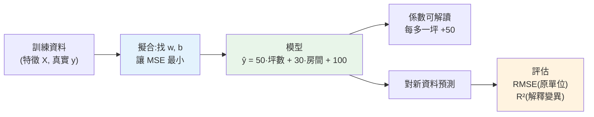

# 線性回歸

> 線性回歸是**最簡單、最重要**的 ML 模型——不是因為它最強,而是因為它**可解釋、快速、是所有回歸的起點**,且它的概念(用資料擬合參數、最小化誤差)是理解更複雜模型([邏輯回歸](05-classification.md)、[神經網路](../27-deep-learning/README.md))的基礎。這章用「預測房價」講透線性回歸:它怎麼學、係數怎麼解讀、用什麼指標([MSE、R²](06-model-evaluation.md))評估。

## Why(為什麼)

線性回歸解決**回歸問題**(預測連續數值:房價、銷量、溫度)。為什麼從它開始學,而不是直接上厲害的模型?

- **它可解釋**:線性回歸學出的是「每個特徵對結果的權重」——`房價 = 50×坪數 + 30×房間數 + 100`。你能**直接讀懂**「每多一坪,房價漲 50」。這種透明度在需要**解釋決策**的場景(金融、醫療、監管)極其寶貴,是黑箱模型給不了的。
- **它是最佳 baseline**:任何回歸專案,先跑線性回歸當基準線——若複雜模型贏不了它多少,就用簡單的(可解釋、快、好維護)。**先簡單再複雜**([上一章](01-ml-intro.md)的原則)。
- **它是理解 ML 的基石**:線性回歸完整體現 ML 的核心——**定義模型(線性方程)、定義損失(誤差)、最佳化參數(讓損失最小)**。搞懂它,[邏輯回歸](05-classification.md)、[梯度下降](../27-deep-learning/02-backpropagation.md)、[神經網路](../27-deep-learning/README.md)都是它的延伸。

線性回歸的假設是「輸出與輸入呈**線性關係**」——雖然真實世界常非線性,但它作為起點、baseline、可解釋工具,是每個 ML 工程師必備的第一課。這章讓你不只會 `fit`,更懂它學到什麼、怎麼評估。

## Theory(理論:線性模型與最小平方)

**模型形式**:線性回歸假設輸出是輸入特徵的**加權和**:

```text
ŷ = w₁·x₁ + w₂·x₂ + ... + wₙ·xₙ + b

ŷ:預測值   xᵢ:第 i 個特徵   wᵢ:第 i 個特徵的權重(係數)   b:截距(bias)
```

**學習目標**:找出讓「預測值 ŷ 與真實值 y 的誤差最小」的權重 w 與截距 b。衡量誤差用 **均方誤差(MSE,Mean Squared Error)**:

```text
MSE = (1/n) · Σ(yᵢ − ŷᵢ)²      ← 各筆誤差的平方,取平均
```

**為何平方**:(1) 讓正負誤差不抵消(平方後都是正);(2) **放大大誤差**(誤差 10 的平方是 100,誤差 1 的平方是 1)——模型會特別避免大錯;(3) 數學上可微分,便於[最佳化](../27-deep-learning/02-backpropagation.md)。

**最小平方法(Ordinary Least Squares, OLS)**:找 MSE 最小的 w、b。對線性回歸,這有**閉式解**(直接用公式算出,`sklearn` 內部就這麼做),不必迭代;但概念上等同「找損失最小的參數」——這正是所有 ML 的核心。

**係數的解讀**:`wᵢ` 是「特徵 xᵢ 每增加 1 單位,ŷ 平均改變 wᵢ」(其他特徵固定)。這讓線性回歸**高度可解釋**。

## Specification(規範:sklearn 與評估指標)

```python
from sklearn.linear_model import LinearRegression
from sklearn.metrics import mean_squared_error, r2_score

model = LinearRegression()
model.fit(X_train, y_train)          # 學 w, b

model.coef_          # 各特徵的權重 w
model.intercept_     # 截距 b
pred = model.predict(X_test)         # 預測

mean_squared_error(y_test, pred)     # MSE
r2_score(y_test, pred)               # R²
```

**回歸評估指標**:

| 指標 | 意義 | 特性 |
|------|------|------|
| **MSE** | 均方誤差 | 單位是「值的平方」,放大大誤差 |
| **RMSE** | √MSE | 回到**原單位**,好解讀(「平均差 20 萬」) |
| **MAE** | 平均絕對誤差 | 原單位,對離群較穩健 |
| **R²(決定係數)** | 模型解釋了多少變異 | 0~1,越接近 1 越好;0 = 不如猜平均 |

**R² 的解讀**:`R² = 0.9` 表示模型解釋了 90% 的目標變異(剩 10% 是無法解釋的雜訊/未捕捉因素)。`R² = 0` 等於「只會猜平均值」;可能為負(比猜平均還差)。

## Implementation(底層:MSE 如何驅動學習、R² 的意義)

**「最小化 MSE」如何找出對的係數**:想像 MSE 是關於權重 w 的函式——一個碗狀的曲面(對線性模型是凸函式,只有一個最低點)。學習就是**找碗底**(MSE 最小處),那裡的 w 就是「讓預測最貼合資料」的權重。線性回歸的碗有閉式解(直接算出碗底座標);更複雜的模型用[梯度下降](../27-deep-learning/02-backpropagation.md)一步步滑到碗底。**關鍵洞見:MSE 把「模型好不好」量化成一個可最佳化的數字,學習就是最小化它**——這個「模型 + 損失函式 + 最小化」的三件套,是**所有** ML(含[神經網路](../27-deep-learning/README.md))的統一框架。下面範例用「房價 = 50×坪數 + 30×房間 + 100 + 雜訊」的合成資料——模型該從資料中**還原出這些真實係數**,驗證它確實學到了規律。

**R² 為何是「解釋的變異比例」**:R² = `1 − (模型的誤差平方和 / 猜平均的誤差平方和)`。分母是「若你什麼都不學、只猜 y 的平均」會有的誤差(baseline);分子是模型的誤差。若模型完美(誤差 0),R²=1;若模型跟「猜平均」一樣爛,分子=分母,R²=0。所以 **R² 衡量「模型比『猜平均』好多少」**,也等於「模型解釋了資料變異的百分之幾」。這讓 R² 成為**跨資料集可比**的相對指標(不像 MSE 依賴單位/規模),常用來快速判斷模型好壞。

**用 RMSE 溝通**:MSE 的單位是「值的平方」(房價萬元的平方),難解讀;開根號變 **RMSE**,回到原單位(萬元),「平均誤差約 20 萬」——**對業務溝通用 RMSE**([資料溝通](../24-business-analytics/08-data-storytelling.md)的精神)。下面範例訓練線性回歸並解讀係數與指標。

## Code Example(可執行的 Python 範例)

```python
# linear_regression.py — 線性回歸:學係數 + 評估(需要 sklearn + numpy)
from __future__ import annotations

import numpy as np
from sklearn.linear_model import LinearRegression
from sklearn.metrics import mean_squared_error, r2_score
from sklearn.model_selection import train_test_split


def main() -> None:
    # 合成資料:房價 = 50×坪數 + 30×房間數 + 100 + 雜訊(模型應還原這些係數)
    rng = np.random.default_rng(42)
    n = 200
    area = rng.uniform(10, 50, n)
    rooms = rng.integers(1, 5, n)
    price = 50 * area + 30 * rooms + 100 + rng.normal(0, 20, n)

    X = np.column_stack([area, rooms])
    X_train, X_test, y_train, y_test = train_test_split(X, price, test_size=0.3, random_state=42)

    model = LinearRegression()
    model.fit(X_train, y_train)

    # 係數解讀:模型從資料還原出真實規律
    print("學到的模型:")
    print(f"  坪數係數 = {model.coef_[0]:.1f}(真實 50)")
    print(f"  房間係數 = {model.coef_[1]:.1f}(真實 30)")
    print(f"  截距 = {model.intercept_:.1f}(真實 100)")

    # 評估(用 test)
    pred = model.predict(X_test)
    rmse = np.sqrt(mean_squared_error(y_test, pred))
    r2 = r2_score(y_test, pred)
    print(f"\n測試 RMSE = {rmse:.1f}(平均誤差約 {rmse:.0f},原單位好溝通)")
    print(f"測試 R2 = {r2:.4f}(解釋了 {r2 * 100:.1f}% 的變異)")

    # 預測新樣本
    new = np.array([[30, 3]])  # 30 坪 3 房
    print(f"\n預測 30坪3房 = {model.predict(new)[0]:.0f}(約 50×30+30×3+100=1690)")


if __name__ == "__main__":
    main()
```

**預期輸出**:

```pycon
$ python linear_regression.py
學到的模型:
  坪數係數 = 49.9(真實 50)
  房間係數 = 29.5(真實 30)
  截距 = 104.8(真實 100)

測試 RMSE = 19.8(平均誤差約 20,原單位好溝通)
測試 R2 = 0.9986(解釋了 99.9% 的變異)

預測 30坪3房 = 1691(約 50×30+30×3+100=1690)
```

逐段解說:

- **還原真實係數**:我們用「50×坪數 + 30×房間 + 100」生成資料(加了雜訊),模型從資料學出 **坪數係數 49.9、房間係數 29.5、截距 104.8**——**幾乎完美還原了真實規律**!這證明線性回歸確實「從資料學到了對的參數」(小偏差來自雜訊)。**這就是 ML 在做的事:從帶雜訊的資料中還原底層規律。**
- **係數可解讀**:`坪數係數 ≈ 50` 直接告訴你「**每多一坪,房價平均漲約 50**」(其他固定)。這種**透明的可解釋性**是線性回歸的最大價值——你能向業務/監管清楚交代模型憑什麼這樣預測。
- **RMSE**:19.8——**用原單位表達「平均誤差約 20」**,好溝通(對照 MSE=393 難解讀)。這正是我們生成資料時加的雜訊量級(std=20),代表模型已學到極致,剩下的誤差就是不可消除的雜訊。
- **R²=0.9986**:模型解釋了 **99.9% 的變異**——極好(因為這是乾淨的合成資料;真實資料通常低很多)。R² 讓你**快速、跨資料集**判斷模型好壞(不受單位影響)。
- **預測**:30 坪 3 房預測 1691,接近理論值 1690——模型能對**新樣本**做準確預測(泛化)。
- **要點**:線性回歸學「特徵的加權和」、係數可直接解讀、用 RMSE(原單位溝通)+ R²(解釋變異比例)評估。

## Diagram(圖解:線性回歸的學習)



## Best Practice(最佳實踐)

- **回歸問題先跑線性回歸當 baseline**:簡單、快、可解釋;複雜模型贏不了多少就用簡單的。
- **解讀係數獲取洞察**:每個係數 = 該特徵每增一單位對結果的影響,是可解釋性的來源。
- **用 RMSE 對業務溝通**:回到原單位;MSE 難解讀。
- **用 R² 快速判斷模型好壞**:解釋變異比例,跨資料集可比。
- **在 test 上評估**([防洩漏](02-ml-workflow.md)):train 分數會過度樂觀。
- **檢查線性假設**:若關係非線性,考慮[特徵衍生](03-feature-engineering.md)(多項式特徵)或非線性模型。
- **標準化特徵**(尤其加[正則化](07-overfitting-regularization.md)時):讓係數可比、最佳化穩定。
- **注意共線性**:特徵高度相關會讓係數不穩、難解讀(可移除或用正則化)。

## Common Mistakes(常見誤解)

- **只看 R² 不看殘差**:R² 高但殘差有模式,代表線性假設可能不成立。
- **用 MSE 對業務溝通**:單位是平方,難懂;用 RMSE(原單位)。
- **在訓練資料上評估就滿意**:沒測泛化(可能過擬合)。
- **忽略線性假設**:硬用線性回歸擬合明顯非線性關係,效果差。
- **係數解讀忽略「其他固定」**:每個係數的影響是在其他特徵不變的前提下。
- **有共線性還硬解讀係數**:高度相關特徵讓係數不穩定、方向可能反直覺。
- **不標準化就比較係數大小**:不同尺度的特徵係數不可直接比重要性。
- **R² 為負當成 bug**:代表模型比猜平均還差,是真實可能的(模型/特徵太爛)。

## Interview Notes(面試重點)

- **能寫出線性回歸模型**:ŷ = 加權和 + 截距,學習目標是最小化 MSE。
- **能解釋為何用平方誤差**:正負不抵消、放大大誤差、可微分。
- **能解讀係數**:每特徵每增一單位對結果的影響(其他固定),是可解釋性來源。
- **能講回歸指標**:MSE/RMSE(原單位)/MAE(穩健)/R²(解釋變異比例,跨集可比)。
- **能講 R² 的意義**:比「猜平均」好多少;可為負。
- **能講線性回歸是 ML 基石**:模型+損失+最小化的三件套,是所有 ML 的統一框架。

---

➡️ 下一章:[邏輯回歸與分類](05-classification.md)

[⬆️ 回 Part 25 索引](README.md)
