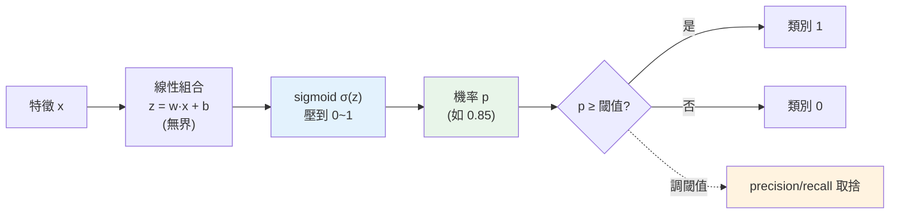

# 邏輯回歸與分類

> [線性回歸](04-linear-regression.md)預測連續數值,但很多問題是**是非題**:這封信是不是垃圾信?這筆交易是不是詐騙?這個客戶會不會流失?這是**分類(classification)**。**邏輯回歸(logistic regression)** 是最基礎的分類模型——名字有「回歸」,做的卻是分類。它不只給「是/否」,還給**機率**(70% 是垃圾信),讓你能依風險調整決策閾值。這章講邏輯回歸怎麼把線性模型變成分類器。

## Why(為什麼)

分類問題無所不在,但**不能直接用線性回歸做**:

- **線性回歸輸出無界**:`ŷ = w·x + b` 可以是任意實數(−∞ 到 +∞)。但分類要的是**機率**(0 到 1)或**類別**(0/1)。若硬用線性回歸,它可能預測「1.7」或「−0.3」——這對「是不是垃圾信」毫無意義。
- **需要機率而非硬性判斷**:好的分類器不只說「是垃圾信」,而是說「**85% 機率**是垃圾信」。機率讓你能**依情境調整決策**——過濾垃圾信可以寬鬆(0.5 就丟),但判斷詐騙要保守(0.9 才攔,避免誤傷正常交易)。**同一個模型,不同閾值,不同取捨**。
- **需要適合分類的學習目標**:線性回歸最小化 [MSE](04-linear-regression.md),但分類要最小化的是「機率預測的錯誤」——用不同的損失函式。

**邏輯回歸**優雅地解決這些:它先算一個線性組合(像線性回歸),再用 **sigmoid 函式**把結果**壓縮到 0~1**變成機率,然後依閾值(預設 0.5)轉成類別。它繼承線性回歸的**可解釋性與簡單**,是分類的最佳 baseline、也是理解[神經網路](../27-deep-learning/README.md)(其實就是很多層邏輯回歸)的基礎。這章講它的原理與實務。

## Theory(理論:sigmoid 與機率)

**邏輯回歸 = 線性組合 + sigmoid**:

```text
1. 線性組合:  z = w₁·x₁ + w₂·x₂ + ... + b    (像線性回歸,z 可為任意實數)
2. sigmoid:   p = σ(z) = 1 / (1 + e^(−z))      (把 z 壓到 0~1,變成機率)
3. 決策:      p ≥ 閾值(預設 0.5) → 類別 1,否則類別 0
```

**sigmoid 函式 σ(z)** 的關鍵性質:

- `z = 0 → σ = 0.5`(正中間)、`z → +∞ → σ → 1`、`z → −∞ → σ → 0`。
- **S 形曲線**:把無界的 z **平滑地**壓進 (0, 1),中間陡、兩端平——完美對應「機率」的直覺。

**學習目標(損失函式)**:邏輯回歸用 **對數損失(log loss / 交叉熵 cross-entropy)** 而非 MSE:

```text
Log Loss = −(1/n) Σ [ yᵢ·log(pᵢ) + (1−yᵢ)·log(1−pᵢ) ]
```

**直覺**:真實是 1 時,模型預測 p 越接近 1 損失越小;預測越接近 0(自信地錯)損失**急劇變大**(懲罰自信的錯誤)。沒有閉式解,用[梯度下降](../27-deep-learning/02-backpropagation.md)最佳化。

**多分類**:邏輯回歸可擴展到多類別(softmax 回歸 / one-vs-rest),sklearn 自動處理。

## Specification(規範:sklearn 與機率/閾值)

```python
from sklearn.linear_model import LogisticRegression

model = LogisticRegression(random_state=42)
model.fit(X_train, y_train)          # 標準化後的特徵(見 ch03)

model.predict(X_test)                # 類別(用預設閾值 0.5)
model.predict_proba(X_test)          # 各類別機率 [[P(0), P(1)], ...]
model.score(X_test, y_test)          # 準確率
model.coef_, model.intercept_        # 係數(可解釋)
```

**決策閾值(關鍵)**:`predict` 預設「機率 ≥ 0.5 → 類別 1」,但**閾值可調**:

```python
proba = model.predict_proba(X_test)[:, 1]   # 取類別 1 的機率
custom_pred = (proba >= 0.3).astype(int)     # 自訂閾值 0.3
```

- **降低閾值**(如 0.3):更容易判為正類 → **抓到更多正類(提高 recall)**,但誤報增加(precision 降)。
- **提高閾值**(如 0.8):更保守 → **誤報少(提高 precision)**,但漏掉更多(recall 降)。
- **依業務取捨調閾值**——這是 [precision/recall 權衡](06-model-evaluation.md)的實際操作。

## Implementation(底層:為何 sigmoid、閾值如何調整取捨)

**為何需要 sigmoid 而非直接用線性輸出**:分類要機率,機率必須在 [0,1]。線性組合 z 是無界的——sigmoid 是把「無界實數」單調、平滑、可微地映射到 (0,1) 的理想函式。它的 S 形還有個好處:**在決策邊界附近(z≈0, p≈0.5)最敏感**(斜率最大),遠離邊界時趨於飽和(很確定的樣本 p→0 或 1)。這符合直覺——模糊的樣本機率接近 0.5,明確的樣本機率接近極端。而且 sigmoid **可微分**,讓[梯度下降](../27-deep-learning/02-backpropagation.md)能最佳化。**邏輯回歸的名字誤導人——它做的是分類,但透過「回歸出一個機率」來達成。**

**為何用 log loss 而非 MSE**:若對分類用 MSE,損失函式會變成非凸(有多個局部最低點),梯度下降容易卡住;而 log loss 配 sigmoid 是凸的,好最佳化。更重要的是 log loss **對「自信的錯誤」重罰**——模型說「99% 是垃圾信」但其實不是,log loss 會給巨大懲罰(log(0.01) 很負),逼模型的機率**校準**(別亂自信)。這對「輸出可信機率」很關鍵。

**調閾值如何實現業務取捨**:模型輸出的**機率是連續的**,閾值把它切成類別。同一個模型,**移動閾值就移動了 precision/recall 的平衡**——這是不重新訓練就能調整行為的強大工具。詐騙偵測寧可多攔(高 recall,閾值調低,容忍誤報)、垃圾信過濾寧可少誤傷(高 precision,閾值調高)。**閾值不是模型的一部分,是你依業務風險做的決策**——這也是為什麼模型該輸出**機率**(`predict_proba`)而非只給類別:機率保留了讓你調整取捨的資訊。下面範例訓練邏輯回歸並示範機率與閾值。

## Code Example(可執行的 Python 範例)

```python
# classification.py — 邏輯回歸:sigmoid + 機率 + 閾值(需要 sklearn + numpy)
from __future__ import annotations

import numpy as np
from sklearn.datasets import make_classification
from sklearn.linear_model import LogisticRegression
from sklearn.model_selection import train_test_split
from sklearn.preprocessing import StandardScaler


def sigmoid(z: float) -> float:
    """把任意實數壓到 (0,1) 變成機率。"""
    return 1 / (1 + np.exp(-z))


def main() -> None:
    # sigmoid 的行為
    print("sigmoid:")
    for z in (-2, 0, 2):
        print(f"  σ({z:+d}) = {sigmoid(z):.3f}")
    print("  → z=0 給 0.5,越正越接近 1,越負越接近 0")

    # 訓練邏輯回歸
    X, y = make_classification(
        n_samples=300, n_features=4, n_informative=3, n_redundant=0,
        random_state=42, class_sep=1.5,
    )
    X_train, X_test, y_train, y_test = train_test_split(
        X, y, test_size=0.3, random_state=42, stratify=y
    )
    scaler = StandardScaler()
    X_train = scaler.fit_transform(X_train)
    X_test = scaler.transform(X_test)

    model = LogisticRegression(random_state=42)
    model.fit(X_train, y_train)
    print(f"\n測試準確率: {model.score(X_test, y_test):.3f}")

    # 機率 vs 硬性類別
    proba = model.predict_proba(X_test[:3])[:, 1]  # 類別 1 的機率
    print(f"\n前 3 筆 P(類別=1): {np.round(proba, 3)}")
    print(f"預設閾值 0.5 → 預測: {(proba >= 0.5).astype(int)}")
    print(f"降低閾值 0.3 → 預測: {(proba >= 0.3).astype(int)}(更易判正類,提高 recall)")


if __name__ == "__main__":
    main()
```

**預期輸出**:

```pycon
$ python classification.py
sigmoid:
  σ(-2) = 0.119
  σ(+0) = 0.500
  σ(+2) = 0.881
  → z=0 給 0.5,越正越接近 1,越負越接近 0

測試準確率: 0.900

前 3 筆 P(類別=1): [0.948 0.042 0.999]
預設閾值 0.5 → 預測: [1 0 1]
降低閾值 0.3 → 預測: [1 0 1](更易判正類,提高 recall)
```

逐段解說:

- **sigmoid**:`σ(0)=0.5`(邊界)、`σ(2)=0.881`(偏向類別 1)、`σ(−2)=0.119`(偏向類別 0)——**把線性組合 z 壓成機率**。這是邏輯回歸把線性模型變成分類器的關鍵一步。
- **訓練與準確率**:標準化後(邏輯回歸是梯度型模型,[需要縮放](03-feature-engineering.md))訓練,測試準確率 0.900。注意用了 `stratify` 保持類別比例([防評估失真](02-ml-workflow.md))。
- **機率輸出(核心)**:`predict_proba` 給出**每筆的機率**——第 1 筆 0.948(很可能是類別 1)、第 2 筆 0.042(很可能類別 0)、第 3 筆 0.999(幾乎確定類別 1)。**機率比硬性「0/1」資訊豐富得多**——它告訴你模型的**信心**,讓你能依風險決策。
- **閾值調整**:預設 0.5 和降到 0.3,這三筆的預測剛好都一樣(因為機率都很極端);但對機率在 0.3~0.5 之間的樣本,降低閾值會**把它們也判為正類**——**抓到更多正類(recall↑)但誤報也增(precision↓)**。**移動閾值 = 移動 precision/recall 的平衡**,不必重訓模型。
- **要點**:邏輯回歸 = 線性組合 → sigmoid 壓成機率 → 閾值分類;輸出機率(非只類別)讓你能依業務調閾值做取捨。

## Diagram(圖解:邏輯回歸流程)



## Best Practice(最佳實踐)

- **分類先跑邏輯回歸當 baseline**:簡單、可解釋、輸出機率;複雜模型贏不了多少就用它。
- **標準化特徵**:邏輯回歸是梯度型模型,[縮放](03-feature-engineering.md)讓最佳化穩定、係數可比。
- **用 `predict_proba` 取機率**:機率比硬性類別資訊豐富,保留調閾值的空間。
- **依業務調決策閾值**:詐騙/疾病寧可高 recall(閾值低)、垃圾過濾寧可高 precision(閾值高)。
- **在 test 評估、分類看多指標**:不只準確率,看 [precision/recall/F1](06-model-evaluation.md)(尤其[不平衡](../26-advanced-ml/README.md))。
- **解讀係數**:如線性回歸,係數反映特徵對「屬於正類的對數勝算」的影響。
- **不平衡資料特別小心**:準確率會騙人(見下章),用 [class_weight 或重採樣](../26-advanced-ml/README.md)。

## Common Mistakes(常見誤解)

- **用線性回歸做分類**:輸出無界、無機率意義,該用邏輯回歸。
- **以為「邏輯回歸」是回歸模型**:名字誤導,它做的是分類。
- **只用 predict 不用 predict_proba**:丟掉機率資訊,失去調閾值的能力。
- **死守 0.5 閾值**:不同業務風險該調閾值;0.5 只是預設。
- **不標準化**:梯度型模型,大尺度特徵讓最佳化不穩(見 [ch03](03-feature-engineering.md))。
- **不平衡資料只看準確率**:99% 正常的資料,全猜「正常」也有 99% 準確率但毫無用處。
- **在訓練資料上評估**:過度樂觀([防洩漏](02-ml-workflow.md))。
- **忘了它也是線性模型**:對非線性可分的資料表現有限(需特徵工程或非線性模型)。

## Interview Notes(面試重點)

- **能講邏輯回歸 = 線性組合 + sigmoid**:z 無界 → sigmoid 壓到 (0,1) 機率 → 閾值分類。
- **能解釋為何不用線性回歸做分類**:輸出無界、無機率意義。
- **能講 sigmoid 的性質**:S 形、σ(0)=0.5、把實數壓到 (0,1)、可微。
- **能講 log loss(交叉熵)**:分類的損失,重罰自信的錯誤,配 sigmoid 是凸的。
- **能講閾值調整**:移動閾值 = 移動 precision/recall 平衡,依業務風險調,不必重訓。
- **知道要輸出機率、標準化、不平衡資料的陷阱**,且邏輯回歸是[神經網路](../27-deep-learning/README.md)的基礎單元。

---

➡️ 下一章:[模型評估與指標](06-model-evaluation.md)

[⬆️ 回 Part 25 索引](README.md)
