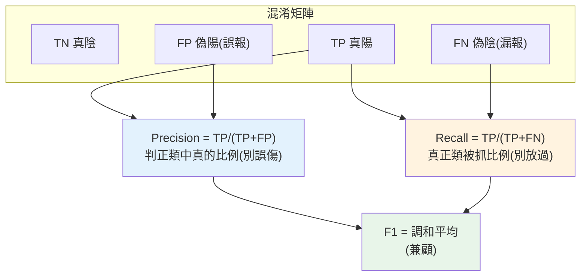

# 模型評估與指標

> 「我的分類模型準確率 95%!」——聽起來很棒?**可能一文不值**。如果你在偵測詐騙(1000 筆交易只有 50 筆詐騙),一個**什麼都不做、全部判為正常**的模型,準確率也有 95%——但它**一個詐騙都沒抓到**,完全無用。準確率(accuracy)在**不平衡資料**上會嚴重誤導。這章講分類的**正確評估指標**:混淆矩陣、precision、recall、F1、ROC/AUC——以及什麼時候該看哪個。

## 💡 白話導讀(建議先讀)

「我的模型準確率 95%!」——**可能一文不值**。
假設一萬筆交易只有 100 筆是詐騙,一個**無腦全部判「正常」**的笨模型,
準確率高達 99%——但它**一筆詐騙都沒抓到**,完全沒用。
這章教你戳破「準確率」的假象,學會**選對的尺**量模型。

一切從**混淆矩陣**這四格開始(以「抓詐騙」為例):

- **抓對了**(真的詐騙、判詐騙)、**放過了**(真詐騙、判正常=**漏網**)、
  **誤殺了**(正常、判詐騙=**擾民**)、**沒事**(正常、判正常)。

兩個最重要的衍生指標,是一對此消彼長的冤家:

- **Precision(精確率)**:「我判為詐騙的,**有幾成是真的**?」——
  低了就**擾民**(一堆正常交易被攔,客訴爆炸)。
- **Recall(召回率)**:「所有真詐騙,**我抓到幾成**?」——
  低了就**漏網**(詐騙沒抓到,錢賠光)。

**抓詐騙要高 recall(寧可誤殺不可放過)、推垃圾信匣要高 precision(別把正常信丟進去)**
——該重視哪個,**由業務代價決定**,不是越高越好。想兼顧就看 **F1**(兩者調和平均),
想看模型「整體排序能力」就看 **ROC-AUC**。

這章還講不平衡資料的處理、precision-recall 曲線怎麼配合[上一章的閾值](05-classification.md)旋鈕——
「選對評估指標」本身就是資深工程師和新手的分水嶺,面試極高頻。

## Why(為什麼)

選錯評估指標,你會**基於假信心部署一個爛模型**:

- **準確率在不平衡資料上騙人**:上面的詐騙例子——95% 準確率的模型可能完全沒抓到詐騙。因為 95% 的資料是正常的,**全猜正常就有 95% 準確率**,但這對「抓詐騙」這個目標毫無貢獻。**準確率把「抓到詐騙」和「認出正常」混在一起**,而在不平衡資料上前者才是重點。
- **不同錯誤的代價不同**:把正常交易誤判為詐騙(**誤報**,false positive)→ 打擾客戶;把詐騙漏掉(**漏報**,false negative)→ 損失金錢。這兩種錯誤**代價天差地別**,但準確率一視同仁。你需要能**分別衡量**兩種錯誤的指標。
- **要能依業務目標選指標**:抓詐騙、篩疾病要**寧可錯殺不可放過**(高 recall);推薦、垃圾過濾要**寧可少推不可誤傷**(高 precision)。不同目標看不同指標。

**混淆矩陣(confusion matrix)** 把預測結果拆成四格(對/錯 × 正/負),從中衍生出 **precision(精確率)、recall(召回率)、F1** 等指標,**分別**衡量不同面向。理解它們的意義與取捨,才能**選對指標、正確判斷模型好壞**——這是 ML 工程師避免「自我感覺良好卻部署爛模型」的關鍵能力。這章講透。

## Theory(理論:混淆矩陣與衍生指標)

**混淆矩陣**——分類結果的四種情況(以「詐騙=正類」為例):

```text
                預測正常(0)      預測詐騙(1)
真實正常(0)   TN(真陰,對)     FP(偽陽,誤報:正常被當詐騙)
真實詐騙(1)   FN(偽陰,漏報:詐騙沒抓到)  TP(真陽,對)
```

**從四格衍生的指標**:

- **Accuracy(準確率)= (TP+TN)/總數**:整體對的比例。**不平衡時誤導。**
- **Precision(精確率)= TP/(TP+FP)**:「**判為詐騙的,有多少真的是詐騙**」——衡量誤報。precision 低 = 常誤傷正常。
- **Recall(召回率)= TP/(TP+FN)**:「**真的詐騙,有多少被抓到**」——衡量漏報。recall 低 = 常放走詐騙。
- **F1 = 2·(P·R)/(P+R)**:precision 與 recall 的**調和平均**——當你要**兼顧兩者**時的單一指標(調和平均對兩者都低時懲罰重,逼兩者都要好)。

**precision vs recall 的取捨**:兩者常此消彼長([調閾值](05-classification.md)就在調這個)。

- **重視 recall**(別放過):詐騙、疾病篩檢、安全威脅——漏報代價高,寧可多誤報。
- **重視 precision**(別誤傷):垃圾信過濾、推薦——誤報代價高(誤刪重要信),寧可少抓。

**ROC 曲線 / AUC**:在**所有閾值**下畫「recall(TPR)vs 誤報率(FPR)」的曲線;**AUC(曲線下面積)** 衡量模型**整體區分能力**(0.5=亂猜,1.0=完美),**與閾值無關**——比較模型的常用單一指標。

## Specification(規範:sklearn 指標)

```python
from sklearn.metrics import (
    confusion_matrix, accuracy_score,
    precision_score, recall_score, f1_score,
    roc_auc_score, classification_report,
)

confusion_matrix(y_true, y_pred)      # [[TN, FP], [FN, TP]]
precision_score(y_true, y_pred)       # TP/(TP+FP)
recall_score(y_true, y_pred)          # TP/(TP+FN)
f1_score(y_true, y_pred)              # 調和平均
roc_auc_score(y_true, y_proba)        # 用「機率」而非類別,與閾值無關
classification_report(y_true, y_pred) # 一次列出各類別的 P/R/F1
```

**指標選擇速查**:

| 情境 | 主要指標 |
|------|----------|
| 類別平衡、錯誤代價相近 | Accuracy |
| 不平衡、重視「別放過」(詐騙/疾病) | Recall(+ F1) |
| 不平衡、重視「別誤傷」(垃圾/推薦) | Precision(+ F1) |
| 兼顧兩者 | F1 |
| 比較模型整體區分力(不定閾值) | AUC |

## Implementation(底層:為何準確率誤導、F1 的調和平均)

**準確率為何在不平衡資料上失效**:準確率 = 對的總數 / 全部。當 95% 是負類,一個「全猜負類」的模型自動對了 95%——它的高準確率**完全來自多數類**,對少數類(正類,通常才是我們在意的)貢獻為零。**準確率把「認出多數類」的容易和「抓到少數類」的困難混為一談**,而後者才是重點。所以不平衡資料要看**分別衡量正類表現的 precision/recall**,而非把兩者混在一起的準確率。**判斷指標是否會誤導,先看資料平不平衡、兩類錯誤代價是否相近。**

**precision 與 recall 為何互相拉扯**:兩者都以 TP 為分子,但分母不同——precision 的分母含 FP(誤報)、recall 的分母含 FN(漏報)。你[調低閾值](05-classification.md)(更愛判正類):抓到更多真正類(TP↑、FN↓ → recall↑),但也誤抓更多負類(FP↑ → precision↓)。反之調高閾值:precision↑、recall↓。**這是根本的取捨**——除非模型完美,否則魚與熊掌難兼得,只能依業務選一個優先。

**F1 為何用調和平均而非算術平均**:F1 = `2PR/(P+R)`。調和平均的特性是**被小的那個主導**——若 precision=0.9 但 recall=0.1,算術平均是 0.5(看起來還行),但調和平均(F1)只有 0.18(誠實反映「有一個很差」)。這逼模型**兩個都要好**才有高 F1,防止「犧牲一個換另一個」的假象。所以 F1 是「要兼顧 precision 和 recall」時的正確單一指標。下面範例用不平衡的詐騙資料,展示準確率的誤導與各指標的正確判讀。

## Code Example(可執行的 Python 範例)

```python
# model_evaluation.py — 不平衡資料的評估:準確率誤導 + P/R/F1(需要 sklearn + numpy)
from __future__ import annotations

import numpy as np
from sklearn.metrics import (
    accuracy_score,
    confusion_matrix,
    f1_score,
    precision_score,
    recall_score,
)


def main() -> None:
    # 不平衡:1000 筆,只 50 個正類(詐騙 5%)
    y_true = np.array([0] * 950 + [1] * 50)

    # 模型 A:偷懶全猜「正常」
    y_pred_a = np.zeros(1000, dtype=int)
    print("模型 A(全猜正常):")
    print(f"  accuracy = {accuracy_score(y_true, y_pred_a):.3f} ← 高得誤導!")
    print(f"  recall   = {recall_score(y_true, y_pred_a, zero_division=0):.3f} ← 一個詐騙都沒抓到")
    print("  → 95% 準確率但完全無用,證明準確率在不平衡資料會騙人")

    # 模型 B:抓到 40/50 詐騙,誤報 30 筆正常
    y_pred_b = y_true.copy()
    y_pred_b[:30] = 1  # 30 筆正常被誤判詐騙(FP)
    y_pred_b[950:960] = 0  # 10 筆詐騙沒抓到(FN)

    cm = confusion_matrix(y_true, y_pred_b)
    print("\n模型 B:")
    print(f"  混淆矩陣 [[TN,FP],[FN,TP]] =\n{cm}")
    print(f"  accuracy  = {accuracy_score(y_true, y_pred_b):.3f}")
    print(f"  precision = {precision_score(y_true, y_pred_b):.3f}(判詐騙中真的比例)")
    print(f"  recall    = {recall_score(y_true, y_pred_b):.3f}(真詐騙被抓到比例)")
    print(f"  f1        = {f1_score(y_true, y_pred_b):.3f}(兼顧兩者)")


if __name__ == "__main__":
    main()
```

**預期輸出**:

```pycon
$ python model_evaluation.py
模型 A(全猜正常):
  accuracy = 0.950 ← 高得誤導!
  recall   = 0.000 ← 一個詐騙都沒抓到
  → 95% 準確率但完全無用,證明準確率在不平衡資料會騙人

模型 B:
  混淆矩陣 [[TN,FP],[FN,TP]] =
[[920  30]
 [ 10  40]]
  accuracy  = 0.960
  precision = 0.571(判詐騙中真的比例)
  recall    = 0.800(真詐騙被抓到比例)
  f1        = 0.667(兼顧兩者)
```

逐段解說:

- **模型 A 的陷阱**:全猜「正常」——**準確率 95%** 看起來不錯,但 **recall = 0**(50 個詐騙一個都沒抓到)!這個模型對「抓詐騙」的目標**完全無用**,卻有漂亮的準確率。**這就是準確率在不平衡資料上的致命誤導**——它的高分全來自多數類(正常),對少數類(詐騙)毫無貢獻。若你只看準確率就部署,等於部署了一個廢物。
- **模型 B 的混淆矩陣**:`[[920,30],[10,40]]`——TN=920(正常判對)、**FP=30**(30 筆正常被誤判詐騙)、**FN=10**(10 筆詐騙漏掉)、TP=40(抓到 40 筆詐騙)。四格清楚呈現**兩種錯誤各多少**。
- **precision=0.571**:判為詐騙的 70 筆(TP+FP=40+30)中,真的詐騙只有 40 → 57.1%。**precision 低代表誤報多**(常打擾正常客戶)。
- **recall=0.800**:50 筆真詐騙中抓到 40 → 80%。**recall 衡量「抓到多少」**——抓詐騙場景通常最在意這個(漏掉詐騙損失大)。
- **f1=0.667**:precision(0.571)和 recall(0.800)的調和平均——**兼顧兩者的單一指標**。注意它比算術平均(0.686)低,因為調和平均被較小的 precision 拉低,誠實反映「precision 還有進步空間」。
- **要點**:不平衡資料**絕不能只看準確率**;看混淆矩陣拆解兩種錯誤,依業務選 precision(別誤傷)或 recall(別放過),要兼顧看 F1。

## Diagram(圖解:混淆矩陣與指標)



## Best Practice(最佳實踐)

- **不平衡資料別只看準確率**:它被多數類主宰、誤導;看 precision/recall/F1。
- **先看混淆矩陣**:拆解兩種錯誤(FP 誤報、FN 漏報),再談指標。
- **依業務選主要指標**:別放過(詐騙/疾病)→ recall;別誤傷(垃圾/推薦)→ precision;兼顧 → F1。
- **理解 precision/recall 取捨**:此消彼長,[調閾值](05-classification.md)在調平衡,選一個優先。
- **用 AUC 比較模型整體區分力**:與閾值無關,適合選模型(用機率算)。
- **用 `classification_report`**:一次看各類別的 P/R/F1,全貌清楚。
- **多分類看 macro/weighted 平均**:各類別 F1 的平均方式影響解讀。
- **評估在 test 上**([防洩漏](02-ml-workflow.md)),不平衡也要 [stratify](02-ml-workflow.md)。

## Common Mistakes(常見誤解)

- **不平衡資料只看準確率**:全猜多數類就高分,實則無用(最經典錯)。
- **不看混淆矩陣**:不知道兩種錯誤各多少,無法判斷模型問題在哪。
- **precision 和 recall 混淆**:記法——precision 看「判正類的準不準」、recall 看「真正類抓多全」。
- **不依業務選指標**:所有場景都看同一指標,忽略錯誤代價差異。
- **以為 F1 是萬用**:F1 兼顧兩者,但若某類錯誤代價遠高,該直接優化 recall 或 precision。
- **用類別(而非機率)算 AUC**:AUC 要機率/分數,用硬類別失去意義。
- **忽略取捨死守單一閾值**:不同閾值不同 P/R,該依需求調。
- **多分類平均方式搞錯**:macro(各類平權)vs weighted(按數量)差很多。

## Interview Notes(面試重點)

- **能講準確率為何在不平衡資料誤導**:被多數類主宰,全猜多數類就高分卻無用。
- **能畫混淆矩陣、定義 TP/FP/FN/TN**,並從中導出 precision/recall。
- **能區分 precision vs recall**:判正類的準確度(別誤傷)vs 真正類的抓取率(別放過)。
- **能講 precision/recall 取捨**:此消彼長,依業務選(詐騙看 recall、垃圾看 precision),調閾值調平衡。
- **能講 F1 為何用調和平均**:被小者主導,逼兩者都要好。
- **能講 AUC**:與閾值無關的整體區分力,用機率算,適合比較模型。

---

➡️ 下一章:[過擬合、正則化與交叉驗證](07-overfitting-regularization.md)

[⬆️ 回 Part 25 索引](README.md)
