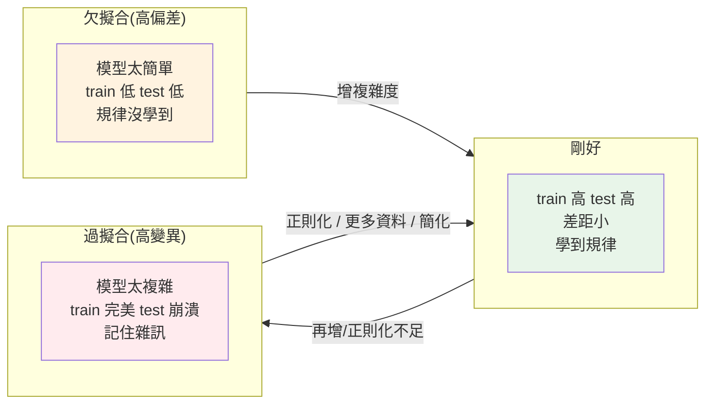

# 過擬合、正則化與交叉驗證

> [第一章](01-ml-intro.md)說「ML 的目的是泛化」,但泛化最大的敵人是**過擬合(overfitting)**——模型把訓練資料**背得滾瓜爛熟**(連雜訊都記住),對新資料卻一敗塗地。這是每個 ML 工程師都會反覆對抗的核心難題。這章講過擬合是什麼、怎麼診斷、以及對付它的兩大武器:**正則化(regularization)** 和**交叉驗證(cross-validation)**——把 Part 25 的評估與訓練知識收束成「如何訓出真正泛化的模型」。

## Why(為什麼)

過擬合是 ML 最普遍、最隱蔽的失敗模式:

- **模型太強會「死記」而非「學規律」**:一個夠複雜的模型(高次多項式、深[神經網路](../27-deep-learning/README.md))能把訓練資料的**每一點**(包括隨機雜訊)完美擬合——訓練誤差趨近 0。但它學到的是「這批資料的特殊細節與雜訊」,不是「可推廣的規律」。遇到新資料,那些死記的細節毫無用處,表現崩潰。**訓練分數完美 + 測試分數很差 = 過擬合**。
- **反面是欠擬合(underfitting)**:模型太簡單(如用直線擬合曲線),連訓練資料的規律都抓不住——訓練和測試都差。這是另一個極端。
- **甜蜜點在中間**:模型要**夠複雜以學到規律,又不能複雜到記住雜訊**。找到這個平衡是訓練模型的核心藝術,背後是 **bias-variance tradeoff(偏差-變異權衡)**。

對付過擬合有系統性的武器:**正則化**(限制模型複雜度,懲罰過大的權重)和**交叉驗證**(更可靠地估計泛化能力、選超參數)。不懂這些,你會反覆訓出「訓練很棒、上線很爛」的模型還不知道為什麼。這章講診斷與解方——這是 ML 工程師的核心功力。

## Theory(理論:bias-variance 與兩大武器)

**Bias-Variance Tradeoff(偏差-變異權衡)**——泛化誤差的兩個來源:

- **偏差(bias)**:模型太簡單、假設太強,系統性地抓不住規律 → **欠擬合**。訓練、測試都差。
- **變異(variance)**:模型太複雜、對訓練資料太敏感,學到雜訊 → **過擬合**。訓練好、測試差。
- **權衡**:降低偏差(增複雜度)常增加變異,反之亦然。**目標是總誤差最小的平衡點**——夠複雜學到規律、夠簡單不記雜訊。

**診斷**:比較**訓練分數**與**測試分數**:

```text
訓練高 + 測試高 + 差距小  → 剛好(泛化好)
訓練高 + 測試低 + 差距大  → 過擬合(高變異)
訓練低 + 測試低          → 欠擬合(高偏差)
```

**武器一:正則化(regularization)**——**懲罰模型複雜度**,逼它別太貼合訓練資料:

- 在損失函式加一項「權重大小的懲罰」:`損失 = 原損失 + α·(權重的懲罰)`。
- **L2(Ridge)**:懲罰權重平方和 → 讓權重**變小但不為 0**,平滑模型。
- **L1(Lasso)**:懲罰權重絕對值和 → 讓部分權重**變成 0**(特徵選擇)。
- **α(正則化強度)**:越大越限制(可能欠擬合)、越小越自由(可能過擬合)——要調。

**武器二:交叉驗證(cross-validation)**——更可靠地估計泛化、調超參數:

- **k-fold CV**:把訓練資料切成 k 份,輪流用 k−1 份訓練、1 份驗證,重複 k 次,**平均**分數。
- **好處**:每筆資料都當過驗證、分數更穩定(不受單次切分運氣影響)、還給出**變異**(分數的標準差)。**用它調超參數(如 α),別用 test**([test 只最終用一次](02-ml-workflow.md))。

## Specification(規範:正則化與 CV)

**正則化模型**:

```python
from sklearn.linear_model import Ridge, Lasso  # L2 / L1
model = Ridge(alpha=0.1)   # alpha 越大正則化越強
model = Lasso(alpha=0.1)   # 會把部分係數壓成 0
# 邏輯回歸的正則化:LogisticRegression(C=1.0),C = 1/alpha(越小越正則)
```

**交叉驗證**:

```python
from sklearn.model_selection import cross_val_score, KFold

kf = KFold(n_splits=5, shuffle=True, random_state=42)  # shuffle 打散順序
scores = cross_val_score(model, X, y, cv=kf, scoring="r2")
scores.mean(), scores.std()   # 平均泛化分數 ± 穩定度
```

**用 CV 調超參數**:`GridSearchCV`/`RandomizedSearchCV`(見 [Part 26](../26-advanced-ml/README.md))對每組超參數跑 CV,選平均最好的。

**對付過擬合的其他手段**:更多資料、簡化模型、[特徵選擇](03-feature-engineering.md)、[神經網路的 dropout/early stopping](../27-deep-learning/07-training-techniques.md)、[集成](../26-advanced-ml/README.md)。

## Implementation(底層:正則化為何有效、CV 為何更可靠)

**正則化為何能抑制過擬合**:過擬合的模型往往有**很大的權重**——為了穿過每一個訓練點(含雜訊),模型必須劇烈擺動,而劇烈擺動對應**巨大的係數**(高次多項式尤其明顯)。正則化在損失裡加「權重懲罰」,等於告訴最佳化:「除了擬合資料,還要讓權重小」。這強迫模型在「貼合資料」和「保持簡單(小權重)」間取捨——結果是**更平滑、更不極端**的模型,不會為了記住雜訊而劇烈擺動。下面範例會看到:15 次多項式無正則化時 test R²=−4.86(災難性過擬合,權重爆炸),加一點 Ridge(α=0.001)後 test R²=0.92——**正則化把過擬合的模型拉回泛化**。α 太大又會過度限制導致欠擬合(範例中 α=0.1 時 test 掉到 0.27),所以 α 要調。

**交叉驗證為何比單次 train/test split 更可靠**:單次切分的分數**受切分運氣影響**——剛好切到容易/難的測試樣本,分數就偏高/偏低。k-fold CV 讓**每筆資料都輪流當驗證集**,取 k 次平均——消除了單次切分的運氣成分,估計更穩定。而且它給出**標準差**(k 次分數的離散),告訴你「這個估計有多穩」——標準差大代表模型對資料切分敏感(可能不穩定或資料太少)。**所以調超參數、選模型用 CV(穩定),最終泛化估計才用一次 test**。注意:資料若有順序(如 X 已排序),要 `shuffle=True` 打散,否則每折拿到的是連續片段(分布偏斜)導致 CV 分數失真。下面範例示範過擬合診斷、正則化修正、CV 評估。

## Code Example(可執行的 Python 範例)

```python
# overfitting.py — 過擬合診斷 + 正則化 + 交叉驗證(需要 sklearn + numpy)
from __future__ import annotations

import numpy as np
from sklearn.linear_model import LinearRegression, Ridge
from sklearn.metrics import r2_score
from sklearn.model_selection import KFold, cross_val_score, train_test_split
from sklearn.pipeline import make_pipeline
from sklearn.preprocessing import PolynomialFeatures


def main() -> None:
    # 真實規律是 sin 曲線 + 雜訊;只有 20 筆(易過擬合)
    rng = np.random.default_rng(0)
    X = np.sort(rng.uniform(0, 1, 20)).reshape(-1, 1)
    y = np.sin(2 * np.pi * X).ravel() + rng.normal(0, 0.15, 20)
    X_train, X_test, y_train, y_test = train_test_split(X, y, test_size=0.4, random_state=0)

    print("多項式次數 vs 過擬合(比較 train 與 test R2):")
    for degree in (1, 3, 15):
        model = make_pipeline(PolynomialFeatures(degree), LinearRegression())
        model.fit(X_train, y_train)
        tr = r2_score(y_train, model.predict(X_train))
        te = r2_score(y_test, model.predict(X_test))
        if tr < 0.7:
            tag = "欠擬合(太簡單)"
        elif tr - te > 0.3:
            tag = "過擬合(記住雜訊)"
        else:
            tag = "剛好"
        print(f"  次數{degree:2}: train R2={tr:6.3f}  test R2={te:7.3f}  ← {tag}")

    print("\n次數 15 + Ridge 正則化(α 控制強度):")
    for alpha in (0.0, 0.001, 0.1):
        est = LinearRegression() if alpha == 0 else Ridge(alpha=alpha)
        model = make_pipeline(PolynomialFeatures(15), est)
        model.fit(X_train, y_train)
        te = r2_score(y_test, model.predict(X_test))
        print(f"  α={alpha}: test R2={te:7.3f}")

    print("\n5-fold 交叉驗證(次數 3,shuffle):")
    kf = KFold(n_splits=5, shuffle=True, random_state=0)
    scores = cross_val_score(
        make_pipeline(PolynomialFeatures(3), LinearRegression()), X, y, cv=kf, scoring="r2"
    )
    print(f"  平均 R2={scores.mean():.3f} ± {scores.std():.3f}(比單次切分更可靠)")


if __name__ == "__main__":
    main()
```

**預期輸出**:

```pycon
$ python overfitting.py
多項式次數 vs 過擬合(比較 train 與 test R2):
  次數 1: train R2= 0.612  test R2=  0.262  ← 欠擬合(太簡單)
  次數 3: train R2= 0.991  test R2=  0.955  ← 剛好
  次數15: train R2= 0.998  test R2= -4.864  ← 過擬合(記住雜訊)

次數 15 + Ridge 正則化(α 控制強度):
  α=0.0: test R2= -4.864
  α=0.001: test R2=  0.921
  α=0.1: test R2=  0.273

5-fold 交叉驗證(次數 3,shuffle):
  平均 R2=0.942 ± 0.078(比單次切分更可靠)
```

逐段解說:

- **欠擬合(次數 1)**:用直線擬合 sin 曲線——train R²=0.612(連訓練資料都抓不好),test 也差。**模型太簡單、高偏差**,規律都沒學到。
- **剛好(次數 3)**:train 0.991、test 0.955,**差距小且都高**——找到了甜蜜點,模型夠複雜學到 sin 的形狀、又不至於記雜訊。**泛化好**。
- **過擬合(次數 15,關鍵)**:train R²=0.998(幾乎完美!)但 **test R²=−4.864(災難!比亂猜還差)**。模型用 15 次多項式的自由度**穿過每個訓練點(含雜訊)**,劇烈擺動,對新資料完全失效。**「訓練近乎完美 + 測試崩潰」是過擬合的典型特徵**——只看訓練分數會被騙得很慘。
- **正則化拯救**:同樣的 15 次多項式,加 Ridge(α=0.001)後 test R² 從 **−4.86 飆到 0.921**!正則化懲罰大權重、抑制劇烈擺動,把過擬合的模型拉回泛化。但 α=0.1(太強)又把 test 壓到 0.273(**過度限制→欠擬合**)——**α 要調到剛好**(用 CV 調)。
- **交叉驗證**:5-fold CV 給出 **0.942 ± 0.078**——平均分數比單次切分穩定,標準差告訴你估計的穩定度。**用 CV 調超參數(如選次數、選 α),比單次切分可靠**。注意 `shuffle=True`(X 已排序,不打散會讓每折分布偏斜)。
- **要點**:過擬合 = 訓練好測試差,靠比較 train/test 診斷;正則化(懲罰複雜度)+ CV(可靠估計/調參)是兩大武器。

## Diagram(圖解:欠擬合/剛好/過擬合)



## Best Practice(最佳實踐)

- **永遠比較 train 與 test 分數**:差距大 = 過擬合、都低 = 欠擬合;這是診斷的第一步。
- **過擬合就正則化**:L2(Ridge)平滑、L1(Lasso)特徵選擇;調 α 到剛好。
- **用交叉驗證調超參數**:比單次切分可靠,還給穩定度;[test 只最終用一次](02-ml-workflow.md)。
- **CV 記得 shuffle**(除非時間序列):有順序的資料不打散會讓折分布偏斜。
- **從簡單模型開始**:先看是否欠擬合再增複雜度,別一開始就上超複雜模型。
- **對付過擬合的多種手段**:更多資料、簡化、特徵選擇、正則化、[集成](../26-advanced-ml/README.md)、[dropout/early stopping](../27-deep-learning/07-training-techniques.md)。
- **正則化前先標準化**:讓懲罰對各特徵公平(否則大尺度特徵受罰不均)。
- **看 CV 的標準差**:很大代表模型不穩或資料太少,結果要保守解讀。

## Common Mistakes(常見誤解)

- **只看訓練分數就滿意**:訓練完美可能是過擬合,測試才見真章。
- **不知道過擬合而反覆增複雜度**:模型越來越複雜、訓練越來越好、上線越來越糟。
- **用 test 調超參數**:test 被間接學習,泛化估計失真;該用 CV/validation。
- **忘記正則化強度要調**:α 太大欠擬合、太小過擬合,用 CV 選。
- **有順序資料 CV 不 shuffle**:折分布偏斜,CV 分數失真(時間序列則相反,不能 shuffle)。
- **正則化前不標準化**:懲罰對不同尺度特徵不公平。
- **以為更多特徵一定更好**:無用特徵增加過擬合與雜訊,適度選擇。
- **忽略欠擬合**:一味防過擬合把模型弄太簡單,連規律都學不到。

## Interview Notes(面試重點)

- **能定義過擬合/欠擬合並診斷**:過擬合=訓練好測試差(高變異)、欠擬合=都差(高偏差);比較 train/test 診斷。
- **能講 bias-variance tradeoff**:兩個誤差來源的權衡,目標是總誤差最小的平衡點。
- **能講正則化如何抑制過擬合**:懲罰大權重、限制複雜度,讓模型平滑;L1(稀疏/特徵選擇)vs L2(平滑)。
- **能講交叉驗證**:k-fold 讓每筆都當驗證、平均更可靠、給穩定度;用來調參,test 留最後。
- **能講對付過擬合的手段**:更多資料、簡化、正則化、特徵選擇、集成、dropout。
- **知道 CV 要 shuffle(除時間序列)、正則化前要標準化、α 要調。**

---

➡️ 下一章:[🏗️ Capstone:端到端 ML 專案](08-capstone-ml.md)

[⬆️ 回 Part 25 索引](README.md)
