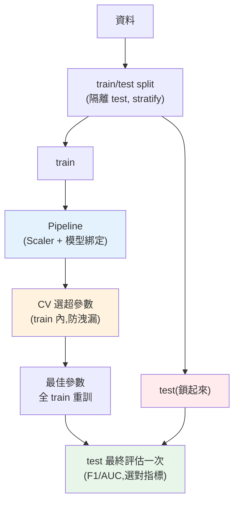

# 🏗️ Capstone:端到端 ML 專案

> 這是 Part 25 的整合實戰:把本 Part 的每一環——[train/test split](02-ml-workflow.md)、[特徵工程](03-feature-engineering.md)、[分類模型](05-classification.md)、[交叉驗證選參](07-overfitting-regularization.md)、[正確評估](06-model-evaluation.md)——串成一個**專業的端到端 ML 流程**,並用 **`Pipeline`** 把它們綁成一個防洩漏、可重現的整體。這章示範一位 ML 工程師如何嚴謹地從資料走到一個可信的模型。

## Why(為什麼)

前面每章教一個環節,但真實 ML 專案的價值在於**把它們正確地組裝起來**——而組裝本身是專業:

- **順序不能錯**:[先 split 再前處理](02-ml-workflow.md)(否則[洩漏](02-ml-workflow.md))、[用 CV 而非 test 調參](07-overfitting-regularization.md)、[test 只最終用一次](02-ml-workflow.md)。順序錯了,評估就作廢。
- **前處理要跟模型綁定**:[標準化的參數只能從 train 學](03-feature-engineering.md),而做 [CV](07-overfitting-regularization.md) 時每一折的 train 都不同——若手動前處理,每折都要小心重算,極易出錯洩漏。**`Pipeline`** 把前處理和模型綁成一個物件,CV/fit 時**自動**在每折的 train 上正確地學前處理,**從結構上杜絕洩漏**。
- **評估要選對指標**:[不平衡資料看 F1/AUC 而非準確率](06-model-evaluation.md),最終在 test 上一次性驗證。

這章用一個完整可跑的分類專案,示範這些如何合為一體,是 Part 25 所有知識的總驗收。**專業的 ML 不是「調高分數」,而是「用嚴謹的流程得到可信的估計」**——這才是模型上線後不會暴跌的保證。

## Theory(理論:專業 ML 流程)

一個嚴謹的端到端 ML 流程:

```text
1. 載入資料 + EDA(見 Part 23)
2. train/test split(先隔離 test,stratify 保比例)
3. 建立 Pipeline(前處理 + 模型綁一起)
4. 用交叉驗證選超參數(在 train 上,不碰 test)
5. 用最佳超參數在「全部 train」上重新訓練
6. 在 test 上一次性最終評估(選對指標)
7. 解讀 + 部署 + 監控(Part 30 的 LLMOps 思維)
```

**Pipeline 的核心價值**:把「前處理 → 模型」串成一個 estimator,它的 `.fit()` 會依序 fit 每一步、`.predict()` 依序 transform + predict。關鍵是——**做 CV 時,Pipeline 在每一折內部只用該折的 train 學前處理參數**,你不必手動管理,洩漏無從發生。這是專業 ML 程式碼的標配。

**選模型/選參數 vs 最終評估的分離**:CV 用來**比較不同超參數/模型**(在 train 內部),選出最佳;test 用來**報告最終泛化**(一次)。這個分離確保 test 的估計是**誠實的**(沒被調參過程間接學習)。

## Specification(規範:Pipeline + CV + 評估)

```python
from sklearn.pipeline import Pipeline
from sklearn.preprocessing import StandardScaler
from sklearn.linear_model import LogisticRegression
from sklearn.model_selection import train_test_split, cross_val_score

# 1. split(先隔離 test)
X_train, X_test, y_train, y_test = train_test_split(
    X, y, test_size=0.25, random_state=42, stratify=y
)

# 2. Pipeline:前處理 + 模型綁定(防洩漏)
pipe = Pipeline([
    ("scaler", StandardScaler()),
    ("clf", LogisticRegression(max_iter=1000, random_state=42)),
])

# 3. CV 選超參數(在 train 上)
for C in [0.01, 0.1, 1, 10]:
    pipe.set_params(clf__C=C)                          # clf__C:存取 Pipeline 內步驟的參數
    score = cross_val_score(pipe, X_train, y_train, cv=5, scoring="f1").mean()

# 4. 最佳參數在全 train 重訓,test 最終評估
pipe.set_params(clf__C=best_C).fit(X_train, y_train)
pipe.predict(X_test), pipe.predict_proba(X_test)
```

**要點**:`Pipeline` 用 `步驟名__參數名` 存取內部參數(`clf__C`);`cross_val_score` 對 Pipeline 做 CV 時自動防洩漏;`scoring` 選符合問題的指標(不平衡用 `"f1"`/`"roc_auc"`)。實務用 [`GridSearchCV`](../26-advanced-ml/README.md) 自動化選參。

## Implementation(底層:Pipeline 如何防洩漏、流程如何保證誠實)

**Pipeline 在 CV 中如何自動防洩漏**:當 `cross_val_score(pipe, X_train, y_train, cv=5)` 執行時,它把 train 切成 5 折,每次用 4 折當「內部 train」、1 折當「內部驗證」。**關鍵在於**:Pipeline 的 `fit` 是在「內部 train(4 折)」上呼叫的——`StandardScaler` 的 mean/std **只從這 4 折學**,然後 transform 套到內部驗證的那 1 折。**每一折都重新、正確地只從該折的訓練部分學前處理**,驗證折的資訊從不洩漏進前處理。若你手動先 `scaler.fit_transform(X_train)` 再做 CV,scaler 就看了全部 train(含每折的驗證部分),**每折都洩漏**——分數虛高。**Pipeline 把這件容易錯的事自動化、正確化**,這是它不可取代的價值。

**整個流程如何保證「誠實的估計」**:誠實的關鍵是 **test 全程零接觸**,直到最後一步。split 後 test 立刻隔離;CV 選參只在 train 內部進行(test 沒參與);選出最佳參數後在**全部 train** 重訓(用滿所有訓練資料);最後才用 test 評一次。這樣 test 分數反映的是「一個依標準流程訓好的模型,遇到全新資料的表現」——沒有任何形式的洩漏或間接學習。**這個流程的每一步都在守護「泛化估計的誠實性」**,這正是專業與業餘的分野:業餘追求高分(常來自洩漏),專業追求可信(來自嚴謹流程)。下面範例跑完整流程。

## Code Example(可執行的 Python 範例)

```python
# capstone_ml.py — 端到端 ML:Pipeline + CV 選參 + test 評估(需要 sklearn)
from __future__ import annotations

from sklearn.datasets import make_classification
from sklearn.linear_model import LogisticRegression
from sklearn.metrics import classification_report, roc_auc_score
from sklearn.model_selection import cross_val_score, train_test_split
from sklearn.pipeline import Pipeline
from sklearn.preprocessing import StandardScaler


def main() -> None:
    # 不平衡分類資料(70/30)
    X, y = make_classification(
        n_samples=500, n_features=8, n_informative=5, weights=[0.7, 0.3], random_state=42
    )

    # 1. 先 split,隔離 test(stratify 保比例)
    X_train, X_test, y_train, y_test = train_test_split(
        X, y, test_size=0.25, random_state=42, stratify=y
    )

    # 2. Pipeline:標準化 + 邏輯回歸(綁定,防洩漏)
    pipe = Pipeline(
        [
            ("scaler", StandardScaler()),
            ("clf", LogisticRegression(max_iter=1000, random_state=42)),
        ]
    )

    # 3. 用 CV 在 train 上選超參數 C(不平衡看 f1)
    best_c, best_score = 1.0, -1.0
    for c in (0.01, 0.1, 1, 10):
        pipe.set_params(clf__C=c)
        score = cross_val_score(pipe, X_train, y_train, cv=5, scoring="f1").mean()
        if score > best_score:
            best_score, best_c = score, c
    print(f"CV 選出最佳 C={best_c}(train CV f1={best_score:.3f})")

    # 4. 最佳參數在全 train 重訓,test 最終評估一次
    pipe.set_params(clf__C=best_c).fit(X_train, y_train)
    pred = pipe.predict(X_test)
    proba = pipe.predict_proba(X_test)[:, 1]

    print(f"\n測試 AUC = {roc_auc_score(y_test, proba):.3f}")
    print("測試分類報告:")
    print(classification_report(y_test, pred, digits=3, target_names=["正常", "目標"]))


if __name__ == "__main__":
    main()
```

**預期輸出**:

```pycon
$ python capstone_ml.py
CV 選出最佳 C=10(train CV f1=0.806)

測試 AUC = 0.900
測試分類報告:
              precision    recall  f1-score   support

          正常      0.917     0.875     0.895        88
          目標      0.732     0.811     0.769        37

    accuracy                          0.856       125
   macro avg      0.824     0.843     0.832       125
weighted avg      0.862     0.856     0.858       125
```

逐段解說:

- **步驟 1 split**:先切出 test(25%)並**隔離**,`stratify=y` 保持 70/30 的類別比例([防評估失真](02-ml-workflow.md))。test 從此鎖進保險箱,直到最後。
- **步驟 2 Pipeline(核心)**:`StandardScaler` + `LogisticRegression` 綁成一個物件。**這確保後續 CV 的每一折都自動、正確地只從該折 train 學標準化參數**——手動做極易洩漏,Pipeline 從結構上杜絕。
- **步驟 3 CV 選參**:試 C ∈ {0.01, 0.1, 1, 10}(C 是[邏輯回歸的正則化強度](07-overfitting-regularization.md)倒數),對每個 C 在 **train 上跑 5-fold CV**,選 f1 最高的(**不平衡資料看 f1 而非準確率**)。選出 C=10。**注意:全程只用 train,test 沒參與選參**——這保證 test 估計誠實。
- **步驟 4 重訓 + 最終評估**:用最佳 C 在**全部 train**上重訓(用滿訓練資料),然後 test **一次性**評估——**AUC=0.900**(整體區分力好)。分類報告顯示「目標」類(少數類)precision 0.732/recall 0.811——**專業做法:對不平衡資料看每類的 P/R/F1 與 AUC,而非只看整體 accuracy(0.856)**。
- **流程的誠實性**:test 全程零接觸直到最後一步,選參靠 CV、前處理靠 Pipeline 防洩漏——所以這個 AUC=0.900 是**可信的泛化估計**,上線後不會暴跌。**這就是專業 ML:嚴謹的流程換來可信的結果。**
- **要點**:先 split → Pipeline 綁前處理防洩漏 → CV 選參(train 內)→ 全 train 重訓 → test 一次評估(選對指標)。這是 ML 工程的標準骨架。

## Diagram(圖解:端到端 ML 流程)



## Best Practice(最佳實踐)

- **用 Pipeline 綁前處理 + 模型**:CV/fit 自動防洩漏,可重現、可部署為單一物件。
- **嚴守流程順序**:先 split → CV 選參(train 內)→ 全 train 重訓 → test 一次評估。
- **CV 選參、test 最終評估分離**:確保泛化估計誠實(test 不參與選參)。
- **選對指標**:不平衡看 F1/AUC/每類 P/R,別只看準確率。
- **stratify + 固定 random_state**:保比例、可重現。
- **實務用 GridSearchCV/RandomizedSearchCV**([Part 26](../26-advanced-ml/README.md)):自動化選參 + CV。
- **追求可信而非高分**:嚴謹流程的可信估計,勝過洩漏來的虛高分數。
- **部署後監控**(Part 30 思維):資料漂移、效能衰退要持續追蹤。

## Common Mistakes(常見誤解)

- **手動前處理 + CV**:每折洩漏而不自知;用 Pipeline。
- **在 split 前前處理**:[經典洩漏](02-ml-workflow.md),評估虛高。
- **用 test 選參**:test 被間接學習,泛化估計失真;用 CV。
- **不平衡只看準確率**:被多數類主宰,漏掉少數類表現差。
- **選完參數不重訓就報 test**:應用最佳參數在全 train 重訓再評 test。
- **不 stratify 不平衡資料**:類別比例失真,評估不具代表性。
- **追求排行榜高分而洩漏**:虛高分數上線暴跌,不如誠實的中等分數。
- **忽略部署後監控**:模型會隨資料漂移衰退。

## Interview Notes(面試重點)

- **能描述端到端 ML 流程**:split→Pipeline→CV 選參→全 train 重訓→test 評估,順序不能錯。
- **能講 Pipeline 為何防洩漏**:CV 時每折自動只從該折 train 學前處理,手動做易洩漏。
- **能講 CV 選參與 test 評估的分離**:保證泛化估計誠實(test 全程零接觸直到最後)。
- **能講選對指標**:不平衡看 F1/AUC/每類 P/R,而非準確率。
- **能強調專業 ML 追求「可信估計」而非「高分」**:嚴謹流程守護誠實性。
- **知道 stratify、固定 random_state、GridSearchCV、部署後監控。**

---

🎉 **恭喜你完成 Part 25!** 你已掌握 ML 的完整基礎——從概念、工作流、特徵工程,到回歸/分類模型、正確評估、對抗過擬合,並能用嚴謹的 Pipeline 流程端到端訓練可信的模型。接下來 [Part 26](../26-advanced-ml/README.md) 進入更強的模型(樹、集成)與模型工程。

➡️ 下一 Part:[進階機器學習](../26-advanced-ml/README.md)

[⬆️ 回 Part 25 索引](README.md)
