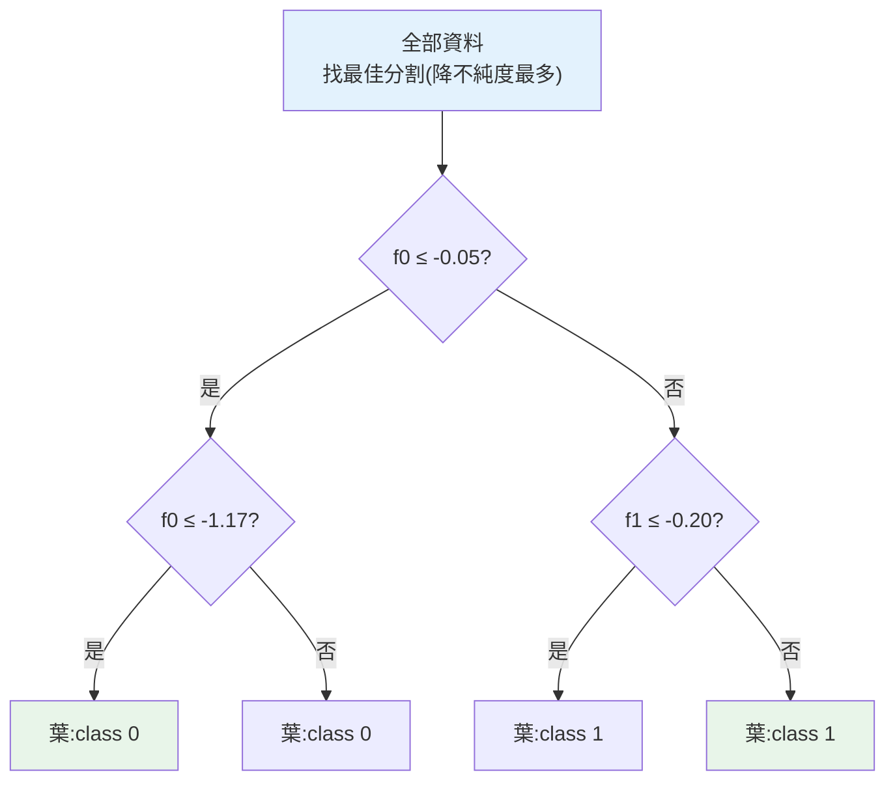

# 決策樹

> [線性/邏輯回歸](../25-machine-learning/04-linear-regression.md)假設關係是線性的,但很多真實關係是「**如果...就...否則...**」的分段邏輯。**決策樹(decision tree)** 用一連串「是非問題」把資料切分,像流程圖一樣做決策——它能學非線性關係、天生可解釋、不需[特徵縮放](../25-machine-learning/03-feature-engineering.md),而且是[隨機森林、梯度提升](02-ensemble-learning.md)這些**最強實務模型**的基石。這章講決策樹怎麼學、為何極易過擬合、怎麼控制。

## 💡 白話導讀(建議先讀)

[線性/邏輯回歸](../25-machine-learning/04-linear-regression.md)假設世界是直線的,
但很多關係是**分段、有轉折**的:「年收入 100 萬以上、且年齡大於 40」才是目標客群——
這種「一層層 if-else」的邏輯,線性模型很難表達,**決策樹**卻天生就是這樣想事情的。

決策樹就是一棵**問診分流圖**,你玩過的「20 問猜動物」就是它:

```text
        年收入 > 80萬?
        /          \
      是            否
   年齡 > 40?      判為「非目標」
   /      \
 目標      非目標
```

它**自己學會該問什麼問題、在哪切**。學習的原則叫「**每問一刀,讓兩堆越純越好**」——
純度就是「同一堆盡量是同類」,用 Gini 或熵衡量。一刀切下去讓混亂度下降最多,就選那一刀。

決策樹最大的優點是**直覺、可解釋**——整棵樹畫出來,連老闆都看得懂「為什麼這樣判」。
但它有個致命弱點,這章會講透也為下一章鋪路:**單棵樹極易過擬合**——
只要不限制,它會一路切到「每片葉子只剩一筆資料」,把訓練集背得滾瓜爛熟、
換新資料就崩(所以要用 `max_depth`、`min_samples_leaf` 這些旋鈕**剪枝**)。

「一棵樹不穩,那就種一片森林」——這個念頭直接通往 [ch02 集成學習](02-ensemble-learning.md),
也是隨機森林、XGBoost 這些實務霸主的起點。

## Why(為什麼)

決策樹填補了線性模型的空白,且有獨特優勢:

- **能學非線性、分段的關係**:「年收入 > 100 萬 **且** 年齡 < 30 → 高價值客戶;否則若持有時間 > 5 年 → 忠實客戶」——這種**條件分支**的邏輯,線性模型難表達,決策樹天生就是這樣運作。
- **可解釋性極強(白箱)**:決策樹學出的是一棵**能直接畫出來、逐條讀懂的規則樹**(「如果 X > 5 走左邊,否則走右邊...」)。你能向業務/監管**完整解釋**每個預測怎麼來——這在[需要透明的場景](../30-production-ai/06-guardrails.md)極其寶貴,是[黑箱模型](07-interpretability.md)給不了的。
- **不需前處理**:決策樹按「單一特徵的閾值」分割,**不受尺度影響**——不必[標準化](../25-machine-learning/03-feature-engineering.md);也能自然處理數值與類別特徵。這省去很多麻煩。
- **是集成模型的基石**:單棵決策樹不夠強、極易過擬合,但把**很多樹組合起來**([隨機森林、梯度提升](02-ensemble-learning.md))就成了實務中最常勝出的模型。理解決策樹是理解那些強模型的前提。

但決策樹有個致命弱點:**極易過擬合**——不加限制的樹會一路分割到「每個葉子只剩一筆資料」,把訓練資料背得死死的([Part 25 的過擬合](../25-machine-learning/07-overfitting-regularization.md)在樹上特別嚴重)。理解為什麼、以及怎麼用「剪枝/深度限制」控制,是用好決策樹的關鍵。這章講透。

## Theory(理論:遞迴分割與純度)

**決策樹如何學**:用**遞迴二元分割(recursive binary splitting)**——

1. 從根節點(全部資料)開始,**找一個「特徵 + 閾值」把資料切成兩堆**,使切完後兩堆各自「**越純越好**」(同一堆盡量是同類別)。
2. 對每一堆**遞迴**重複,直到停止條件(達最大深度、葉子夠純、樣本太少)。
3. 每個**葉節點**給一個預測(分類:多數類;回歸:平均值)。

**「純度」怎麼衡量**——分割的目標是降低**不純度(impurity)**:

- **Gini 不純度**:`1 − Σpᵢ²`(pᵢ 是各類別比例)。全同類 = 0(最純)、各半 = 0.5(最不純)。sklearn 分類預設。
- **熵(entropy)**:`−Σpᵢ·log(pᵢ)`,概念類似。
- 每次分割選「**讓不純度下降最多**」的特徵與閾值(貪婪法)。

**特徵重要性**:某特徵在樹中被用來分割時,累計降低了多少不純度——反映它對預測的貢獻(sklearn 的 `feature_importances_`)。

**回歸樹**:概念相同,但用「降低變異(MSE)」當分割標準,葉子預測該區的平均值。

## Specification(規範:sklearn 與過擬合控制)

```python
from sklearn.tree import DecisionTreeClassifier, DecisionTreeRegressor, export_text

model = DecisionTreeClassifier(
    max_depth=3,           # 最大深度(最重要的正則化參數)
    min_samples_split=20,  # 節點至少多少樣本才分割
    min_samples_leaf=10,   # 葉子至少多少樣本
    random_state=42,
)
model.fit(X_train, y_train)

model.feature_importances_          # 各特徵重要性
export_text(model, feature_names=[...])  # 印出可讀的規則樹
```

**控制過擬合的關鍵參數(剪枝 / pre-pruning)**:

| 參數 | 作用 |
|------|------|
| `max_depth` | 樹的最大深度——**最重要**,越小越簡單 |
| `min_samples_split` | 節點要多少樣本才分割(越大越保守) |
| `min_samples_leaf` | 葉子最少樣本(防止過細分割) |
| `max_leaf_nodes` | 最多葉子數 |
| `ccp_alpha` | 成本複雜度剪枝(post-pruning) |

**不設限制的樹幾乎必過擬合**——一定要調這些參數(用 [CV](../25-machine-learning/07-overfitting-regularization.md))。

## Implementation(底層:為何極易過擬合、樹的優缺)

**決策樹為何極易過擬合**:一棵不加限制的決策樹會**一直分割直到每個葉子完全純**——極端情況下,每筆訓練資料獨佔一個葉子。這時訓練準確率 **100%**(每筆都被「記住」),但它學到的是「這批資料的每個特例(含雜訊)」而非可推廣的規律——遇到新資料就崩([Part 25 過擬合](../25-machine-learning/07-overfitting-regularization.md)的極致)。下面範例會看到:`max_depth=None`(無限制)時 train=1.000 但 test 停在 0.883,而 `max_depth=3` 的 train=0.929、test=0.883——**深度無限只是把訓練分數刷到滿分,泛化毫無改善**,純粹是記憶。這就是為什麼**決策樹一定要限制複雜度(剪枝)**:樹的表達力太強,不約束就會記住雜訊。

**樹的其他特性**:決策樹是**貪婪**的(每步選當下最好的分割,不保證全域最優),且**不穩定**(資料小變動可能讓整棵樹長得很不一樣——這也是[集成](02-ensemble-learning.md)能改善它的原因:平均掉不穩定)。優點是**天生可解釋**(能畫出規則樹,見下面範例的 `export_text`)、**不需縮放**、**能捕捉非線性與特徵交互**。缺點是**單棵易過擬合又不穩、對某些線性關係反而不如線性模型效率高**。理解這些優缺,你就知道何時用單棵樹(要極致可解釋時)、何時用[集成](02-ensemble-learning.md)(要高效能時)。下面範例示範深度對過擬合的影響、特徵重要性、可讀規則。

## Code Example(可執行的 Python 範例)

```python
# decision_tree.py — 決策樹:深度對過擬合的影響 + 特徵重要性 + 可讀規則
from __future__ import annotations

import numpy as np
from sklearn.datasets import make_classification
from sklearn.model_selection import train_test_split
from sklearn.tree import DecisionTreeClassifier, export_text


def main() -> None:
    X, y = make_classification(
        n_samples=400, n_features=4, n_informative=3, n_redundant=0, random_state=42
    )
    X_train, X_test, y_train, y_test = train_test_split(
        X, y, test_size=0.3, random_state=42, stratify=y
    )

    print("max_depth vs 過擬合(樹越深越易背住訓練資料):")
    for depth in (1, 3, None):
        model = DecisionTreeClassifier(max_depth=depth, random_state=42)
        model.fit(X_train, y_train)
        tr, te = model.score(X_train, y_train), model.score(X_test, y_test)
        label = "無限制" if depth is None else str(depth)
        print(f"  max_depth={label:>6}: train={tr:.3f} test={te:.3f}")
    print("  → 無限制:train=1.0(完美記憶)但 test 沒更好 = 純過擬合")

    # 特徵重要性
    model = DecisionTreeClassifier(max_depth=3, random_state=42).fit(X_train, y_train)
    print(f"\n特徵重要性: {np.round(model.feature_importances_, 3)}")
    print("  → 反映各特徵對降低不純度的貢獻(哪個特徵最有用)")

    # 可讀規則樹(可解釋性)
    small = DecisionTreeClassifier(max_depth=2, random_state=42).fit(X_train[:, :2], y_train)
    print("\n決策樹規則(前 2 特徵,深度 2):")
    print(export_text(small, feature_names=["f0", "f1"]))


if __name__ == "__main__":
    main()
```

**預期輸出**:

```pycon
$ python decision_tree.py
max_depth vs 過擬合(樹越深越易背住訓練資料):
  max_depth=     1: train=0.854 test=0.775
  max_depth=     3: train=0.929 test=0.883
  max_depth=無限制: train=1.000 test=0.883
  → 無限制:train=1.0(完美記憶)但 test 沒更好 = 純過擬合

特徵重要性: [0.141 0.    0.101 0.758]
  → 反映各特徵對降低不純度的貢獻(哪個特徵最有用)

決策樹規則(前 2 特徵,深度 2):
|--- f0 <= -0.05
|   |--- f0 <= -1.17
|   |   |--- class: 0
|   |--- f0 >  -1.17
|   |   |--- class: 0
|--- f0 >  -0.05
|   |--- f1 <= -0.20
|   |   |--- class: 1
|   |--- f1 >  -0.20
|   |   |--- class: 1
```

逐段解說:

- **深度與過擬合(核心)**:`max_depth=1`(太淺)train/test 都偏低——**欠擬合**(樹太簡單);`max_depth=3` train=0.929 test=0.883,差距合理——**剛好**;`max_depth=None`(無限制)**train=1.000**(完美背下每筆訓練資料)但 **test 還是 0.883**(沒比深度 3 好)!**這證明無限制的樹只是在「記憶」而非「學習」**——訓練分數刷滿但泛化零改善,是[過擬合](../25-machine-learning/07-overfitting-regularization.md)的教科書案例。**所以決策樹一定要限制深度。**
- **特徵重要性**:`[0.141, 0.0, 0.101, 0.758]`——第 4 個特徵貢獻 75.8%(最重要),第 2 個是 0(樹沒用它)。這讓你知道**哪些特徵真正驅動預測**,可用於[特徵選擇](../25-machine-learning/03-feature-engineering.md)與[洞察](../24-business-analytics/08-data-storytelling.md)。
- **可讀規則(可解釋性)**:`export_text` 印出**完整的決策邏輯**——「若 f0 ≤ −0.05 走左...」。你能**逐條讀懂**模型怎麼決策,向任何人解釋。這種**白箱透明度**是決策樹相對[神經網路](../27-deep-learning/README.md)等黑箱的最大優勢。
- **要點**:決策樹用遞迴分割學非線性規則、天生可解釋、不需縮放,但**極易過擬合、必須限制深度**(剪枝);單棵樹是[集成模型](02-ensemble-learning.md)的基石。

## Diagram(圖解:決策樹分割)



## Best Practice(最佳實踐)

- **一定要限制複雜度**:`max_depth`、`min_samples_leaf` 等剪枝參數,否則必過擬合;用 [CV](../25-machine-learning/07-overfitting-regularization.md) 調。
- **用 `max_depth` 當主要調節**:最直接控制複雜度;配合 `min_samples_leaf`。
- **善用可解釋性**:`export_text`/畫樹圖向利害關係人解釋決策。
- **看 `feature_importances_`**:了解哪些特徵驅動預測,做[特徵選擇](../25-machine-learning/03-feature-engineering.md)與洞察。
- **不需縮放**:樹按閾值分割,省去[標準化](../25-machine-learning/03-feature-engineering.md)。
- **單棵樹要更強就上集成**:[隨機森林/梯度提升](02-ensemble-learning.md)平均掉單棵樹的不穩與過擬合。
- **注意特徵重要性的偏誤**:偏好高基數/連續特徵;要對照 [permutation importance](07-interpretability.md)。
- **不平衡資料設 `class_weight`**(見 [ch06](06-imbalanced-data.md))。

## Common Mistakes(常見誤解)

- **不限制深度**:樹一路長到 train=100%,嚴重過擬合,test 崩。
- **只看訓練準確率**:決策樹訓練分數容易刷滿,測試才見真章。
- **對決策樹做標準化**:無害但多餘(樹不受尺度影響)。
- **過度信任單棵樹**:不穩定(資料小變動樹就變)、易過擬合,要用集成。
- **盲信 feature_importances_**:對高基數/連續特徵有偏誤,需佐證。
- **以為越深越好**:深度增加只是記憶,泛化不改善反變差。
- **用單棵樹追求最高分**:單棵樹上限有限,高效能該用集成。
- **忽略回歸樹的存在**:決策樹也能做回歸(葉子預測平均)。

## Interview Notes(面試重點)

- **能講決策樹如何學**:遞迴二元分割,每次選「降不純度(Gini/熵)最多」的特徵與閾值。
- **能講為何極易過擬合**:不限制會分割到每葉一筆、完美記憶訓練資料;要剪枝(max_depth 等)。
- **能講決策樹的優點**:可解釋(白箱規則)、不需縮放、能學非線性與交互。
- **能講缺點**:單棵易過擬合、不穩定;所以用[集成](02-ensemble-learning.md)改善。
- **能講特徵重要性**:累計降低的不純度,但有偏誤(需 permutation importance 佐證)。
- **知道 Gini vs 熵、回歸樹用變異、決策樹是集成模型基石。**

---

➡️ 下一章:[集成學習:隨機森林與梯度提升](02-ensemble-learning.md)

[⬆️ 回 Part 26 索引](README.md)
