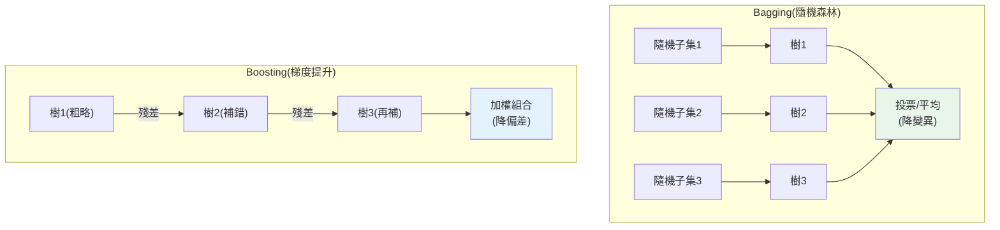

# 集成學習:隨機森林與梯度提升

> [單棵決策樹](01-decision-trees.md)易過擬合、不穩定——那就**種一整片森林**。**集成學習(ensemble learning)** 的核心洞見驚人地簡單卻強大:**把很多個「不夠好」的模型組合起來,能得到一個「很好」的模型**。**隨機森林**和**梯度提升**是這個思想的兩種實現,也是**表格資料上實務與競賽最常勝出的模型**——常常打敗調校精細的[神經網路](../27-deep-learning/README.md)。這章講兩種集成策略(bagging vs boosting)的原理與差異。

## 💡 白話導讀(建議先讀)

[單棵決策樹](01-decision-trees.md)聰明但**任性**——換一批資料,長相就大變(不穩、易過擬合)。
**集成學習(ensemble)** 的核心信念是一句諺語:**「三個臭皮匠,勝過一個諸葛亮」**——
與其賭一個天才模型,不如讓一群平庸模型**投票**。

湊出這群人有兩種完全不同的哲學,一定要分清:

**Bagging(並行,降變異)＝獨立民調取平均。**
同時訓練很多棵樹,每棵**只看隨機的一部分資料和特徵**,最後**投票/平均**。
關鍵妙處:每棵樹各自過擬合到「不同的隨機角落」,**錯誤方向各異**,
平均後互相抵消——像多份獨立民調平均,比單份準。
**代表作:隨機森林(Random Forest)**——實務最好用的「開箱即用」模型之一。

**Boosting(串行,降偏差)＝一群人接力補前一棒的錯。**
一棵接一棵**依序**訓練,每棵**專門修正前面所有樹犯的錯**(盯著被答錯的樣本加強)。
一群弱模型接力,拼出一個超強模型。
**代表作:XGBoost、LightGBM**——Kaggle 表格資料競賽的**常勝軍**,面試高頻。

一句話記住取捨:
**Bagging 平行、治「不穩」(變異);Boosting 串行、治「不準」(偏差),但更容易過擬合、要調參**。
這章把兩派原理、隨機森林與梯度提升的實作、以及何時選誰講清楚——
表格資料的實戰,八成時間在跟這兩派打交道。

## Why(為什麼)

單一模型有其極限:[單棵決策樹](01-decision-trees.md)易過擬合又不穩(資料小變動樹就大變),[線性模型](../25-machine-learning/04-linear-regression.md)表達力有限。集成學習用「群體智慧」突破:

- **群體比個體準**:一個人猜一罐糖果有幾顆容易偏,但**一群人猜的平均**往往驚人地準——個別的錯誤(有人猜太多、有人太少)**互相抵消**。集成學習把這用在模型上:多個模型的預測**平均/投票**,個別模型的錯誤相互抵消,整體更準更穩。
- **降低過擬合與變異**:單棵決策樹過擬合(高變異),但**很多棵樹的平均**會平滑掉各自的過擬合——森林比單棵樹穩定得多、泛化好得多(下面範例:單棵 0.894 → 森林 0.933)。
- **表格資料的王者**:對結構化的**表格資料**(大多數商業資料),梯度提升(XGBoost、LightGBM)和隨機森林**幾乎是預設最佳選擇**——強、穩、相對好調、不太需要[特徵縮放](../25-machine-learning/03-feature-engineering.md)。深度學習在影像/文字稱王,但**表格資料上集成樹常勝出**。

理解集成的兩大策略——**bagging(平行、降變異)** 和 **boosting(序列、降偏差)**——以及它們的代表(隨機森林 vs 梯度提升),是 ML Engineer 的核心武器。這章講清楚它們怎麼運作、何時用哪個。

## Theory(理論:bagging vs boosting)

集成有兩大策略,思路截然不同:

**Bagging(Bootstrap Aggregating)——平行、降變異**:

- **並行**訓練很多個模型,每個看**資料的隨機子集**(bootstrap 抽樣 + 隨機特徵子集),最後**投票/平均**。
- **代表:隨機森林(Random Forest)**——很多棵決策樹,每棵看不同的隨機資料/特徵子集,分類投票、回歸平均。
- **為何有效**:每棵樹各自過擬合到「不同的隨機子集」,但**它們的錯誤方向不同**,平均後**相互抵消**,降低整體**變異**(過擬合)。樹之間越「不相關」,抵消越有效(所以要隨機化)。

**Boosting——序列、降偏差**:

- **序列**訓練模型,**每個新模型專注修正前面模型的錯誤**(給前面答錯的樣本更大權重/擬合殘差)。最後加權組合。
- **代表:梯度提升(Gradient Boosting)**——一棵接一棵地種樹,每棵樹擬合「前面所有樹的殘差(錯誤)」,逐步逼近。**XGBoost、LightGBM、CatBoost** 是其高效實現(競賽常勝軍)。
- **為何有效**:每步專注修正錯誤,**逐步降低偏差**(擬合能力),集成後很強。但**更易過擬合**(一直修正到記住雜訊),要小心調(學習率、樹數、深度)。

**核心對比**:bagging 並行、降變異、較不易過擬合、好平行化;boosting 序列、降偏差、更強但更易過擬合、要細調。

## Specification(規範:sklearn 集成)

```python
from sklearn.ensemble import RandomForestClassifier, GradientBoostingClassifier

# 隨機森林(bagging)
rf = RandomForestClassifier(
    n_estimators=100,     # 樹的數量(越多越穩,邊際遞減)
    max_depth=None,       # 單棵可較深(集成會平均掉過擬合)
    max_features="sqrt",  # 每次分割考慮的隨機特徵數(去相關)
    random_state=42,
)

# 梯度提升(boosting)
gb = GradientBoostingClassifier(
    n_estimators=100,     # 樹的數量(boosting 太多會過擬合)
    learning_rate=0.1,    # 學習率(每棵樹的貢獻;小=慢但穩)
    max_depth=3,          # 單棵通常淺(弱學習器)
    random_state=42,
)

rf.feature_importances_   # 集成也提供特徵重要性
```

**關鍵參數**:

| 模型 | 關鍵參數 | 調校方向 |
|------|----------|----------|
| 隨機森林 | `n_estimators`、`max_features`、`max_depth` | 樹夠多、特徵子集去相關 |
| 梯度提升 | `n_estimators`、`learning_rate`、`max_depth` | 學習率與樹數權衡、樹淺、防過擬合 |

**learning_rate × n_estimators 的權衡**(boosting):小學習率 + 多樹 = 更穩但更慢;是 boosting 調校的核心。

## Implementation(底層:平均為何降變異、boosting 為何降偏差)

**bagging 為何降低變異(過擬合)**:假設你有 N 個模型,每個預測都有隨機誤差(變異)。若這些誤差**互相獨立**,取平均後——根據統計,N 個獨立隨機變數的平均,其變異是單個的 **1/N**。所以**平均很多個各自過擬合(高變異)的樹,能大幅降低整體變異**,而不增加偏差(每棵樹平均而言是對的)。關鍵是誤差要**盡量獨立**——所以隨機森林讓每棵樹看**不同的隨機資料子集 + 隨機特徵子集**,強迫樹之間「不相關」,平均才有效。這就是為什麼「隨機」是隨機森林的靈魂:越隨機、樹越不相關、變異降越多。下面範例會看到單棵樹 test=0.894,而 100 棵樹的森林 test=0.933——**平均掉了單棵的過擬合與不穩**。

**boosting 為何降低偏差**:bagging 的每棵樹是「完整能力」的(可能過擬合),平均降變異;boosting 相反——每棵樹是**弱的(淺樹,高偏差)**,但**序列地專注修正前面的錯誤**。第一棵樹粗略擬合,第二棵樹專門補第一棵答錯的,第三棵補前兩棵還錯的...**逐步把偏差降下來**。就像考試訂正——每次專攻上次錯的題,慢慢逼近滿分。因為每步都針對性修正,boosting 的**擬合能力(降偏差)很強**,常比隨機森林準一點;但代價是**更易過擬合**(一直修正到把雜訊也「訂正」進去),所以要用**小學習率**(每棵樹只貢獻一點,慢慢逼近,別衝過頭)和**淺樹**來約束。下面範例對比單棵樹、隨機森林、梯度提升。

## Code Example(可執行的 Python 範例)

```python
# ensemble.py — 單棵樹 vs 隨機森林(bagging) vs 梯度提升(boosting)
from __future__ import annotations

from sklearn.datasets import make_classification
from sklearn.ensemble import GradientBoostingClassifier, RandomForestClassifier
from sklearn.model_selection import train_test_split
from sklearn.tree import DecisionTreeClassifier


def main() -> None:
    X, y = make_classification(
        n_samples=600, n_features=10, n_informative=6, random_state=42
    )
    X_train, X_test, y_train, y_test = train_test_split(
        X, y, test_size=0.3, random_state=42, stratify=y
    )

    models = {
        "單棵決策樹": DecisionTreeClassifier(random_state=42),
        "隨機森林(bagging)": RandomForestClassifier(n_estimators=100, random_state=42),
        "梯度提升(boosting)": GradientBoostingClassifier(n_estimators=100, random_state=42),
    }
    print("模型對比:")
    for name, model in models.items():
        model.fit(X_train, y_train)
        tr, te = model.score(X_train, y_train), model.score(X_test, y_test)
        print(f"  {name:20}: train={tr:.3f} test={te:.3f}")
    print("  → 集成(森林/提升)test 明顯勝過單棵樹(平均掉過擬合與不穩)")

    print("\n隨機森林 n_estimators 影響(樹越多越穩,邊際遞減):")
    for n in (1, 10, 100):
        rf = RandomForestClassifier(n_estimators=n, random_state=42).fit(X_train, y_train)
        print(f"  {n:>3} 棵樹: test={rf.score(X_test, y_test):.3f}")


if __name__ == "__main__":
    main()
```

**預期輸出**:

```pycon
$ python ensemble.py
模型對比:
  單棵決策樹            : train=1.000 test=0.894
  隨機森林(bagging)    : train=1.000 test=0.933
  梯度提升(boosting)   : train=0.998 test=0.928
  → 集成(森林/提升)test 明顯勝過單棵樹(平均掉過擬合與不穩)

隨機森林 n_estimators 影響(樹越多越穩,邊際遞減):
    1 棵樹: test=0.839
   10 棵樹: test=0.917
  100 棵樹: test=0.933
```

逐段解說:

- **集成勝過單棵(核心)**:單棵決策樹 train=1.0(過擬合)但 **test 只 0.894**;**隨機森林 test=0.933、梯度提升 test=0.928**——都明顯勝過單棵樹。**集成的威力**:100 棵各自過擬合的樹,它們的錯誤方向不同,平均後相互抵消,泛化大幅提升。注意森林 train 也是 1.0 但 test 高得多——**它的「過擬合」被平均消化了**。
- **隨機森林 vs 梯度提升**:兩者都很強(0.933 vs 0.928),此例森林略高。實務上**梯度提升(XGBoost/LightGBM)常在細調後略勝**,但更難調、更易過擬合;隨機森林**更省心、更穩、好平行**。**表格資料先試這兩個當強 baseline。**
- **樹的數量效應**:1 棵樹 test=0.839(等於單棵,不穩)、10 棵=0.917、100 棵=0.933——**樹越多越穩越準,但邊際遞減**(10→100 只多 1.6%)。這印證「平均越多獨立模型,變異降越多」,但到一定程度收益趨緩。實務常用 100~數百棵。
- **要點**:bagging(隨機森林)平行、降變異、省心穩定;boosting(梯度提升)序列、降偏差、更強但要細調。**表格資料上,集成樹是實務首選**,常勝過神經網路。

## Diagram(圖解:bagging vs boosting)



## Best Practice(最佳實踐)

- **表格資料先試集成樹**:隨機森林 + 梯度提升(XGBoost/LightGBM)是強 baseline,常勝神經網路。
- **要省心穩定用隨機森林**:好平行、不太需調、抗過擬合;`n_estimators` 夠多即可。
- **要極致效能用梯度提升**:XGBoost/LightGBM 細調後常最強,但要小心過擬合。
- **boosting 調 learning_rate × n_estimators**:小學習率 + 多樹更穩;配淺樹。
- **看集成的 `feature_importances_`**:比單棵樹穩健的特徵重要性(但仍有偏誤,見 [ch07](07-interpretability.md))。
- **不太需要縮放**:樹基集成不受尺度影響。
- **用 [CV 調參](05-hyperparameter-tuning.md)**:集成參數多,系統化調校。
- **注意成本**:集成比單模型慢(訓練/推論),權衡效能與延遲。

## Common Mistakes(常見誤解)

- **表格資料一上來就用神經網路**:常不如集成樹,又更難調、要更多資料。
- **梯度提升樹太多不調 learning_rate**:過擬合(boosting 一直修正到記住雜訊)。
- **以為隨機森林不會過擬合**:較抗,但仍可能(尤其樹極深 + 特徵不去相關)。
- **n_estimators 越多越好無上限**:邊際遞減,增加成本沒收益。
- **boosting 用很深的樹**:boosting 該用淺的弱學習器,深樹易過擬合。
- **不去相關(bagging)**:樹太相似,平均降變異效果差(要隨機特徵子集)。
- **盲信集成特徵重要性**:仍有偏誤,需 [permutation importance](07-interpretability.md) 佐證。
- **忽略推論成本**:集成慢,對延遲敏感場景要權衡。

## Interview Notes(面試重點)

- **能講集成的核心思想**:組合多個弱模型,錯誤相互抵消,整體更準更穩。
- **能對比 bagging vs boosting**:平行降變異(隨機森林)vs 序列降偏差(梯度提升)。
- **能講隨機森林為何降變異**:平均多個去相關的樹,獨立誤差相互抵消(變異 ~1/N)。
- **能講梯度提升為何降偏差**:每棵樹擬合前面的殘差,序列修正錯誤,逐步逼近。
- **能講兩者取捨**:森林省心穩定好平行、提升更強但易過擬合要細調。
- **知道表格資料上集成樹常勝神經網路**、XGBoost/LightGBM 是競賽常勝軍。

---

➡️ 下一章:[非監督學習:k-means 聚類](03-clustering.md)

[⬆️ 回 Part 26 索引](README.md)
