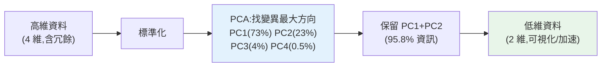

# 降維:PCA

> 真實資料常有**幾十、幾百個特徵**——太多特徵會拖慢訓練、增加[過擬合](../25-machine-learning/07-overfitting-regularization.md)、無法視覺化、還可能充滿冗餘(高度相關的特徵)。**降維(dimensionality reduction)** 把高維資料**壓縮到少數幾維**,同時**盡量保留資訊**。**PCA(主成分分析)** 是最經典的降維方法——它找出資料變異最大的幾個方向,用它們重新表示資料。這章講 PCA 怎麼運作、能保留多少資訊、什麼時候用。

## 💡 白話導讀(建議先讀)

真實資料常有**幾百個特徵**,帶來三個麻煩:訓練慢、容易[過擬合](../25-machine-learning/07-overfitting-regularization.md)、
還沒法畫出來看(人眼只能看 2、3 維)。**降維**就是「**用更少的維度,保住大部分資訊**」。
主角 **PCA(主成分分析)** 是最經典的一招。

用一個比喻:給一個茶壺**拍一張最能認出它的照片**,你會選哪個角度?
一定是能看到壺嘴、壺把、壺身的那個角度——**資訊最豐富的視角**。
從正上方拍(只看到一個圓)就丟失了太多。

PCA 做的就是**自動找出資料裡「資訊最豐富的拍攝角度」**:

- **主成分(PC)** ＝那些最佳視角。**PC1** 是資料變化最大的方向(資訊最多),
  **PC2** 是與它垂直、次多的方向……越後面的 PC 資訊越少(多是雜訊)。
- **降維** ＝只留前幾個 PC:用 PC1、PC2 兩個新軸重新描述資料,
  就能把 100 維壓成 2 維,還保住大部分變化。

兩個實務要點這章會強調:
**PCA 前務必先標準化**(否則大尺度特徵會霸佔主成分,和 [ch03 縮放](../25-machine-learning/03-feature-engineering.md)同一個道理);
**新的 PC 軸沒有直覺意義**(PC1 是一堆原特徵的加權混合,不再是「年齡」「收入」)——
所以 PCA 換來了效率與視覺化,**代價是可解釋性**。
這章示範用 PCA 做視覺化、加速訓練、以及「保留多少變異(如 95%)來決定留幾維」。

## Why(為什麼)

「特徵越多越好」是個迷思——**太多維度反而有害**:

- **維度災難(curse of dimensionality)**:維度越高,資料在空間中越**稀疏**,模型需要**指數級更多的資料**才能學好;[距離也失去意義](03-clustering.md)(高維空間中所有點都「差不多遠」),讓 [KNN、聚類](03-clustering.md)等失效。
- **冗餘與噪音**:很多特徵彼此**高度相關**(如「身高(公分)」和「身高(英吋)」根本是同一資訊)、或充滿噪音。冗餘特徵不增資訊卻增複雜度與[過擬合](../25-machine-learning/07-overfitting-regularization.md)風險。
- **無法視覺化**:人只能看 2D/3D。有 50 個特徵的資料,你怎麼「看」它的結構?**降到 2 維才能畫出來**、發現聚集/離群。
- **訓練慢、儲存大**:維度高則計算與儲存成本高。

**PCA** 的洞見:資料的「資訊」主要藏在**變異(variance)** 裡——變異大的方向承載了資料的主要差異,變異小的方向多是噪音或冗餘。PCA **找出變異最大的幾個正交方向(主成分)**,用它們重新表示資料。這樣你能用**少數幾維**捕捉**大部分資訊**——降維、去冗餘、可視化、加速,一舉數得。它是 ML Engineer 處理高維資料的基本工具,也是理解 [embedding](../28-llm-genai/06-embeddings-semantic-search.md)、資料壓縮的基礎。這章講透。

## Theory(理論:主成分與變異)

**PCA 的核心思想**:找出資料中**變異最大的方向**,依變異大小排序,用前幾個方向重新表示資料。

- **主成分(principal component)**:資料變異最大的方向(第一主成分 PC1),接著是**與它正交**、變異次大的方向(PC2)...每個 PC 都是原特徵的**線性組合**。
- **PC 依變異排序**:PC1 承載最多變異(資訊)、PC2 次之...後面的 PC 變異越來越小(多是噪音/冗餘)。
- **降維**:只保留前 k 個主成分(k < 原維度),丟棄變異小的——用 k 維表示原本的高維資料,**保留大部分資訊**。

**解釋變異比例(explained variance ratio)**:每個主成分承載了原資料**百分之幾的總變異**。累計前 k 個的比例 = 保留了多少資訊。如「前 2 個 PC 解釋 95% 變異」= 降到 2 維只丟了 5% 資訊。

**選保留幾維**:常見準則——保留「累計解釋變異達 90%/95%」所需的維度,或看**碎石圖(scree plot)** 的拐點(類似 [elbow](03-clustering.md))。

**PCA 是非監督的**:它只看特徵的變異,**不看標籤**——目標是保留資料結構,不是分類。

## Specification(規範:sklearn PCA)

```python
from sklearn.decomposition import PCA
from sklearn.preprocessing import StandardScaler

X_scaled = StandardScaler().fit_transform(X)   # PCA 前一定要標準化!

# 方式一:指定維度
pca = PCA(n_components=2)
X_reduced = pca.fit_transform(X_scaled)         # 降到 2 維

# 方式二:指定要保留的變異比例(自動決定維度)
pca = PCA(n_components=0.95)                     # 保留 95% 變異
X_reduced = pca.fit_transform(X_scaled)
pca.n_components_                                # 自動選出的維度數

pca.explained_variance_ratio_    # 各主成分的解釋變異比例
pca.components_                   # 主成分方向(原特徵的線性組合)
```

**關鍵**:

- **PCA 前必須標準化**([同 k-means](03-clustering.md)):PCA 對變異敏感,大尺度特徵會主宰主成分(見 Implementation)。
- **`n_components` 可給整數(維度)或小數(保留變異比例)**——後者更方便(讓資料決定維度)。
- **降維也要 [fit 在 train、transform 到 test](../25-machine-learning/02-ml-workflow.md)**(防洩漏),常放進 [Pipeline](../25-machine-learning/08-capstone-ml.md)。

## Implementation(底層:為何要標準化、變異=資訊)

**為何 PCA 前必須標準化**:PCA 找「變異最大的方向」——但**變異的大小依賴特徵的尺度**。若「收入」以元為單位(變異數十億)、「年齡」以歲為單位(變異數百),PCA 會認為「收入方向」變異最大,**第一主成分幾乎完全對齊收入**,年齡等小尺度特徵被忽略——但這只是**單位選擇的假象**(收入改用「萬元」變異就小很多)。**標準化讓每個特徵變異都是 1**,PCA 才能公平地找「真正」變異最大的方向(反映資料結構而非單位)。這是 PCA 最常見的錯誤——不標準化,主成分就被大尺度特徵綁架。

**為何「變異大」等於「資訊多」**:直覺上,一個特徵若所有樣本的值**都差不多**(變異小),它幾乎不能區分樣本、承載的「資訊」少;反之變異大的方向,樣本在其上**分得很開**,能有效區分樣本、承載主要差異。PCA 假設「資料的重要結構體現在變異大的方向,噪音/冗餘體現在變異小的方向」——所以保留變異大的 PC、丟棄變異小的,就是**保留資訊、去除噪音**。這個假設在多數情況成立(是 PCA 有效的原因),但**不總是**(有時小變異方向才是關鍵,或標籤相關的方向變異不大——那時 PCA 可能丟掉有用資訊,要用監督式降維如 LDA)。

**降維保留多少資訊看累計解釋變異**:下面範例用 4 維的 iris 資料——**前 2 個主成分就解釋了 95.8% 的變異**,代表降到 2 維只丟 4.2% 資訊。這是為什麼 PCA 常能大幅降維(4→2、100→10)卻保留絕大部分資訊——真實資料的「有效維度」常遠低於原始特徵數(很多特徵冗餘)。下面範例示範 PCA 降維與解釋變異。

## Code Example(可執行的 Python 範例)

```python
# pca.py — PCA 降維 + 解釋變異(需要 sklearn + numpy)
from __future__ import annotations

import numpy as np
from sklearn.datasets import load_iris
from sklearn.decomposition import PCA
from sklearn.preprocessing import StandardScaler


def main() -> None:
    X = load_iris().data  # 150 筆,4 維特徵
    X_scaled = StandardScaler().fit_transform(X)  # PCA 前一定標準化

    # 看每個主成分解釋多少變異
    pca = PCA().fit(X_scaled)
    ratios = pca.explained_variance_ratio_
    cumulative = np.cumsum(ratios)
    print("各主成分解釋變異比例:", np.round(ratios, 3))
    print("累計解釋變異:      ", np.round(cumulative, 3))
    print("  → PC1+PC2 就解釋了 95.8%,後兩個 PC 幾乎是噪音/冗餘")

    # 降到 2 維(可視化 + 保留大部分資訊)
    pca2 = PCA(n_components=2)
    X_2d = pca2.fit_transform(X_scaled)
    print(f"\n4 維 → 2 維: shape {X_2d.shape}")
    print(f"保留資訊: {pca2.explained_variance_ratio_.sum() * 100:.1f}%")

    # 讓資料決定維度:保留 95% 變異
    pca95 = PCA(n_components=0.95).fit(X_scaled)
    print(f"\n保留 95% 變異需要 {pca95.n_components_} 維(自動選出)")


if __name__ == "__main__":
    main()
```

**預期輸出**:

```pycon
$ python pca.py
各主成分解釋變異比例: [0.73  0.229 0.037 0.005]
累計解釋變異:       [0.73  0.958 0.995 1.   ]
  → PC1+PC2 就解釋了 95.8%,後兩個 PC 幾乎是噪音/冗餘

4 維 → 2 維: shape (150, 2)
保留資訊: 95.8%

保留 95% 變異需要 2 維(自動選出)
```

逐段解說:

- **解釋變異比例**:4 個主成分分別解釋 **73%、22.9%、3.7%、0.5%** 的變異。**PC1 承載了近四分之三的資訊**,PC1+PC2 累計 **95.8%**,後兩個 PC 加起來只 4.2%(幾乎是噪音/冗餘)。這揭示——**iris 的 4 個特徵其實高度冗餘,真正的「有效維度」約 2 維**。
- **降到 2 維**:`PCA(n_components=2)` 把 4 維壓成 2 維,**保留 95.8% 資訊**——只丟 4.2%。現在可以**把資料畫在 2D 平面上**(視覺化)、餵給模型(更快、更不易過擬合),而幾乎沒損失。這就是 PCA 的價值:**大幅降維卻保留絕大部分資訊**。
- **自動選維度**:`PCA(n_components=0.95)` 讓你說「我要保留 95% 資訊」,PCA **自動算出需要幾維**(這裡是 2)。這比手動猜維度方便——**讓資料告訴你需要多少維**。
- **實務應用**:降維後的資料用於——視覺化(2D 散佈圖看聚集/離群)、加速訓練(少維度)、去冗餘(改善[過擬合](../25-machine-learning/07-overfitting-regularization.md))、[聚類](03-clustering.md)前處理(高維聚類先降維)。
- **要點**:PCA 找變異最大的正交方向、依變異排序、保留前 k 個降維;前必標準化;用累計解釋變異決定保留幾維(或指定比例自動選)。

## Diagram(圖解:PCA 降維)



## Best Practice(最佳實踐)

- **PCA 前一定標準化**:PCA 對變異敏感,大尺度特徵會主宰主成分。
- **用累計解釋變異選維度**:保留 90%/95% 所需維度,或用 `n_components=0.95` 自動選。
- **降維用於視覺化**:降到 2D/3D 畫圖,發現聚集、離群、結構。
- **[fit 在 train、transform 到 test](../25-machine-learning/02-ml-workflow.md)**:降維也會洩漏,放進 [Pipeline](../25-machine-learning/08-capstone-ml.md)。
- **高維資料先降維再聚類/建模**:改善[距離失效](03-clustering.md)、[過擬合](../25-machine-learning/07-overfitting-regularization.md)、速度。
- **注意可解釋性損失**:主成分是原特徵的線性組合,**失去原特徵的直觀意義**——要可解釋時謹慎。
- **PCA 假設線性 + 變異=資訊**:非線性結構用 t-SNE/UMAP(視覺化)、監督式降維用 LDA。
- **不是所有問題都需要降維**:特徵不多、樹模型(不受維度困擾)時未必需要。

## Common Mistakes(常見誤解)

- **PCA 前不標準化**:主成分被大尺度特徵綁架,反映單位而非結構(最常見錯)。
- **保留太少維度丟失資訊**:降太狠(如只留 PC1)可能丟掉關鍵資訊,看累計變異。
- **在 split 前做 PCA**:[資料洩漏](../25-machine-learning/02-ml-workflow.md);要 fit 在 train。
- **以為 PCA 一定提升模型**:降維可能丟掉標籤相關但變異小的資訊,反而變差;要驗證。
- **忽略可解釋性損失**:主成分無直觀意義,需要解釋特徵時 PCA 不利。
- **對樹模型硬做 PCA**:樹不受維度災難困擾、且 PCA 破壞特徵可解釋性,未必划算。
- **用 PCA 做非線性降維**:PCA 是線性的,非線性結構用 t-SNE/UMAP。
- **把 PCA 當特徵選擇**:PCA 是特徵「轉換」(組合),不是「選擇」原特徵。

## Interview Notes(面試重點)

- **能講 PCA 的核心思想**:找變異最大的正交方向(主成分),依變異排序,保留前 k 個降維。
- **能講為何 PCA 前要標準化**:對變異敏感,大尺度特徵會主宰主成分。
- **能講解釋變異比例**:各 PC 承載的變異比例,累計決定保留多少資訊/維度。
- **能講降維的好處**:對抗維度災難、去冗餘/過擬合、視覺化、加速。
- **能講 PCA 的假設與侷限**:線性、變異=資訊、失去可解釋性;非線性用 t-SNE/UMAP、監督用 LDA。
- **知道 PCA 是非監督(不看標籤)、是特徵轉換非選擇、要防洩漏(fit 在 train)。**

---

➡️ 下一章:[超參數調校](05-hyperparameter-tuning.md)

[⬆️ 回 Part 26 索引](README.md)
