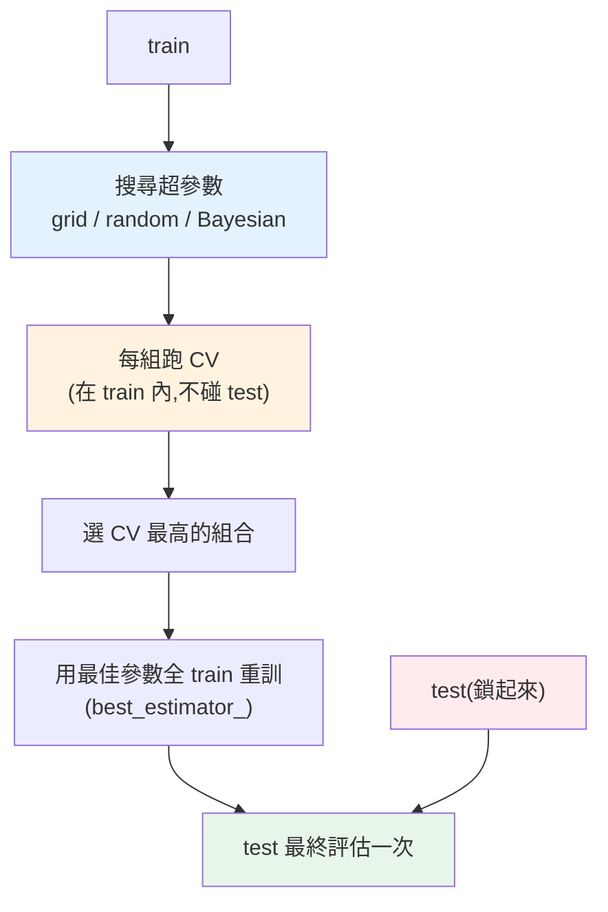

# 超參數調校

> 每個模型都有一堆**旋鈕**:[決策樹的 `max_depth`](01-decision-trees.md)、[隨機森林的 `n_estimators`](02-ensemble-learning.md)、[邏輯回歸的正則化 `C`](../25-machine-learning/07-overfitting-regularization.md)。這些**超參數(hyperparameter)** 不是模型從資料學的,而是**你要設定**的——設得好壞天差地別。手動一個個試又慢又不系統。**超參數調校(hyperparameter tuning)** 用系統化的方法(grid search、random search)自動找出最佳組合。這章講怎麼有效率、不作弊地調參。

## 💡 白話導讀(建議先讀)

每個模型都有一排**出廠沒調好的旋鈕**——
[決策樹的 `max_depth`](01-decision-trees.md)、隨機森林的 `n_estimators`、
XGBoost 的學習率……這些**不是模型從資料學的,是你要替它設定的**,
叫**超參數(hyperparameter)**。調對了,同一個模型效能可能天差地遠。

問題是旋鈕組合爆炸多,怎麼找最佳解?三種策略,這章逐一實作:

- **網格搜尋(Grid Search)＝地毯式窮舉**:列出每個旋鈕要試的值,**所有組合全跑一遍**。
  徹底,但組合數**指數爆炸**(4 個旋鈕各 5 個值 = 625 組 × 交叉驗證 5 折 = 3125 次訓練),貴。
- **隨機搜尋(Random Search)＝隨機抽樣試**:在旋鈕空間隨機挑 N 組試。
  **反直覺但常更划算**——因為多數旋鈕不重要,隨機搜尋能用同樣預算,
  在「重要的旋鈕」上試到更多不同值。實務常勝過網格。
- **貝式優化(Bayesian，如 Optuna)＝聰明地邊試邊學**:根據前面試過的結果,
  **智慧地猜下一組該試哪裡**,少走冤枉路。大模型/貴訓練時的首選。

**最重要的鐵律**貫穿全章:**調參只能用訓練集(靠交叉驗證評分),
絕不碰測試集**——否則你等於拿考卷來調參,測試分數全是假的
(呼應 [Part 25 工作流](../25-machine-learning/02-ml-workflow.md))。
這章用 sklearn 的 `GridSearchCV`/`RandomizedSearchCV` 與 Optuna 各跑一遍,
並教你怎麼設合理的搜尋範圍(別讓機器瞎試)。

## Why(為什麼)

超參數決定模型的行為,但**沒有通用的最佳值**——要依資料找:

- **超參數 vs 參數**:**參數(parameter)** 是模型**從資料學**的([線性回歸的係數](../25-machine-learning/04-linear-regression.md)、樹的分割點);**超參數(hyperparameter)** 是你**訓練前設定**的、控制學習過程與模型複雜度([`max_depth`、`learning_rate`、`C`、`n_estimators`](02-ensemble-learning.md))。模型不會自己學超參數,得你來調。
- **超參數影響巨大**:同一個[梯度提升](02-ensemble-learning.md),`learning_rate` 和 `n_estimators` 沒調好可能[過擬合](../25-machine-learning/07-overfitting-regularization.md)或欠擬合,調好了效能大不同。超參數常是「堪用」與「頂尖」的差距。
- **手動調又慢又不系統**:手動試「`max_depth=3` 看看...再試 5...」既慢、又容易漏掉好組合、還很難公平比較。而且用 test 反覆試會[洩漏](../25-machine-learning/02-ml-workflow.md)。

**系統化調參**用程式**自動搜尋**超參數空間,並用[交叉驗證](../25-machine-learning/07-overfitting-regularization.md)公平評估每組——**grid search**(窮舉所有組合)、**random search**(隨機取樣,大空間更有效率)、以及進階的 **Bayesian optimization**(用前面的結果指導下一步)。關鍵是**全程用 CV、不碰 test**——否則調參本身就洩漏了。這章講這些方法與正確做法,是 ML Engineer 把模型調到最佳的核心技能。

## Theory(理論:搜尋策略)

**調參的本質**:在「超參數空間」中找**交叉驗證分數最高**的組合。三種搜尋策略:

- **Grid Search(網格搜尋)**:**窮舉**你指定的所有超參數組合。如 `max_depth ∈ {3,5,None}` × `n_estimators ∈ {50,100}` = 6 組,每組跑 CV,選最好。**徹底但貴**——組合數隨參數與取值**指數爆炸**(4 個參數各 5 個值 = 625 組 × CV 5 折 = 3125 次訓練)。
- **Random Search(隨機搜尋)**:在超參數空間**隨機取樣** N 組來試。**反直覺但更有效率**——研究證明,當只有少數超參數真正重要時,隨機搜尋用**更少的嘗試**就能找到好組合(見 Implementation)。適合大搜尋空間。
- **Bayesian Optimization(貝葉斯最佳化)**:用**前面試過的結果**建模,**智慧地**選下一組最可能好的來試(如 Optuna、Hyperopt)。最有效率,但較複雜。大規模調參的首選。

**共通鐵律:用 CV 評估、不碰 test**:每組超參數用[交叉驗證](../25-machine-learning/07-overfitting-regularization.md)在 **train** 上評估(不用 test),選出最佳後才用 test 做**最終一次**評估。這保證泛化估計誠實([Part 25 的鐵律](../25-machine-learning/08-capstone-ml.md))。

## Specification(規範:sklearn 搜尋)

```python
from sklearn.model_selection import GridSearchCV, RandomizedSearchCV

# Grid Search:窮舉
param_grid = {"n_estimators": [50, 100], "max_depth": [3, 5, None]}
gs = GridSearchCV(estimator, param_grid, cv=5, scoring="f1", n_jobs=-1)
gs.fit(X_train, y_train)        # 內部對每組跑 5-fold CV
gs.best_params_                 # 最佳超參數
gs.best_score_                  # 最佳 CV 分數
gs.best_estimator_              # 用最佳參數在全 train 重訓好的模型
gs.score(X_test, y_test)        # test 最終評估

# Random Search:隨機取樣(大空間)
from scipy.stats import randint
param_dist = {"n_estimators": randint(50, 200), "max_depth": [3, 5, 7, None]}
rs = RandomizedSearchCV(estimator, param_dist, n_iter=20, cv=5, scoring="f1", random_state=42)
```

**要點**:

- **`scoring`** 選符合問題的指標([不平衡用 `"f1"`/`"roc_auc"`](../25-machine-learning/06-model-evaluation.md))。
- **`cv=5`** 用 5-fold CV 評估每組;`n_jobs=-1` 平行加速。
- **`best_estimator_`** 已用最佳參數在**全 train** 重訓,可直接用。
- **搭配 [Pipeline](../25-machine-learning/08-capstone-ml.md)**:調參含前處理步驟(用 `步驟名__參數名`),CV 每折自動防洩漏。

## Implementation(底層:random search 為何更有效率、搜尋與 CV 的成本)

**random search 為何常勝過 grid search(反直覺)**:假設你調 2 個超參數,但其中**只有一個真正重要**(對分數影響大),另一個幾乎無影響。grid search 用 5×5 網格 = 25 組,但重要參數**只試了 5 個不同值**(另一維在浪費)。random search 同樣試 25 組,但因為是隨機取樣,重要參數**試了接近 25 個不同值**——**對重要參數的搜尋密度高 5 倍**!因為真實中「只有少數超參數重要」很常見,random search 用相同預算**更可能找到好值**。而且 random search 能**自由控制嘗試次數**(grid 是固定的組合數),適合大空間。**經驗:超參數多、空間大時用 random search 或 Bayesian,別用 grid。** 下面範例會看到 RandomizedSearch 只試 8 組就找到與 GridSearch(6 組窮舉)相當的結果。

**調參的成本要清楚**:每次搜尋的總訓練次數 = **組合數 × CV 折數**。GridSearch 6 組 × 5 折 = 30 次訓練;若參數空間是 625 組 × 5 折 = 3125 次——**成本爆炸**。所以:(a) 別把太多參數 × 太多值放進 grid;(b) 大空間用 random search 控制 `n_iter`;(c) 先粗調(大範圍少點)再細調(小範圍多點);(d) 用 `n_jobs=-1` 平行。**調參是計算密集的,要有成本意識**——尤其模型本身訓練就慢時([集成/深度學習](../27-deep-learning/README.md))。

**為何調參不能碰 test**:調參本質是「用評估結果選超參數」——若用 test 評估來選,你就是**在對 test 最佳化**,test 不再是「沒見過的資料」,泛化估計失真(慢慢[過擬合到 test](../25-machine-learning/02-ml-workflow.md))。所以調參**只在 train 上用 CV**,test 鎖到最後。`GridSearchCV`/`RandomizedSearchCV` 天生這麼設計(內部只對傳入的資料做 CV),你只要**別把 test 傳進去** fit 即可。下面範例示範 grid 與 random search。

## Code Example(可執行的 Python 範例)

```python
# hyperparameter_tuning.py — GridSearch vs RandomizedSearch(需要 sklearn + scipy)
from __future__ import annotations

from scipy.stats import randint
from sklearn.datasets import make_classification
from sklearn.ensemble import RandomForestClassifier
from sklearn.model_selection import GridSearchCV, RandomizedSearchCV, train_test_split


def main() -> None:
    X, y = make_classification(n_samples=400, n_features=8, random_state=42)
    X_train, X_test, y_train, y_test = train_test_split(
        X, y, test_size=0.3, random_state=42, stratify=y
    )

    # Grid Search:窮舉所有組合
    param_grid = {"n_estimators": [50, 100], "max_depth": [3, 5, None]}
    gs = GridSearchCV(
        RandomForestClassifier(random_state=42), param_grid, cv=5, scoring="f1"
    )
    gs.fit(X_train, y_train)  # 只用 train,內部做 CV
    print(f"GridSearch(窮舉 {2 * 3} 組):")
    print(f"  最佳參數: {gs.best_params_}")
    print(f"  最佳 CV f1: {gs.best_score_:.3f}")
    print(f"  test f1(最終評估): {gs.score(X_test, y_test):.3f}")

    # Random Search:大空間隨機取樣,只試少數組
    param_dist = {"n_estimators": randint(50, 200), "max_depth": [3, 5, 7, None]}
    rs = RandomizedSearchCV(
        RandomForestClassifier(random_state=42),
        param_dist,
        n_iter=8,
        cv=5,
        scoring="f1",
        random_state=42,
    )
    rs.fit(X_train, y_train)
    print(f"\nRandomizedSearch(從大空間隨機試 8 組):")
    print(f"  最佳參數: {rs.best_params_}")
    print(f"  最佳 CV f1: {rs.best_score_:.3f}")
    print("  → 只試 8 組就達到與窮舉相當的結果(大空間更有效率)")


if __name__ == "__main__":
    main()
```

**預期輸出**:

```pycon
$ python hyperparameter_tuning.py
GridSearch(窮舉 6 組):
  最佳參數: {'max_depth': None, 'n_estimators': 50}
  最佳 CV f1: 0.926
  test f1(最終評估): 0.924

RandomizedSearch(從大空間隨機試 8 組):
  最佳參數: {'max_depth': None, 'n_estimators': 70}
  最佳 CV f1: 0.926
  → 只試 8 組就達到與窮舉相當的結果(大空間更有效率)
```

逐段解說:

- **Grid Search**:窮舉 `n_estimators ∈ {50,100}` × `max_depth ∈ {3,5,None}` = **6 組**,每組跑 5-fold CV(共 30 次訓練),選出最佳 `{max_depth: None, n_estimators: 50}`,CV f1=0.926。**注意全程只用 train 做 CV**,選好後才用 `gs.score(X_test)` 做**最終一次** test 評估(f1=0.924)——**CV 分數(0.926)與 test 分數(0.924)接近,代表沒有洩漏、估計誠實**。
- **Random Search**:從**更大的空間**(`n_estimators` 是 50~200 的連續範圍、`max_depth` 4 個值)**隨機試 8 組**,找到 `{max_depth: None, n_estimators: 70}`,CV f1 同樣 0.926——**只試 8 組就達到與窮舉相當的結果**。若用 grid 窮舉這個更大空間會需要更多組合;random search 用少量嘗試就逼近最佳,**大空間更有效率**。
- **`best_estimator_` 直接可用**:兩者的 `best_estimator_` 都已用最佳參數在**全 train** 重訓好,可直接部署/評估——不必手動重訓。
- **成本意識**:GridSearch 6 組已是 30 次訓練;若參數更多會爆炸。**大空間該用 random search（控制 `n_iter`）或 Bayesian**。
- **要點**:調參用 grid(小空間窮舉)/random(大空間取樣)/Bayesian(智慧搜尋),全程 CV 不碰 test,選對 scoring,注意成本。

## Diagram(圖解:調參流程)



## Best Practice(最佳實踐)

- **全程用 CV 調參、test 只最終用一次**:調參碰 test 就洩漏,泛化估計失真。
- **大空間用 random search / Bayesian**:比 grid 更有效率(重要參數搜尋密度高);grid 只適合小空間。
- **先粗調再細調**:大範圍少點找到好區域,再小範圍多點精修。
- **選對 scoring**:依問題選([不平衡用 f1/roc_auc](../25-machine-learning/06-model-evaluation.md)),別預設用 accuracy。
- **搭配 [Pipeline 調參](../25-machine-learning/08-capstone-ml.md)**:含前處理一起調,CV 每折自動防洩漏。
- **注意計算成本**:組合數 × CV 折數 = 訓練次數,會爆炸;控制 `n_iter`、用 `n_jobs=-1` 平行。
- **聚焦重要超參數**:別把所有參數都調,先找對結果影響大的(如 boosting 的 learning_rate)。
- **記錄搜尋結果**:`cv_results_` 分析各組表現,理解超參數的影響。

## Common Mistakes(常見誤解)

- **用 test 調參**:對 test 最佳化,慢慢過擬合到 test,泛化估計失真(最經典錯)。
- **手動調參不系統**:漏掉好組合、無法公平比較、易洩漏。
- **大空間硬用 grid search**:組合爆炸、計算成本失控;該用 random/Bayesian。
- **調太多參數 × 太多值**:訓練次數指數爆炸,跑不完。
- **不搭 Pipeline 調含前處理的參數**:手動前處理易洩漏。
- **scoring 用錯**:不平衡資料調 accuracy,調出的模型對少數類差。
- **忽略計算成本**:模型本身慢還開大 grid,跑到天荒地老。
- **調完不重訓/不評 test**:GridSearchCV 已重訓(best_estimator_),但要記得 test 最終評估。

## Interview Notes(面試重點)

- **能區分參數 vs 超參數**:參數從資料學(係數/分割點)、超參數訓練前設定(max_depth/C/learning_rate)。
- **能講三種搜尋**:grid(窮舉)、random(隨機取樣,大空間更有效率)、Bayesian(智慧搜尋)。
- **能講 random search 為何常勝 grid**:少數超參數重要時,隨機取樣對重要參數搜尋密度更高。
- **能講調參鐵律**:全程 CV 在 train 上、test 只最終評估一次,否則洩漏。
- **能講成本**:組合數 × CV 折數 = 訓練次數,大空間用 random/Bayesian、粗調再細調。
- **知道選對 scoring、搭 Pipeline 防洩漏、聚焦重要超參數。**

---

➡️ 下一章:[類別不平衡處理](06-imbalanced-data.md)

[⬆️ 回 Part 26 索引](README.md)
