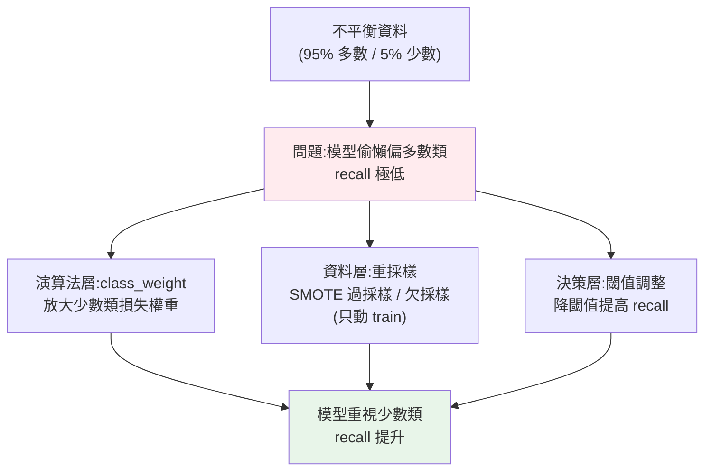

# 類別不平衡處理

> 詐騙偵測、疾病篩檢、故障預測、流失預警——這些**最有價值**的分類問題,往往**極度不平衡**:正類(詐騙、患病)只佔 1%、甚至 0.1%。而 ML 模型在不平衡資料上會**偷懶**——因為「全部猜多數類」就能有很高的準確率,模型乾脆放棄學習少數類。結果是[準確率漂亮但完全抓不到你真正在乎的東西](../25-machine-learning/06-model-evaluation.md)。這章講如何讓模型**認真對待少數類**:class_weight、重採樣、閾值調整。

## Why(為什麼)

不平衡資料是真實世界最常見、也最容易搞砸的情況:

- **模型會偷懶偏向多數類**:訓練時模型最小化整體損失——當 95% 是負類,**把所有樣本都預測成負類**就能讓 95% 的損失消失,模型「學到」的最省力策略就是**忽略少數類**。結果:[recall 極低](../25-machine-learning/06-model-evaluation.md)(下面範例:無處理時 recall 只有 0.031——1000 個詐騙只抓到 3%)。
- **偏偏少數類才是重點**:詐騙、疾病、故障——**正類(少數)才是你要抓的**,漏掉它們(false negative)代價極高(損失金錢、延誤治療、設備損壞)。一個「抓不到詐騙」的詐騙模型毫無用處,無論準確率多高。
- **準確率完全誤導**([Part 25 講過](../25-machine-learning/06-model-evaluation.md)):不平衡資料上準確率被多數類主宰,必須看 [precision/recall/F1](../25-machine-learning/06-model-evaluation.md)。

**解方**是讓模型**認真看待少數類**,主要三類手段:**加權(class_weight)**——訓練時放大少數類的損失權重,逼模型別忽略它;**重採樣(resampling)**——調整訓練資料的類別比例(過採樣少數類 / 欠採樣多數類);**閾值調整**——[降低決策閾值](../25-machine-learning/05-classification.md)讓模型更願意判正類。這章講這些方法的原理、取捨,以及不平衡資料的正確評估——這是 ML Engineer 面對真實高價值問題(全都不平衡)的必備技能。

## Theory(理論:三類處理手段)

**1. 演算法層面:class_weight(類別加權)**:

- 訓練時給**少數類的錯誤更大的損失權重**——答錯一個少數類的「懲罰」等於答錯多個多數類。這逼模型**別為了省事而忽略少數類**。
- sklearn 的 `class_weight="balanced"` 自動按類別頻率的**反比**設權重(少數類權重高)。
- **最簡單、常最有效的第一手段**——不改資料、一個參數搞定。

**2. 資料層面:重採樣(resampling)**——調整訓練資料的類別比例:

- **過採樣(oversampling)**:增加少數類。最簡單是**複製**少數類樣本;更好的是 **SMOTE**——在少數類樣本間**合成**新樣本(插值),避免單純複製造成的過擬合。
- **欠採樣(undersampling)**:減少多數類(隨機丟棄部分多數類樣本)。簡單但**丟資訊**(丟掉可能有用的多數類樣本)。
- **只在訓練集重採樣,絕不動測試集**——測試集要保持真實分布才能誠實評估([防洩漏](../25-machine-learning/02-ml-workflow.md)的延伸)。

**3. 決策層面:閾值調整**:

- [降低分類閾值](../25-machine-learning/05-classification.md)(如 0.5 → 0.3),讓模型**更願意判正類** → recall 上升(抓到更多少數類),但 precision 下降(誤報增)。
- 不改模型、不改資料,**事後調閾值**依業務風險平衡 precision/recall。

**評估鐵律**:不平衡資料**永遠看 precision/recall/F1、混淆矩陣、AUC**,別看準確率;測試集保持真實不平衡分布。

## Specification(規範:sklearn 手段)

```python
# 手段一:class_weight(最簡單)
from sklearn.linear_model import LogisticRegression
model = LogisticRegression(class_weight="balanced")   # 自動反比加權
# 樹/森林/SVM 也都支援 class_weight

# 手段二:重採樣(需 imbalanced-learn 套件)
# from imblearn.over_sampling import SMOTE
# X_res, y_res = SMOTE(random_state=42).fit_resample(X_train, y_train)  # 只對 train!

# 手段三:閾值調整
proba = model.predict_proba(X_test)[:, 1]
pred = (proba >= 0.3).astype(int)   # 降閾值提高 recall
```

**選用指引**:

| 手段 | 優點 | 缺點 |
|------|------|------|
| class_weight | 最簡單、不改資料、常有效 | 有時不夠 |
| SMOTE 過採樣 | 增少數類、合成避免過擬合 | 需額外套件、可能造假樣本 |
| 隨機欠採樣 | 快、平衡 | 丟失多數類資訊 |
| 閾值調整 | 不重訓、依業務調 | 只調決策不改學習 |

**常組合使用**:如 class_weight + 閾值調整。用 [CV 調](05-hyperparameter-tuning.md)這些選擇(`scoring="f1"`/`"recall"`)。

## Implementation(底層:class_weight 如何運作、為何只在 train 重採樣)

**class_weight 如何逼模型重視少數類**:模型訓練是最小化**總損失** = Σ 每個樣本的損失。不加權時,每個樣本的損失權重相同——1324 個多數類 vs 76 個少數類([下面範例的比例](#)),多數類的損失**總量**遠大於少數類,所以最佳化主要在「討好多數類」,少數類被淹沒。`class_weight="balanced"` 把少數類每個樣本的損失**乘上一個大權重**(約等於多數類/少數類的比例,這裡約 17 倍)——這樣少數類的損失**總量**就和多數類相當,模型**被迫認真學少數類**(答錯一個少數類的代價 = 答錯 17 個多數類)。下面範例會看到:無處理時 recall=0.031(幾乎放棄少數類),加 `class_weight="balanced"` 後 **recall 飆到 0.750**(抓到四分之三的詐騙)——代價是 precision 降(誤報增),這是**用 precision 換 recall** 的取捨(不平衡場景通常值得,因為漏抓的代價高)。

**為何重採樣只能動訓練集**:測試集必須**保持真實世界的分布**(真實中詐騙就是 5%),才能誠實估計「模型上線後的表現」。若你對測試集也過採樣(把詐騙變成 50%),測試的分布就**不是真實的**,評估分數對真實世界毫無意義。同理,做 [CV](../25-machine-learning/07-overfitting-regularization.md) 時重採樣要在**每一折的訓練部分內**做(用 imbalanced-learn 的 `Pipeline`),否則合成樣本洩漏到驗證折。**規則:重採樣是「改變模型看到的訓練資料」,絕不改變「用來評估的資料」。**

**閾值調整為何獨立於前兩者**:class_weight 和重採樣改變**模型怎麼學**;閾值調整改變**學好的模型怎麼決策**——[模型輸出機率](../25-machine-learning/05-classification.md),閾值把機率切成類別。即使不動訓練,**把閾值從 0.5 降到 0.3**,就讓更多樣本被判為正類 → recall 上升。這是**不重訓就能調 precision/recall 平衡**的工具,常和加權/重採樣**組合**(先讓模型願意學少數類,再微調閾值到業務要的平衡點)。下面範例示範這三種手段。

## Code Example(可執行的 Python 範例)

```python
# imbalanced.py — 不平衡處理:class_weight + 閾值調整(需要 sklearn + numpy)
from __future__ import annotations

import numpy as np
from sklearn.datasets import make_classification
from sklearn.linear_model import LogisticRegression
from sklearn.metrics import f1_score, precision_score, recall_score
from sklearn.model_selection import train_test_split


def scores(y_true: np.ndarray, y_pred: np.ndarray) -> str:
    return (
        f"recall={recall_score(y_true, y_pred):.3f} "
        f"precision={precision_score(y_true, y_pred, zero_division=0):.3f} "
        f"f1={f1_score(y_true, y_pred):.3f}"
    )


def main() -> None:
    # 嚴重不平衡:5% 正類(如詐騙)
    X, y = make_classification(
        n_samples=2000, n_features=10, n_informative=5, weights=[0.95, 0.05], random_state=42
    )
    X_train, X_test, y_train, y_test = train_test_split(
        X, y, test_size=0.3, random_state=42, stratify=y
    )
    print(f"訓練集類別分布: {np.bincount(y_train)}(多數 vs 少數)")

    # 手段一:無處理 vs class_weight
    print("\n手段一 class_weight:")
    m1 = LogisticRegression(max_iter=1000, random_state=42).fit(X_train, y_train)
    print(f"  無處理:              {scores(y_test, m1.predict(X_test))}")
    print("    → recall 極低,模型幾乎放棄少數類")
    m2 = LogisticRegression(
        max_iter=1000, random_state=42, class_weight="balanced"
    ).fit(X_train, y_train)
    print(f"  class_weight=balanced: {scores(y_test, m2.predict(X_test))}")
    print("    → recall 大幅提升(逼模型重視少數類),代價是 precision 降")

    # 手段三:閾值調整
    print("\n手段三 閾值調整(無加權模型,降閾值提高 recall):")
    proba = m1.predict_proba(X_test)[:, 1]
    for th in (0.5, 0.3, 0.2):
        pred = (proba >= th).astype(int)
        print(f"  閾值={th}: {scores(y_test, pred)}")


if __name__ == "__main__":
    main()
```

**預期輸出**:

```pycon
$ python imbalanced.py
訓練集類別分布: [1324   76](多數 vs 少數)

手段一 class_weight:
  無處理:              recall=0.031 precision=0.333 f1=0.057
    → recall 極低,模型幾乎放棄少數類
  class_weight=balanced: recall=0.750 precision=0.133 f1=0.225
    → recall 大幅提升(逼模型重視少數類),代價是 precision 降

手段三 閾值調整(無加權模型,降閾值提高 recall):
  閾值=0.5: recall=0.031 precision=0.333
  閾值=0.3: recall=0.219 precision=0.350
  閾值=0.2: recall=0.281 precision=0.243
```

逐段解說:

- **問題呈現**:訓練集 1324 個多數類 vs 76 個少數類(約 17:1)。**無處理**的模型 **recall 只有 0.031**——1000 個詐騙(比例)只抓到 3%!模型幾乎完全放棄少數類,因為「猜多數類」最省損失。**這種模型準確率可能 95%+ 卻毫無用處**(抓不到詐騙)。
- **class_weight 的效果(核心)**:加 `class_weight="balanced"` 後,**recall 從 0.031 飆到 0.750**——抓到四分之三的詐騙!因為加權後少數類的損失被放大約 17 倍,模型**被迫認真學少數類**。代價是 **precision 從 0.333 降到 0.133**(誤報增多)——這是**用 precision 換 recall** 的取捨。**在詐騙/疾病場景,這個取捨通常值得**(漏抓一個詐騙的代價 >> 誤報一個)。
- **閾值調整的效果**:即使用無加權的原模型,**降低閾值**也能提升 recall——0.5→0.3→0.2 時 recall 從 0.031→0.219→0.281 逐步上升,precision 隨之變化。**不重訓、事後調閾值**就能在 precision/recall 間移動,依業務風險選點。
- **組合使用**:實務常**先用 class_weight/重採樣讓模型願意學少數類,再調閾值**到業務要的精確平衡點——兩者互補。
- **評估要看對指標**:全程看 recall/precision/f1(**不看準確率**),測試集保持真實不平衡分布——這樣的評估才反映真實表現。
- **要點**:不平衡資料模型會偷懶偏多數類;用 class_weight(加權)/重採樣(改訓練分布)/閾值調整(改決策)讓它重視少數類;只動 train、看 P/R/F1。

## Diagram(圖解:三類處理手段)



## Best Practice(最佳實踐)

- **先試 class_weight="balanced"**:最簡單、常有效、不改資料;樹/森林/SVM/邏輯回歸都支援。
- **重採樣只動訓練集**:測試集保持真實分布才能誠實評估;CV 時在每折訓練部分內採樣。
- **SMOTE 優於單純複製**:合成新樣本避免複製造成的過擬合(需 imbalanced-learn)。
- **欠採樣慎用**:丟失多數類資訊;資料多時可行,資料少時傷害大。
- **閾值調整依業務風險**:漏抓代價高(詐騙/疾病)→ 降閾值提 recall;可與加權組合。
- **永遠看 P/R/F1/AUC,不看準確率**([Part 25](../25-machine-learning/06-model-evaluation.md)):不平衡資料準確率誤導。
- **用 CV 選手段與參數**(`scoring="f1"`/`"recall"`),別憑感覺。
- **考慮收集更多少數類資料**:根本解方常是更多真實的少數類樣本。

## Common Mistakes(常見誤解)

- **不處理不平衡直接訓練**:模型偷懶偏多數類,recall 極低,抓不到重點。
- **只看準確率**:被多數類主宰,95% 準確率的模型可能完全抓不到少數類。
- **對測試集也重採樣**:分布不再真實,評估分數對真實世界無意義。
- **CV 前先重採樣全部**:合成樣本洩漏到驗證折,評估虛高。
- **單純複製少數類過採樣**:模型過擬合到重複樣本;用 SMOTE。
- **過度欠採樣**:丟太多多數類資訊,模型變差。
- **只調閾值不改學習**:若模型根本沒學好少數類,調閾值效果有限;先加權/重採樣。
- **忽略業務代價選手段**:沒依「漏抓 vs 誤報」的代價調整取捨。

## Interview Notes(面試重點)

- **能講不平衡的問題**:模型偷懶偏多數類(全猜多數類省損失),recall 極低,準確率誤導。
- **能列三類處理手段**:class_weight(加權)、重採樣(SMOTE 過採樣/欠採樣)、閾值調整。
- **能講 class_weight 如何運作**:放大少數類損失權重,逼模型重視;balanced 按頻率反比。
- **能講重採樣只動 train**:測試集保持真實分布才能誠實評估;CV 在每折內採樣。
- **能講 SMOTE vs 複製**:合成插值避免過擬合;欠採樣丟資訊。
- **能講評估要看 P/R/F1/AUC**、依業務代價(漏抓 vs 誤報)調取捨。

---

➡️ 下一章:[模型可解釋性](07-interpretability.md)

[⬆️ 回 Part 26 索引](README.md)
