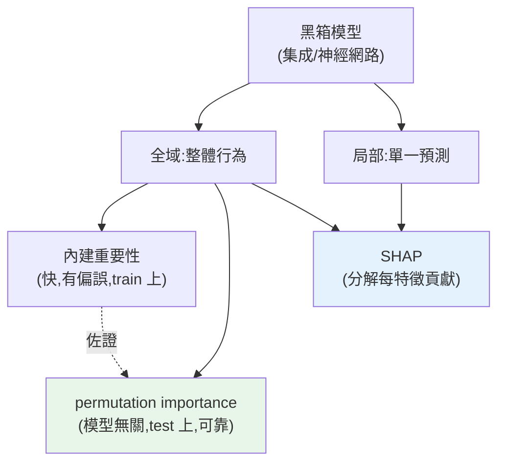

# 模型可解釋性

> [集成模型](02-ensemble-learning.md)、[神經網路](../27-deep-learning/README.md)很強,但它們是**黑箱**——你知道它預測「這筆是詐騙」,卻不知道**為什麼**。但真實世界常需要解釋:銀行拒貸要給理由(法規)、醫生要理解模型憑什麼判病、工程師要 debug 模型的怪異預測。**模型可解釋性(interpretability / explainability)** 讓黑箱變透明——哪些特徵重要?單一預測憑什麼?這章講可解釋性的方法(特徵重要性、permutation importance、SHAP 概念)與陷阱。

## 💡 白話導讀(建議先讀)

[集成模型](02-ensemble-learning.md)、神經網路很強,但都是**黑盒子**——
它給你一個答案「這筆貸款拒絕」,卻不告訴你為什麼。
可是很多場景**非解釋不可**:銀行拒貸得依法給理由、醫療診斷要醫生信得過、
模型出錯時你得知道它到底在看什麼。**可解釋性(interpretability)** 就是撬開黑盒子的工具。

分兩個層次,回答不同問題:

**全域解釋——「這個模型整體上重視什麼?」**

- **特徵重要性**:樹模型內建的 `feature_importances_` 快又免費,
  但**有偏誤**(偏愛高基數/連續特徵、且在訓練資料上算)。
- **排列重要性(permutation importance)**:把某一欄的值**故意打亂**,
  看模型分數掉多少——掉越多代表越依賴它。**模型無關、更可信**,是更好的預設選擇。

**局部解釋——「這一筆,為什麼是這個預測?」**

- **SHAP**:目前的黃金標準。它把一筆預測**拆解成每個特徵的貢獻**
  (「收入 +0.3、年齡 −0.1……加起來得到這個決定」),有紮實的賽局理論基礎、
  全域局部都能用。銀行給拒貸理由、debug 個案,都靠它。

一個重要的分辨貫穿全章:**「可解釋」不等於「因果」**——
特徵重要不代表它**造成**結果(呼應 [相關非因果](../24-business-analytics/02-correlation-causation.md))。
模型說「郵遞區號很重要」可能只是它跟收入相關,不是郵遞區號**導致**違約。
這章用 SHAP 與 permutation importance 實作,並談公平性/偏見的檢查。

## Why(為什麼)

「模型準」常常不夠,你還需要「模型**可解釋**」:

- **法規與信任**:金融、醫療、司法等領域,**法律要求能解釋自動決策**(如 GDPR 的「解釋權」)。拒絕貸款卻說不出理由,不合規也不被信任。可解釋性是[生產部署](../30-production-ai/06-guardrails.md)的必要條件之一。
- **debug 與發現問題**:模型預測很怪?可解釋性幫你找原因——可能它學到了**錯誤的捷徑**(如用「醫院代碼」而非病徵預測疾病,因為某醫院剛好收重症)、或依賴了**不該用的特徵**(洩漏、偏見)。**不可解釋 = 無法 debug**。
- **發現偏見與公平性**:模型是否對某族群不公?可解釋性揭示模型依賴哪些特徵,幫你發現並修正**歧視性的依賴**(如用郵遞區號當種族代理)。
- **獲取領域洞察**:哪些特徵最影響流失/購買?這些洞察本身就有[商業價值](../24-business-analytics/08-data-storytelling.md),幫業務理解驅動因素。

可解釋性分兩層:**全域(global)**——整個模型**整體**怎麼運作、哪些特徵重要;**局部(local)**——**單一預測**憑什麼(這個客戶為何被判高風險)。方法從簡單([決策樹的規則](01-decision-trees.md)、特徵重要性)到進階(**permutation importance、SHAP**)。理解它們、以及它們的**陷阱**(內建特徵重要性有偏誤、相關特徵誤導),是負責任地部署強模型的關鍵。這章講透。

## Theory(理論:全域與局部解釋)

**全域可解釋性**——整個模型的行為:

- **內建特徵重要性(impurity-based,樹模型)**:[樹/森林](02-ensemble-learning.md)的 `feature_importances_`——某特徵累計降低了多少不純度。**快、免費,但有偏誤**(見 Implementation):偏好高基數/連續特徵、且在**訓練資料**上算(可能反映過擬合)。
- **Permutation importance(排列重要性)**:**打亂**某特徵的值,看模型分數**掉多少**——掉越多代表該特徵越重要。**模型無關**(任何模型都能用)、在**測試資料**上算(反映泛化)、更可靠。但相關特徵會互相掩蓋。
- **係數([線性模型](../25-machine-learning/04-linear-regression.md))**:標準化後的係數大小反映特徵影響——天生可解釋。

**局部可解釋性**——單一預測:

- **SHAP(SHapley Additive exPlanations)**:基於博弈論,把一個預測**分解**成「每個特徵貢獻了多少」(正向/負向)。**理論嚴謹、全域+局部都能做**,是目前最主流的可解釋工具。
- **LIME**:在某預測附近用簡單模型局部近似黑箱,解釋該預測。

**內在可解釋 vs 事後解釋**:[線性回歸、決策樹](01-decision-trees.md)**天生可解釋**(白箱);集成/神經網路是黑箱,要用 permutation/SHAP 等**事後(post-hoc)** 方法解釋。**若可解釋性極重要,考慮直接用可解釋模型**(有時犧牲一點準確率換透明,值得)。

## Specification(規範:sklearn 可解釋工具)

```python
# 內建特徵重要性(樹模型,快但有偏誤)
model.feature_importances_

# Permutation importance(模型無關,在 test 上,更可靠)
from sklearn.inspection import permutation_importance
result = permutation_importance(model, X_test, y_test, n_repeats=10, random_state=42)
result.importances_mean    # 各特徵打亂後分數平均下降
result.importances_std     # 穩定度

# SHAP(需 shap 套件,局部+全域)
# import shap
# explainer = shap.TreeExplainer(model)
# shap_values = explainer.shap_values(X_test)   # 每筆每特徵的貢獻
```

**選用指引**:

| 方法 | 範圍 | 特性 |
|------|------|------|
| 內建 feature_importances_ | 全域 | 快、免費、有偏誤、在 train 上 |
| Permutation importance | 全域 | 模型無關、在 test 上、較可靠、相關特徵掩蓋 |
| SHAP | 全域+局部 | 理論嚴謹、可解釋單筆、較慢 |
| 決策樹規則/線性係數 | 全域 | 內在可解釋(白箱) |

## Implementation(底層:內建重要性的偏誤、permutation 為何更可靠)

**內建特徵重要性(impurity-based)的偏誤**:樹模型的 `feature_importances_` 是「該特徵累計降低了多少不純度」。問題有二:(1) **偏好高基數/連續特徵**——連續特徵有很多可能的分割點,更容易「剛好」找到降不純度的分割,即使它其實不重要,也會被分很多次而累積高重要性;(2) **在訓練資料上計算**——若模型過擬合,它的「重要性」反映的是「對訓練資料有用」而非「真正泛化重要」。所以內建重要性**快但可能誤導**,不能盡信。

**permutation importance 為何更可靠**:它的邏輯是「**如果一個特徵真的重要,把它的值打亂(破壞它與標籤的關係)後,模型分數應該大幅下降**」。它:(1) **在測試資料上算**——反映的是泛化重要性,不受訓練過擬合影響;(2) **模型無關**——直接測「打亂後分數掉多少」,任何模型都能用(森林、[神經網路](../27-deep-learning/README.md)、SVM);(3) **測的是「對預測的實際貢獻」**——不受特徵基數偏誤影響。下面範例會看到:資料只有前 3 個特徵是有用的(informative),permutation importance 清楚顯示 **f0、f1 重要(打亂後分數大降),f3、f4 接近 0(打亂沒差,因為是噪音)**——精準區分了有用與無用特徵。而內建重要性給後兩個噪音特徵也分了一點(0.055、0.052),不如 permutation 乾淨。**實務:內建重要性快速看看,重要結論用 permutation importance 或 SHAP 佐證。**

**相關特徵的陷阱**:permutation importance 有個弱點——若兩個特徵**高度相關**,打亂其中一個時,模型可以「靠另一個補償」,導致兩個的重要性都被**低估**(互相掩蓋)。SHAP 在處理相關特徵上更嚴謹。所以解讀重要性時要**注意特徵間的相關性**(結合 [EDA 的相關分析](../23-data-analysis/08-eda.md))。下面範例對比內建與 permutation 重要性。

## Code Example(可執行的 Python 範例)

```python
# interpretability.py — 內建 vs permutation 特徵重要性(需要 sklearn + numpy)
from __future__ import annotations

import numpy as np
from sklearn.datasets import make_classification
from sklearn.ensemble import RandomForestClassifier
from sklearn.inspection import permutation_importance
from sklearn.model_selection import train_test_split


def main() -> None:
    # 5 個特徵,但只有前 3 個是有用的(informative),後 2 個是噪音
    X, y = make_classification(
        n_samples=500, n_features=5, n_informative=3, n_redundant=0,
        shuffle=False, random_state=42,
    )
    X_train, X_test, y_train, y_test = train_test_split(
        X, y, test_size=0.3, random_state=42, stratify=y
    )
    rf = RandomForestClassifier(n_estimators=100, random_state=42).fit(X_train, y_train)

    # 內建特徵重要性(快,但有偏誤、在 train 上)
    print("內建特徵重要性(impurity-based,在 train 上):")
    print(f"  {np.round(rf.feature_importances_, 3)}")
    print("  → 給噪音特徵 f3/f4 也分了一點(0.055/0.052),不夠乾淨")

    # Permutation importance(模型無關,在 test 上,更可靠)
    print("\nPermutation importance(打亂各特徵看 test 分數掉多少):")
    perm = permutation_importance(rf, X_test, y_test, n_repeats=10, random_state=42)
    for i in range(5):
        mark = "重要" if perm.importances_mean[i] > 0.02 else "噪音(打亂沒差)"
        print(f"  f{i}: {perm.importances_mean[i]:.3f} ± {perm.importances_std[i]:.3f}  {mark}")
    print("  → 精準區分:前 3 個有用、後 2 個噪音接近 0")


if __name__ == "__main__":
    main()
```

**預期輸出**:

```pycon
$ python interpretability.py
內建特徵重要性(impurity-based,在 train 上):
  [0.577 0.192 0.123 0.055 0.052]
  → 給噪音特徵 f3/f4 也分了一點(0.055/0.052),不夠乾淨

Permutation importance(打亂各特徵看 test 分數掉多少):
  f0: 0.329 ± 0.032  重要
  f1: 0.147 ± 0.030  重要
  f2: 0.038 ± 0.013  重要
  f3: 0.002 ± 0.009  噪音(打亂沒差)
  f4: 0.003 ± 0.006  噪音(打亂沒差)
  → 精準區分:前 3 個有用、後 2 個噪音接近 0
```

逐段解說:

- **內建特徵重要性**:`[0.577, 0.192, 0.123, 0.055, 0.052]`——正確地把最多重要性給了 f0,但**給噪音特徵 f3、f4 也分了 0.055、0.052**(它們其實毫無用處)。這反映內建重要性的**偏誤**:在訓練資料上算、對連續特徵有偏好,不夠乾淨。
- **Permutation importance(更可靠)**:在**測試資料**上打亂每個特徵——f0 打亂後分數掉 0.329(**很重要**)、f1 掉 0.147、f2 掉 0.038(**都是真正有用的前 3 個**);而 **f3、f4 打亂後分數幾乎沒掉(0.002、0.003)**——精準識別它們是**噪音**(打亂與否對模型沒差,代表模型根本沒真正依賴它們泛化)。**permutation importance 乾淨地區分了有用與無用特徵**,比內建重要性可靠。
- **為何 permutation 更可信**:它測「破壞這個特徵後,泛化分數掉多少」——直接反映特徵對**泛化預測的實際貢獻**,不受訓練過擬合與特徵基數偏誤影響。且 `± std` 給了穩定度。
- **實務用途**:用重要性做[特徵選擇](../25-machine-learning/03-feature-engineering.md)(移除 f3/f4 這種噪音)、debug(模型是否依賴不該用的特徵)、[洞察溝通](../24-business-analytics/08-data-storytelling.md)(哪些因素驅動預測)。重要決策再用 **SHAP** 做單筆解釋。
- **要點**:內建重要性快但有偏誤,permutation importance 模型無關、在 test 上更可靠;SHAP 做嚴謹的全域+局部解釋;注意相關特徵會互相掩蓋。

## Diagram(圖解:可解釋性方法)



## Best Practice(最佳實踐)

- **重要結論用 permutation importance / SHAP 佐證**:別盡信內建特徵重要性(有偏誤、在 train 上)。
- **permutation importance 在 test 上算**:反映泛化重要性,模型無關。
- **單筆解釋用 SHAP**:分解每個特徵對該預測的貢獻,滿足法規與 debug 需求。
- **可解釋性極重要時考慮白箱模型**:[線性/決策樹](01-decision-trees.md)天生可解釋,有時值得犧牲一點準確率換透明。
- **用可解釋性 debug**:發現模型是否依賴洩漏/捷徑/偏見特徵(如郵遞區號當種族代理)。
- **注意相關特徵互相掩蓋**:結合 [EDA 相關分析](../23-data-analysis/08-eda.md)解讀,SHAP 較嚴謹。
- **區分全域與局部**:整體哪些特徵重要(全域)vs 這筆為何這樣預測(局部)。
- **可解釋性納入模型選擇**:不只比準確率,也考量能否解釋(生產/法規需求)。

## Common Mistakes(常見誤解)

- **盡信內建特徵重要性**:有偏誤(偏好連續/高基數)、在 train 上算,可能誤導。
- **在訓練資料上算 permutation importance**:反映的是記憶而非泛化;應在 test 上。
- **忽略相關特徵掩蓋**:兩相關特徵重要性被互相低估,誤判不重要。
- **把特徵重要性當因果**:重要性反映「模型依賴」,不代表[因果關係](../24-business-analytics/02-correlation-causation.md)。
- **黑箱模型不做可解釋就上生產**:法規、debug、信任都出問題。
- **用局部方法下全域結論**:單筆 SHAP 不能直接推廣到整個模型。
- **忽略可解釋性揭示的偏見**:發現歧視性依賴卻不修正。
- **以為準確就夠**:法規/高風險場景還需要可解釋。

## Interview Notes(面試重點)

- **能講可解釋性的動機**:法規、debug、發現偏見、獲取洞察;分全域與局部。
- **能對比內建 vs permutation importance**:內建快但有偏誤(連續特徵偏好、train 上);permutation 模型無關、test 上、更可靠。
- **能講 permutation importance 原理**:打亂特徵看分數掉多少,反映對泛化的實際貢獻。
- **能講 SHAP**:基於博弈論分解單筆預測的每特徵貢獻,全域+局部、理論嚴謹。
- **能講內在可解釋 vs 事後解釋**:白箱(線性/樹)vs 黑箱事後(permutation/SHAP)。
- **知道相關特徵掩蓋、重要性≠因果、可解釋性納入模型選擇。**

---

➡️ 下一章:[🏗️ Capstone:進階 ML 專案](08-capstone-advanced.md)

[⬆️ 回 Part 26 索引](README.md)
