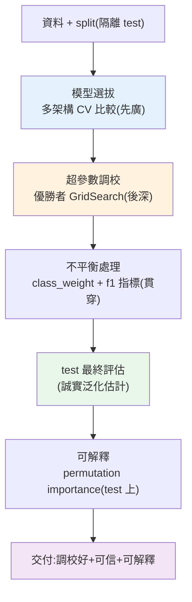

# 🏗️ Capstone:進階 ML 專案

> 這是 Part 26 的整合實戰:把本 Part 的技能——[集成模型](02-ensemble-learning.md)、[超參數調校](05-hyperparameter-tuning.md)、[不平衡處理](06-imbalanced-data.md)、[可解釋性](07-interpretability.md)——串成一個**專業 ML 工程師的完整模型開發流程**:多模型比較選拔 → 對優勝者調參 → 誠實評估 → 解釋。這章示範如何系統化地從「一堆候選模型」得到「一個調校好、可信、可解釋的最終模型」。

## 💡 白話導讀(建議先讀)

這是 Part 26 的**畢業專題**:拿一個真實(而且**不平衡**)的資料集,
走完一套**專業級進階 ML 流程**,把本 Part 的每一招串成一條產線:

```text
資料準備+切分 → 多模型選拔(CV 公平比) → 對優勝者調參(grid/random)
   → 處理不平衡(class_weight/SMOTE + 對的指標) → test 一次評估 → SHAP 解讀
```

這章的重點不是「再學一個新模型」,而是**把零件組成專業流程的判斷力**:

- **模型選拔要公平**:每個候選模型都用**同樣的交叉驗證**比較,
  別用「在 test 上誰高選誰」(那是洩題)。
- **順序有講究**:先選架構、再調參、再處理不平衡——
  而且處理不平衡的重採樣**要放進 Pipeline/CV 的每一折內**,否則又是資料洩漏。
- **指標要選對**:不平衡問題看 F1/PR-AUC,不看準確率。
- **交付要能解釋**:最後用 [SHAP](07-interpretability.md) 說清楚模型憑什麼這樣判——
  一個「準但講不清為什麼」的模型,在真實業務裡常常無法上線。

走完這章,資料科學/ML 的**傳統機器學習**線就完整了——
你有了一套從資料到可解釋模型的肌肉記憶。
接著 [Part 27 深度學習](../27-deep-learning/README.md)進入神經網路,
處理影像、文字這些傳統 ML 吃力的非結構化資料——但「切分紀律、交叉驗證、選對指標、
可解釋」這些原則,到那裡依然是地基。

## Why(為什麼)

前面每章教一項進階技能,但真實的模型開發是**把它們編排成一個嚴謹的決策流程**:

- **不是只訓練一個模型,而是比較多個**:哪個模型架構適合這份資料?[線性、隨機森林、梯度提升](02-ensemble-learning.md)各有所長,要用[交叉驗證](../25-machine-learning/07-overfitting-regularization.md)**公平比較**,選出優勝者——而非憑感覺選一個。
- **選定後要調到最佳**:優勝的模型架構還要[調超參數](05-hyperparameter-tuning.md)榨出效能。
- **不平衡要處理**:真實高價值問題多[不平衡](06-imbalanced-data.md),要用 class_weight 等讓模型重視少數類、看對指標。
- **最後要解釋**:交付一個模型,還要能說明[哪些特徵驅動預測](07-interpretability.md)(法規、信任、洞察)。

這章用一個完整可跑的專案,示範這套「**比較 → 調參 → 評估 → 解釋**」的流程如何合為一體。這是 ML Engineer 的核心工作方式,也是 Part 25–26 所有知識的總驗收。**專業不在於用最炫的模型,而在於嚴謹的流程產出可信、可解釋的結果。**

## Theory(理論:模型開發流程)

一個系統化的進階 ML 流程:

```text
1. 資料準備 + split(隔離 test,stratify)          [Part 25]
2. 多模型選拔:各候選用 CV 公平比較,選優勝架構      [ch02 集成 + CV]
3. 超參數調校:對優勝模型 grid/random search       [ch05]
4. 處理不平衡:class_weight / 重採樣 + 對的指標      [ch06]
5. 最終評估:test 一次,看 F1/AUC 等對的指標         [Part 25 評估]
6. 可解釋:permutation importance / SHAP 說明驅動因素 [ch07]
7. 交付 + 部署 + 監控                              [Part 30]
```

**兩層決策**:

- **選架構(model selection)**:用 CV 比較不同**模型類型**(邏輯回歸 vs 森林 vs 提升),選最適合這份資料的。
- **調超參數(hyperparameter tuning)**:對選定的架構,用 [CV 搜尋](05-hyperparameter-tuning.md)最佳超參數。

兩者**都用 CV、都不碰 test**——test 只在最後評估選定且調好的模型一次,確保[泛化估計誠實](../25-machine-learning/08-capstone-ml.md)。

## Specification(規範:流程組件)

| 步驟 | 技能 | 產出 |
|------|------|------|
| 1. split | [Part 25](../25-machine-learning/02-ml-workflow.md) | 隔離的 train/test |
| 2. 模型選拔 | [CV](../25-machine-learning/07-overfitting-regularization.md) + [集成](02-ensemble-learning.md) | 優勝模型架構 |
| 3. 調參 | [GridSearchCV](05-hyperparameter-tuning.md) | 最佳超參數 |
| 4. 不平衡 | [class_weight](06-imbalanced-data.md) | 重視少數類 |
| 5. 評估 | [F1/AUC](../25-machine-learning/06-model-evaluation.md) | 誠實泛化估計 |
| 6. 解釋 | [permutation importance](07-interpretability.md) | 驅動特徵 |

**核心程式結構**:

```python
# 2. 選拔:各候選跑 CV
for name, model in candidates.items():
    score = cross_val_score(model, X_train, y_train, cv=5, scoring="f1").mean()
# 3. 對優勝者調參
gs = GridSearchCV(best_model, param_grid, cv=5, scoring="f1").fit(X_train, y_train)
# 5-6. test 評估 + 解釋
final = gs.best_estimator_
permutation_importance(final, X_test, y_test)
```

## Implementation(底層:選拔與調參的分工、流程守護誠實)

**為何先選架構再調參(而非一起)**:不同模型架構的「甜蜜點超參數」不同,若一開始就對每個架構做完整調參再比較,成本爆炸(組合數 × 模型數 × CV)。務實做法是**分兩階段**:先用**各架構的合理預設**(或輕度調校)做 CV 比較,快速篩掉明顯較差的架構(如這裡邏輯回歸 0.684 < 集成 0.81),選出優勝架構;**再對優勝者深入調參**榨效能。這是「先廣後深」——先廣泛比較選對方向,再對選定方向深入優化,兼顧全面與成本。下面範例會看到:先比三個架構(梯度提升/隨機森林勝出),再對隨機森林 GridSearch 調參。

**整個流程如何守護誠實性**:和 [Part 25 Capstone](../25-machine-learning/08-capstone-ml.md) 一樣,**test 全程零接觸直到最後**——選架構用 CV(train 內)、調參用 CV(train 內)、不平衡處理只影響訓練、最後才用 test 評一次。所以最終的 test F1 是**可信的泛化估計**。而**可解釋性分析也在 test 上做**([permutation importance](07-interpretability.md) 在 test 上才反映泛化重要性)——確保「哪些特徵重要」的結論也是誠實的。**這個流程的每一步都在守護結論的可信度**:效能估計誠實、特徵重要性誠實。這是專業 ML 交付的標準。

**不平衡貫穿全程**:資料不平衡時,**選拔、調參、評估都要用對的指標**(`scoring="f1"` 而非 accuracy)、模型都設 `class_weight="balanced"`([Part 25 評估](../25-machine-learning/06-model-evaluation.md) + [ch06](06-imbalanced-data.md))。若在不平衡資料上用 accuracy 選模型/調參,會選出「偏向多數類」的模型——整個流程的方向就錯了。**指標的選擇從第一步就要對。** 下面範例跑完整流程。

## Code Example(可執行的 Python 範例)

```python
# capstone_advanced.py — 進階 ML:多模型比較→調參→評估→解釋(需要 sklearn + numpy)
from __future__ import annotations

import numpy as np
from sklearn.datasets import make_classification
from sklearn.ensemble import GradientBoostingClassifier, RandomForestClassifier
from sklearn.inspection import permutation_importance
from sklearn.linear_model import LogisticRegression
from sklearn.metrics import f1_score
from sklearn.model_selection import GridSearchCV, cross_val_score, train_test_split
from sklearn.pipeline import Pipeline
from sklearn.preprocessing import StandardScaler


def main() -> None:
    # 不平衡分類(70/30)
    X, y = make_classification(
        n_samples=800, n_features=10, n_informative=6, weights=[0.7, 0.3], random_state=42
    )
    X_train, X_test, y_train, y_test = train_test_split(
        X, y, test_size=0.25, random_state=42, stratify=y
    )

    # 步驟 2:多模型選拔(CV 公平比較,不平衡看 f1,都設 class_weight)
    candidates = {
        "邏輯回歸": Pipeline(
            [
                ("scaler", StandardScaler()),
                ("clf", LogisticRegression(max_iter=1000, class_weight="balanced", random_state=42)),
            ]
        ),
        "隨機森林": RandomForestClassifier(
            n_estimators=100, class_weight="balanced", random_state=42
        ),
        "梯度提升": GradientBoostingClassifier(n_estimators=100, random_state=42),
    }
    print("步驟2 模型選拔(5-fold CV f1):")
    best_name, best_cv = "", -1.0
    for name, model in candidates.items():
        score = cross_val_score(model, X_train, y_train, cv=5, scoring="f1").mean()
        print(f"  {name}: {score:.3f}")
        if score > best_cv:
            best_cv, best_name = score, name
    print(f"  → 優勝架構:{best_name}(或並列最佳的集成模型)")

    # 步驟 3:對集成優勝者調參
    gs = GridSearchCV(
        RandomForestClassifier(class_weight="balanced", random_state=42),
        {"n_estimators": [100, 200], "max_depth": [5, 10, None]},
        cv=5,
        scoring="f1",
    )
    gs.fit(X_train, y_train)
    print(f"\n步驟3 調參最佳: {gs.best_params_} (CV f1={gs.best_score_:.3f})")

    # 步驟 5:test 最終評估
    final = gs.best_estimator_
    print(f"\n步驟5 test f1: {f1_score(y_test, final.predict(X_test)):.3f}(誠實泛化估計)")

    # 步驟 6:可解釋(permutation importance 在 test 上)
    perm = permutation_importance(final, X_test, y_test, n_repeats=5, random_state=42)
    top3 = np.argsort(perm.importances_mean)[::-1][:3]
    print(f"步驟6 最重要 3 特徵: {[f'f{i}' for i in top3]}(驅動預測的因素)")


if __name__ == "__main__":
    main()
```

**預期輸出**:

```pycon
$ python capstone_advanced.py
步驟2 模型選拔(5-fold CV f1):
  邏輯回歸: 0.684
  隨機森林: 0.810
  梯度提升: 0.812
  → 優勝架構:梯度提升(或並列最佳的集成模型)

步驟3 調參最佳: {'max_depth': None, 'n_estimators': 100} (CV f1=0.810)

步驟5 test f1: 0.850(誠實泛化估計)

步驟6 最重要 3 特徵: ['f5', 'f0', 'f1'](驅動預測的因素)
```

逐段解說:

- **步驟 2 模型選拔**:三個候選架構用 **5-fold CV 公平比較**——邏輯回歸 0.684 明顯輸給集成(隨機森林 0.810、梯度提升 0.812)。**集成在這份資料上勝出**(印證[表格資料集成常勝](02-ensemble-learning.md))。注意**全程 `scoring="f1"`(不平衡)+ `class_weight="balanced"`**——指標與加權從選拔階段就對。
- **步驟 3 調參**:對集成優勝者用 [GridSearchCV](05-hyperparameter-tuning.md) 調 `n_estimators` × `max_depth`,選出最佳組合(CV f1=0.810)。**先選架構、再深入調參**的「先廣後深」策略。
- **步驟 5 test 評估**:用調好的最終模型在 **test 一次評估**——f1=0.850。**test 全程零接觸直到此刻**(選拔、調參都只用 train 的 CV),所以這是**可信的泛化估計**。CV f1(0.810)與 test f1(0.850)接近,佐證沒有洩漏。
- **步驟 6 可解釋**:[permutation importance](07-interpretability.md) 在 **test 上**算出最重要的 3 個特徵(f5、f0、f1)——**交付模型時能說明「這些因素驅動預測」**,滿足法規、信任、洞察需求。在 test 上算確保重要性反映泛化。
- **流程的價值**:這不是「隨便訓個模型」,而是**系統化地比較、調校、誠實評估、解釋**——每一步守護結論的可信度。最終交付的是「一個經過公平選拔、調校最佳、誠實估計、可解釋」的模型。**這就是專業 ML 工程。**
- **要點**:多模型 CV 選拔(先廣)→ 優勝者調參(後深)→ test 誠實評估 → permutation 解釋;不平衡貫穿(f1 + class_weight)、test 全程隔離。

## Diagram(圖解:進階 ML 流程)



## Best Practice(最佳實踐)

- **多模型 CV 公平比較選架構**:別憑感覺選一個,用 CV 客觀比較。
- **先廣後深**:先比較架構(合理預設),再對優勝者深入調參,兼顧全面與成本。
- **選拔/調參全程 CV、test 只最終一次**:守護泛化估計的誠實性。
- **不平衡貫穿全程**:選拔、調參、評估都用對的指標(f1/auc)+ class_weight。
- **交付要附可解釋**:permutation importance/SHAP 說明驅動特徵(法規/信任/洞察)。
- **可解釋性分析在 test 上**:反映泛化重要性。
- **用 Pipeline 綁前處理**:含前處理的模型([防洩漏](../25-machine-learning/08-capstone-ml.md)),整體調參。
- **追求可信而非炫技**:嚴謹流程的可信可解釋結果,勝過黑箱高分。

## Common Mistakes(常見誤解)

- **只訓練一個模型不比較**:錯過更適合的架構。
- **一開始就對所有架構完整調參**:成本爆炸;應先廣後深。
- **選拔/調參用 test**:[洩漏](../25-machine-learning/02-ml-workflow.md),泛化估計失真。
- **不平衡卻用 accuracy 選模型**:選出偏多數類的模型,方向錯。
- **交付黑箱不解釋**:法規/信任/debug 都出問題。
- **在 train 上算特徵重要性下結論**:反映記憶而非泛化。
- **不用 Pipeline**:含前處理的調參易洩漏。
- **追求排行榜高分而犧牲誠實/可解釋**:上線暴跌或不合規。

## Interview Notes(面試重點)

- **能描述進階 ML 完整流程**:split→多模型 CV 選拔→優勝者調參→不平衡處理→test 評估→可解釋。
- **能講先廣後深**:先比架構(合理預設)再深入調參,兼顧全面與成本。
- **能講選架構與調參都用 CV、test 只最終一次**:守護泛化估計誠實。
- **能講不平衡貫穿全程**:指標(f1)與 class_weight 從選拔就要對。
- **能講交付要附可解釋**:permutation importance/SHAP,且在 test 上算。
- **能強調專業 ML 追求可信可解釋而非炫技高分。**

---

🎉 **恭喜你完成 Part 26!** 你已掌握進階 ML——決策樹與集成(隨機森林、梯度提升)、非監督學習(聚類、降維)、系統化調參、不平衡處理、可解釋性,並能用完整流程開發調校好、可信、可解釋的模型。接下來 [Part 27](../27-deep-learning/README.md) 進入深度學習,理解[神經網路](../27-deep-learning/README.md)如何從零運作。

➡️ 下一 Part:[深度學習](../27-deep-learning/README.md)

[⬆️ 回 Part 26 索引](README.md)
