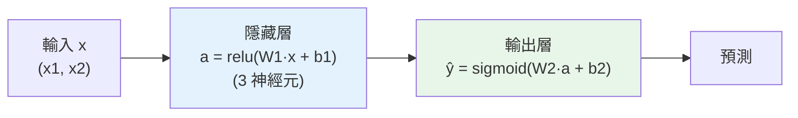

# 神經網路基礎

> 神經網路聽起來很玄，其實它的基本單元——**神經元(neuron)**——簡單到你三行就能寫出來:**把輸入加權求和、加個偏置、過一個激活函式**。把很多這種神經元**分層堆疊**,就成了能學習複雜模式的**神經網路**。這章從單一神經元講起,一路到多層網路的**前向傳播(forward pass)**——用純 numpy 親手算,讓你看清神經網路「預測」時到底在做什麼運算。

## 💡 白話導讀(建議先讀)

「神經網路」聽起來像腦科學,其實它的基本零件簡單到你三行就能寫出來。
一個**神經元(neuron)** 只做三件事:

```text
1. 把幾個輸入「加權求和」:  z = w₁x₁ + w₂x₂ + ... + b
2. 過一個「激活函式」:      a = activation(z)
3. 把 a 傳給下一層
```

等等——這不就是 [Part 25 的邏輯回歸](../25-machine-learning/05-classification.md)嗎?
沒錯!**一個神經元 ≈ 一個帶激活函式的邏輯回歸**。
神經網路的魔法不在單個神經元,而在**把成千上萬個這種小單元疊成很多層**——
前一層的輸出當後一層的輸入,層層堆疊。

那**激活函式**在幹嘛、為什麼非要不可?
關鍵洞見:**如果沒有它,疊幾層都沒用**——
一堆線性運算疊起來,數學上還是一條線性(等於只有一層)。
激活函式(ReLU、sigmoid)加入**非線性的彎折**,
網路才能學會彎彎曲曲的複雜關係——這是「深度」有意義的前提。

主流激活函式這章會逐一比較:
**ReLU**(`max(0, z)`,又快又好,現代預設)、
**sigmoid/tanh**(早期用,深層時會[梯度消失](07-training-techniques.md))。
本章先讓你**親手用 numpy 寫出一個神經元和一層網路**——
從「三行加權求和」開始,把後面所有深度學習的地基打穩。

## Why(為什麼)

前面的模型([線性/邏輯回歸](../25-machine-learning/05-classification.md)、[樹](../26-advanced-ml/01-decision-trees.md))各有極限——線性模型只能學線性關係、樹在影像/文字上很弱。**神經網路**為什麼能處理影像辨識、語音、翻譯、[生成文字(LLM)](../28-llm-genai/README.md)這些最難的問題?

- **能學任意複雜的函式**:單一神經元只是[邏輯回歸](../25-machine-learning/05-classification.md)(加權和 + 激活),表達力有限。但**多層堆疊 + 非線性激活**,理論上能逼近**任何函式**(通用逼近定理)——這讓神經網路能捕捉影像中的邊緣→形狀→物體、文字中的字→詞→語意這種**層次化的複雜模式**。
- **自動學特徵**:傳統 ML 要你[手工做特徵工程](../25-machine-learning/03-feature-engineering.md);深度網路**自己從原始資料學出多層次的特徵表示**(淺層學簡單特徵、深層組合成複雜概念)——這是「深度學習」相對傳統 ML 的最大革命,尤其在非結構化資料上。
- **是理解現代 AI 的根基**:[CNN](05-cnn.md)、[transformer/LLM](../28-llm-genai/README.md) 全都是神經網路的變體。不懂神經元、前向傳播、[反向傳播](02-backpropagation.md),就無法真正理解這些技術。

但神經網路不是魔法——**它的本質就是一堆簡單運算(乘、加、非線性)的組合**。這章的目標是**破除神秘感**:讓你親手算一遍前向傳播,看清「神經網路做預測」不過是矩陣乘法 + 激活函式的層層套用。搞懂這個,後面的[反向傳播](02-backpropagation.md)、[手刻網路](03-nn-from-scratch.md)才有基礎。

## Theory(理論:神經元與層)

**單一神經元**——神經網路的基本單元,做三件事:

```text
1. 加權求和:  z = w₁·x₁ + w₂·x₂ + ... + wₙ·xₙ + b   (= w·x + b)
2. 激活函式:  a = activation(z)
   w:權重  x:輸入  b:偏置(bias)  a:神經元的輸出
```

這其實就是[邏輯回歸](../25-machine-learning/05-classification.md)(加權和 + sigmoid)!**神經元 = 一個帶激活函式的線性單元**。

**激活函式(activation function)——非線性的關鍵**:

- **Sigmoid**:`1/(1+e^-z)`,壓到 (0,1)。早期常用,但深層易[梯度消失](07-training-techniques.md)。
- **ReLU(Rectified Linear Unit)**:`max(0, z)`,負的變 0、正的不變。**現代預設**——簡單、計算快、緩解梯度消失。
- **Tanh**:壓到 (−1,1);**Softmax**:多分類輸出機率分布。
- **為何一定要非線性**:若沒有激活函式(或只用線性激活),**多層網路會塌縮成單層線性模型**(線性的組合還是線性)——非線性激活才讓多層能學複雜函式(見 Implementation)。

**層(layer)與網路**:

- **一層** = 多個神經元並排,各自對同樣的輸入做「加權和 + 激活」。用**矩陣**表示:`a = activation(W·x + b)`,W 的每一列是一個神經元的權重。
- **多層堆疊**:一層的輸出當下一層的輸入。**輸入層 → 隱藏層(hidden layers)→ 輸出層**。「深度」學習的「深」就是指**多個隱藏層**。
- **前向傳播(forward pass)**:輸入從第一層一路計算到輸出層,得到預測——就是「用網路做預測」的過程。

## Specification(規範:前向傳播的運算)

**單神經元**:

```python
import numpy as np
def neuron(x, w, b, activation):
    z = np.dot(w, x) + b     # 加權和 + 偏置
    return activation(z)      # 過激活函式
```

**一層(dense / fully-connected layer)**:

```python
def dense_layer(x, W, b, activation):
    return activation(W @ x + b)   # W: (神經元數, 輸入數), 矩陣乘法一次算完整層
```

**多層前向傳播**:

```python
h1 = dense_layer(x,  W1, b1, relu)      # 輸入 → 隱藏層1
h2 = dense_layer(h1, W2, b2, relu)      # 隱藏層1 → 隱藏層2
out = dense_layer(h2, W3, b3, sigmoid)  # → 輸出層(分類用 sigmoid/softmax)
```

**形狀(shape)**:每層的 `W` 形狀是 `(本層神經元數, 上層輸出數)`——矩陣乘法把上層的輸出向量轉成本層的輸出向量。搞清楚形狀是 debug 神經網路的基本功。

## Implementation(底層:為何需要非線性、參數就是「學到的知識」)

**為何沒有非線性激活,深層網路毫無意義**:假設每層只做線性運算(`W·x + b`,無激活)。兩層就是 `W₂·(W₁·x + b₁) + b₂ = (W₂·W₁)·x + (W₂·b₁ + b₂)`——展開後**仍是「某個矩陣 · x + 某個向量」的形式,等於一個單層線性模型**!無論疊多少層,線性的組合永遠是線性,表達力**不會超過單層邏輯回歸**。**非線性激活函式(ReLU 等)打破這個塌縮**——每層之間插入非線性,讓多層能組合出**彎曲、複雜**的決策邊界,這才是深度網路強大的根源。這就是為什麼激活函式非有不可,且為什麼「線性激活的深度網路」是沒意義的。

**神經網路的「知識」就是權重與偏置**:一個神經網路的行為完全由它的**參數(所有的 W 和 b)** 決定。前向傳播用**當前的**參數算預測——一開始參數是隨機的,預測也是亂的。**學習(訓練)就是調整這些參數**,讓預測越來越準([下一章的反向傳播](02-backpropagation.md)+ 梯度下降就在做這件事)。所以理解前向傳播很重要:它是「用參數做預測」,而訓練是「調參數讓預測變好」——兩者是神經網路的一體兩面。一個現代 [LLM](../28-llm-genai/README.md) 有數千億個這樣的參數,但每一個的角色和這裡的 `w`、`b` 一模一樣。

**前向傳播就是矩陣乘法的鏈**:每層 `activation(W @ x + b)` 是一次矩陣乘法 + 加法 + 逐元素激活。多層就是把這個運算**串接**。所以神經網路的前向傳播**高度適合 GPU**(GPU 擅長大規模平行的矩陣運算)——這是深度學習能規模化的硬體基礎。下面範例用 numpy 手算單神經元、一層、兩層前向傳播。

## Code Example(可執行的 Python 範例)

```python
# nn_basics.py — 神經元 + 激活函式 + 前向傳播(純 numpy 手算)
from __future__ import annotations

import numpy as np


def relu(z: np.ndarray) -> np.ndarray:
    """負的變 0,正的不變(現代預設激活)。"""
    return np.maximum(0, z)


def sigmoid(z: np.ndarray) -> np.ndarray:
    """壓到 (0,1),分類輸出用。"""
    return 1 / (1 + np.exp(-z))


def dense_layer(x: np.ndarray, W: np.ndarray, b: np.ndarray, activation) -> np.ndarray:  # type: ignore[no-untyped-def]
    """一層:加權和 + 偏置 + 激活。W 形狀 (神經元數, 輸入數)。"""
    return activation(W @ x + b)


def main() -> None:
    x = np.array([1.0, 2.0])  # 2 維輸入

    # 單一神經元:z = w·x + b,過激活
    w = np.array([0.5, -0.3])
    z = np.dot(w, x) + 0.3
    print(f"單一神經元: z = w·x + b = {z:.1f}")
    print(f"  relu(z) = {relu(z):.1f}  sigmoid(z) = {sigmoid(z):.4f}")
    print("  → 神經元 = 加權和 + 偏置 + 激活(就是帶激活的邏輯回歸)")

    # 隱藏層:3 個神經元(W 是 3×2 矩陣)
    W1 = np.array([[0.5, -0.3], [0.1, 0.8], [-0.2, 0.4]])
    b1 = np.array([0.3, 0.0, 0.5])
    h = dense_layer(x, W1, b1, relu)
    print(f"\n隱藏層(3 神經元, relu): {np.round(h, 2)}")

    # 輸出層:1 個神經元(W 是 1×3)
    W2 = np.array([[0.3, -0.5, 0.2]])
    b2 = np.array([0.0])
    out = dense_layer(h, W2, b2, sigmoid)
    print(f"輸出層(sigmoid): {out[0]:.4f}")
    print("  → 前向傳播 = 矩陣乘法 + 激活,層層套用得到預測")


if __name__ == "__main__":
    main()
```

**預期輸出**:

```pycon
$ python nn_basics.py
單一神經元: z = w·x + b = 0.2
  relu(z) = 0.2  sigmoid(z) = 0.5498
  → 神經元 = 加權和 + 偏置 + 激活(就是帶激活的邏輯回歸)

隱藏層(3 神經元, relu): [0.2 1.7 1.1]
輸出層(sigmoid): 0.3612
```

逐段解說:

- **單一神經元**:`z = w·x + b = 0.5×1 + (−0.3)×2 + 0.3 = 0.2`,過 relu 得 0.2、過 sigmoid 得 0.55。**這就是一個神經元的全部運算**——加權和、加偏置、過激活。和[邏輯回歸](../25-machine-learning/05-classification.md)一模一樣(邏輯回歸就是一個 sigmoid 神經元)!神經網路的神秘感到此破除:**基本單元簡單得很**。
- **隱藏層(3 神經元)**:`W1` 是 3×2 矩陣(3 個神經元、每個吃 2 維輸入),`W1 @ x + b1` **一次算出 3 個神經元的加權和**,過 relu 得 `[0.2, 1.7, 1.1]`。**矩陣乘法讓整層一次算完**——這是為什麼神經網路用矩陣表示、適合 GPU 平行。
- **輸出層**:把隱藏層的 3 維輸出當輸入,`W2`(1×3)算出最終 1 個值,過 sigmoid 得 **0.3612**(可解讀為機率)。這就是**前向傳播**——輸入從第一層流到輸出層,層層做「矩陣乘 + 激活」,得到預測。
- **非線性的作用**:中間的 relu 讓兩層網路能表達比單層更複雜的函式;若拿掉 relu(純線性),這兩層會塌縮成一個線性模型,白疊。
- **參數是隨機的(目前)**:這裡的 W、b 是我隨便給的,所以輸出 0.3612 沒有意義。**訓練**([反向傳播](02-backpropagation.md))會調整這些參數,讓輸出變成有意義的預測——那是下一章的主題。
- **要點**:神經元 = 加權和+偏置+激活;層 = 矩陣乘法 + 激活;前向傳播 = 層層套用得預測;非線性激活讓多層有意義;參數(W、b)就是網路的「知識」。

## Diagram(圖解:前向傳播)



## Best Practice(最佳實踐)

- **理解神經元 = 帶激活的線性單元**:破除神秘感,連結到[邏輯回歸](../25-machine-learning/05-classification.md)。
- **隱藏層預設用 ReLU**:簡單、快、緩解[梯度消失](07-training-techniques.md);輸出層依任務(分類 sigmoid/softmax、回歸線性)。
- **記住非線性不可少**:沒有它多層塌縮成單層線性,白疊。
- **搞清楚每層的形狀**:`W` 是 `(本層神經元, 上層輸出)`;形狀對不上是最常見的 bug。
- **前向傳播就是矩陣乘 + 激活的鏈**:用向量化(numpy/框架)一次算整層,別逐神經元迴圈。
- **參數就是知識**:訓練在調 W、b;理解前向傳播(用參數)vs 反向傳播(調參數)。
- **[標準化輸入](../25-machine-learning/03-feature-engineering.md)**:神經網路是梯度型模型,輸入尺度影響訓練穩定。
- **從小網路開始**:先理解淺網路,再加深度/寬度。

## Common Mistakes(常見誤解)

- **以為神經網路很玄**:基本單元就是加權和+激活,和邏輯回歸一樣簡單。
- **忘記非線性激活**:純線性的深層網路 = 單層線性,毫無意義。
- **層的形狀對不上**:矩陣乘法維度錯,最常見的 bug;仔細對 shape。
- **輸出層激活用錯**:分類該用 sigmoid/softmax、回歸該用線性,用錯結果無意義。
- **逐神經元迴圈算**:慢;用矩陣運算一次算整層。
- **不標準化輸入**:梯度型模型,尺度不一訓練不穩。
- **以為深就一定好**:太深不好訓練([梯度問題](07-training-techniques.md)),要配合技巧。
- **混淆前向與反向傳播**:前向用參數算預測,反向調參數(下一章)。

## Interview Notes(面試重點)

- **能描述單一神經元**:加權和 + 偏置 + 激活函式;等同帶激活的邏輯回歸。
- **能解釋為何需要非線性激活**:否則多層塌縮成單層線性,無法學複雜函式。
- **能列常見激活函式**:ReLU(現代預設)、sigmoid/tanh、softmax(多分類);各自特性。
- **能描述前向傳播**:輸入層層做「矩陣乘 + 激活」到輸出,得預測。
- **能講層的形狀**:W 是 (本層神經元數, 上層輸出數),矩陣乘法轉換維度。
- **知道參數(W、b)是網路的知識,訓練在調它,前向傳播適合 GPU 平行。**

---

➡️ 下一章:[反向傳播與梯度下降](02-backpropagation.md)

[⬆️ 回 Part 27 索引](README.md)
