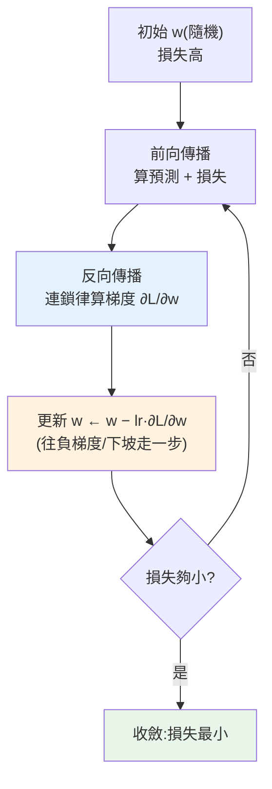

# 反向傳播與梯度下降

> [上一章](01-neural-network-basics.md)的網路參數是隨機的,預測沒意義。**怎麼讓網路學會?** 答案是深度學習的兩大引擎:**梯度下降(gradient descent)** 決定「往哪個方向調參數能讓損失變小」,**反向傳播(backpropagation)** 高效地算出「每個參數該怎麼調」的梯度。這兩者是**所有**神經網路訓練的核心——從最小的網路到 [GPT/Claude](../28-llm-genai/README.md) 都靠它們。這章講清楚它們怎麼運作。

## Why(為什麼)

神經網路有數千、數百萬、甚至數千億個參數([LLM](../28-llm-genai/README.md)),要怎麼把它們**全部**調到讓預測準確?這是個天文數字的最佳化問題:

- **不能靠試**:參數空間是無限維,窮舉不可能。要有**系統化的方法**找出「讓損失變小的參數」。
- **梯度下降給方向**:[損失函式](../25-machine-learning/04-linear-regression.md)衡量「預測有多錯」。**梯度(gradient)** 是損失對每個參數的偏導數——它指向「損失**增加最快**的方向」。所以**往負梯度方向**調參數,損失就會下降。反覆這樣做,參數逐步滑向「損失最小」——就像蒙眼下山,每步往最陡的下坡走。
- **但梯度怎麼算?反向傳播**:網路有很多層、很多參數,直接算每個參數的梯度極其繁瑣。**反向傳播**用**微積分的連鎖律(chain rule)**,從輸出層的誤差**往回**逐層高效計算每個參數的梯度——**一次反向掃描**就算完所有梯度,是讓深度學習可行的關鍵演算法。

沒有梯度下降,網路不知道往哪調;沒有反向傳播,算梯度慢到無法訓練大網路。這兩者合起來,讓「調數十億參數」變成可行——這是**深度學習能成立的數學核心**。這章用最簡單的例子講透它們的原理,為[下一章手刻完整網路](03-nn-from-scratch.md)鋪路。

## Theory(理論:梯度下降與反向傳播)

**梯度下降(gradient descent)——迭代最小化損失**:

```text
重複:
  1. 前向傳播:用當前參數算預測、算損失 L
  2. 算梯度:  ∂L/∂w(損失對每個參數的偏導數)
  3. 更新參數: w ← w − learning_rate × ∂L/∂w   (往負梯度方向走一步)
直到損失夠小
```

- **梯度 ∂L/∂w**:告訴你「w 增加一點,損失怎麼變」。梯度為正 → w 增加會讓損失變大 → 該**減少** w;梯度為負 → 該增加 w。**往負梯度方向**總是降低損失。
- **學習率(learning rate)**:每步走多大。**太小**→ 收斂極慢;**太大**→ 衝過頭、震盪甚至**發散**(見範例)。是最重要的超參數之一。

**反向傳播(backpropagation)——高效算梯度**:

- 神經網路是**函式的層層複合**:`L = loss(f₃(f₂(f₁(x))))`。要算損失對第一層參數的梯度,得用**連鎖律**:一層層把梯度「乘回去」。
- **反向傳播 = 連鎖律的系統化應用**:先前向傳播算出各層的值,再**從輸出往輸入反向**,逐層算「損失對這層的梯度」= 「損失對下一層的梯度」× 「這層的局部導數」。**一次反向掃描算完所有參數的梯度**——這是它高效的原因(不必對每個參數各算一次)。

**隨機/小批次梯度下降(SGD / mini-batch)**:每次不用全部資料算梯度(慢),而是用**一小批(batch)** 資料估計梯度——快、且噪音有助跳出局部最優。這是實務訓練的標配。

## Specification(規範:梯度下降的要素)

**單參數梯度下降**(以 `L(w) = (w−3)²` 為例,最小在 w=3):

```python
def loss(w): return (w - 3)**2
def grad(w): return 2 * (w - 3)      # dL/dw

w = 0.0                               # 初始參數(隨機)
learning_rate = 0.1
for step in range(N):
    g = grad(w)                       # 算梯度
    w = w - learning_rate * g         # 往負梯度更新
```

**梯度檢查(gradient checking)**——驗證反向傳播算對:

```python
def numerical_grad(f, w, eps=1e-5):
    return (f(w + eps) - f(w - eps)) / (2 * eps)   # 數值近似
# 解析梯度(反向傳播)應 ≈ 數值梯度
```

**學習率的影響**:

| 學習率 | 效果 |
|--------|------|
| 太小(0.001) | 收斂極慢,可能卡住 |
| 適中(0.01–0.1) | 穩定收斂 |
| 太大(>1) | 震盪、衝過頭、發散 |

進階優化器(Adam、RMSprop)自適應調整學習率,見 [訓練技巧](07-training-techniques.md)。

## Implementation(底層:梯度為何指向下山、學習率的兩難)

**梯度為何指向「損失下降最快的反方向」**:梯度 ∂L/∂w 的數學意義是「w 每增加一個微小量,L 變化多少」。若 ∂L/∂w = 6(正且大),代表「w 稍微增加,L 就大幅增加」——所以要降低 L,該**往反方向**(減少 w)、且因為梯度大(斜率陡),可以走大步。若梯度接近 0(平坦),代表接近最低點,該走小步(快到了)。`w ← w − lr × grad` 完美實現這個直覺:**梯度的符號決定方向(往下坡)、梯度的大小決定步幅(陡的地方走快、平的地方走慢)**。下面範例會看到:從 w=0 開始,梯度是 −6(陡),往正方向走大步;越接近 w=3,梯度越小(−4.8→−3.84→...),步幅自然變小,平滑收斂——這是梯度下降「自動適應地形」的優雅之處。

**學習率的兩難(關鍵超參數)**:學習率是「梯度大小」之外的額外步幅倍率。**太小**:每步走一點點,要跑很多步才到底(下面範例 lr=0.01 跑 5 步 w 才到 0.288,離目標 3 還很遠);**太大**:步子太大會**衝過最低點跳到對面**,甚至越跳越遠而**發散**(範例 lr=1.1 時 w 跑到 10.465,離目標越來越遠!)。**適中的學習率**(0.1)穩定收斂。這個兩難沒有萬用解——要調(或用 [Adam 等自適應優化器](07-training-techniques.md)緩解)。學習率設不好是訓練失敗最常見的原因。

**梯度檢查驗證反向傳播**:反向傳播的解析梯度容易寫錯(連鎖律繁瑣)。**梯度檢查**用「數值梯度」(`(L(w+ε)−L(w−ε))/2ε`,微積分導數的定義)當標準答案,對照解析梯度——若兩者接近,反向傳播就寫對了。下面範例會看到解析梯度 −3.0000 = 數值梯度 −3.0000,完全吻合。這是[手刻網路](03-nn-from-scratch.md)時 debug 反向傳播的必備工具。下面範例示範梯度下降、梯度檢查、學習率影響。

## Code Example(可執行的 Python 範例)

```python
# backprop.py — 梯度下降 + 梯度檢查 + 學習率影響(純標準庫)
from __future__ import annotations

from collections.abc import Callable


def loss(w: float) -> float:
    """簡單損失:(w-3)^2,最小值在 w=3。"""
    return (w - 3) ** 2


def grad(w: float) -> float:
    """解析梯度 dL/dw = 2(w-3)(反向傳播算的就是這個)。"""
    return 2 * (w - 3)


def numerical_grad(f: Callable[[float], float], w: float, eps: float = 1e-5) -> float:
    """數值梯度:用導數定義近似,驗證反向傳播是否正確。"""
    return (f(w + eps) - f(w - eps)) / (2 * eps)


def gradient_descent(w: float, learning_rate: float, steps: int) -> float:
    for _ in range(steps):
        w = w - learning_rate * grad(w)  # 往負梯度方向走一步
    return w


def main() -> None:
    # 梯度下降:從 w=0 滑向 w=3
    print("梯度下降(loss=(w-3)^2,最小在 w=3):")
    w = 0.0
    for step in range(6):
        g = grad(w)
        print(f"  step {step}: w={w:.3f} loss={loss(w):.3f} grad={g:+.3f}")
        w = w - 0.1 * g
    print(f"  → 收斂中,w={w:.3f}(逐步逼近 3,梯度變小步幅變小)")

    # 梯度檢查:解析 vs 數值
    print("\n梯度檢查 at w=1.5(驗證反向傳播):")
    print(f"  解析梯度(反向傳播): {grad(1.5):.4f}")
    print(f"  數值梯度(近似):     {numerical_grad(loss, 1.5):.4f}")
    print("  → 兩者吻合 = 反向傳播算對了")

    # 學習率影響
    print("\n學習率影響(從 w=0 跑 5 步):")
    for lr in (0.01, 0.1, 0.9, 1.1):
        final = gradient_descent(0.0, lr, 5)
        note = "← 發散!衝過頭越跑越遠" if abs(final - 3) > 3 else ""
        print(f"  lr={lr}: w={final:.3f} {note}")


if __name__ == "__main__":
    main()
```

**預期輸出**:

```pycon
$ python backprop.py
梯度下降(loss=(w-3)^2,最小在 w=3):
  step 0: w=0.000 loss=9.000 grad=-6.000
  step 1: w=0.600 loss=5.760 grad=-4.800
  step 2: w=1.080 loss=3.686 grad=-3.840
  step 3: w=1.464 loss=2.359 grad=-3.072
  step 4: w=1.771 loss=1.510 grad=-2.458
  step 5: w=2.017 loss=0.966 grad=-1.966
  → 收斂中,w=2.214(逐步逼近 3,梯度變小步幅變小)

梯度檢查 at w=1.5(驗證反向傳播):
  解析梯度(反向傳播): -3.0000
  數值梯度(近似):     -3.0000
  → 兩者吻合 = 反向傳播算對了

學習率影響(從 w=0 跑 5 步):
  lr=0.01: w=0.288 
  lr=0.1: w=2.017 
  lr=0.9: w=3.983 
  lr=1.1: w=10.465 ← 發散!衝過頭越跑越遠
```

逐段解說:

- **梯度下降收斂**:從 `w=0`(損失 9)開始,梯度是 −6(陡峭,往正方向),更新後 w 跳到 0.6。**注意梯度隨接近目標而變小**:−6 → −4.8 → −3.84 → ...──越接近 w=3,坡越平、步幅越小,**平滑地逼近最低點**。這就是梯度下降「自動適應地形」——陡處走快、平處走慢。損失也單調下降(9→5.76→3.69→...)。
- **梯度檢查**:解析梯度(反向傳播算的 `2(w−3)`)在 w=1.5 是 **−3.0000**,數值梯度(用導數定義近似)也是 **−3.0000**——**完全吻合,證明反向傳播算對了**。手刻網路時,梯度寫錯是最常見的 bug,梯度檢查是必備的驗證工具。
- **學習率影響(關鍵)**:同樣跑 5 步——`lr=0.01`(太小)w 才到 0.288(離目標 3 很遠,**收斂太慢**);`lr=0.1`(適中)到 2.017(穩定接近);`lr=0.9`(大但可行)到 3.983(快但略過頭);**`lr=1.1`(太大)w 跑到 10.465——發散!** 步子太大讓 w 衝過最低點、跳到對面更遠處,越跑越遠。**這生動展示學習率設太大的災難**,也是訓練失敗最常見的原因。
- **推廣到真實網路**:這裡只調 1 個參數 w;真實網路有數百萬參數,但**每個參數都用同樣的規則更新**(`w ← w − lr × ∂L/∂w`),梯度由**反向傳播一次算出所有參數的**。原理完全相同,只是規模大。
- **要點**:梯度下降往負梯度方向迭代降損失(梯度定方向與步幅)、反向傳播用連鎖律高效算梯度、梯度檢查驗證正確性、學習率要適中(太大發散、太小太慢)。

## Diagram(圖解:梯度下降下山)



## Best Practice(最佳實踐)

- **學習率適中且要調**:太大發散、太小太慢;是最關鍵超參數,可用 [Adam 等自適應優化器](07-training-techniques.md)緩解。
- **用梯度檢查驗證反向傳播**:手刻網路時,解析梯度對照數值梯度,抓連鎖律錯誤。
- **用 mini-batch(小批次)梯度下降**:每次用一小批資料估梯度,快且噪音助跳出局部最優。
- **標準化輸入**:讓各參數的梯度尺度相近,訓練穩定([特徵縮放](../25-machine-learning/03-feature-engineering.md))。
- **監控損失曲線**:損失該穩定下降;震盪(lr 太大)、卡住(lr 太小/[梯度消失](07-training-techniques.md))都是警訊。
- **理解梯度指向下降方向**:往負梯度走總降損失,梯度大小=步幅。
- **框架自動反向傳播**:實務用 [PyTorch 的 autograd](04-frameworks.md),不必手算,但要懂原理。
- **注意局部最優**:非凸損失可能卡局部最優;SGD 的噪音、好的初始化與優化器有幫助。

## Common Mistakes(常見誤解)

- **學習率設太大**:衝過頭、震盪、發散(訓練失敗最常見原因)。
- **學習率設太小**:收斂極慢或卡住,以為模型學不會。
- **反向傳播寫錯不做梯度檢查**:連鎖律容易錯,不驗證就 debug 到崩潰。
- **用全部資料算每次梯度**:慢;用 mini-batch。
- **不標準化輸入**:梯度尺度差異大,訓練不穩。
- **不監控損失曲線**:訓練出問題(發散/卡住)卻沒發現。
- **以為梯度下降保證找到全域最優**:非凸問題只保證局部最優(但實務常夠好)。
- **混淆前向與反向**:前向算損失、反向算梯度,兩者搭配。

## Interview Notes(面試重點)

- **能講梯度下降**:往負梯度方向迭代更新參數以最小化損失;梯度定方向與步幅。
- **能講反向傳播**:用連鎖律從輸出往輸入反向、一次掃描高效算所有參數的梯度。
- **能講學習率的影響**:太大發散、太小太慢;最關鍵超參數。
- **能講梯度檢查**:數值梯度對照解析梯度,驗證反向傳播正確。
- **能講 mini-batch SGD**:用小批資料估梯度,快且噪音助跳出局部最優。
- **知道梯度指向損失增加最快方向(故往負方向)、非凸只保證局部最優、框架用 autograd。**

---

➡️ 下一章:[從零手刻神經網路](03-nn-from-scratch.md)

[⬆️ 回 Part 27 索引](README.md)
