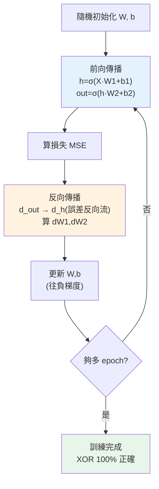

# 從零手刻神經網路

> 前兩章分開講了[前向傳播](01-neural-network-basics.md)和[反向傳播 + 梯度下降](02-backpropagation.md)。這章把它們**組合成一個完整、會學習的神經網路**——用純 numpy 從零手刻,訓練它學會 **XOR**(一個線性模型學不會、必須用隱藏層的經典問題)。看著損失一路下降、預測從亂猜變到 100% 正確,你會**真正理解「神經網路訓練」的全貌**。這是本 Part 最重要的一章——親手做過,深度學習就不再神秘。

## Why(為什麼)

呼叫 `model.fit()` 誰都會,但**框架把訓練藏成一個黑箱**。親手刻一次,你才會真正懂:

- **看清「學習」的完整循環**:前向傳播算預測 → 算損失 → 反向傳播算梯度 → 更新參數 → 重複。這個 **train loop** 是**所有**深度學習訓練的骨架,從你的 XOR 網路到 [GPT](../28-llm-genai/README.md) 都一樣。手刻一遍,這個循環就刻進你腦裡。
- **理解為何需要隱藏層**:**XOR 問題**(相同→0、相異→1)是**非線性可分**的——[單層線性模型](../25-machine-learning/05-classification.md)(邏輯回歸)**永遠學不會**它。但加一個隱藏層,網路就能學會。這生動證明了[隱藏層 + 非線性激活的威力](01-neural-network-basics.md)——它讓網路能表達線性模型辦不到的複雜關係。親眼看到「單層失敗、多層成功」,你就懂了深度學習為何強大。
- **debug 能力**:懂原理才能 debug——損失不降是學習率問題?梯度算錯?初始化不好?框架出錯時,只有懂底層的人能救。

這章不是「學怎麼用 numpy」,而是**用最少的程式碼揭開神經網路訓練的全部秘密**。60 行 numpy,你會有一個真正會學習的神經網路——沒有框架、沒有魔法,每一步都看得見。做完這章,[框架](04-frameworks.md)、[CNN](05-cnn.md)、[LLM](../28-llm-genai/README.md) 對你都只是「同一個原理的不同規模」。

## Theory(理論:完整的 train loop)

一個神經網路的訓練,就是重複這個循環(**epoch**:掃過全部資料一次):

```text
初始化參數(隨機的 W, b)
重複 N 個 epoch:
  1. 前向傳播:  用當前參數算預測(輸入 → 隱藏層 → 輸出層)
  2. 算損失:    比較預測與真實答案(MSE / 交叉熵)
  3. 反向傳播:  用連鎖律從輸出往回算每個參數的梯度
  4. 更新參數:  w ← w − learning_rate × 梯度
```

**XOR 問題與網路架構**:

- XOR:`(0,0)→0, (0,1)→1, (1,0)→1, (1,1)→0`。**無法用一條直線分開** 0 和 1(非線性可分)。
- 架構:**2 輸入 → 4 隱藏神經元(sigmoid)→ 1 輸出(sigmoid)**。隱藏層讓網路能「彎曲」決策邊界,學會 XOR。

**反向傳播的具體步驟**(2 層網路):

```text
前向:  h = sigmoid(X·W1 + b1)      # 隱藏層輸出
        out = sigmoid(h·W2 + b2)    # 最終輸出
反向:  d_out = (out − y) · sigmoid'(out)     # 輸出層誤差
        dW2 = hᵀ · d_out                       # W2 的梯度
        d_h = (d_out · W2ᵀ) · sigmoid'(h)     # 誤差傳回隱藏層(連鎖律!)
        dW1 = Xᵀ · d_h                         # W1 的梯度
```

注意 `d_h` 那步——**誤差從輸出層「往回傳」到隱藏層**,這就是「反向傳播」名字的由來:誤差反向流動,逐層算梯度。

## Specification(規範:手刻網路的組件)

```python
import numpy as np

# 激活函式 + 導數
def sigmoid(z): return 1 / (1 + np.exp(-z))
def sigmoid_deriv(a): return a * (1 - a)   # a 是 sigmoid 的輸出

# 初始化(隨機權重打破對稱、偏置設 0)
W1 = rng.normal(0, 1, (input_dim, hidden_dim))
b1 = np.zeros((1, hidden_dim))
# ... W2, b2

# 一個 epoch:前向 → 損失 → 反向 → 更新
h = sigmoid(X @ W1 + b1)              # 前向:隱藏層
out = sigmoid(h @ W2 + b2)            # 前向:輸出層
loss = np.mean((out - y) ** 2)        # MSE 損失

d_out = (out - y) * sigmoid_deriv(out)          # 反向:輸出層誤差
dW2 = h.T @ d_out
d_h = (d_out @ W2.T) * sigmoid_deriv(h)         # 誤差傳回隱藏層
dW1 = X.T @ d_h

W2 -= lr * dW2; W1 -= lr * dW1        # 更新(偏置類似)
```

**關鍵**:

- **權重隨機初始化**:全設 0 會讓所有神經元學一樣的東西(對稱性問題),要隨機。
- **偏置可設 0**。
- **固定隨機種子** 讓訓練可重現。
- **批次矩陣運算**:`X` 是所有樣本堆疊的矩陣,一次算完所有樣本(向量化)。

## Implementation(底層:誤差如何反向流動、為何 XOR 需要隱藏層)

**誤差如何「反向傳播」**:訓練的核心是「哪個參數該負多少責任」。前向傳播算出 `out` 後,先算輸出層的誤差 `d_out = (out−y)·sigmoid'(out)`——這是「輸出錯了多少 × 輸出對它的輸入有多敏感」。然後**關鍵一步**:`d_h = (d_out @ W2ᵀ)·sigmoid'(h)`——把輸出層的誤差**透過 W2 傳回隱藏層**(乘 W2 的轉置),再乘隱藏層激活的導數。這就是連鎖律的體現:**隱藏層的「責任」= 它對輸出的影響(W2)× 輸出的誤差**。誤差像水一樣**從輸出反向流回每一層**,每層據此算出自己參數的梯度。這個「反向流動」就是反向傳播的精髓——一次反向掃描,每個參數都知道自己該怎麼調。下面範例的訓練迴圈完整實現了這個流動。

**為何 XOR 非要隱藏層不可**:XOR 的 4 個點——`(0,0)→0, (1,1)→0`(對角)是一類,`(0,1)→1, (1,0)→1`(另一對角)是另一類。**你無法用一條直線把這兩類分開**(試試看:任何直線都會把某個 0 和某個 1 分到同一邊)——這叫「非線性可分」。[單層邏輯回歸](../25-machine-learning/05-classification.md)只能畫直線,所以**永遠學不會 XOR**(這是 1969 年差點扼殺神經網路研究的著名問題)。但加一個隱藏層後,網路能先把輸入**非線性地轉換**到一個新空間(隱藏層的表示),在那個空間裡兩類就變得線性可分了——輸出層再用一條線分開。**隱藏層的作用就是「學一個讓問題變簡單的表示」**,這正是深度學習的核心能力(深層網路學越來越抽象的表示)。下面範例會看到網路從損失 0.28(亂猜)訓練到 0.0025,**100% 學會 XOR**——親眼見證隱藏層的威力。

## Code Example(可執行的 Python 範例)

```python
# nn_from_scratch.py — 從零手刻 2 層神經網路,訓練學會 XOR(純 numpy)
from __future__ import annotations

import numpy as np


def sigmoid(z: np.ndarray) -> np.ndarray:
    return 1 / (1 + np.exp(-z))


def sigmoid_deriv(a: np.ndarray) -> np.ndarray:
    """sigmoid 的導數(a 是 sigmoid 的輸出)。"""
    return a * (1 - a)


def main() -> None:
    # XOR:相異為 1、相同為 0(非線性可分,單層學不會)
    X = np.array([[0, 0], [0, 1], [1, 0], [1, 1]], dtype=float)
    y = np.array([[0], [1], [1], [0]], dtype=float)

    # 架構:2 輸入 → 4 隱藏 → 1 輸出;隨機初始化權重
    rng = np.random.default_rng(42)
    w1 = rng.normal(0, 1, (2, 4))
    b1 = np.zeros((1, 4))
    w2 = rng.normal(0, 1, (4, 1))
    b2 = np.zeros((1, 1))
    lr = 0.5

    # 訓練迴圈:前向 → 損失 → 反向 → 更新
    for epoch in range(3001):
        # 前向傳播
        h = sigmoid(X @ w1 + b1)  # 隱藏層
        out = sigmoid(h @ w2 + b2)  # 輸出層
        loss = float(np.mean((out - y) ** 2))  # MSE

        # 反向傳播(連鎖律:誤差從輸出反向流回)
        d_out = (out - y) * sigmoid_deriv(out)  # 輸出層誤差
        d_w2 = h.T @ d_out
        d_b2 = d_out.sum(axis=0, keepdims=True)
        d_h = (d_out @ w2.T) * sigmoid_deriv(h)  # 誤差傳回隱藏層
        d_w1 = X.T @ d_h
        d_b1 = d_h.sum(axis=0, keepdims=True)

        # 更新參數(往負梯度方向)
        w2 -= lr * d_w2
        b2 -= lr * d_b2
        w1 -= lr * d_w1
        b1 -= lr * d_b1

        if epoch % 1000 == 0:
            print(f"epoch {epoch:>4}: loss={loss:.4f}")

    # 最終預測
    h = sigmoid(X @ w1 + b1)
    out = sigmoid(h @ w2 + b2)
    print("\n最終預測 vs 真實:")
    for i in range(4):
        print(f"  {X[i].astype(int)} → {out[i][0]:.3f}(真實 {int(y[i][0])})")
    accuracy = np.mean((out > 0.5).astype(int) == y)
    print(f"準確率: {accuracy:.0%}(單層邏輯回歸永遠做不到)")


if __name__ == "__main__":
    main()
```

**預期輸出**:

```pycon
$ python nn_from_scratch.py
epoch    0: loss=0.2775
epoch 1000: loss=0.0149
epoch 2000: loss=0.0025
epoch 3000: loss=0.0011

最終預測 vs 真實:
  [0 0] → 0.022(真實 0)
  [0 1] → 0.963(真實 1)
  [1 0] → 0.966(真實 1)
  [1 1] → 0.044(真實 0)
準確率: 100%(單層邏輯回歸永遠做不到)
```

逐段解說:

- **訓練循環(核心)**:每個 epoch 做四件事——**前向**(算 h、out)、**算損失**(MSE)、**反向**(算所有梯度)、**更新**(往負梯度調參數)。**這 15 行就是所有深度學習訓練的骨架**,GPT 的訓練也是這個循環,只是網路更大、資料更多、優化器更花俏。
- **損失一路下降**:`0.2775 → 0.0149 → 0.0025 → 0.0011`——**網路在學習!** 一開始參數隨機、預測亂猜(損失 0.28);隨著梯度下降不斷調整參數,損失穩定降到接近 0。這條下降曲線就是「學習」的可視證據。
- **反向傳播的誤差流動**:`d_out`(輸出層誤差)→ 透過 `d_h = (d_out @ w2.T) * sigmoid_deriv(h)` **傳回隱藏層** → 算出兩層的梯度。**誤差反向流動、逐層算梯度**——這就是反向傳播,一次掃描算完 `w1, b1, w2, b2` 全部的梯度。
- **100% 學會 XOR(見證隱藏層威力)**:最終預測——`[0,0]→0.022`(≈0 ✓)、`[0,1]→0.963`(≈1 ✓)、`[1,0]→0.966`(≈1 ✓)、`[1,1]→0.044`(≈0 ✓),**準確率 100%**!**這是[單層邏輯回歸永遠做不到的](../25-machine-learning/05-classification.md)**(XOR 非線性可分)。隱藏層讓網路學到了「把輸入轉換成線性可分的表示」的能力——這正是深度學習的核心魔力,你親手實現了它。
- **要點**:訓練 = 前向→損失→反向→更新的循環;反向傳播讓誤差反向流動算所有梯度;隱藏層讓網路能學非線性(XOR),這是深度學習超越線性模型的根本。你已經從零實現了一個真正會學習的神經網路。

## Diagram(圖解:訓練循環)



## Best Practice(最佳實踐)

- **記住 train loop 的四步**:前向 → 損失 → 反向 → 更新;這是所有深度學習訓練的骨架。
- **權重隨機初始化**:全 0 會讓神經元對稱、學一樣的東西;要隨機打破對稱。
- **向量化(矩陣運算)**:一次算所有樣本/整層,別逐樣本/逐神經元迴圈。
- **監控損失曲線**:該穩定下降;不降就查學習率、初始化、梯度。
- **手刻時用[梯度檢查](02-backpropagation.md)**:數值梯度驗證反向傳播寫對。
- **理解隱藏層 = 學表示**:它把輸入轉成讓問題變簡單(可分)的表示。
- **固定隨機種子**:訓練可重現,便於除錯與比較。
- **懂原理再用框架**:手刻過,[框架](04-frameworks.md)的 autograd 對你就是「自動化這個過程」。

## Common Mistakes(常見誤解)

- **權重全設 0**:對稱性問題,所有神經元學一樣,網路學不動;要隨機初始化。
- **想用單層學 XOR**:非線性可分,單層永遠學不會;必須隱藏層。
- **反向傳播的形狀/轉置錯**:矩陣維度對不上是手刻最常見的 bug;仔細對 shape、用梯度檢查。
- **學習率不當**:太大發散、太小不學([上一章](02-backpropagation.md))。
- **逐樣本迴圈**:慢;用矩陣一次算全部。
- **不監控損失**:訓練壞了(不降/發散)卻沒發現。
- **激活導數用錯**:`sigmoid_deriv(a)` 的 a 要是 sigmoid 的輸出,不是輸入。
- **以為框架就不用懂原理**:出錯時只有懂底層的能 debug。

## Interview Notes(面試重點)

- **能描述完整 train loop**:前向傳播→算損失→反向傳播→更新參數,重複 epoch。
- **能解釋為何 XOR 需要隱藏層**:非線性可分,單層(邏輯回歸)只能畫直線學不會;隱藏層學可分的表示。
- **能講反向傳播的誤差流動**:輸出層誤差透過權重轉置傳回隱藏層,連鎖律逐層算梯度。
- **能講權重要隨機初始化**:全 0 導致對稱性,神經元學一樣。
- **能講隱藏層的作用**:學一個讓問題變簡單(線性可分)的表示。
- **知道向量化、梯度檢查、監控損失、train loop 是所有深度學習(含 LLM)的骨架。**

---

➡️ 下一章:[深度學習框架 PyTorch](04-frameworks.md)

[⬆️ 回 Part 27 索引](README.md)
