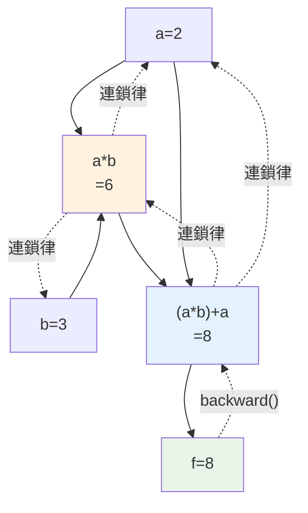

# 深度學習框架 PyTorch

> [上一章](03-nn-from-scratch.md)你親手算了反向傳播——但你也看到,**手動算梯度既繁瑣又容易錯**(轉置、形狀、連鎖律)。真實網路有幾百層、幾億參數,不可能手算。**深度學習框架(PyTorch、TensorFlow/JAX)** 解決這個核心痛點:**自動微分(autograd)**——你只寫前向傳播,框架**自動**算出所有梯度。再加上 GPU 加速、現成層與優化器,讓你專注在模型設計而非底層數學。這章講框架做了什麼、autograd 的原理,以及 PyTorch 的樣貌。

## Why(為什麼)

手刻網路教會你原理,但**實務不可能手刻**——框架解決幾個關鍵問題:

- **自動微分免去手算梯度**:[手刻反向傳播](03-nn-from-scratch.md)時,你得為每個運算手動推導梯度、小心轉置與形狀——**一個網路架構改動,整個反向傳播要重寫**。框架的 **autograd** 讓你**只寫前向傳播**,它自動記錄運算、自動算出所有參數的梯度(`loss.backward()`)。改架構?前向改一改,梯度自動跟著對。這是框架**最核心**的價值。
- **GPU 加速**:神經網路是[大量矩陣運算](01-neural-network-basics.md),GPU 擅長平行這些運算(比 CPU 快幾十倍)。框架讓你**一行**把運算搬到 GPU(`.to("cuda")`),不必碰底層 CUDA。這是訓練大模型的硬體基礎。
- **現成的層、優化器、工具**:現成的 [CNN 層](05-cnn.md)、[注意力層](06-sequence-attention.md)、[Adam 優化器](07-training-techniques.md)、資料載入、[分散式訓練](../22-distributed-systems/README.md)——不必重造輪子。生態(預訓練模型、Hugging Face)更是巨大加速。

**PyTorch** 是目前研究與業界的主流框架(動態計算圖、Pythonic、生態豐富);TensorFlow/JAX 也各有優勢。這章的重點**不是教 PyTorch API**(那要專書),而是讓你理解**框架到底做了什麼**——尤其 autograd 的原理(它不是魔法,就是自動化你[上一章手做的事](03-nn-from-scratch.md))。懂了原理,學任何框架都快;出錯時也能 debug。這是 ML Engineer 從「會手刻」到「高效實戰」的橋樑。

## Theory(理論:autograd 與計算圖)

**框架的核心:自動微分(automatic differentiation)**:

- **計算圖(computational graph)**:當你做前向傳播(`c = a * b`、`d = c + a`),框架**記錄下每個運算與它的輸入**,建成一張圖——節點是值、邊是運算。
- **反向傳播 = 沿圖反向套連鎖律**:呼叫 `loss.backward()`,框架**從損失往回走這張圖**,每個運算用它**已知的局部導數**,依[連鎖律](02-backpropagation.md)把梯度一路傳回每個參數。**你手刻時逐層寫的反向傳播,框架自動做了**——因為它記得整張圖,知道怎麼倒著算。
- **每個運算都「知道自己的導數」**:加法、乘法、matmul、sigmoid... 框架為每個運算預先定義了「前向怎麼算、反向梯度怎麼傳」。你組合這些運算,框架就能自動組合它們的梯度。

**PyTorch 的核心物件**:

- **Tensor**:多維陣列(像 numpy),但**能追蹤梯度**(`requires_grad=True`)、能上 GPU。
- **autograd**:`loss.backward()` 自動算所有 `requires_grad` tensor 的梯度,存進 `.grad`。
- **`nn.Module`**:模型的基類,封裝層與參數。
- **optimizer**(`torch.optim`):封裝[參數更新](02-backpropagation.md)(SGD、Adam),`optimizer.step()` 一行更新所有參數。

**動態 vs 靜態圖**:PyTorch 用**動態圖**(每次前向重建圖,Pythonic、好 debug);早期 TF 用靜態圖(先定義後執行,較快但難 debug)。現代框架多支援動態。

## Specification(規範:PyTorch 訓練骨架)

一個 PyTorch 訓練循環(**對照[手刻的四步](03-nn-from-scratch.md)**):

```python
# 概念示意(需 torch;訓練骨架與手刻的前向→損失→反向→更新完全對應)
import torch
import torch.nn as nn

model = nn.Sequential(          # 現成的層
    nn.Linear(2, 4), nn.ReLU(),
    nn.Linear(4, 1), nn.Sigmoid(),
)
loss_fn = nn.MSELoss()
optimizer = torch.optim.Adam(model.parameters(), lr=0.01)

for epoch in range(epochs):
    optimizer.zero_grad()        # 清空上一輪梯度(重要!)
    out = model(X)               # 1. 前向傳播(autograd 記錄計算圖)
    loss = loss_fn(out, y)       # 2. 算損失
    loss.backward()              # 3. 反向傳播(自動算所有梯度!)
    optimizer.step()             # 4. 更新參數(自動)
```

**對照手刻**:`model(X)` = 前向、`loss.backward()` = 你手寫的整段反向傳播(**現在一行搞定**)、`optimizer.step()` = 你手寫的 `W -= lr * dW`。**框架自動化了反向傳播與更新**,你只寫前向。

**`zero_grad()` 別忘**:PyTorch 梯度是**累加**的,每輪要先清零(否則梯度會疊加,訓練錯亂)——常見的坑。

## Implementation(底層:autograd 不是魔法、框架自動化了什麼)

**autograd 就是自動化你手做的事**:很多人以為框架的 `backward()` 是黑魔法,其實它做的就是[上一章你手寫的反向傳播](03-nn-from-scratch.md)——只是**自動化**。關鍵機制:每個運算(加、乘、matmul...)都**同時知道「前向怎麼算」和「反向梯度怎麼傳」**。當你寫前向傳播,框架**記錄下運算的順序(建計算圖)**;呼叫 `backward()` 時,它**倒著走這張圖**,對每個運算套用它已知的反向規則,連鎖律自動組合起來——就得到每個參數的梯度。你[手刻時](03-nn-from-scratch.md)是「對這個特定的 2 層網路手推反向傳播」;框架是「對**任意**運算組合,自動推反向傳播」。下面範例用純 numpy 實作一個 **mini autograd**(micrograd 精神)——一個能自動算梯度的 `Value` 類別,讓你看清「自動微分」內部就是「記錄運算 + 反向套連鎖律」,沒有魔法。

**框架自動化了哪些、沒自動化哪些**:框架自動化了**反向傳播(算梯度)、參數更新(optimizer)、GPU 搬運、現成層**——這些是機械性、易錯的苦工。但它**沒有**自動化**模型設計、超參數選擇、資料處理、debug**——這些仍需你的判斷。所以「用框架」不等於「不用懂原理」:當損失不降、梯度爆炸/消失、形狀對不上時,**只有懂 autograd 與[反向傳播原理](02-backpropagation.md)的人能 debug**。框架讓你**站在原理之上高效工作**,而非取代原理。

**為何 mini autograd 值得看**:PyTorch 的 autograd 引擎本質上就是下面這個 `Value` 類別的**放大版**(支援張量、更多運算、GPU)。Andrej Karpathy 的 micrograd(約 100 行)就證明了這點。看懂這個 60 行的版本,你就懂了 PyTorch autograd 的核心——**記錄運算建圖、拓撲排序、反向套連鎖律**。下面範例實作它。

## Code Example(可執行的 Python 範例)

```python
# mini_autograd.py — 迷你自動微分引擎(micrograd 精神,揭開 autograd 的秘密)
from __future__ import annotations

from collections.abc import Callable


class Value:
    """能自動算梯度的純量(PyTorch Tensor 的迷你版)。"""

    def __init__(self, data: float, children: tuple[Value, ...] = ()) -> None:
        self.data = data
        self.grad = 0.0
        self._backward: Callable[[], None] = lambda: None
        self._prev = set(children)

    def __add__(self, other: Value | float) -> Value:
        other = other if isinstance(other, Value) else Value(other)
        out = Value(self.data + other.data, (self, other))

        def _backward() -> None:  # 加法的反向規則:梯度直接傳給兩者
            self.grad += out.grad
            other.grad += out.grad

        out._backward = _backward
        return out

    def __mul__(self, other: Value | float) -> Value:
        other = other if isinstance(other, Value) else Value(other)
        out = Value(self.data * other.data, (self, other))

        def _backward() -> None:  # 乘法的反向規則:交叉相乘(連鎖律)
            self.grad += other.data * out.grad
            other.grad += self.data * out.grad

        out._backward = _backward
        return out

    def backward(self) -> None:
        """反向傳播:拓撲排序後,倒著套每個運算的反向規則。"""
        topo: list[Value] = []
        visited: set[Value] = set()

        def build(v: Value) -> None:
            if v not in visited:
                visited.add(v)
                for child in v._prev:
                    build(child)
                topo.append(v)

        build(self)
        self.grad = 1.0  # 最終輸出對自己的梯度是 1
        for v in reversed(topo):
            v._backward()


def main() -> None:
    # f = a*b + a,求 df/da 與 df/db(框架自動算,不必手推)
    a = Value(2.0)
    b = Value(3.0)
    f = a * b + a
    f.backward()

    print(f"f = a*b + a = {f.data}")
    print(f"df/da = {a.grad}(手算驗證: b+1 = {3 + 1})")
    print(f"df/db = {b.grad}(手算驗證: a = {2})")
    print("\n→ 只寫了前向 (a*b+a),梯度自動算出——這就是 autograd")


if __name__ == "__main__":
    main()
```

**預期輸出**:

```pycon
$ python mini_autograd.py
f = a*b + a = 8.0
df/da = 4.0(手算驗證: b+1 = 4)
df/db = 2.0(手算驗證: a = 2)

→ 只寫了前向 (a*b+a),梯度自動算出——這就是 autograd
```

逐段解說:

- **`Value` 類別 = 迷你 Tensor**:每個 `Value` 記錄自己的 `data`(值)、`grad`(梯度)、`_prev`(產生它的輸入)、`_backward`(這步運算的反向規則)。**這正是 PyTorch Tensor 的核心結構**(放大成張量 + GPU)。
- **每個運算定義前向 + 反向**:`__add__` 前向算 `self.data + other.data`,同時定義 `_backward`(加法的梯度直接傳給兩個輸入);`__mul__` 前向算乘積,`_backward` 用連鎖律交叉相乘。**「每個運算知道自己的導數」——這是 autograd 的關鍵**。
- **`backward()` 自動反向傳播**:**拓撲排序**(確保按依賴順序倒著走計算圖),把最終輸出的梯度設 1,然後**倒著對每個運算呼叫 `_backward`**——連鎖律自動組合,梯度一路傳回 `a`、`b`。**這就是 `loss.backward()` 內部做的事**。
- **驗證正確**:`f = a*b + a`,手算 `df/da = b + 1 = 4`、`df/db = a = 2`——mini autograd 自動算出 **4.0 和 2.0**,完全正確!**你只寫了前向 `a*b+a`,梯度自動算出**——這就是框架免去手推梯度的價值。
- **推廣到 PyTorch**:PyTorch 的 autograd 就是這個的放大版(張量、幾百種運算、GPU)。看懂這 60 行,你就懂了 PyTorch `backward()` 的本質——**沒有魔法,就是記錄運算 + 反向套連鎖律**。真實訓練用 PyTorch(`nn.Sequential` + `loss.backward()` + `optimizer.step()`),但底層就是這個機制。
- **要點**:框架的 autograd 自動化了[手刻的反向傳播](03-nn-from-scratch.md)——記錄前向運算建計算圖、`backward()` 反向套連鎖律算所有梯度;加上 GPU、現成層/優化器,讓你只寫前向、專注模型設計。

## Diagram(圖解:autograd 計算圖)



## Best Practice(最佳實踐)

- **用框架而非手刻**:實務網路太大,框架的 autograd + GPU + 現成元件不可或缺。
- **懂原理再用框架**:手刻過[反向傳播](03-nn-from-scratch.md),才知道 autograd 在做什麼、出錯能 debug。
- **記得 `zero_grad()`**:PyTorch 梯度累加,每輪先清零(常見坑)。
- **對照訓練骨架**:`model(X)`→前向、`loss.backward()`→反向、`optimizer.step()`→更新,對應手刻四步。
- **善用現成層與優化器**:`nn.Linear`/`nn.Conv2d`/`Adam`,別重造。
- **用 GPU 訓練大模型**:`.to("cuda")` 加速幾十倍。
- **善用生態**:Hugging Face、預訓練模型([遷移學習](07-training-techniques.md))大幅加速。
- **PyTorch 主流、Pythonic**:研究與業界首選;TF/JAX 各有場景。

## Common Mistakes(常見誤解)

- **以為 autograd 是魔法**:它就是自動化的[反向傳播](03-nn-from-scratch.md)——記錄運算 + 反向套連鎖律。
- **忘記 `zero_grad()`**:梯度累加導致訓練錯亂(超常見坑)。
- **用框架卻不懂原理**:損失不降、梯度爆炸/消失、形狀錯時無法 debug。
- **不用 GPU 訓練大模型**:CPU 慢幾十倍,大模型跑不動。
- **手刻大網路**:不切實際、易錯;該用框架。
- **搞不清 tensor 形狀**:框架也會形狀對不上報錯,要理解維度。
- **忽略生態**:什麼都自己訓,不用預訓練模型/遷移學習,浪費資源。
- **以為換框架很難**:懂原理後,PyTorch/TF/JAX 都是同一套概念的不同語法。

## Interview Notes(面試重點)

- **能講框架的核心價值**:autograd(自動算梯度)、GPU 加速、現成層/優化器/生態。
- **能解釋 autograd 的原理**:前向記錄計算圖、`backward()` 反向套連鎖律算所有梯度,就是自動化的反向傳播。
- **能對照訓練骨架與手刻**:model(前向)/backward(反向)/step(更新)對應手刻四步。
- **能講 `zero_grad()` 的必要**:梯度累加,每輪要清零。
- **能講計算圖(動態 vs 靜態)**:PyTorch 動態圖 Pythonic 好 debug。
- **知道懂原理才能用好框架、debug;autograd 不是魔法(mini autograd 就 ~100 行)。**

---

➡️ 下一章:[CNN 卷積神經網路](05-cnn.md)

[⬆️ 回 Part 27 索引](README.md)
