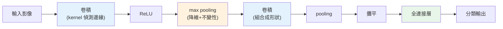

# CNN 卷積神經網路

> 用[全連接網路](01-neural-network-basics.md)處理影像有大問題:一張 1000×1000 的圖有百萬像素,第一層每個神經元就要百萬個權重——參數爆炸、又沒利用影像的**空間結構**。**CNN(卷積神經網路)** 為影像量身打造:用**卷積(convolution)** 讓小小的濾鏡(kernel)滑過整張圖偵測局部特徵(邊緣、紋理),**參數共享**大幅減少參數,並保留空間關係。這是電腦視覺的基石。這章講卷積、池化、CNN 為何適合影像。

## 💡 白話導讀(建議先讀)

用[普通的全連接網路](01-neural-network-basics.md)處理影像,會撞上一堵牆:
一張 1000×1000 的圖有一百萬像素,第一層每個神經元都連到全部像素——
**參數量爆炸到幾十億**,又慢又必定過擬合。而且它還很笨:
把貓的照片**平移幾個像素**,對它就是「完全不同的輸入」,得重新學。
**CNN(卷積神經網路)** 就是為影像量身打造的解法。

它偷師了人眼的兩個直覺:

**1. 卷積(convolution)＝拿放大鏡在圖上滑。**
用一個小濾鏡(kernel,如 3×3)**滑過整張圖**,
每到一處就檢查「這一小塊符不符合某個模式」(垂直邊、水平邊、某種紋理)。
關鍵妙處是**參數共享**:整張圖用**同一個濾鏡**——
所以貓耳朵不管出現在左上還是右下,同一個「耳朵偵測器」都認得,
一舉解決「平移就不認得」和「參數爆炸」兩個問題。

**2. 層層抽象＝從邊到形狀到物件。**
淺層濾鏡偵測簡單的邊與角,深層把它們組合成「眼睛」「輪子」「臉」——
**越深越抽象**,和人腦視覺皮質的運作驚人地像。

再配上**池化(pooling)**(把特徵圖縮小、保留重點,增加位移容忍度),
就是 CNN 的基本骨架。這章用 PyTorch 搭一個 CNN 分類手寫數字/小圖片,
並解釋為什麼它是影像辨識、醫療影像、自駕視覺的基石。

## Why(為什麼)

為什麼影像不用[普通全連接網路](01-neural-network-basics.md),要專門的 CNN?

- **全連接對影像參數爆炸**:一張 200×200 的彩色圖有 12 萬個數值。全連接第一層若有 1000 個神經元,就要 **1.2 億個權重**——參數量大到無法訓練、必然[過擬合](../25-machine-learning/07-overfitting-regularization.md)。而且它把影像**攤平成一長串數字**,完全**丟失了空間結構**(哪些像素相鄰)。
- **影像的特徵是局部且平移不變的**:一個「邊緣」「眼睛」不管出現在圖的**哪個位置**,都是同樣的模式。全連接為每個位置各學一套權重(浪費);而**同一個特徵偵測器應該能用在任何位置**。
- **CNN 用卷積解決這兩點**:一個小 **kernel(濾鏡,如 3×3)** 滑過整張圖,在每個位置偵測同一種局部特徵——**參數共享**(整張圖用同一個 kernel,參數量從百萬降到 9 個)、**保留空間**(卷積在 2D 上運算)、**平移不變**(同個 kernel 到處偵測)。堆疊多層卷積,網路能學出**層次化的視覺特徵**:淺層偵測邊緣→中層組合成形狀/紋理→深層組合成物體(眼睛、車輪、臉)。

這種「局部感受野 + 參數共享 + 層次特徵」的設計,讓 CNN 在影像辨識上遠勝全連接網路,是**電腦視覺革命(AlexNet 2012 起)** 的核心。這章講 CNN 的兩大元件——**卷積**與**池化**——的原理,親手用 numpy 算一次卷積,看清它怎麼偵測特徵。

## Theory(理論:卷積與池化)

**卷積(convolution)——用 kernel 偵測局部特徵**:

- **kernel(濾鏡/filter)**:一個小矩陣(如 2×2、3×3),代表要偵測的**特徵模式**(如垂直邊緣、水平邊緣)。
- **卷積運算**:把 kernel **滑過**整張影像,在每個位置**與覆蓋的區域逐元素相乘再求和**,得到一個數——這個數代表「該位置有多符合這個 kernel 的模式」。滑完整張圖,得到一張 **特徵圖(feature map)**。
- **參數共享**:整張圖用**同一個 kernel**(同一組權重)——所以無論特徵在哪,都能被偵測到(平移不變),且參數極少。
- **多個 kernel**:一層卷積有多個 kernel(各偵測不同特徵),產生多張特徵圖。**kernel 的值是學出來的**(訓練時 CNN 自己學出「該偵測什麼特徵」)。

**池化(pooling)——降維 + 增強不變性**:

- **max pooling**:把特徵圖分成小區塊(如 2×2),每塊**取最大值**——降低解析度(減少後續計算與參數)、保留最強的特徵反應、增加對小位移的**不變性**(特徵稍微移動,pooling 結果不變)。
- **降維**:2×2 pooling 讓特徵圖尺寸減半。

**典型 CNN 架構**:`[卷積 → 激活 → 池化] × N → 攤平 → 全連接 → 輸出`。前段卷積層學視覺特徵,後段全連接層做分類。

## Specification(規範:卷積與池化)

**2D 卷積(valid,無 padding)**:

```python
def conv2d(image, kernel):
    ih, iw = image.shape
    kh, kw = kernel.shape
    out = np.zeros((ih - kh + 1, iw - kw + 1))   # 輸出尺寸縮小
    for i in range(out.shape[0]):
        for j in range(out.shape[1]):
            region = image[i:i+kh, j:j+kw]        # kernel 覆蓋的區域
            out[i, j] = np.sum(region * kernel)   # 逐元素乘再求和
    return out
```

**關鍵概念與參數**:

| 概念 | 說明 |
|------|------|
| **kernel size** | 濾鏡大小(3×3 常見);決定感受野 |
| **stride(步幅)** | kernel 每次滑動幾格;大 stride 降維更快 |
| **padding** | 邊緣補 0;`same` padding 讓輸出與輸入同尺寸 |
| **channels** | 輸入通道(RGB 3 通道)、輸出通道(kernel 數) |
| **max pooling** | 區塊取最大,降維 + 不變性 |

**PyTorch 中**(概念):`nn.Conv2d(in_channels, out_channels, kernel_size)`、`nn.MaxPool2d(2)`——框架高效實現卷積(不必手寫迴圈),但原理就是上面的滑動相乘求和。

## Implementation(底層:卷積為何偵測特徵、參數共享省多少)

**卷積如何「偵測特徵」**:卷積在每個位置算「kernel 與該區域的逐元素乘積和」——這其實是**相似度**(內積)。若某區域的模式與 kernel **越像**,乘積和**越大**(強反應);越不像,反應越弱或為負。所以一個「垂直邊緣 kernel」(如 `[[1,-1],[1,-1]]`,左正右負)滑過影像時,在**左暗右亮的垂直邊緣處**會有強反應(左邊乘正的暗值、右邊乘負的亮值,相減得大值),在平坦區域反應為 0。**kernel 就是「特徵模板」,卷積就是到處找這個模板的匹配程度**。下面範例會看到:一張「左黑右白」有垂直邊緣的圖,經垂直邊緣 kernel 卷積後,**邊緣所在的中間欄有強反應(−2),平坦的左右兩欄是 0**——卷積精準地「找到」了邊緣的位置。CNN 訓練時**自動學出**該用什麼 kernel(該偵測什麼特徵),不需人工設計。

**參數共享省多少**:假設偵測 200×200 圖的邊緣。**全連接**:每個輸出神經元連到全部 4 萬像素,1000 個神經元 = 4000 萬參數。**卷積**:一個 3×3 kernel 只有 **9 個參數**,滑過整張圖偵測邊緣——**參數從千萬降到個位數**!因為「同一個特徵偵測器用在所有位置」(參數共享),不必為每個位置各學一套。這讓 CNN 能用**少量參數**處理高維影像,訓練得動、不易過擬合。這是 CNN 相對全連接的根本優勢:**利用影像的平移不變性,用參數共享大幅降參數**。

**池化增強不變性**:max pooling 取區塊最大值——若特徵稍微移動幾個像素,只要還在同一個池化區塊內,**最大值不變**,所以 pooling 後的表示對小位移**不敏感(不變性)**。這讓 CNN 辨識物體時不會因物體移了幾像素就認不出。同時 pooling 降維(2×2 減半)大幅減少後續計算。下面範例示範卷積偵測邊緣 + max pooling。

## Code Example(可執行的 Python 範例)

```python
# cnn.py — 手刻 2D 卷積(邊緣偵測)+ max pooling(純 numpy)
from __future__ import annotations

import numpy as np


def conv2d(image: np.ndarray, kernel: np.ndarray) -> np.ndarray:
    """2D 卷積(valid,無 padding):kernel 滑過影像,逐元素乘再求和。"""
    ih, iw = image.shape
    kh, kw = kernel.shape
    out = np.zeros((ih - kh + 1, iw - kw + 1))
    for i in range(out.shape[0]):
        for j in range(out.shape[1]):
            region = image[i : i + kh, j : j + kw]  # kernel 覆蓋的區域
            out[i, j] = float(np.sum(region * kernel))  # 相似度(內積)
    return out


def max_pool(x: np.ndarray, size: int = 2) -> np.ndarray:
    """max pooling:每 size×size 區塊取最大,降維 + 不變性。"""
    h, w = x.shape
    out = np.zeros((h // size, w // size))
    for i in range(out.shape[0]):
        for j in range(out.shape[1]):
            block = x[i * size : (i + 1) * size, j * size : (j + 1) * size]
            out[i, j] = float(np.max(block))
    return out


def main() -> None:
    # 一張左黑右白、中間有垂直邊緣的影像
    image = np.array(
        [[0, 0, 1, 1], [0, 0, 1, 1], [0, 0, 1, 1], [0, 0, 1, 1]], dtype=float
    )
    print("原圖(左 0 右 1,中間有垂直邊緣):")
    print(image.astype(int))

    # 垂直邊緣偵測 kernel(左正右負)
    vertical_edge = np.array([[1, -1], [1, -1]], dtype=float)
    feature_map = conv2d(image, vertical_edge)
    print("\n卷積後的特徵圖(邊緣處強反應,平坦處為 0):")
    print(feature_map)
    print("  → 中間欄 -2 = 偵測到垂直邊緣;左右欄 0 = 平坦區無反應")

    pooled = max_pool(np.abs(feature_map), size=2)
    print("\nmax pooling(2×2,取絕對值最強反應,降維):")
    print(pooled)
    print("  → 降維保留最強特徵反應,增加位移不變性")


if __name__ == "__main__":
    main()
```

**預期輸出**:

```pycon
$ python cnn.py
原圖(左 0 右 1,中間有垂直邊緣):
[[0 0 1 1]
 [0 0 1 1]
 [0 0 1 1]
 [0 0 1 1]]

卷積後的特徵圖(邊緣處強反應,平坦處為 0):
[[ 0. -2.  0.]
 [ 0. -2.  0.]
 [ 0. -2.  0.]]
  → 中間欄 -2 = 偵測到垂直邊緣;左右欄 0 = 平坦區無反應

max pooling(2×2,取絕對值最強反應,降維):
[[2.]]
```

逐段解說:

- **卷積偵測邊緣(核心)**:原圖左半是 0、右半是 1,**垂直邊緣在中間**(第 2、3 欄之間)。用垂直邊緣 kernel `[[1,-1],[1,-1]]`(左正右負)卷積後,**特徵圖的中間欄是 −2**(強反應!因為那裡左暗右亮,符合 kernel 的模式:0×1 + 1×(−1) + 0×1 + 1×(−1) = −2),而**左右欄都是 0**(平坦區域,左右一樣,正負抵消)。**卷積精準地「找到」了邊緣的位置**——這就是特徵偵測。kernel 就是「模板」,卷積是「到處找匹配」。
- **參數共享的體現**:同一個 2×2 kernel(4 個參數)滑過整張圖偵測所有位置的邊緣——**不必為每個位置各學一套權重**。真實 CNN 處理大圖時,這讓參數量從千萬級降到極少。
- **max pooling**:對特徵圖(取絕對值)做 2×2 pooling——**取每區塊最大值 2**,把 3×3 降成 1×1(這裡示範降維)。保留了「最強的邊緣反應」,並且**若邊緣移動幾像素,只要還在區塊內,pooling 結果不變**(位移不變性)。真實中 pooling 大幅減少後續層的計算。
- **CNN 的層次學習**:這裡是**一個**偵測垂直邊緣的 kernel;真實 CNN 每層有很多 kernel(各偵測不同特徵),且**堆疊多層**——淺層偵測邊緣、中層組合成形狀/紋理、深層組合成物體。而且 **kernel 的值是訓練學出來的**(這裡我手設,CNN 會自己學)。這種層次化特徵學習是 CNN 強大的根源。
- **要點**:卷積用 kernel 滑過影像偵測局部特徵(相似度)、參數共享大幅降參數並平移不變、池化降維增不變性;堆疊多層學層次化視覺特徵——這是電腦視覺的基石。

## Diagram(圖解:CNN 架構)



## Best Practice(最佳實踐)

- **影像用 CNN 而非全連接**:利用空間結構、參數共享、平移不變,遠勝全連接。
- **堆疊卷積 + 池化學層次特徵**:淺層邊緣→深層物體;越深越抽象。
- **kernel 值讓網路學**:不手設,訓練時 CNN 自己學出該偵測什麼特徵。
- **用池化降維 + 增不變性**:減少計算、對小位移穩健。
- **用框架的高效卷積**([PyTorch `nn.Conv2d`](04-frameworks.md)):不必手寫迴圈,GPU 加速。
- **善用遷移學習**:用預訓練 CNN(ResNet 等)當骨幹,[微調](07-training-techniques.md)自己的任務,省資料省算力。
- **注意 padding/stride**:`same` padding 保尺寸、stride 控降維;依需求設。
- **資料增強**(旋轉、翻轉、裁切)提升 CNN 泛化。

## Common Mistakes(常見誤解)

- **用全連接處理影像**:參數爆炸、丟失空間結構、易過擬合。
- **以為要手設 kernel**:CNN 訓練時自己學 kernel;手設只用於理解/傳統影像處理。
- **忽略參數共享的價值**:不懂為何 CNN 參數這麼少還這麼強。
- **不用池化或用錯**:失去降維與不變性,或過度池化丟失資訊。
- **搞錯卷積輸出尺寸**:valid 會縮小、same padding 保尺寸;算錯 shape。
- **從零訓大 CNN 卻資料少**:該用遷移學習(預訓練骨幹)。
- **不做資料增強**:影像任務錯失提升泛化的簡單手段。
- **忽略通道維度**:RGB 3 通道、多 kernel 多輸出通道,shape 要對。

## Interview Notes(面試重點)

- **能講 CNN 為何適合影像**:利用空間結構、參數共享(降參數+平移不變)、局部感受野。
- **能解釋卷積運算**:kernel 滑過影像逐元素乘求和,偵測局部特徵(相似度);多層學層次特徵。
- **能講參數共享**:同一 kernel 用於所有位置,參數從千萬降到極少,平移不變。
- **能講池化**:max pooling 降維 + 增位移不變性。
- **能講典型架構**:[卷積→激活→池化]×N → 攤平 → 全連接 → 輸出。
- **知道 kernel 是學出來的、遷移學習、資料增強、padding/stride 的作用。**

---

➡️ 下一章:[序列模型與注意力](06-sequence-attention.md)

[⬆️ 回 Part 27 索引](README.md)
