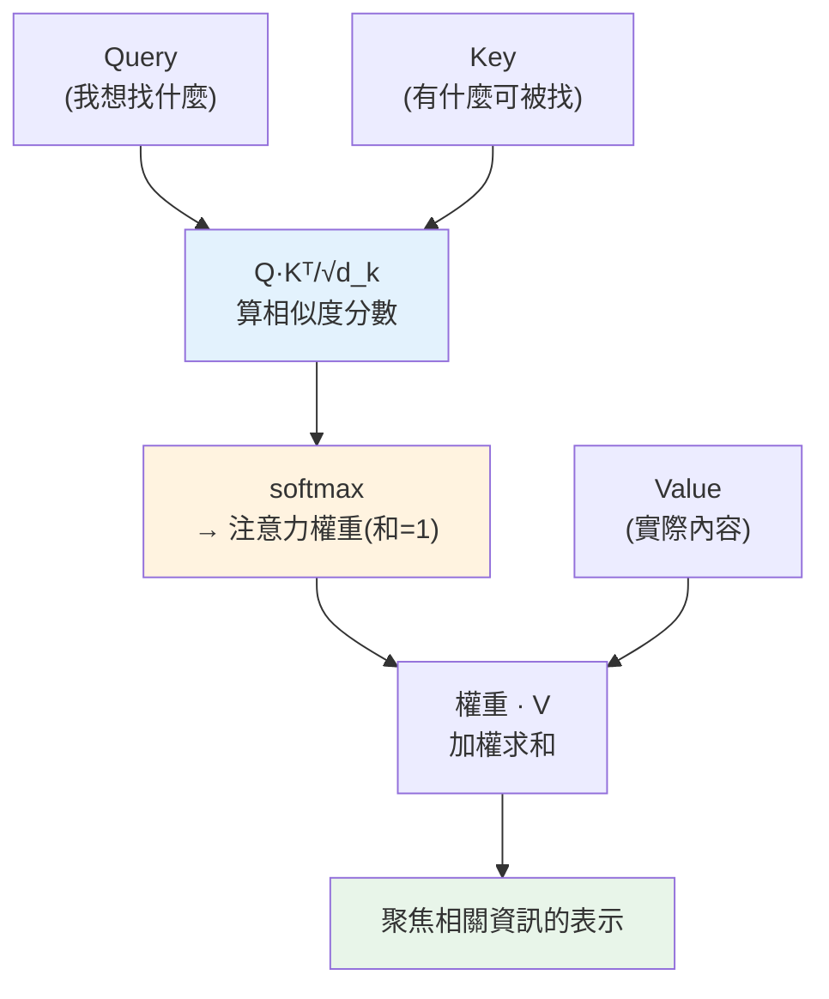

# 序列模型與注意力

> [CNN](05-cnn.md) 為影像而生,但**文字、語音、時間序列**是**序列**——有順序、長度不定、且元素間有**遠距依賴**(句首的主詞影響句尾的動詞)。處理序列的模型從 RNN 演進到 **注意力機制(attention)**,而注意力正是 **transformer** 的核心——**GPT、Claude 等所有現代 [LLM](../28-llm-genai/README.md) 的地基**。這章講序列模型的演進,並親手用 numpy 實作 **scaled dot-product attention**,揭開「注意力」的神秘面紗,直接銜接 Part 28。

## Why(為什麼)

序列資料有影像沒有的挑戰,需要專門的模型:

- **順序與可變長度**:「狗咬人」和「人咬狗」字一樣但意思相反——**順序有意義**。而且句子長度不定(3 個字或 300 個字)。[全連接](01-neural-network-basics.md)/[CNN](05-cnn.md) 難處理這種可變長度、順序敏感的資料。
- **遠距依賴(long-range dependency)**:「那隻在公園裡追著紅色球跑了很久的**狗**...累了」——「狗」和「累了」隔很遠,但模型要把它們**關聯**起來。早期的 **RNN(遞迴神經網路)** 逐字處理、用隱藏狀態記憶,但**遠距依賴會隨距離衰減**(梯度消失),記不住太遠的東西。
- **無法平行、訓練慢**:RNN 必須**逐字序列處理**(第 t 步要等第 t−1 步),無法平行,訓練慢。

**注意力機制(attention)** 徹底解決這些:它讓序列中**每個元素直接「看」序列中所有其他元素**,依相關性加權整合資訊——**遠距依賴一步到位**(不隨距離衰減)、**可完全平行**(所有位置同時算)。2017 年的 transformer(《Attention is All You Need》)證明「**只用注意力**」就能超越 RNN,從此成為 NLP 乃至 [LLM](../28-llm-genai/README.md) 的絕對主流。

這章講序列模型的演進(RNN → attention),重點是**親手實作注意力**——看清它不過是「算相似度 → softmax 加權 → 加權求和」。理解這個,你就懂了 [transformer 與 LLM](../28-llm-genai/01-llm-fundamentals.md) 的核心,這章是通往 Part 28 的橋樑。

## Theory(理論:從 RNN 到 attention)

**RNN(遞迴神經網路)——序列處理的早期方案**:

- 逐個處理序列元素,維護一個**隱藏狀態(hidden state)** 當「記憶」,每步用「當前輸入 + 上一步的隱藏狀態」更新記憶。
- **問題**:遠距依賴隨距離衰減([梯度消失](07-training-techniques.md))、無法平行(逐步依賴)。LSTM/GRU 用門控緩解記憶問題,但平行問題仍在。

**注意力機制(attention)——直接關聯所有位置**:

核心是 **Query-Key-Value(查詢-鍵-值)** 機制,直覺像「查字典」:

- **Query(Q)**:當前元素「想找什麼」。
- **Key(K)**:每個元素「有什麼可被找」。
- **Value(V)**:每個元素「實際的內容」。
- **運作**:用 Q 和每個 K 算**相似度**(誰跟我相關)→ softmax 轉成**注意力權重**(和為 1)→ 用權重對 V 做**加權求和**——得到「聚焦於相關元素的整合表示」。

**Scaled Dot-Product Attention**(transformer 的核心公式):

```text
Attention(Q, K, V) = softmax( Q·Kᵀ / √d_k ) · V

Q·Kᵀ:每個 query 對每個 key 的相似度分數(點積)
/ √d_k:縮放(防止分數過大讓 softmax 飽和)
softmax:轉成權重(每列和為 1)
· V:加權求和 value
```

**self-attention(自注意力)**:Q、K、V 都來自**同一個序列**——讓序列中每個元素關注序列中所有元素(包括自己),這是 transformer 的關鍵。**多頭注意力(multi-head)**:並行多組 attention 捕捉不同面向的關係。

## Specification(規範:attention 運算)

```python
import numpy as np

def softmax(x, axis=-1):
    e = np.exp(x - x.max(axis=axis, keepdims=True))   # 減 max 防溢位
    return e / e.sum(axis=axis, keepdims=True)

def attention(Q, K, V):
    d_k = Q.shape[-1]
    scores = Q @ K.T / np.sqrt(d_k)   # 相似度分數,縮放
    weights = softmax(scores)          # 注意力權重(每列和為 1)
    return weights @ V, weights         # 加權求和
```

**維度**:Q、K 是 `(序列長度, d_k)`、V 是 `(序列長度, d_v)`;`scores` 是 `(seq, seq)`(每個位置對每個位置的相似度);輸出是 `(seq, d_v)`。

**transformer 的其他組件**(概念,見 [Part 28](../28-llm-genai/01-llm-fundamentals.md)):

- **位置編碼(positional encoding)**:注意力本身**不含順序資訊**(它平等看所有位置),要額外加位置編碼告訴模型「誰在前誰在後」。
- **殘差連接 + LayerNorm + 前饋層**:堆疊多個注意力層的標準組件。
- **堆疊多層**:多個 transformer block 疊起來,學越來越抽象的表示。

## Implementation(底層:注意力為何強、為何能平行)

**注意力如何「聚焦相關資訊」**:核心是 `Q·Kᵀ` 算出「每個位置對每個位置的相似度」——若位置 i 的 query 和位置 j 的 key **點積大**(方向相近),代表 i 覺得 j **很相關**。softmax 把這些相似度轉成**權重**(相關的權重高、不相關的低,總和為 1),再用權重對 V **加權求和**——結果是「**主要由相關位置的內容組成**的表示」。下面範例會看到:token 0 和 token 2 的 Q/K 相同(相似),它們對彼此的注意力權重高(0.422),對不相似的 token 1 權重低(0.155)——**注意力自動讓相似/相關的元素互相關注、整合資訊**。這就是為什麼「狗...累了」能被關聯:「累了」的 query 會對「狗」的 key 產生高相似度,把「狗」的資訊直接拉過來——**遠距依賴一步到位,不隨距離衰減**(不像 RNN 要逐步傳遞、會遺忘)。

**為何注意力能完全平行(相對 RNN)**:RNN 第 t 步要等第 t−1 步算完(序列依賴),無法平行。注意力的 `Q·Kᵀ` 是**一次矩陣乘法同時算出所有位置對所有位置的關係**——**所有位置同時處理,完全平行**。這讓 transformer 能高效利用 [GPU](04-frameworks.md)、訓練超大模型(這是 LLM 能規模化的關鍵原因之一)。代價是計算量隨序列長度**平方**成長(每個位置對每個位置),所以超長序列有效率挑戰(FlashAttention 等優化在解決)。

**縮放 `/√d_k` 為何必要**:當維度 d_k 大時,`Q·Kᵀ` 的點積值會很大,讓 softmax **飽和**(輸出接近 one-hot,梯度消失,難訓練)。除以 `√d_k` 把分數縮放回合理範圍,讓 softmax 平滑、梯度健康。這是個小但關鍵的細節。下面範例實作 scaled dot-product attention。

## Code Example(可執行的 Python 範例)

```python
# attention.py — scaled dot-product attention(transformer 核心,純 numpy)
from __future__ import annotations

import numpy as np


def softmax(x: np.ndarray, axis: int = -1) -> np.ndarray:
    e = np.exp(x - x.max(axis=axis, keepdims=True))  # 減 max 防溢位
    return e / e.sum(axis=axis, keepdims=True)


def attention(Q: np.ndarray, K: np.ndarray, V: np.ndarray) -> tuple[np.ndarray, np.ndarray]:
    """scaled dot-product attention:softmax(Q·Kᵀ/√d_k)·V。"""
    d_k = Q.shape[-1]
    scores = Q @ K.T / np.sqrt(d_k)  # 每個 query 對每個 key 的相似度
    weights = softmax(scores)  # 注意力權重(每列和為 1)
    return weights @ V, weights  # 加權求和 value


def main() -> None:
    # 3 個 token,每個 4 維;讓 token0 和 token2 相同(應互相關注)
    Q = np.array([[1, 0, 1, 0], [0, 1, 0, 1], [1, 0, 1, 0]], dtype=float)
    K = Q.copy()  # self-attention:Q、K 同源
    V = np.array([[10, 0, 0, 0], [0, 10, 0, 0], [0, 0, 10, 0]], dtype=float)

    output, weights = attention(Q, K, V)

    print("注意力權重(第 i 列 = token i 對各 token 的注意力):")
    print(np.round(weights, 3))
    print("  → token0 與 token2 相似,互相注意力高(0.422);對不同的 token1 低(0.155)")

    print("\n輸出(各 token 聚焦相關資訊後的表示):")
    print(np.round(output, 2))

    print(f"\n驗證每列權重和為 1: {np.round(weights.sum(axis=1), 5)}")


if __name__ == "__main__":
    main()
```

**預期輸出**:

```pycon
$ python attention.py
注意力權重(第 i 列 = token i 對各 token 的注意力):
[[0.422 0.155 0.422]
 [0.212 0.576 0.212]
 [0.422 0.155 0.422]]
  → token0 與 token2 相似,互相注意力高(0.422);對不同的 token1 低(0.155)

輸出(各 token 聚焦相關資訊後的表示):
[[4.22 1.55 4.22 0.  ]
 [2.12 5.76 2.12 0.  ]
 [4.22 1.55 4.22 0.  ]]

驗證每列權重和為 1: [1. 1. 1.]
```

逐段解說:

- **注意力權重(核心)**:第 i 列是 token i 對所有 token 的注意力分配。**token0 和 token2 的 Q/K 相同(相似)**,所以它們**對彼此的注意力高(0.422)**,對不同的 token1 只有 0.155;而 token1 對自己注意力最高(0.576)。**注意力自動讓相似/相關的元素互相關注**——這就是「狗...累了」能關聯的機制:相關的位置互相拉高注意力。
- **加權求和輸出**:每個 token 的輸出是「**按注意力權重整合所有 token 的 value**」。token0 主要整合 token0 和 token2 的 value(各 0.422),所以輸出偏向它們的內容。**每個 token 得到一個「聚焦於相關元素」的新表示**——這是注意力的產物。
- **權重和為 1**:softmax 保證每列和為 1(0.422+0.155+0.422=1)——注意力是「把 100% 的關注**分配**給各元素」,是一種軟性的加權選擇。
- **縮放與 self-attention**:`/√d_k` 縮放防 softmax 飽和;這裡 Q=K(self-attention),讓序列關注自己內部的關係——這正是 transformer 的核心。
- **通往 LLM**:這 15 行 attention 就是 [GPT/Claude](../28-llm-genai/README.md) 的核心運算(放大成多頭、多層、加位置編碼、幾千億參數)。你已經實作了現代 AI 的地基 會從這裡接續講 LLM。
- **要點**:注意力用 Q·Kᵀ 算相似度、softmax 轉權重、加權求和 V,讓每個元素直接關注所有相關元素——遠距依賴一步到位、完全平行;這是 transformer 與所有 LLM 的核心。

## Diagram(圖解:attention 機制)



## Best Practice(最佳實踐)

- **序列任務用注意力/transformer**:遠距依賴一步到位、可平行,遠勝 RNN。
- **理解 Q-K-V 機制**:query 找、key 被找、value 內容;相似度→權重→加權和。
- **記得縮放 `/√d_k`**:防 softmax 飽和、梯度健康。
- **加位置編碼**:注意力本身無順序資訊,要額外告訴模型位置。
- **用 self-attention 捕捉序列內關係**:Q、K、V 同源,每元素關注所有元素。
- **用框架/現成 transformer**([PyTorch](04-frameworks.md)、Hugging Face):不必手刻,但要懂原理。
- **注意序列長度的平方成本**:超長序列用高效注意力(FlashAttention 等)。
- **連結到 [LLM](../28-llm-genai/README.md)**:transformer 是 GPT/Claude 的地基,懂 attention 就懂 LLM 核心。

## Common Mistakes(常見誤解)

- **序列任務硬用 CNN/全連接**:難處理可變長度、順序、遠距依賴。
- **忘記位置編碼**:注意力平等看所有位置,沒有順序資訊會出錯。
- **忘記縮放 `/√d_k`**:大維度時 softmax 飽和,訓練困難。
- **以為注意力很玄**:就是相似度→softmax→加權和,15 行 numpy。
- **softmax 不減 max**:數值溢位(exp 爆炸);要減 max 穩定。
- **忽略平方成本**:長序列注意力計算/記憶體暴增。
- **搞混 Q/K/V 維度**:shape 對不上;Q、K 同 d_k、輸出同 V 的 d_v。
- **以為 RNN 已過時無用**:某些場景(串流、極長序列)仍有用,但主流是 transformer。

## Interview Notes(面試重點)

- **能講序列模型演進**:RNN(逐步、遠距衰減、無法平行)→ attention(直接關聯、可平行)。
- **能寫 scaled dot-product attention**:softmax(Q·Kᵀ/√d_k)·V,並解釋 Q/K/V 的角色。
- **能解釋注意力為何強**:每元素直接關注所有相關元素,遠距依賴一步到位、完全平行。
- **能講縮放 /√d_k 的作用**:防 softmax 飽和、梯度健康。
- **能講 self-attention 與位置編碼**:Q/K/V 同源關注序列內部;注意力無順序要加位置編碼。
- **知道 transformer 是 LLM 的地基、注意力平方成本、multi-head 的作用。**

---

➡️ 下一章:[訓練技巧](07-training-techniques.md)

[⬆️ 回 Part 27 索引](README.md)
