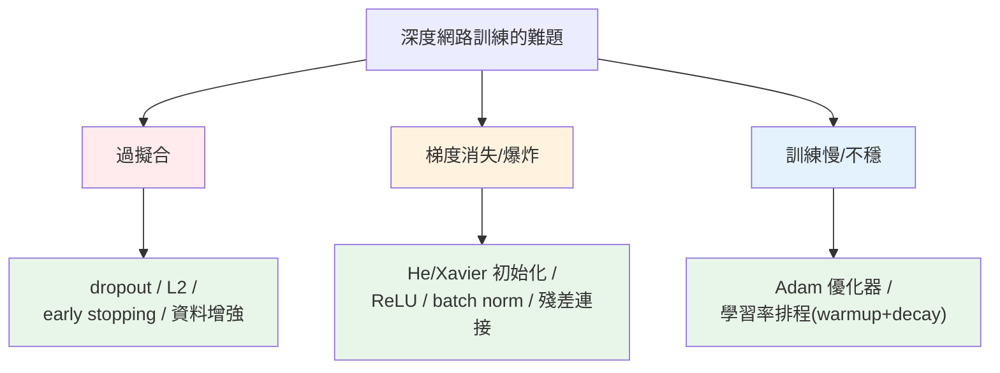

# 訓練技巧

> [手刻網路](03-nn-from-scratch.md)在 XOR 這種玩具問題上很順,但訓練**真實的深度網路**會遇到一堆麻煩:過擬合、梯度消失/爆炸、訓練不穩、[學習率難調](02-backpropagation.md)。深度學習的實務,很大一部分是這些**訓練技巧**——dropout、批次正規化、好的初始化、進階優化器(Adam)、學習率排程、early stopping。它們讓深度網路**訓得動、訓得好、不過擬合**。這章講這些讓深度學習真正可行的關鍵技巧。

## Why(為什麼)

理論上疊很多層就能學複雜函式,但實務上**深度網路很難訓練**——這些技巧解決真實的痛點:

- **過擬合**:深度網路參數多、表達力強,極易[背住訓練資料](../25-machine-learning/07-overfitting-regularization.md)。**dropout、正則化、early stopping、資料增強** 都在對抗過擬合。
- **梯度消失/爆炸**:深層網路反向傳播時,梯度一層層相乘——可能**越乘越小(消失,深層學不動)** 或**越乘越大(爆炸,訓練發散)**。**好的初始化、ReLU、批次正規化、殘差連接** 緩解這問題,讓深層網路訓得動。
- **訓練慢又不穩**:單純的[梯度下降](02-backpropagation.md)收斂慢、[學習率難調](02-backpropagation.md)。**Adam 等自適應優化器、學習率排程** 大幅改善收斂速度與穩定性。
- **不知道何時停**:訓練太久會過擬合、太短會欠擬合。**early stopping** 用驗證損失自動決定停在最佳點。

這些技巧不是可有可無的裝飾——**沒有它們,深度網路根本訓不好**。2010 年代深度學習的爆發,除了資料與算力,很大程度就是這些技巧的成熟(ReLU、dropout、batch norm、Adam、殘差連接)。這章講最核心的幾個,理解它們解決什麼問題、怎麼運作——這是把深度學習從「理論可行」變成「實務可用」的關鍵知識。

## Theory(理論:核心訓練技巧)

**對抗過擬合**:

- **Dropout**:訓練時**隨機關閉一部分神經元**(每次前向隨機丟棄,如 50%)。逼網路不依賴特定神經元、學更穩健的表示(像集成)。**推論時不 dropout**(用全部神經元)。
- **L2 正則化(weight decay)**:[懲罰大權重](../25-machine-learning/07-overfitting-regularization.md),讓模型平滑。
- **Early stopping**:監控**驗證損失**,不再改善(連續 N 輪)就停——停在泛化最佳點。
- **資料增強**:對訓練資料做變換(影像旋轉/翻轉、文字同義替換)增加多樣性。

**對抗梯度問題 + 加速訓練**:

- **好的初始化(He / Xavier)**:權重初始尺度依 fan-in 設定(He 給 ReLU、Xavier 給 tanh),讓各層的訊號/梯度尺度穩定,避免一開始就消失/爆炸。
- **ReLU**:[緩解梯度消失](01-neural-network-basics.md)(正區間梯度恆為 1,不像 sigmoid 兩端飽和)。
- **批次正規化(batch norm)**:每層對輸入正規化(零均值單位方差),穩定訓練、加速收斂、有輕微正則化效果。
- **殘差連接(residual / skip connection)**:讓梯度「抄捷徑」跳過層,使**極深**網路(ResNet 上百層、[transformer](06-sequence-attention.md))訓得動。

**優化器與學習率**:

- **Adam**:自適應學習率的優化器(結合動量 + 各參數自適應步幅),比純 [SGD](02-backpropagation.md) 收斂快、對學習率較不敏感——**現代預設**。
- **學習率排程(schedule)**:動態調整學習率——常見 **warmup**(初期線性升,穩定啟動)+ **decay**(之後衰減,精細收斂)。

## Specification(規範:關鍵技巧的實作)

**Dropout(inverted dropout)**:

```python
def dropout(x, rate, training, rng):
    if not training or rate == 0:
        return x                                    # 推論時不 dropout
    mask = (rng.random(x.shape) >= rate) / (1 - rate)  # 隨機保留 + 放大補償
    return x * mask
```

**He / Xavier 初始化**:

```python
he_scale = np.sqrt(2 / fan_in)      # 給 ReLU
xavier_scale = np.sqrt(1 / fan_in)  # 給 tanh/sigmoid
W = rng.normal(0, scale, (fan_in, fan_out))
```

**學習率排程(warmup + linear decay)**:

```python
def lr_schedule(step, base_lr, warmup, total):
    if step < warmup:
        return base_lr * step / warmup             # warmup 線性上升
    return base_lr * (1 - (step - warmup) / (total - warmup))  # 之後衰減
```

**Early stopping**:監控驗證損失,連續 `patience` 輪無改善則停。

## Implementation(底層:dropout 為何有效、初始化為何關鍵)

**Dropout 為何能防過擬合**:訓練時每次隨機關閉一半神經元,意味著網路**不能依賴任何特定神經元**(它隨時可能被關掉),被迫讓**每個特徵都由多個神經元冗餘地表示**、學更穩健的表示。這等效於**訓練了大量共享權重的子網路的集成**([集成降變異](../26-advanced-ml/02-ensemble-learning.md)的精神),大幅降低過擬合。**inverted dropout** 的細節:保留的神經元要**放大 `1/(1−rate)` 倍**(下面範例 rate=0.5 時放大 2 倍),補償被關掉的部分,讓輸出的期望值不變——這樣**推論時直接用全部神經元、不需任何調整**。推論時關閉 dropout(要用全部學到的知識)。下面範例會看到訓練時約一半神經元變 0、保留的變 2,推論時全部保留為 1。

**權重初始化為何是「深度網路能否訓練」的關鍵**:若初始權重**太大**,每層的輸出/梯度會**逐層放大**→ 梯度爆炸(訓練發散);**太小** → 逐層縮小 → 梯度消失(深層學不動)。**He/Xavier 初始化**根據該層的 fan-in(輸入數)設定初始權重的尺度(`√(2/fan_in)` for ReLU),讓**訊號和梯度在多層間保持穩定的尺度**——不放大也不縮小。這看似小細節,卻是深層網路能否訓練的成敗關鍵(早期深度網路訓不動,很大原因就是初始化不當)。下面範例會看到 He 尺度(0.141)比 Xavier(0.100)大——因為 ReLU 會把一半輸出歸零,需要稍大的初始權重補償。

**Adam 與學習率排程為何加速收斂**:純 [SGD](02-backpropagation.md) 對所有參數用**同一個固定學習率**,收斂慢又對學習率敏感。**Adam** 為**每個參數**維護自適應的學習率(依該參數梯度的歷史調整)+ 動量(平滑梯度方向)——收斂快、對學習率較不敏感,是現代預設。**學習率排程**再進一步:**warmup**(初期用小學習率慢慢升,避免一開始梯度不穩就大步走壞)+ **decay**(後期衰減,讓模型精細收斂到最低點)。下面範例的排程會看到 lr 從 0 線性升到 0.1(warmup)再線性降(decay)——這種形狀是訓練 [transformer/LLM](06-sequence-attention.md) 的標配。下面範例示範 dropout、初始化、排程、early stopping。

## Code Example(可執行的 Python 範例)

```python
# training_techniques.py — dropout / 初始化 / 學習率排程 / early stopping(純 numpy)
from __future__ import annotations

import numpy as np


def dropout(x: np.ndarray, rate: float, training: bool, rng: np.random.Generator) -> np.ndarray:
    """inverted dropout:訓練時隨機關閉 + 放大補償;推論時原樣通過。"""
    if not training or rate == 0:
        return x
    mask = (rng.random(x.shape) >= rate) / (1 - rate)  # 保留的放大 1/(1-rate)
    return x * mask


def init_scale(fan_in: int, method: str) -> float:
    """權重初始化尺度:He 給 ReLU、Xavier 給 tanh。"""
    return float(np.sqrt(2 / fan_in) if method == "he" else np.sqrt(1 / fan_in))


def lr_schedule(step: int, base_lr: float, warmup: int, total: int) -> float:
    """warmup 線性上升 + 之後線性衰減(transformer 訓練標配)。"""
    if step < warmup:
        return base_lr * step / warmup
    return base_lr * (1 - (step - warmup) / (total - warmup))


def should_stop(val_losses: list[float], patience: int = 3) -> bool:
    """early stopping:最近 patience 輪都沒比之前更好就停。"""
    if len(val_losses) <= patience:
        return False
    return min(val_losses[-patience:]) >= min(val_losses[:-patience])


def main() -> None:
    rng = np.random.default_rng(0)

    # Dropout
    x = np.ones(10)
    print("Dropout(rate=0.5):")
    print(f"  訓練時: {np.round(dropout(x, 0.5, training=True, rng=rng), 1)}")
    print("    → 約一半關閉為 0,保留的放大為 2(補償)")
    print(f"  推論時: {dropout(x, 0.5, training=False, rng=rng)[:5]}... (全保留)")

    # 初始化尺度
    print(f"\n初始化尺度(fan_in=100): He(ReLU)={init_scale(100, 'he'):.3f} "
          f"Xavier(tanh)={init_scale(100, 'xavier'):.3f}")

    # 學習率排程
    print("\n學習率排程(base=0.1, warmup=10, total=100):")
    for step in (0, 5, 10, 50, 99):
        print(f"  step {step:>2}: lr={lr_schedule(step, 0.1, 10, 100):.4f}")

    # Early stopping
    losses = [0.5, 0.4, 0.3, 0.31, 0.32, 0.33]  # 第 3 輪後不再改善
    print(f"\nEarly stopping: 驗證損失 {losses} → 該停? {should_stop(losses)}")


if __name__ == "__main__":
    main()
```

**預期輸出**:

```pycon
$ python training_techniques.py
Dropout(rate=0.5):
  訓練時: [2. 0. 0. 0. 2. 2. 2. 2. 2. 2.]
    → 約一半關閉為 0,保留的放大為 2(補償)
  推論時: [1. 1. 1. 1. 1.]... (全保留)

初始化尺度(fan_in=100): He(ReLU)=0.141 Xavier(tanh)=0.100

學習率排程(base=0.1, warmup=10, total=100):
  step  0: lr=0.0000
  step  5: lr=0.0500
  step 10: lr=0.1000
  step 50: lr=0.0556
  step 99: lr=0.0011

Early stopping: 驗證損失 [0.5, 0.4, 0.3, 0.31, 0.32, 0.33] → 該停? True
```

逐段解說:

- **Dropout**:訓練時 `[2, 0, 0, 0, 2, 2, ...]`——**約一半神經元被關閉(0)**,保留的**放大為 2**(`1/(1−0.5)`,補償被關掉的部分讓期望不變)。這逼網路不依賴特定神經元、學穩健表示(像[集成](../26-advanced-ml/02-ensemble-learning.md))。**推論時全保留為 1**(不 dropout,用全部知識)——inverted dropout 讓推論不需任何調整。
- **初始化尺度**:He(給 ReLU)=0.141 > Xavier(給 tanh)=0.100——**He 尺度較大**,因為 ReLU 把一半輸出歸零,需要稍大的初始權重補償訊號。**用對的初始化讓深層網路的訊號/梯度尺度穩定**,避免一開始就[梯度消失/爆炸](#)——這是深層網路能訓練的關鍵前提。
- **學習率排程**:lr 從 step0 的 0 **線性升到 step10 的 0.1(warmup)**,再**線性衰減到 step99 的 0.0011(decay)**。**warmup** 讓訓練初期穩定啟動(避免梯度不穩時大步走壞)、**decay** 讓後期精細收斂。這種「先升後降」是訓練 [transformer/LLM](06-sequence-attention.md) 的標準做法。
- **Early stopping**:驗證損失 `0.5→0.4→0.3` 後開始回升(`0.31→0.32→0.33`)——**第 3 輪的 0.3 是最佳點,之後過擬合了**。`should_stop` 偵測到最近 3 輪都沒比之前更好 → **回傳 True(該停)**。這自動停在泛化最佳點,避免繼續訓練導致過擬合。
- **要點**:dropout(隨機關神經元防過擬合)、He/Xavier 初始化(穩定訊號防梯度問題)、學習率排程(warmup+decay 加速穩定收斂)、early stopping(停在泛化最佳點)——這些技巧讓深度網路訓得動、訓得好、不過擬合。

## Diagram(圖解:訓練技巧解決的問題)



## Best Practice(最佳實踐)

- **用 dropout 防過擬合**:全連接層常用(0.2–0.5);推論時關閉。
- **用 He/Xavier 初始化**:ReLU 用 He、tanh/sigmoid 用 Xavier;穩定深層訓練。
- **預設用 Adam 優化器**:收斂快、對學習率較不敏感;細調時可試 SGD+動量。
- **用學習率排程**:warmup + decay,尤其訓練大模型/transformer。
- **用 early stopping**:監控驗證損失,停在泛化最佳點,省時防過擬合。
- **深層網路用批次正規化 + 殘差連接**:穩定訓練、讓極深網路訓得動。
- **資料增強**:影像/文字任務增加多樣性,提升泛化。
- **監控 train/val 損失曲線**:診斷過擬合(train 降 val 升)、梯度問題(不降/發散)。

## Common Mistakes(常見誤解)

- **推論時仍 dropout**:應關閉;訓練時 dropout、推論用全部神經元。
- **初始化不當**:太大爆炸、太小消失;用 He/Xavier。
- **深層網路不用 batch norm / 殘差**:梯度問題讓深層訓不動。
- **死守固定學習率**:用排程(warmup+decay)+ Adam 更好。
- **不做 early stopping 訓練過久**:過擬合;要監控驗證損失。
- **不監控 train/val 曲線**:過擬合/梯度問題沒發現。
- **以為技巧可有可無**:沒它們深度網路根本訓不好。
- **dropout rate 亂設**:太高欠擬合、太低沒效果;常 0.2–0.5,要調。

## Interview Notes(面試重點)

- **能列對抗過擬合的技巧**:dropout、L2、early stopping、資料增強。
- **能講 dropout 原理**:訓練隨機關神經元(像集成)、推論全開;inverted dropout 放大補償。
- **能講梯度消失/爆炸與對策**:好初始化(He/Xavier)、ReLU、batch norm、殘差連接。
- **能講 Adam vs SGD**:自適應學習率 + 動量,收斂快對 lr 較不敏感,現代預設。
- **能講學習率排程**:warmup(穩定啟動)+ decay(精細收斂),transformer 標配。
- **能講 early stopping**:監控驗證損失、停在泛化最佳點,防過擬合。

---

➡️ 下一章:[🏗️ Capstone:從零訓練神經網路](08-capstone-nn.md)

[⬆️ 回 Part 27 索引](README.md)
