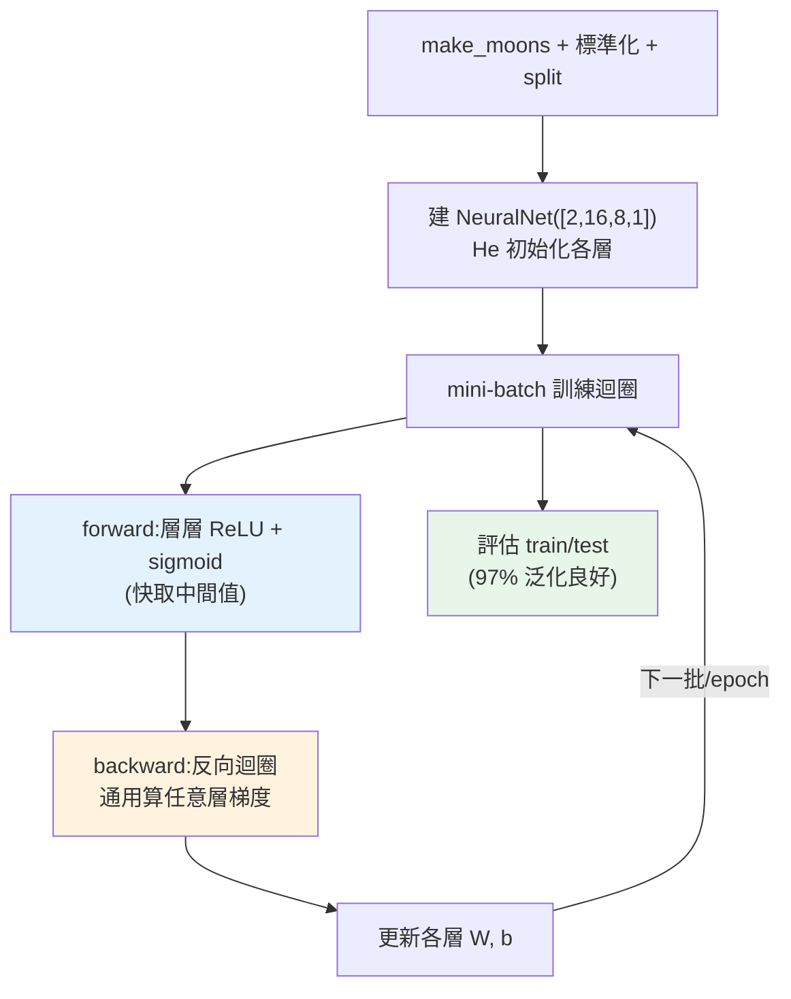

# 🏗️ Capstone:從零訓練神經網路

> 這是 Part 27、也是整條 **資料 / AI 學習線** 深度學習部分的收尾整合。我們把本 Part 的知識——[神經元與前向傳播](01-neural-network-basics.md)、[反向傳播與梯度下降](02-backpropagation.md)、[多層架構](03-nn-from-scratch.md)、[ReLU 與初始化](07-training-techniques.md)、[mini-batch](02-backpropagation.md)——組裝成一個**通用的、多層的神經網路類別**,用純 numpy 從零訓練它解決一個**真實的非線性分類問題**(make_moons)。做完這章,你就親手實現了一個完整、可用的深度學習框架的核心。

## Why(為什麼)

[ch03 的 XOR 網路](03-nn-from-scratch.md)是寫死的兩層;真實框架([PyTorch](04-frameworks.md))能建**任意層數**的網路。這章把手刻提升到「通用網路類別」的層次,整合本 Part 所有技巧:

- **通用架構**:一個 `NeuralNet` 類別,傳入 `[2, 16, 8, 1]` 就建出「2 輸入 → 16 → 8 → 1 輸出」的網路——**任意深度、任意寬度**。這才是框架的樣子。
- **整合訓練技巧**:[He 初始化](07-training-techniques.md)(給 ReLU)、[ReLU 激活](01-neural-network-basics.md)、[mini-batch 訓練](02-backpropagation.md)——這些是實務訓練的標配,全部用上。
- **解決真實非線性問題**:make_moons 是兩個交錯的月牙形——**強烈非線性可分**([線性模型](../25-machine-learning/05-classification.md)束手無策),正好展示多層網路的威力。

這章不教新概念,而是**把 Part 27 學的一切合為一個能跑的整體**——一個從零手刻、能學習任意複雜函式的神經網路。這是深度學習能力的總驗收:**你不再是「呼叫框架的人」,而是「懂得框架內部每一行在做什麼的人」**。這種底層理解,是 ML Engineer 面對 debug、優化、乃至理解 [LLM](../28-llm-genai/README.md) 的根本能力。

## Theory(理論:通用網路的組件)

一個通用的多層神經網路類別需要:

- **參數(每層的 W、b)**:依 `sizes`(如 `[2,16,8,1]`)建立各層權重,用 [He 初始化](07-training-techniques.md)。
- **前向傳播(forward)**:輸入層層做 `ReLU(W·h + b)`,最後一層用 sigmoid(分類);**快取各層的中間值**(z、a)供反向傳播用。
- **反向傳播(backward)**:從輸出誤差往回,逐層算梯度並更新([連鎖律](02-backpropagation.md))——**通用地處理任意層數**(迴圈,不寫死)。
- **訓練(train)**:[mini-batch](02-backpropagation.md) 迴圈——每 epoch 打亂資料、分小批,每批做前向+反向。
- **預測(predict)**:前向傳播 + 閾值。

**關鍵設計:通用地處理任意層數**。[ch03](03-nn-from-scratch.md) 把 2 層寫死;這裡用**迴圈**遍歷各層,所以改 `sizes` 就改架構——這正是[框架](04-frameworks.md)的做法(`nn.Sequential([...])`)。

**訓練流程**(整合本 Part):

```text
1. 準備資料 + 標準化 + split(Part 25)
2. 建網路(He 初始化各層)
3. mini-batch 訓練:每 epoch 打亂 → 分批 → forward → backward → update
4. 評估(train/test 準確率,對比看過擬合)
```

## Specification(規範:NeuralNet 類別)

```python
class NeuralNet:
    def __init__(self, sizes, lr):
        # sizes 如 [2,16,8,1];各層 He 初始化
        self.W = [he_init(sizes[i], sizes[i+1]) for i in range(len(sizes)-1)]
        self.b = [zeros(sizes[i+1]) for i in ...]

    def forward(self, X):
        # 層層 ReLU(W·h+b),最後 sigmoid;快取中間值
        ...
        return output

    def backward(self, y):
        # 從輸出誤差往回,通用迴圈算各層梯度並更新
        ...

    def train(self, X, y, epochs, batch):
        # mini-batch:每 epoch 打亂、分批、forward+backward
        ...
```

**要點**:

- **快取前向的中間值**(z 用於算 ReLU 導數、a 用於算權重梯度)——反向傳播需要。
- **mini-batch**:每次用一小批([比全量快、噪音助收斂](02-backpropagation.md))。
- **He 初始化 + ReLU**:深層網路訓得動的[標配](07-training-techniques.md)。
- **標準化輸入**:梯度型模型必須([特徵縮放](../25-machine-learning/03-feature-engineering.md))。

## Implementation(底層:通用反向傳播、整合的威力)

**通用反向傳播如何處理任意層數**:[ch03](03-nn-from-scratch.md) 手寫了兩層的反向傳播(d_out → d_h)。通用版用**迴圈從最後一層往第一層走**:對每層 i,用「傳到這層的誤差 d」算出該層權重梯度(`dW = a[i].T @ d`),然後**把誤差往前一層傳**(`d = (d @ W[i].T) * relu_deriv(z[i-1])`)——這就是 [ch03 手做的「誤差反向流動」](03-nn-from-scratch.md)的通用化,不管幾層都用同一段迴圈處理。這正是 [PyTorch autograd](04-frameworks.md) 對任意計算圖做的事(只是它更通用、自動)。理解這個迴圈,你就懂了「反向傳播對任意深度網路」的機制。

**整合技巧讓真實問題可解**:[XOR](03-nn-from-scratch.md) 是 4 個點的玩具;make_moons 是 500 個帶噪音、非線性交錯的真實資料點。要學好它,需要——**足夠深/寬的網路**(2→16→8→1,比 XOR 的網路大)、**[He 初始化](07-training-techniques.md)**(讓深層 ReLU 網路訓得動)、**[ReLU](01-neural-network-basics.md)**(緩解梯度消失)、**[mini-batch](02-backpropagation.md)**(500 筆資料分批訓練)、**[標準化](../25-machine-learning/03-feature-engineering.md)**(梯度穩定)。**這些技巧缺一不可**——少了 He 初始化深層可能訓不動、少了標準化訓練不穩。下面範例整合它們,在 make_moons 上達到 **97% 測試準確率**——一個純 numpy、從零手刻的網路,解決了線性模型辦不到的非線性問題。

**train vs test 準確率驗證泛化**:下面範例會看到 train 98.3%、test 97.3%——**兩者接近**,代表模型**學到了真正的規律而非過擬合**(若 train 遠高於 test 就是[過擬合](../25-machine-learning/07-overfitting-regularization.md),要加 [dropout/正則化](07-training-techniques.md))。這也印證了 [Part 25 的評估原則](../25-machine-learning/02-ml-workflow.md)在深度學習同樣適用——**深度學習仍是 ML,泛化、過擬合、評估的原則一以貫之**。下面是完整的通用神經網路。

## Code Example(可執行的 Python 範例)

```python
# capstone_nn.py — 通用多層神經網路,從零訓練解非線性分類(純 numpy + sklearn 資料)
from __future__ import annotations

import numpy as np
from sklearn.datasets import make_moons
from sklearn.model_selection import train_test_split
from sklearn.preprocessing import StandardScaler


def relu(z: np.ndarray) -> np.ndarray:
    return np.maximum(0, z)


def relu_deriv(z: np.ndarray) -> np.ndarray:
    return (z > 0).astype(float)


def sigmoid(z: np.ndarray) -> np.ndarray:
    return 1 / (1 + np.exp(-np.clip(z, -500, 500)))


class NeuralNet:
    """通用多層神經網路:sizes 如 [2,16,8,1] 決定架構。"""

    def __init__(self, sizes: list[int], lr: float = 0.5, seed: int = 42) -> None:
        rng = np.random.default_rng(seed)
        self.lr = lr
        # He 初始化(給 ReLU):尺度 sqrt(2/fan_in)
        self.weights = [
            rng.normal(0, np.sqrt(2 / sizes[i]), (sizes[i], sizes[i + 1]))
            for i in range(len(sizes) - 1)
        ]
        self.biases = [np.zeros((1, sizes[i + 1])) for i in range(len(sizes) - 1)]

    def forward(self, x: np.ndarray) -> np.ndarray:
        self.zs: list[np.ndarray] = []
        self.activations = [x]
        h = x
        for i in range(len(self.weights) - 1):  # 隱藏層用 ReLU
            z = h @ self.weights[i] + self.biases[i]
            self.zs.append(z)
            h = relu(z)
            self.activations.append(h)
        z = h @ self.weights[-1] + self.biases[-1]  # 輸出層用 sigmoid
        self.zs.append(z)
        out = sigmoid(z)
        self.activations.append(out)
        return out

    def backward(self, y: np.ndarray) -> None:
        m = y.shape[0]
        d = (self.activations[-1] - y) / m  # 輸出誤差
        for i in reversed(range(len(self.weights))):  # 通用:任意層數迴圈
            d_w = self.activations[i].T @ d
            d_b = d.sum(axis=0, keepdims=True)
            if i > 0:  # 誤差往前一層傳(連鎖律)
                d = (d @ self.weights[i].T) * relu_deriv(self.zs[i - 1])
            self.weights[i] -= self.lr * d_w
            self.biases[i] -= self.lr * d_b

    def train(self, x: np.ndarray, y: np.ndarray, epochs: int, batch: int = 32) -> None:
        rng = np.random.default_rng(0)
        for _ in range(epochs):  # mini-batch 訓練
            idx = rng.permutation(len(x))
            for s in range(0, len(x), batch):
                bi = idx[s : s + batch]
                self.forward(x[bi])
                self.backward(y[bi])

    def predict(self, x: np.ndarray) -> np.ndarray:
        return (self.forward(x) > 0.5).astype(int)


def main() -> None:
    # make_moons:兩個交錯月牙(強非線性,線性模型學不會)
    x, y = make_moons(n_samples=500, noise=0.2, random_state=42)
    y = y.reshape(-1, 1)
    x_train, x_test, y_train, y_test = train_test_split(
        x, y, test_size=0.3, random_state=42, stratify=y
    )
    scaler = StandardScaler()
    x_train = scaler.fit_transform(x_train)
    x_test = scaler.transform(x_test)

    net = NeuralNet([2, 16, 8, 1], lr=0.5)  # 2→16→8→1
    net.train(x_train, y_train, epochs=200)

    train_acc = float(np.mean(net.predict(x_train) == y_train))
    test_acc = float(np.mean(net.predict(x_test) == y_test))
    print(f"從零手刻神經網路 [2,16,8,1] 訓練 make_moons:")
    print(f"  train 準確率: {train_acc:.3f}")
    print(f"  test 準確率:  {test_acc:.3f}")
    print("  → 純 numpy 手刻,解決線性模型辦不到的非線性分類,泛化良好")


if __name__ == "__main__":
    main()
```

**預期輸出**:

```pycon
$ python capstone_nn.py
從零手刻神經網路 [2,16,8,1] 訓練 make_moons:
  train 準確率: 0.983
  test 準確率:  0.973
  → 純 numpy 手刻,解決線性模型辦不到的非線性分類,泛化良好
```

逐段解說:

- **通用架構**:`NeuralNet([2, 16, 8, 1])` 建出「2 輸入 → 16 → 8 → 1」的**四層網路**——`sizes` 決定架構,改一下就是不同網路。`__init__` 用**迴圈**依 sizes 建各層權重(He 初始化)——這就是[框架](04-frameworks.md) `nn.Sequential` 的手刻版。
- **通用 forward/backward**:`forward` 用迴圈層層做 ReLU、輸出層 sigmoid,快取中間值;`backward` 用**反向迴圈**(`reversed(range(...))`)通用地處理**任意層數**的梯度計算與誤差反傳——不像 [ch03](03-nn-from-scratch.md) 寫死兩層。這正是[反向傳播對任意深度網路](02-backpropagation.md)的機制。
- **mini-batch 訓練**:`train` 每 epoch 打亂資料、分成 32 筆的小批,每批 forward+backward——[mini-batch SGD](02-backpropagation.md),比全量快、噪音助收斂。
- **整合技巧解真實問題**:make_moons 是強非線性的兩個月牙,[線性模型](../25-machine-learning/05-classification.md)完全學不會。但這個網路整合了 **He 初始化 + ReLU + mini-batch + 標準化**,達到 **test 97.3%**——**純 numpy、從零手刻,解決了線性模型辦不到的問題**。
- **泛化良好**:train 98.3%、test 97.3% **接近**——學到真規律而非[過擬合](../25-machine-learning/07-overfitting-regularization.md)。**深度學習仍是 ML**,[泛化與評估的原則](../25-machine-learning/02-ml-workflow.md)一以貫之。
- **你完成了什麼**:一個完整、通用、能訓練任意架構的神經網路——**框架內部的核心,你親手實現了**。從此 [PyTorch](04-frameworks.md)、[CNN](05-cnn.md)、[transformer/LLM](../28-llm-genai/README.md) 對你都是「同一原理的不同規模」。
- **要點**:通用網路類別 = 依 sizes 建參數 + 迴圈式 forward/backward(任意層數)+ mini-batch 訓練;整合 He 初始化/ReLU/標準化解真實非線性問題;深度學習仍遵循 ML 的泛化原則。

## Diagram(圖解:通用網路訓練)



## Best Practice(最佳實踐)

- **通用化:用迴圈處理任意層數**:別寫死層數,依 sizes 建網路(框架的做法)。
- **快取前向中間值供反向用**:z(算激活導數)、a(算權重梯度)。
- **He 初始化 + ReLU**:深層網路訓得動的[標配](07-training-techniques.md)。
- **標準化輸入**:梯度型模型必須,訓練才穩。
- **mini-batch 訓練**:每 epoch 打亂 + 分批,比全量快、助收斂。
- **對比 train/test 準確率**:接近=泛化好、差距大=[過擬合](../25-machine-learning/07-overfitting-regularization.md)(加 dropout/正則化)。
- **懂手刻後用框架**:實務用 [PyTorch](04-frameworks.md),但這份底層理解讓你能 debug/優化。
- **深度學習仍遵循 ML 原則**:split、泛化、評估、防過擬合一以貫之。

## Common Mistakes(常見誤解)

- **寫死層數不通用化**:改架構要重寫;用迴圈依 sizes 建。
- **忘記快取中間值**:反向傳播需要前向的 z、a。
- **不用 He 初始化 / 不標準化**:深層 ReLU 網路可能訓不動、訓練不穩。
- **全量訓練不用 mini-batch**:慢、易卡局部最優。
- **只看 train 準確率**:可能過擬合;要看 test。
- **反向傳播的形狀/轉置錯**:通用迴圈也要對 shape;可用[梯度檢查](02-backpropagation.md)。
- **以為手刻沒用**:懂底層才能 debug 框架、理解 LLM。
- **忽略深度學習仍是 ML**:泛化/過擬合/評估原則同樣適用。

## Interview Notes(面試重點)

- **能描述通用神經網路的組件**:依 sizes 建參數、迴圈式 forward(快取中間值)/backward(任意層數)、mini-batch train。
- **能講通用反向傳播**:反向迴圈逐層算梯度並把誤差往前傳,是 [ch03](03-nn-from-scratch.md) 兩層版的通用化。
- **能講整合的訓練技巧**:He 初始化、ReLU、mini-batch、標準化,缺一深層可能訓不好。
- **能講 train/test 對比驗證泛化**:接近=好、差距大=過擬合。
- **能連結到框架**:這個通用類別就是 [PyTorch](04-frameworks.md) autograd + nn.Module 的手刻核心。
- **能強調深度學習仍遵循 ML 的泛化/評估原則**,底層理解是 debug 與理解 LLM 的根本。

---

🎉 **恭喜你完成 Part 27,也完成了整條資料 / AI 學習線的深度學習部分!** 你已從單一神經元一路手刻到通用多層網路、CNN、注意力機制,並理解訓練技巧——**深度學習對你不再是黑箱**。這份底層理解,正是理解 [Part 28 LLM](../28-llm-genai/README.md)(transformer 是注意力的放大版)的根基。

➡️ 銜接:[Part 28 LLM 與生成式 AI](../28-llm-genai/README.md)——注意力 → transformer → LLM 的延伸。

[⬆️ 回 Part 27 索引](README.md) ｜ [回章節總覽](../README.md)
