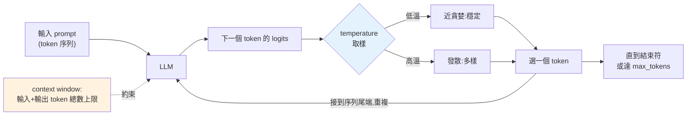

# LLM 原理:token、context、取樣

> 要用好 LLM,得先理解它到底在做什麼:它不「懂」文字,而是把文字切成 **token**、根據前文**預測下一個 token 的機率分布**,再從中**取樣**一個接一個地生成。理解 token、context window、取樣參數(temperature),你才能掌控成本、長度與輸出的隨機性。

## 💡 白話導讀(建議先讀)

ChatGPT 看起來像「懂」你的話,但它骨子裡在做一件樸素到驚人的事:
**猜下一個字**。給定前面的文字,它算出「下一個詞最可能是什麼」,
挑一個接上去,再猜下一個——像一個**接龍高手**,一個詞一個詞往下接,
接到句號為止。這叫**自迴歸(autoregressive)生成**。
([Part 27 的 attention](../27-deep-learning/06-sequence-attention.md)就是讓它「接得準」的引擎。)

理解這個本質,就能解釋你對 LLM 的所有困惑:

- **為什麼它會「一本正經地胡說八道」(幻覺)?**
  因為它只求「接得像」,不查證「是不是真的」——
  流暢和正確是兩回事。
- **為什麼同個問題每次答不一樣?**
  因為它是**按機率取樣**下一個詞,不是每次都挑最高分的。
  這個隨機性由 **temperature** 旋鈕控制:高=有創意但易失控,低=穩定但無聊。

幾個貫穿整個 Part 的關鍵詞先建立:

- **token(詞元)**:模型眼中的最小單位,**不是字也不是詞**,
  是用 BPE 演算法切出來的碎片(英文一個詞約 1.3 個 token,中文一字常 1~2 個)。
  **計費、長度限制、成本,全都按 token 算**——所以這個詞很重要。
- **context window(脈絡窗口)**:模型一次能「看到」的 token 上限——
  它的短期記憶容量,超過就得取捨。

這章帶你看懂 LLM 生成文字的完整機制,是後面所有實作的地基。

## Why(為什麼)

你要用 LLM(大型語言模型,Large Language Model)建應用——聊天、摘要、RAG、agent。但如果把它當成「會思考的黑盒」,你會踩一堆坑:為什麼同樣的問題每次答不一樣?為什麼超過某長度就報錯?為什麼帳單這麼貴?為什麼調某個參數輸出就變得天馬行空?

這些全都源自 LLM 的**運作機制**:

- 它把文字切成 **token**(不是字、不是詞,是模型的最小單位)——**成本、長度限制、速度都以 token 計**。
- 它有 **context window(上下文視窗)** 上限——輸入 + 輸出的 token 總數不能超過,否則截斷或報錯。
- 它是**機率模型**:對每個位置預測「下一個 token 的機率分布」,再**取樣**——所以有隨機性,由 **temperature** 等參數控制。

理解這三件事,你就能回答:這個 prompt 要花多少錢([成本](08-cost-latency-caching.md))?會不會超過 context?要不要調 temperature 讓輸出更穩定?這章打好這個地基,後面才談[呼叫 API](02-calling-llm-api.md)、[prompt engineering](03-prompt-engineering.md)、[RAG](../29-ai-applications/README.md) 等。

## Theory(理論:LLM 如何生成文字)

**核心一句話:LLM 是一個「下一個 token 預測器」。** 給定前面的 token 序列,它輸出「詞彙表中每個 token 作為下一個 token 的機率」,取樣一個、接到序列尾端,再預測下一個——**自迴歸(autoregressive)** 地逐 token 生成,直到產生結束符或達到長度上限。

拆解關鍵概念:

- **Token(詞元)**:模型處理的最小單位。**不是字元也不是單詞**——用 **BPE(Byte Pair Encoding)** 之類的演算法切分。常見英文單詞約 1 token,較長或罕見的詞拆成多個 subword;中文常一字 1–2 token;標點、空白也算。**「一個 token 平均約 4 個英文字元」是粗略經驗值**,實際依 tokenizer 而定。
- **Context window(上下文視窗)**:模型一次能處理的 **token 總數上限**(輸入 prompt + 生成輸出)。如 Claude 的 1M token context。超過就無法處理——長文件要[分塊](../29-ai-applications/README.md)、長對話要裁剪或[壓縮](08-cost-latency-caching.md)。
- **Logits 與機率分布**:模型對每個候選 token 輸出一個分數(logit),經 **softmax** 轉成機率分布(全部加起來為 1)。
- **取樣(sampling)**:從這個機率分布**選一個 token**。策略:
  - **貪婪(greedy)**:永遠選機率最高的——確定性,但單調、易重複。
  - **溫度取樣(temperature sampling)**:**temperature** 調整分布的「尖銳度」再取樣。
  - **top-k / top-p(nucleus)**:只從機率最高的前 k 個 / 累積機率達 p 的 token 中取樣,截掉長尾。

## Specification(規範:取樣參數)

**temperature(溫度)**——控制隨機性,最重要的參數:

- **低溫(→0)**:分布變尖銳,趨近貪婪——**輸出穩定、可預測、重複性高**。適合:分類、抽取、要求一致的任務。
- **高溫(如 1.0+)**:分布變平坦——**輸出多樣、有創意、隨機性高**。適合:創意寫作、腦力激盪。
- 原理:對 logits 除以 temperature 再 softmax。溫度越高,除完後差距越小,分布越平。

**其他參數**:

- **top_p(nucleus sampling)**:只從「累積機率達 p」的最小 token 集合取樣(如 p=0.9)。
- **top_k**:只從機率前 k 個取樣。
- **max_tokens**:限制**輸出**的最大 token 數(不含輸入)。設太小會截斷輸出。

> **Claude API 注意**:最新的 Claude 模型(Opus 4.8 / Sonnet 5 等)**移除了 `temperature`/`top_p`/`top_k`**——改用 **adaptive thinking** 與 prompting 引導行為(見 [呼叫 API](02-calling-llm-api.md))。取樣參數在**開源模型/舊模型**仍常見,概念仍需理解。本章教的是**通用原理**。

**Token 計數——別用 tiktoken 算 Claude**:要精確算 Claude 的 token 數,用官方的 **`client.messages.count_tokens`**(見 [呼叫 API](02-calling-llm-api.md))。`tiktoken` 是 OpenAI 的 tokenizer,對 Claude 會**低估 15–20%**(程式碼/中文更多)。下面範例的 token 計數只是**示意原理**,非精確值。

## Implementation(底層:temperature 如何改變分布)

**temperature 的數學**:設模型輸出 logits `z = [z1, z2, ...]`。標準 softmax 是 `p_i = exp(z_i) / Σ exp(z_j)`。加入溫度 T 後變成 `p_i = exp(z_i / T) / Σ exp(z_j / T)`:

- **T → 0**:`z_i / T` 差距被放大到極致,最大的那個 logit 的 exp 遠遠壓過其他——機率趨近 1,其餘趨近 0,等同**貪婪選 argmax**。
- **T = 1**:標準 softmax,反映模型原本的機率。
- **T → ∞**:`z_i / T` 全趨近 0,exp 全趨近 1——機率趨近**均勻分布**(每個 token 等機率),完全隨機。

所以 temperature 就是「**信任模型的偏好到什麼程度**」的旋鈕:低溫 = 高度信任(選它最想要的),高溫 = 給冷門選項更多機會。這解釋了為何**低溫穩定、高溫發散**。

**為何 LLM 有隨機性(即使同一 prompt)**:因為生成是**取樣**,不是查表。T>0 時,每次從機率分布抽樣,可能抽到不同 token,一步不同、後續全變(自迴歸放大差異)。要**可重現**就用貪婪(或 T→0),但代價是失去多樣性。這也是為何「同一問題 LLM 每次答不同」——那是設計,不是 bug。

**為何 token 計數重要**:成本按 token 計費(輸入 + 輸出各有價),context window 按 token 限制,速度也大致與 token 數成正比。所以**估算 token 數 = 估算成本、判斷會不會超限、預測延遲**。下面範例模擬 temperature 對分布的影響與取樣行為。

## Code Example(可執行的 Python 範例)

```python
# llm_fundamentals.py — temperature 對機率分布與取樣的影響(純標準庫,可執行)
from __future__ import annotations

import math
import random
import re
from collections import Counter


def softmax_with_temperature(logits: list[float], temperature: float) -> list[float]:
    """對 logits 加溫度後做 softmax。temperature→0 等同貪婪。"""
    if temperature <= 0:
        best = max(range(len(logits)), key=lambda i: logits[i])
        return [1.0 if i == best else 0.0 for i in range(len(logits))]
    scaled = [z / temperature for z in logits]
    mx = max(scaled)  # 數值穩定:先減最大值
    exps = [math.exp(z - mx) for z in scaled]
    total = sum(exps)
    return [e / total for e in exps]


def rough_token_count(text: str) -> int:
    """粗略 token 計數示意(真實 Claude 請用 count_tokens,勿用 tiktoken)。"""
    return len(re.findall(r"\w+|[^\w\s]", text))


def main() -> None:
    tokens = ["cat", "dog", "bird", "fish"]
    logits = [2.0, 1.0, 0.5, 0.1]  # 模型對下一個 token 的原始分數

    # 溫度如何改變分布:低溫尖銳、高溫平坦
    print("同樣的 logits,不同 temperature 的機率分布:")
    for temp in (0.1, 1.0, 2.0):
        probs = softmax_with_temperature(logits, temp)
        dist = ", ".join(f"{t}={p:.2f}" for t, p in zip(tokens, probs))
        print(f"  temp={temp}: {dist}")

    # 貪婪 vs 取樣
    greedy = tokens[max(range(len(logits)), key=lambda i: logits[i])]
    print(f"\n貪婪(temp→0)永遠選: {greedy}")

    # temperature=1.0 取樣 1000 次(固定 seed 可重現)
    rng = random.Random(42)
    probs = softmax_with_temperature(logits, 1.0)
    counts = Counter(rng.choices(tokens, weights=probs)[0] for _ in range(1000))
    print(f"temp=1.0 取樣 1000 次: {dict((t, counts[t]) for t in tokens)}")

    # token 計數示意
    text = "Hello, world! 這是測試"
    print(f"\ntoken 計數示意 {text!r} ≈ {rough_token_count(text)} tokens")
    print("  (真實 Claude token 數請用 client.messages.count_tokens)")


if __name__ == "__main__":
    main()
```

**預期輸出**:

```pycon
$ python llm_fundamentals.py
同樣的 logits,不同 temperature 的機率分布:
  temp=0.1: cat=1.00, dog=0.00, bird=0.00, fish=0.00
  temp=1.0: cat=0.57, dog=0.21, bird=0.13, fish=0.09
  temp=2.0: cat=0.41, dog=0.25, bird=0.19, fish=0.16

貪婪(temp→0)永遠選: cat
temp=1.0 取樣 1000 次: {'cat': 556, 'dog': 218, 'bird': 134, 'fish': 92}

token 計數示意 'Hello, world! 這是測試' ≈ 5 tokens
  (真實 Claude token 數請用 client.messages.count_tokens)
```

逐段解說:

- **temperature 改變分布**:同樣的 logits `[2.0, 1.0, 0.5, 0.1]`,`temp=0.1` 讓 `cat` 機率趨近 1.00(近乎貪婪);`temp=1.0` 是原始分布(cat 0.57);`temp=2.0` 更平坦(cat 降到 0.41,冷門的 fish 從 0.09 升到 0.16)。**溫度越高,分布越平、越隨機**。
- **貪婪**:永遠選 logit 最高的 `cat`——確定但單調。
- **取樣**:temp=1.0 取樣 1000 次,結果約 `cat 556 / dog 218 / bird 134 / fish 92`——**比例貼近機率分布**(0.57/0.21/0.13/0.09),但每次抽樣是隨機的(固定 seed 才可重現)。這就是「LLM 為何同一問題答不同」。
- **token 計數**:`"Hello, world! 這是測試"` 粗切成約 5 個 token——但這只是**示意**,真實 Claude 值要用 `count_tokens`(見下章)。
- **要點**:LLM 逐 token 預測 + 取樣;temperature 控制隨機性(低穩定、高發散);一切以 token 計(成本/長度/速度)。

## Diagram(圖解:LLM 自迴歸生成)



## Best Practice(最佳實踐)

- **依任務調 temperature**(在支援的模型上):分類/抽取/要一致 → 低溫;創意/多樣 → 高溫。
- **精確算 token 用官方 `count_tokens`,別用 tiktoken 算 Claude**:tiktoken 是 OpenAI 的,對 Claude 低估。
- **以 token 思考成本、長度、速度**:估 token 數 = 估帳單、判斷會不會超 context、預測延遲。
- **長輸入注意 context window**:超長要[分塊](../29-ai-applications/README.md)/裁剪/[壓縮](08-cost-latency-caching.md)。
- **需要可重現時用貪婪/低溫**,並固定其他隨機源;接受「LLM 有隨機性」是常態。
- **設合理 `max_tokens`**:太小截斷輸出、太大浪費(且影響延遲估算)。
- **理解 token ≠ 字/詞**:估算長度別用字數,用 token 數。

## Common Mistakes(常見誤解)

- **以為 LLM「理解」文字**:它是機率化的下一 token 預測器,沒有真正的理解或事實保證(會**幻覺**)。
- **用 tiktoken/字數估 Claude token**:不準;用 `count_tokens`。
- **把「同問題不同答」當 bug**:那是取樣的隨機性(T>0),要一致就降溫/貪婪。
- **高溫用在要準確的任務**:分類/抽取用高溫 → 亂答;該用低溫。
- **忽略 context window 上限**:長輸入直接超限報錯或被截斷。
- **`max_tokens` 設太小**:輸出被截斷(`stop_reason: max_tokens`),以為模型「話沒說完」。
- **以為 token = 單詞**:英文罕見詞、中文、標點都影響,別用字數換算。
- **在最新 Claude 上傳 `temperature`**:會 400(已移除);用 prompting 或 adaptive thinking(見下章)。

## Interview Notes(面試重點)

- **能解釋 LLM 如何生成**:自迴歸、逐 token 預測機率分布、取樣;不是查表也非真正理解(會幻覺)。
- **能定義 token / context window**,並說明「成本/長度/速度都以 token 計」。
- **能解釋 temperature 的作用與數學**:除以 T 再 softmax,低溫尖銳(穩定)、高溫平坦(發散);T→0 等同貪婪。
- **知道 top-k / top-p** 的概念(截長尾)。
- **知道「同 prompt 不同輸出」源於取樣的隨機性**,要可重現就貪婪/低溫。
- **知道算 Claude token 要用 `count_tokens`,不用 tiktoken**(低估)。
- **知道最新 Claude 移除了 temperature 等取樣參數**,改用 adaptive thinking + prompting。

---

➡️ 下一章:[呼叫 LLM API(Anthropic Claude SDK)](02-calling-llm-api.md)

[⬆️ 回 Part 28 索引](README.md)
