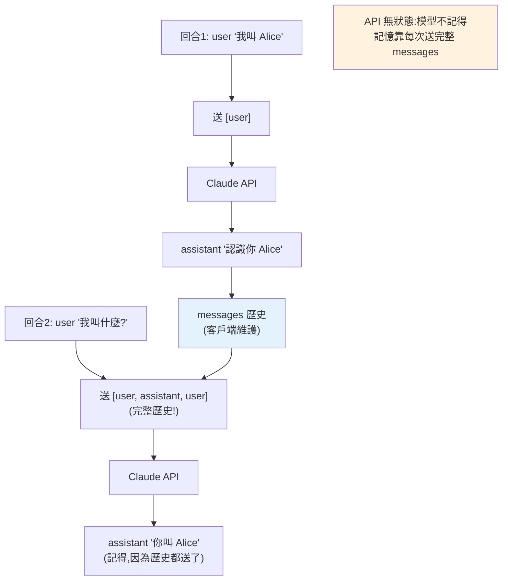

# 呼叫 LLM API(Anthropic Claude SDK)

> 理解了 [LLM 原理](01-llm-fundamentals.md),現在動手呼叫。本章用 **Anthropic 官方 Python SDK** 呼叫 **Claude**:基本請求、system prompt、多輪對話、串流、錯誤處理、token 計數與模型/成本選擇。可執行範例用 mock client(不需金鑰),真實用法以官方 SDK 程式碼示意。

## 💡 白話導讀(建議先讀)

懂了原理,這章開始**動手**——用 Anthropic 官方 Python SDK 呼叫 Claude。
第一個必須顛覆的直覺:**API 是「失憶」的**。

你以為的對話是「AI 記得我們聊過什麼」,真相是:
**每次呼叫,你都要把整段對話歷史重新送一遍**,模型才「想起」上下文。
它自己**不存任何記憶**——像一個每次見面都失憶的天才,
你得把「我們之前聊到哪」的筆記每次都遞給他。這解釋了為什麼:

- 對話越長,每次呼叫越貴(送的歷史越來越厚,token 越來越多)。
- 「記憶」是**你的程式**在管的(把歷史存起來、每次附上),不是 API 的魔法。

Messages API 的形狀也很簡單——一串對話:

```python
messages = [
    {"role": "user", "content": "你好"},
    {"role": "assistant", "content": "你好!有什麼可以幫忙?"},
    {"role": "user", "content": "解釋一下 GIL"},   # 每次把整串送出
]
```

`user` 和 `assistant` 交替,`system` prompt 另外設定(給模型的角色與規則)。

這章帶你走完:裝 SDK、設 API key(**別把金鑰寫進程式碼**——
呼應 [secrets 管理](../20-security-system-design/05-secrets-management.md))、
發第一個請求、讀回應、看 token 用量、處理錯誤與重試。
本書全程用 Claude 示範,模型預設 `claude-opus-4-8`。

## Why(為什麼)

建 AI 應用的第一步,是**可靠地呼叫 LLM**。這看似只是「發個請求」,但要做對有不少細節:

- **用官方 SDK**:Anthropic 提供 `anthropic` 套件,處理認證、重試、串流、型別——別自己拼 HTTP。
- **API 是無狀態的**:LLM 不記得上一次對話,**每次都要送完整歷史**——多輪對話要自己管理訊息序列。
- **回應是結構化的**:`content` 是一串 block(text、tool_use、thinking…),不是單一字串——要正確解析。
- **要處理錯誤與限流**:網路會失敗、會被 rate limit,SDK 有型別化例外與自動重試。
- **選對模型**:Claude 有 Opus(最強)、Sonnet(均衡)、Haiku(最快最省)——**成本差數倍**,依任務選。

這章教你把這些做對,是後面所有 AI 應用([prompt engineering](03-prompt-engineering.md)、[tool use](04-structured-output-tools.md)、[RAG](../29-ai-applications/README.md))的基礎。範例的真實 Claude 呼叫以官方 SDK 程式碼呈現;可執行/可測試的部分用 **mock client**(模擬 SDK 介面,不需金鑰或網路),讓你先掌握結構。

## Theory(理論:Messages API 的形狀)

Anthropic 的核心是 **Messages API**——一個端點 `client.messages.create(...)`,涵蓋對話、tool use、結構化輸出。關鍵概念:

- **messages 是一串 `{"role": ..., "content": ...}`**:`role` 是 `"user"` 或 `"assistant"`,交替出現(第一則須為 user)。**API 無狀態——你每次呼叫都送整串歷史**,模型才「記得」對話。
- **system prompt**:獨立的 `system` 參數,設定模型的角色/行為(不放進 messages,見 [prompt engineering](03-prompt-engineering.md))。
- **回應 `content` 是 block 陣列**:每個 block 有 `type`(`"text"`、`"tool_use"`、`"thinking"`…)。要取文字得遍歷找 `type == "text"` 的 block 讀 `.text`——**別假設 `content[0].text`**。
- **`stop_reason`**:模型為何停止——`"end_turn"`(自然結束)、`"max_tokens"`(達上限,輸出被截斷)、`"tool_use"`(要呼叫工具,見 [tool use](04-structured-output-tools.md))、`"refusal"`(安全拒絕)。
- **`usage`**:`input_tokens` / `output_tokens`——用於算[成本](08-cost-latency-caching.md)。

**認證**:SDK 從環境變數 `ANTHROPIC_API_KEY` 讀金鑰(別寫死在程式,見 [密鑰管理](../20-security-system-design/05-secrets-management.md))。`client = anthropic.Anthropic()` 自動抓。

## Specification(規範:官方 SDK 用法)

**安裝與基本請求**(`pip install anthropic`):

```python
import anthropic

client = anthropic.Anthropic()  # 從 ANTHROPIC_API_KEY 讀金鑰,別寫死

response = client.messages.create(
    model="claude-opus-4-8",           # 預設用最強的 Opus 4.8
    max_tokens=1024,                    # 輸出上限(必填)
    system="你是友善的 Python 助教。",   # system prompt(可選)
    messages=[
        {"role": "user", "content": "什麼是 list comprehension?"},
    ],
)

# content 是 block 陣列——遍歷找 text block
for block in response.content:
    if block.type == "text":
        print(block.text)

print(response.stop_reason)                 # "end_turn"
print(response.usage.input_tokens, response.usage.output_tokens)
```

**多輪對話**(API 無狀態,送完整歷史):

```python
messages = []
def chat(user_message: str) -> str:
    messages.append({"role": "user", "content": user_message})
    resp = client.messages.create(model="claude-opus-4-8", max_tokens=1024, messages=messages)
    reply = next(b.text for b in resp.content if b.type == "text")
    messages.append({"role": "assistant", "content": reply})  # 存回歷史
    return reply
```

**錯誤處理**(用型別化例外,SDK 自動重試 429/5xx):

```python
try:
    resp = client.messages.create(...)
except anthropic.RateLimitError:
    ...   # 被限流(SDK 已自動重試數次)
except anthropic.APIStatusError as e:
    print(e.status_code, e.message)
except anthropic.APIConnectionError:
    ...   # 網路問題
```

**Token 計數**(算成本/判斷是否超限——**別用 tiktoken**):

```python
count = client.messages.count_tokens(model="claude-opus-4-8", messages=messages)
print(count.input_tokens)
```

**模型與成本**(依任務選,價格差數倍):

| 模型 | model id | 輸入 $/1M | 輸出 $/1M | 適用 |
|------|----------|-----------|-----------|------|
| Claude Opus 4.8 | `claude-opus-4-8` | $5 | $25 | 最強,複雜推理/agent(**預設**) |
| Claude Sonnet 5 | `claude-sonnet-5` | $3 | $15 | 均衡,高量產 |
| Claude Haiku 4.5 | `claude-haiku-4-5` | $1 | $5 | 最快最省,簡單任務 |

> **最新 Claude 的取樣參數**:Opus 4.8 / Sonnet 5 等**不接受 `temperature`/`top_p`/`top_k`**(傳了會 400),改用 **adaptive thinking**(`thinking={"type": "adaptive"}`)讓模型自行決定思考深度,並用 prompting 引導行為。這與[前章](01-llm-fundamentals.md)講的通用取樣原理不衝突——原理仍要懂,只是最新 API 收斂了介面。

## Implementation(底層:無狀態、block 解析、重試)

**為何「每次送完整歷史」**:Messages API 是**無狀態的**——伺服器不保存你的對話。模型要「記得」前文,唯一方式是你**把整串 messages(含過去的 user 與 assistant 訊息)重新送出**。所以多輪對話的實作就是「維護一個 messages 陣列,每輪 append user 訊息、呼叫、再 append 模型的回覆」。這也意味著:對話越長,每次送的 token 越多、成本越高——長對話要[裁剪或壓縮](08-cost-latency-caching.md)。這與 [Web 的無狀態 + session](../14-web/README.md) 是同一種思路:狀態在客戶端維護、每次帶上。

**為何 `content` 是 block 陣列而非字串**:因為一則回應可能**混合多種內容**——文字 + 工具呼叫(`tool_use`)+ 思考(`thinking`)。單一字串表達不了。所以要**遍歷 `content`、依 `block.type` 分別處理**:text block 讀 `.text`、tool_use block 讀 `.name`/`.input`(見 [tool use](04-structured-output-tools.md))。寫 `response.content[0].text` 是常見錯誤——若第一個 block 是 thinking 或 tool_use 就會出錯。

**SDK 的自動重試與型別化例外**:網路呼叫會失敗——逾時、429 限流、5xx 伺服器錯。官方 SDK **內建指數退避重試**(預設對 429/5xx/連線錯誤重試 2 次),你不必自己寫重試迴圈。它也把 HTTP 狀態映射成**型別化例外**(`RateLimitError`、`AuthenticationError`、`APIStatusError`…),讓你用 `except` 精準處理不同錯誤,而非字串比對錯誤訊息(見 [例外處理](../06-error-handling/README.md))。下面範例用 mock client 模擬這個介面,讓你在沒有金鑰時也能跑通對話流程。

## Code Example(可執行的 Python 範例)

```python
# calling_llm_api.py — 用 mock client 示範 Claude 對話流程(可執行,不需金鑰)
# 真實用法見上方的 anthropic SDK 程式碼;此處 mock 模擬其介面以便測試。
from __future__ import annotations

from dataclasses import dataclass


@dataclass
class TextBlock:
    type: str
    text: str


@dataclass
class Usage:
    input_tokens: int
    output_tokens: int


@dataclass
class Message:
    content: list[TextBlock]
    stop_reason: str
    usage: Usage
    model: str


class MockAnthropic:
    """模擬 anthropic.Anthropic() 的 messages.create 介面(教學/測試用)。"""

    def __init__(self, canned: dict[str, str] | None = None) -> None:
        self.canned = canned or {}
        self.call_count = 0

    def create(
        self, model: str, max_tokens: int, messages: list[dict[str, str]],
        system: str | None = None,
    ) -> Message:
        self.call_count += 1
        last_user = next(
            (m["content"] for m in reversed(messages) if m["role"] == "user"), ""
        )
        reply = self.canned.get(last_user, f"(mock 回覆: {last_user})")
        return Message(
            content=[TextBlock("text", reply)],
            stop_reason="end_turn",
            usage=Usage(input_tokens=len(str(messages)), output_tokens=len(reply)),
            model=model,
        )


class Conversation:
    """多輪對話:API 無狀態,每次送完整歷史。"""

    def __init__(self, client: MockAnthropic, model: str, system: str | None = None) -> None:
        self.client = client
        self.model = model
        self.system = system
        self.messages: list[dict[str, str]] = []

    def send(self, user_message: str) -> str:
        self.messages.append({"role": "user", "content": user_message})
        resp = self.client.create(
            model=self.model, max_tokens=1024, system=self.system, messages=self.messages
        )
        reply = next(b.text for b in resp.content if b.type == "text")
        self.messages.append({"role": "assistant", "content": reply})
        return reply


def main() -> None:
    client = MockAnthropic(
        canned={"我叫 Alice": "很高興認識你,Alice!", "我叫什麼名字?": "你叫 Alice。"}
    )
    conv = Conversation(client, model="claude-opus-4-8", system="你是友善的助手。")

    # 多輪對話:模型「記得」是因為每次送了完整歷史
    print("回合 1:", conv.send("我叫 Alice"))
    print("回合 2:", conv.send("我叫什麼名字?"))
    print(f"歷史訊息數: {len(conv.messages)}（2 user + 2 assistant）")
    print(f"API 呼叫次數: {client.call_count}")

    # 一次性呼叫 + 解析 content block
    resp = client.create(
        model="claude-opus-4-8", max_tokens=100,
        messages=[{"role": "user", "content": "你好"}],
    )
    text = next(b.text for b in resp.content if b.type == "text")
    print(f"\n一次性: {text} | stop={resp.stop_reason} | model={resp.model}")


if __name__ == "__main__":
    main()
```

**預期輸出**:

```pycon
$ python calling_llm_api.py
回合 1: 很高興認識你,Alice!
回合 2: 你叫 Alice。
歷史訊息數: 4（2 user + 2 assistant）
API 呼叫次數: 2
一次性: (mock 回覆: 你好) | stop=end_turn | model=claude-opus-4-8
```

逐段解說:

- **`MockAnthropic`**:模擬官方 SDK 的 `messages.create` 介面——回傳帶 `content`(block 陣列)、`stop_reason`、`usage` 的 Message。真實的 `anthropic.Anthropic()` 介面一樣,只是會實際呼叫 Claude。
- **多輪對話**:`Conversation.send` 每次 **append user 訊息 → 送完整歷史 → append 模型回覆**。第 2 回合模型能答「你叫 Alice」,**是因為第 1 回合的內容都在 messages 裡送過去了**(無狀態:記憶在客戶端維護)。
- **歷史 4 則、呼叫 2 次**:兩輪對話累積 2 user + 2 assistant = 4 則;呼叫 API 2 次(每輪一次)。對話越長,每次送的 token 越多。
- **解析 content block**:`next(b.text for b in resp.content if b.type == "text")` 正確地遍歷找 text block——**不是** `content[0].text`(第一個 block 可能是 thinking/tool_use)。
- **要點**:用官方 SDK、無狀態需送完整歷史、遍歷 content block 取文字、用 `usage` 算成本、用型別化例外處理錯誤、依任務選模型。

## Diagram(圖解:無狀態多輪對話)



## Best Practice(最佳實踐)

- **用官方 `anthropic` SDK**,別自己拼 HTTP:獲得認證、重試、串流、型別。
- **金鑰用環境變數 `ANTHROPIC_API_KEY`**,別寫死(見 [密鑰管理](../20-security-system-design/05-secrets-management.md))。
- **多輪對話送完整歷史**:API 無狀態;長對話要裁剪/壓縮控成本。
- **遍歷 `content` block 取文字**,別用 `content[0].text`:可能是 thinking/tool_use。
- **檢查 `stop_reason`**:`max_tokens` 代表被截斷,要調大 `max_tokens` 或串流。
- **用型別化例外處理錯誤**(`RateLimitError` 等),SDK 已自動重試 429/5xx。
- **算 token 用 `count_tokens`,不用 tiktoken**;用 `usage` 追蹤實際成本。
- **依任務選模型**:簡單/高量用 Haiku、均衡用 Sonnet、最難用 Opus;預設 Opus 4.8。
- **大輸出/長回應用串流**(見 [串流](05-streaming-async.md)):避免逾時。

## Common Mistakes(常見誤解)

- **把金鑰寫死在程式並 commit**:外洩;用環境變數(見 [密鑰管理](../20-security-system-design/05-secrets-management.md))。
- **以為 API 記得對話**:它無狀態;沒送歷史就「失憶」。
- **用 `response.content[0].text`**:第一個 block 可能非 text(thinking/tool_use)→ 出錯。
- **不檢查 `stop_reason`**:`max_tokens` 截斷卻以為模型話沒說完。
- **自己拼 HTTP / 自己寫重試**:重造輪子;SDK 已內建。
- **字串比對錯誤訊息**:用型別化例外。
- **在最新 Claude 傳 `temperature`**:400;已移除,用 adaptive thinking + prompting。
- **無腦全用 Opus**:簡單任務用 Haiku 省數倍成本。
- **長對話不裁剪**:每次送整串歷史,token 與成本暴增。

## Interview Notes(面試重點)

- **能說明 Messages API 的形狀**:messages 陣列(user/assistant 交替)、system 參數、content block、stop_reason、usage。
- **能解釋 API 無狀態 → 多輪對話要送完整歷史**,及其成本含意。
- **知道 `content` 是 block 陣列**,要遍歷找 text(別假設 `[0]`)。
- **知道用官方 SDK、金鑰走環境變數、型別化例外 + 自動重試**。
- **知道算 token 用 `count_tokens`(不用 tiktoken)、用 `usage` 算成本**。
- **能依任務選模型**(Opus/Sonnet/Haiku 的成本與能力取捨)。
- **知道最新 Claude 移除取樣參數、改用 adaptive thinking**。

---

➡️ 下一章:[Prompt engineering](03-prompt-engineering.md)

[⬆️ 回 Part 28 索引](README.md)
