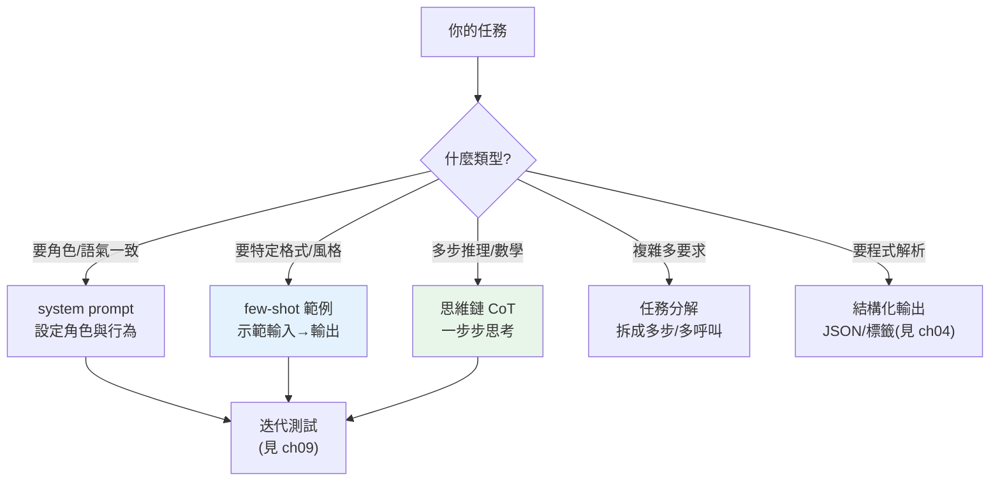

# Prompt engineering

> 同一個模型,好 prompt 和爛 prompt 的輸出天差地遠。**Prompt engineering** 是「用文字把任務講清楚、把模型的能力引導出來」的工程。這章講可靠的 prompt 技巧:清晰指令、角色(system)、few-shot 範例、思維鏈(CoT)、任務分解,以及把 prompt 當程式碼管理。

## Why(為什麼)

LLM 很強,但它**只照你給的 prompt 做事**——你講不清楚,它就猜,猜錯就給你一堆不對的輸出。同一個任務:

- 「幫我分類這則評論」→ 模型不知道分成哪些類、要什麼格式,亂答。
- 「把這則評論分類成 positive/negative/neutral,只回一個詞」→ 精準、可解析。

差別不在模型,在 **prompt 的品質**。Prompt engineering 就是系統化地把任務**講清楚、給脈絡、示範格式、引導推理**,讓模型穩定產出你要的東西。它是 AI 應用**最高槓桿**的一環——常常改幾句 prompt 就解決問題,不必碰模型或程式。

而且 prompt 不是「隨手打字」,是**要版本管理、要測試、要迭代**的工程產物(見 [prompt 測試](09-evaluation.md))。這章講可靠的技巧與心法,是 [RAG](../29-ai-applications/README.md)、[agent](../29-ai-applications/README.md) 的基礎——那些系統的核心也是精心設計的 prompt。

## Theory(理論:好 prompt 的要素)

**核心原則:把模型當成一個聰明但沒有脈絡的新同事**——它很有能力,但不知道你的具體需求、格式偏好、領域背景。你要**把這些明確告訴它**。

有效的 prompt 技巧(由基礎到進階):

- **清晰具體的指令**:講清楚要做什麼、輸出什麼格式、有什麼限制。避免模糊(「寫好一點」→「用 3 個要點,每點不超過 20 字」)。
- **角色 / system prompt**:用 system 設定模型的身分與行為(「你是資深 Python 工程師,回答簡潔、附程式碼」)——影響整個對話的語氣與專業度。
- **few-shot 範例**:給幾個「輸入 → 輸出」範例,示範你要的格式與風格。**模型從範例學**,比純文字描述更精準——尤其格式/風格難用文字說清時。
- **思維鏈(Chain-of-Thought, CoT)**:要求模型「一步步思考再回答」。對**推理任務**(數學、邏輯、多步問題)大幅提升正確率——因為它把推理過程展開,而非直接跳到答案。
- **任務分解**:複雜任務拆成多步(或多次呼叫),每步聚焦一件事——比一個 prompt 硬塞所有要求更可靠。
- **結構化輸出**:要求特定格式(JSON、清單、標籤),方便程式解析(見 [結構化輸出](04-structured-output-tools.md))。

## Specification(規範:prompt 的組成與模板)

**system vs user 的分工**:

```python
system = "你是嚴謹的技術文件審閱者,只指出事實錯誤,用繁體中文。"  # 角色/行為(穩定)
messages = [{"role": "user", "content": "審閱這段:..."}]           # 具體任務(每次變)
```

**few-shot 範例**(在 user 訊息裡或用多輪 user/assistant):

```text
把情緒分類成 positive/negative/neutral。

範例:
輸入: 這產品太棒了! → positive
輸入: 完全不推薦。 → negative
輸入: 還可以,普通。 → neutral

輸入: {待分類的文字} →
```

**思維鏈(CoT)**:

```text
問題: 一家店有 23 顆蘋果,賣掉 8 顆又進貨 15 顆,現在有幾顆?
請一步步思考,最後才給答案。
```

**prompt 模板化**——把可變部分參數化,固定部分重用:

```python
TEMPLATE = """你是{role}。
任務:{task}
限制:{constraints}

輸入:{input}"""
prompt = TEMPLATE.format(role="翻譯專家", task="翻成英文", constraints="保留專有名詞", input=text)
```

**進階技巧**:用 XML 標籤或分隔符標示區塊(`<document>...</document>`)、明確要求「只輸出 X,不要多餘的話」、給模型「不確定就說不知道」的退路(減少幻覺)。

## Implementation(底層:為何這些技巧有效)

**為何 few-shot 有效**:LLM 是[下一 token 預測器](01-llm-fundamentals.md),它從 prompt 裡的**模式**推斷「接下來該產生什麼」。給幾個「輸入 → 輸出」範例,等於在 prompt 裡建立了一個**強烈的模式**——模型看到 `輸入: X → 輸出:` 的結構,會傾向延續這個結構、產生同格式的輸出。這比用文字描述格式更有效,因為模型「看到」了具體的樣子而非抽象的規則。這也是「in-context learning(脈絡內學習)」——模型不需重新訓練,光靠 prompt 裡的範例就學會任務。

**為何 CoT(思維鏈)提升推理**:直接問「答案是多少」,模型要在**一次 token 生成**裡跳到答案——對多步推理,它沒有「空間」展開中間步驟,容易錯。要求「一步步思考」,模型會**先生成推理過程的 token**(23-8=15,15+15=30),這些中間 token 成為後續預測的**脈絡**,讓最終答案建立在展開的推理上,正確率大幅提升。本質是:**給模型更多 token 去「思考」**。(最新 Claude 的 **adaptive thinking** 把這個內建化——模型自動決定要思考多少,見 [呼叫 API](02-calling-llm-api.md)。)

**為何 system prompt 定調**:system prompt 放在整個對話**最前面、且有特殊地位**,模型把它當作貫穿全程的「行為準則」。它影響每一則回應的語氣、專業度、格式偏好——比在每則 user 訊息重複要求更有效、也更省 token。把「穩定不變的角色/規則」放 system,「每次變的具體任務」放 user,是清晰的分工。下面範例用純 Python 組裝這些 prompt 模式(不呼叫真實 API,聚焦 prompt 的**結構**)。

## Code Example(可執行的 Python 範例)

```python
# prompt_engineering.py — 組裝各種 prompt 模式(純標準庫,聚焦結構)
from __future__ import annotations


def build_system_prompt(role: str, constraints: list[str]) -> str:
    """system prompt:穩定的角色與行為準則。"""
    lines = [f"你是{role}。"]
    if constraints:
        lines.append("請遵守:")
        lines.extend(f"- {c}" for c in constraints)
    return "\n".join(lines)


def build_few_shot(task: str, examples: list[tuple[str, str]], query: str) -> str:
    """few-shot:用範例示範格式,模型從模式學(in-context learning)。"""
    parts = [task, "", "範例:"]
    for inp, out in examples:
        parts.append(f"輸入: {inp} → {out}")
    parts.append(f"\n輸入: {query} →")
    return "\n".join(parts)


def build_cot(question: str) -> str:
    """思維鏈:要求先展開推理再給答案,提升多步推理正確率。"""
    return f"問題: {question}\n請一步步思考,最後一行以「答案:」給出最終答案。"


def main() -> None:
    # 1. system prompt
    system = build_system_prompt(
        "嚴謹的程式碼審閱者", ["只指出真正的 bug", "用繁體中文", "附修正建議"]
    )
    print("=== system prompt ===")
    print(system)

    # 2. few-shot 分類
    print("\n=== few-shot 情緒分類 ===")
    prompt = build_few_shot(
        "把情緒分類成 positive/negative/neutral。",
        [("這產品太棒了!", "positive"), ("完全不推薦。", "negative"), ("還可以。", "neutral")],
        "品質不錯但有點貴。",
    )
    print(prompt)

    # 3. 思維鏈
    print("\n=== 思維鏈(CoT)===")
    print(build_cot("一家店有 23 顆蘋果,賣掉 8 顆又進貨 15 顆,現在有幾顆?"))


if __name__ == "__main__":
    main()
```

**預期輸出**:

```pycon
$ python prompt_engineering.py
=== system prompt ===
你是嚴謹的程式碼審閱者。
請遵守:
- 只指出真正的 bug
- 用繁體中文
- 附修正建議

=== few-shot 情緒分類 ===
把情緒分類成 positive/negative/neutral。

範例:
輸入: 這產品太棒了! → positive
輸入: 完全不推薦。 → negative
輸入: 還可以。 → neutral

輸入: 品質不錯但有點貴。 →

=== 思維鏈(CoT)===
問題: 一家店有 23 顆蘋果,賣掉 8 顆又進貨 15 顆,現在有幾顆?
請一步步思考,最後一行以「答案:」給出最終答案。
```

逐段解說:

- **system prompt**:把「角色 + 穩定的行為準則」組成 system——貫穿整個對話,不必每則 user 訊息重複。
- **few-shot**:提供 3 個「輸入 → 輸出」範例,建立明確的**格式模式**(`輸入: X → 標籤`)。模型看到這個模式,會傾向對新輸入(「品質不錯但有點貴」)產生同格式的單詞標籤——這是 in-context learning。
- **CoT**:要求「一步步思考,最後才給答案」——模型會先生成推理(23-8=15, 15+15=30)再給答案,對多步問題正確率遠高於直接問答案。
- **要點**:清晰指令 + system 定調 + few-shot 示範格式 + CoT 引導推理 + 模板化重用。這些是純文字工程,槓桿極高。真實使用時把這些 prompt 送進 [Claude API](02-calling-llm-api.md)。

## Diagram(圖解:prompt 技巧與適用)



## Best Practice(最佳實踐)

- **指令清晰具體**:講明做什麼、輸出格式、限制;避免模糊。
- **穩定角色/規則放 system、具體任務放 user**:分工清楚、省重複。
- **格式/風格難描述時用 few-shot**:給範例比文字更精準。
- **推理任務用 CoT**(或最新 Claude 的 adaptive thinking):展開思考提升正確率。
- **複雜任務分解**:拆成聚焦的多步,勝過一個 prompt 塞所有要求。
- **要求結構化輸出**方便解析(見 [tool use](04-structured-output-tools.md))。
- **給「不知道就說不知道」的退路**:減少幻覺。
- **prompt 當程式碼:版本管理、測試、迭代**(見 [prompt 測試](09-evaluation.md))。
- **用分隔符/XML 標籤區隔區塊**(文件、指令、輸入),減少混淆。

## Common Mistakes(常見誤解)

- **prompt 模糊**:「寫好一點」模型不知標準;給具體可衡量的要求。
- **期待模型讀心**:它不知道你的脈絡/格式偏好,要明講。
- **推理任務不用 CoT**:直接問答案,多步推理易錯。
- **格式靠文字硬描述**:難的格式用 few-shot 示範更有效。
- **一個 prompt 塞太多要求**:模型顧此失彼;分解。
- **prompt 隨手改、不測試**:改壞了不知道;要有[評估](09-evaluation.md)。
- **忽略 system prompt**:把角色/規則塞進每則 user 訊息,重複又不穩。
- **不給幻覺退路**:模型硬編答案;允許它說不確定。

## Interview Notes(面試重點)

- **能列有效 prompt 技巧**:清晰指令、system 角色、few-shot、CoT、任務分解、結構化輸出。
- **能解釋 few-shot 為何有效**(in-context learning:從 prompt 的模式學)。
- **能解釋 CoT 為何提升推理**(展開中間步驟成為後續脈絡;本質是給模型更多思考 token)。
- **知道 system vs user 的分工**(穩定角色 vs 具體任務)。
- **知道 prompt 是要版本管理與測試的工程產物**(見 [評估](09-evaluation.md))。
- **知道最新 Claude 的 adaptive thinking 把 CoT 內建化**。
- **強調 prompt engineering 是 AI 應用最高槓桿的一環**。

---

➡️ 下一章:[結構化輸出與 function calling / tool use](04-structured-output-tools.md)

[⬆️ 回 Part 28 索引](README.md)
