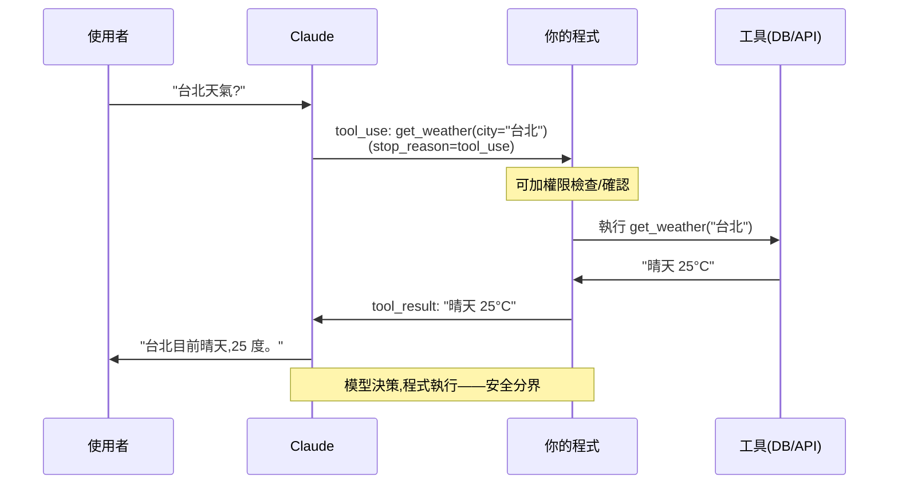

# 結構化輸出與 function calling / tool use

> LLM 預設回自然語言,但你的程式需要**結構化資料**(JSON)或**執行動作**(查資料庫、呼叫 API)。**結構化輸出**讓模型回符合 schema 的 JSON;**tool use(function calling)** 讓模型呼叫你定義的工具。這兩者把「會聊天的模型」變成「能整合進系統、能動手做事的元件」。

## Why(為什麼)

純聊天的 LLM 用途有限。要把它整合進**真實系統**,你需要兩種能力:

- **結構化輸出**:模型回的是自然語言(「這位客戶叫 Alice,想要企業方案」),但你的程式要的是 `{"name": "Alice", "plan": "enterprise"}`。要可靠地**解析**模型輸出,就得讓它回**符合你定義的 schema 的 JSON**——而不是自己用正規式硬拆自然語言(易碎)。

- **tool use / function calling**:LLM 本身**不能查即時資料、不能執行動作**(它的知識有截止日,也碰不到你的資料庫)。tool use 讓你**定義工具**(如 `get_weather(city)`、`search_orders(user_id)`),模型在需要時**回一個「我要呼叫這個工具、參數是這些」的請求**,你的程式執行後把結果回給它,它再據此回答。這是 LLM 連接真實世界的橋樑——也是 [agent](../29-ai-applications/README.md) 的基礎。

有了這兩者,LLM 從「文字產生器」變成「**能輸出結構化資料、能驅動動作**的系統元件」。這章講它們的機制與 Claude 的做法。

## Theory(理論:結構化輸出與 tool use 的機制)

**結構化輸出(structured output)**:你提供一個 **JSON schema**(描述要什麼欄位、什麼型別),要求模型回**嚴格符合**該 schema 的 JSON。好處:輸出**保證可解析**、型別正確,程式能直接用。用途:資訊抽取、分類、把非結構化文字轉成結構化資料。

**Tool use / function calling**:機制是一個**多步循環**:

1. 你在請求裡**定義工具**——每個工具有 `name`、`description`、`input_schema`(參數的 JSON schema)。
2. 模型判斷需要某工具時,**不直接回答**,而是回一個 **`tool_use` block**(含工具名 + 參數),`stop_reason` 為 `"tool_use"`。
3. **你的程式執行那個工具**(查 DB、呼叫 API…),把結果包成 **`tool_result`** 送回。
4. 模型收到結果,產生最終的自然語言回答(或再呼叫別的工具)。

**關鍵認知:模型不執行工具,只「決定要呼叫哪個、給什麼參數」——實際執行是你的程式**。這是安全與控制的分界:模型建議動作,你決定要不要做、怎麼做(可加權限檢查、確認,見 [授權](../20-security-system-design/03-authn-authz.md))。

**description 是關鍵**:模型靠工具的 `description` 決定何時用、怎麼用——寫清楚「這個工具做什麼、何時該呼叫」(見 [prompt engineering](03-prompt-engineering.md))。

## Specification(規範:Claude 的 tool use 與結構化輸出)

**定義工具並處理 tool_use**(官方 SDK):

```python
import anthropic

client = anthropic.Anthropic()

tools = [{
    "name": "get_weather",
    "description": "查詢某城市的目前天氣。當使用者問天氣時呼叫。",
    "input_schema": {
        "type": "object",
        "properties": {"city": {"type": "string", "description": "城市名"}},
        "required": ["city"],
    },
}]

response = client.messages.create(
    model="claude-opus-4-8", max_tokens=1024, tools=tools,
    messages=[{"role": "user", "content": "台北天氣如何?"}],
)

if response.stop_reason == "tool_use":
    for block in response.content:
        if block.type == "tool_use":
            result = execute_tool(block.name, block.input)   # 你的程式執行
            # 把結果送回,模型據此回答
            followup = client.messages.create(
                model="claude-opus-4-8", max_tokens=1024, tools=tools,
                messages=[
                    {"role": "user", "content": "台北天氣如何?"},
                    {"role": "assistant", "content": response.content},
                    {"role": "user", "content": [{
                        "type": "tool_result", "tool_use_id": block.id, "content": result,
                    }]},
                ],
            )
```

**SDK 的 tool runner(beta)** 自動處理這個循環——用 `@beta_tool` 裝飾器定義工具、`client.beta.messages.tool_runner(...)` 自動呼叫工具並回饋,直到完成。

**結構化輸出**(Claude 的 `messages.parse` + pydantic,見 [pydantic](../14-web/06-pydantic-validation.md)):

```python
from pydantic import BaseModel

class Contact(BaseModel):
    name: str
    email: str
    plan: str

response = client.messages.parse(
    model="claude-opus-4-8", max_tokens=1024,
    messages=[{"role": "user", "content": "抽取:Alice (alice@co.com) 想要企業方案"}],
    output_format=Contact,
)
contact = response.parsed_output   # 已驗證的 Contact 實例
```

**strict tool use**:工具定義加 `"strict": True` + `additionalProperties: false`,保證參數嚴格符合 schema。

## Implementation(底層:tool use 的循環與安全)

**tool use 為何是「模型建議、你執行」**:LLM 是文字模型,它**沒有能力**真的去查資料庫或打 API——它能做的只是**產生文字**。tool use 的巧妙在於:把「我要呼叫 get_weather('台北')」表達成一段**結構化文字**(tool_use block),你的程式解析這段文字、**實際執行**、把結果(也是文字)送回。所以整個循環裡,模型只負責「決定叫什麼、給什麼參數」和「解讀結果、產生回答」,**真正的動作在你的程式**。這個分界至關重要:

- **安全**:模型可能被 [prompt injection](../20-security-system-design/07-owasp-xss-csrf.md) 誘導呼叫危險工具。因為執行在你手上,你可以**加權限檢查、參數驗證、人工確認**(尤其是有副作用的操作:刪除、付款、寄信)。**別無條件執行模型要求的任何工具**。
- **控制**:你決定工具真正做什麼、回什麼——模型只看到你給的結果。

**為何結構化輸出比「叫模型回 JSON 再自己 parse」可靠**:你當然可以在 prompt 裡說「請回 JSON」,但模型可能**多加解釋文字、格式跑掉、欄位漏掉**,你的 `json.loads` 就炸了。結構化輸出(schema 約束 / `messages.parse`)在**生成層面**約束輸出符合 schema、並自動驗證——保證你拿到的是合法、型別正確的結構,不必寫脆弱的解析。這和 [pydantic 驗證](../14-web/06-pydantic-validation.md) 的精神一致:用 schema 當契約。

下面範例用純 Python 模擬 tool use 的完整循環(工具註冊 + 模型決策 + 執行 + 回饋),讓你掌握這個核心模式(真實用 Claude API 的 tools 參數)。

## Code Example(可執行的 Python 範例)

```python
# tool_use.py — tool use 循環的核心邏輯(純標準庫,模擬模型決策)
from __future__ import annotations

from collections.abc import Callable
from dataclasses import dataclass


@dataclass
class ToolCall:
    name: str
    args: dict[str, object]


class ToolRegistry:
    """註冊工具:name → (執行函式, description)。模型靠 description 決定何時用。"""

    def __init__(self) -> None:
        self._tools: dict[str, Callable[..., str]] = {}

    def register(self, name: str, func: Callable[..., str]) -> None:
        self._tools[name] = func

    def execute(self, call: ToolCall) -> str:
        """你的程式執行工具(可在此加權限檢查、驗證)。"""
        if call.name not in self._tools:
            return f"錯誤:未知工具 {call.name}"
        return self._tools[call.name](**call.args)


def run_with_tools(user_query: str, model_decision: ToolCall | None, registry: ToolRegistry) -> str:
    """模擬 tool use 循環:模型決定呼叫工具 → 程式執行 → 模型據結果回答。"""
    if model_decision is None:
        return f"(直接回答,不需工具)關於「{user_query}」的一般回覆"
    # 模型回了 tool_use → 你的程式執行
    tool_result = registry.execute(model_decision)
    # 模型收到結果,產生最終回答(此處模擬)
    return f"根據工具結果「{tool_result}」,回答:{user_query}"


def main() -> None:
    registry = ToolRegistry()
    registry.register("get_weather", lambda city: f"{city} 晴天 25°C")
    registry.register("get_order", lambda order_id: f"訂單 {order_id}:已出貨")

    # 情境 1:問天氣 → 模型決定呼叫 get_weather
    print("問天氣:")
    decision = ToolCall("get_weather", {"city": "台北"})
    print(f"  模型決定呼叫: {decision.name}({decision.args})")
    print(f"  → {run_with_tools('台北天氣?', decision, registry)}")

    # 情境 2:查訂單 → 呼叫 get_order
    print("\n查訂單:")
    decision = ToolCall("get_order", {"order_id": "A123"})
    print(f"  模型決定呼叫: {decision.name}({decision.args})")
    print(f"  → {run_with_tools('訂單 A123 狀態?', decision, registry)}")

    # 情境 3:一般問題 → 不需工具,直接回答
    print("\n一般問題:")
    print(f"  → {run_with_tools('什麼是 Python?', None, registry)}")

    # 安全:模型不該執行的工具(未註冊)被擋
    print("\n未知工具:")
    print(f"  → {registry.execute(ToolCall('delete_all', {}))}")


if __name__ == "__main__":
    main()
```

**預期輸出**:

```pycon
$ python tool_use.py
問天氣:
  模型決定呼叫: get_weather({'city': '台北'})
  → 根據工具結果「台北 晴天 25°C」,回答:台北天氣?

查訂單:
  模型決定呼叫: get_order({'order_id': 'A123'})
  → 根據工具結果「訂單 A123:已出貨」,回答:訂單 A123 狀態?

一般問題:
  → (直接回答,不需工具)關於「什麼是 Python?」的一般回覆

未知工具:
  → 錯誤:未知工具 delete_all
```

逐段解說:

- **`ToolRegistry`**:註冊工具(name → 執行函式)。真實系統中每個工具還有 `description` + `input_schema` 給模型看。**`execute` 是你的程式執行的地方**——可在此加權限檢查、參數驗證。
- **問天氣 → tool_use**:模型判斷需要天氣資料,回一個 `ToolCall("get_weather", {"city": "台北"})`(真實是 tool_use block)。你的程式執行 → 得「台北 晴天 25°C」→ 模型據此回答。這就是 tool use 循環:**模型決策 → 程式執行 → 模型據結果回答**。
- **一般問題 → 不需工具**:模型判斷不需工具,直接回答(真實中 `stop_reason` 為 `end_turn`)。模型會**自己決定**何時該用工具。
- **未知工具被擋**:`execute` 對未註冊的工具回錯誤——示範「執行在你手上,可加保護」。真實中對危險工具(刪除/付款)應加確認/權限(見 [授權](../20-security-system-design/03-authn-authz.md))。
- **要點**:tool use = 定義工具 → 模型決定呼叫 → **你的程式執行** → 回饋結果 → 模型回答。結構化輸出則保證回可解析的 JSON。兩者把 LLM 接進真實系統。

## Diagram(圖解:tool use 循環)



## Best Practice(最佳實踐)

- **需要程式解析輸出時用結構化輸出**(schema / `messages.parse` + pydantic),別自己 parse 自然語言。
- **需要即時資料/執行動作時用 tool use**:定義清楚的工具 + description。
- **工具 description 寫清楚「做什麼、何時呼叫」**:模型靠它決策。
- **執行工具前加保護**:權限檢查、參數驗證、對副作用操作(刪除/付款)要確認——別無條件執行(防 [prompt injection](../20-security-system-design/07-owasp-xss-csrf.md))。
- **用 SDK 的 tool runner 自動處理循環**(beta),或手動控制以加審核關卡。
- **strict tool use / schema 保證參數合法**。
- **tool_result 要帶對應的 tool_use_id**、失敗時回 `is_error: True`。
- **工具設計小而聚焦**,別給一個萬能工具。

## Common Mistakes(常見誤解)

- **叫模型回 JSON 再自己 parse**:格式易跑掉;用結構化輸出約束。
- **無條件執行模型要求的任何工具**:prompt injection 可誘導呼叫危險工具;要加保護。
- **工具 description 含糊**:模型不知何時/如何用,亂呼叫或不呼叫。
- **忘了 tool use 是多步循環**:回了 tool_use 卻沒執行 + 回饋,對話卡住。
- **`tool_result` 沒帶 `tool_use_id`**:對不上,報錯。
- **以為模型自己會執行工具**:它只建議,執行在你程式。
- **給模型過多工具**:選擇困難、易錯;聚焦必要的。
- **副作用操作不加確認**:模型誤呼叫 → 刪錯資料/亂扣款。

## Interview Notes(面試重點)

- **能區分結構化輸出(回可解析 JSON)與 tool use(呼叫工具執行動作)**。
- **能描述 tool use 的多步循環**:定義工具 → 模型回 tool_use → 程式執行 → tool_result 回饋 → 模型回答。
- **能強調「模型建議、程式執行」的安全分界**,及對副作用操作加保護(防 prompt injection)。
- **知道工具 description 是模型決策的依據**。
- **知道結構化輸出比「prompt 要 JSON 再 parse」可靠**(schema 約束 + 驗證)。
- **知道 Claude 的 tools 參數、`messages.parse`、tool runner、strict**。
- **知道 tool use 是 agent 的基礎**(見 [AI 應用](../29-ai-applications/README.md))。

---

➡️ 下一章:[串流與非同步回應](05-streaming-async.md)

[⬆️ 回 Part 28 索引](README.md)
