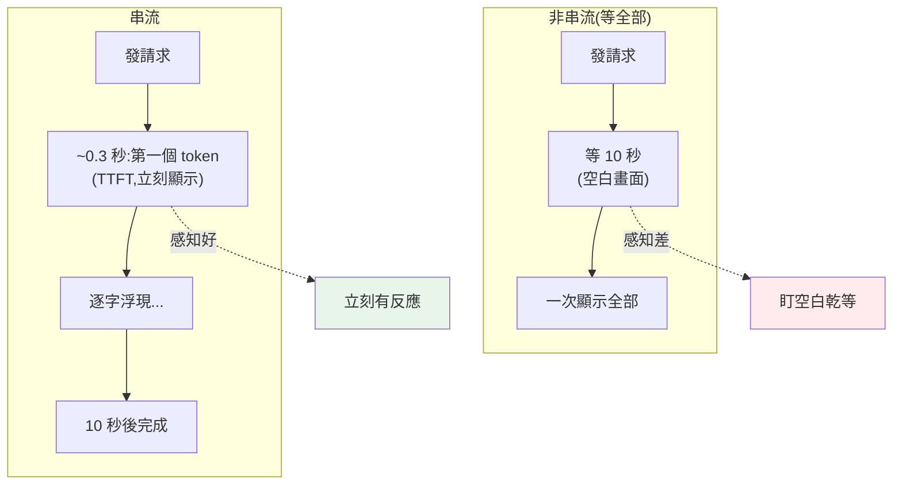

# 串流與非同步回應

> LLM 產生一段長回應可能要好幾秒。若等它全部生成完才顯示,使用者盯著空白畫面乾等——體驗很差,還可能逾時。**串流(streaming)** 讓 token 一產生就即時吐出,像 ChatGPT 那樣逐字浮現。搭配 **asyncio**,一個服務還能同時處理大量並發的 LLM 請求。這章講串流與非同步的原理與做法。

## Why(為什麼)

LLM 是[逐 token 生成](01-llm-fundamentals.md)的,一段 500 token 的回應可能要 5–10 秒才生成完。兩種取用方式:

- **非串流(等全部)**:發請求 → 等模型生成完整回應 → 一次拿到。使用者**盯著空白等 10 秒**才看到東西——體驗差,且大 `max_tokens` 的請求容易**逾時**(連線閒置太久被切斷)。
- **串流(streaming)**:模型**每產生一個 token 就即時傳給你**,你邊收邊顯示——使用者**立刻看到文字開始浮現**(像 ChatGPT 打字效果),感知延遲大減。這是 LLM 應用的**標準體驗**。

串流解決的關鍵指標是 **TTFT(Time To First Token,首 token 時間)**——從發請求到看到**第一個字**的時間。串流讓 TTFT 很短(第一個 token 一生成就顯示),即使**總生成時間**沒變,使用者的**感知**快得多。

另一面是**並發**:一個 AI 服務要同時服務很多使用者,每個請求都在等 LLM(I/O-bound)。用 **asyncio**(見 [asyncio](../09-concurrency/README.md)、[非同步效能](../18-performance/07-async-performance.md)),單一行程就能**並發處理成百上千個 LLM 請求**——等一個回應時去處理別的,不必一個個排隊。這章講串流與非同步這兩個 LLM 應用的必備技術。

## Theory(理論:串流與非同步)

**串流的機制**:LLM API 支援 **Server-Sent Events(SSE)** 之類的串流傳輸——伺服器不等生成完,而是**邊生成邊送出一連串事件**:

- `message_start`:回應開始的中繼資料。
- `content_block_delta`:每個 token/文字塊(delta)——**這是你要即時顯示的**。
- `message_delta` / `message_stop`:結束,含 `stop_reason`、`usage`。

你的程式**迭代這些事件**,把每個 text delta 即時輸出(印到終端、推給前端 WebSocket)。

**為何串流也防逾時**:非串流的大請求,連線可能**閒置**很久(等生成)→ 被 HTTP 逾時切斷。串流下連線**持續有資料流動**(一直在收 delta),不會閒置逾時。所以**大 `max_tokens` 的請求應該串流**。

**非同步(asyncio)的角色**:LLM 呼叫是 **I/O-bound**(大部分時間在等模型/網路,見 [I/O vs CPU bound](../18-performance/07-async-performance.md))。用 `async`/`await`,一個請求在等回應時,事件迴圈去處理**別的請求**——單執行緒並發處理大量 LLM 呼叫,不必一連線一執行緒。串流 + async 是天生一對:`async for` 迭代串流事件,同時服務多個並發的串流對話。

## Specification(規範:Claude 的串流與非同步)

**串流**(官方 SDK,`messages.stream`):

```python
with client.messages.stream(
    model="claude-opus-4-8", max_tokens=1024,
    messages=[{"role": "user", "content": "寫一個故事"}],
) as stream:
    for text in stream.text_stream:      # 逐塊即時吐出
        print(text, end="", flush=True)  # flush 讓每塊立刻顯示
    final = stream.get_final_message()   # 串流完後拿完整訊息(含 usage)
```

**非同步串流**(`AsyncAnthropic`,並發服務多請求):

```python
async_client = anthropic.AsyncAnthropic()

async def stream_reply(prompt: str) -> None:
    async with async_client.messages.stream(
        model="claude-opus-4-8", max_tokens=1024,
        messages=[{"role": "user", "content": prompt}],
    ) as stream:
        async for text in stream.text_stream:
            ...   # 推給前端/WebSocket

# 並發服務多個對話
await asyncio.gather(stream_reply("問題1"), stream_reply("問題2"), ...)
```

**串流事件的細節**:低階可迭代 `stream` 拿到 `content_block_delta`(text_delta / thinking_delta)、`message_delta`(usage)等事件,精細控制;`stream.text_stream` 是方便的高階「只給文字」迭代器。

**最佳做法**:官方 SDK 建議**大 `max_tokens`(如 >16K 非串流會拋錯)一律串流**;用 `get_final_message()` 拿完整結果即使串流也能取得 usage。

## Implementation(底層:TTFT、SSE、async 並發)

**TTFT 為何是體驗關鍵**:使用者對延遲的**感知**主要看「多久看到第一個字」,而非「多久全部完成」。非串流下 TTFT = 總生成時間(等全部才顯示)——10 秒空白。串流下 TTFT = 生成第一個 token 的時間(通常幾百毫秒)——**幾乎立刻**看到文字浮現,即使總時間一樣。這就是為何 ChatGPT 感覺「反應很快」——它從第一個 token 就開始顯示。串流不縮短總時間,但把**感知延遲**從「總時間」變成「首 token 時間」,體驗質變。

**SSE 串流如何運作**:伺服器保持連線開啟,隨著模型生成 token,**逐步推送**一連串事件(SSE 格式)。你的 SDK 把這些事件解析成可迭代的物件(`content_block_delta` 等)。因為連線**持續有資料**,不會因閒置而逾時——這也是大請求該串流的原因。你邊收 delta 邊處理(印出、推前端),不必等全部。

**async 為何適合 LLM 服務**:一個 LLM 請求 5–10 秒大部分在**等**(模型生成 + 網路),CPU 幾乎閒著。同步下,一個請求佔住一個執行緒等 10 秒,並發 100 個要 100 執行緒(重)。async 下,一個請求 `await` 時**讓出事件迴圈**去處理別的請求——單執行緒並發成百上千個等待中的 LLM 呼叫,記憶體開銷小得多(見 [非同步效能](../18-performance/07-async-performance.md))。但注意 async 裡別做**阻塞**或 CPU 密集的事,會卡死事件迴圈。下面範例用 asyncio 模擬串流(async generator 逐塊產出)+ 並發多串流。

## Code Example(可執行的 Python 範例)

```python
# streaming_async.py — 模擬 LLM 串流與並發(asyncio,可執行)
from __future__ import annotations

import asyncio
from collections.abc import AsyncIterator


async def stream_tokens(reply: str) -> AsyncIterator[str]:
    """async generator:逐塊 yield,模擬 LLM 串流。真實用 client.messages.stream。"""
    for chunk in reply.split():
        await asyncio.sleep(0.001)  # 模擬每塊生成的微小延遲
        yield chunk + " "


async def collect_stream(name: str, reply: str) -> str:
    """收一個串流,累積成完整回應(邊收邊可即時顯示)。"""
    first_chunk_seen = False
    parts: list[str] = []
    async for chunk in stream_tokens(reply):
        if not first_chunk_seen:
            first_chunk_seen = True  # 這就是 TTFT 時刻:第一塊立刻可顯示
        parts.append(chunk)
    return f"[{name}] {''.join(parts).strip()}"


async def main() -> None:
    # 單一串流:逐塊到達
    print("單一串流(逐塊):")
    parts: list[str] = []
    async for chunk in stream_tokens("Hello streaming world"):
        parts.append(chunk)
        print(f"  收到塊: {chunk!r}  (累積: {''.join(parts).strip()!r})")

    # 並發多個串流:一個服務同時處理多個對話(I/O-bound → async 並發)
    print("\n並發 3 個串流對話:")
    results = await asyncio.gather(
        collect_stream("對話A", "回答第一個問題"),
        collect_stream("對話B", "回答第二個問題"),
        collect_stream("對話C", "回答第三個問題"),
    )
    for r in results:
        print(f"  {r}")


if __name__ == "__main__":
    asyncio.run(main())
```

**預期輸出**:

```pycon
$ python streaming_async.py
單一串流(逐塊):
  收到塊: 'Hello '  (累積: 'Hello')
  收到塊: 'streaming '  (累積: 'Hello streaming')
  收到塊: 'world '  (累積: 'Hello streaming world')

並發 3 個串流對話:
  [對話A] 回答第一個問題
  [對話B] 回答第二個問題
  [對話C] 回答第三個問題
```

逐段解說:

- **`stream_tokens`(async generator)**:逐塊 `yield`,模擬 LLM 一個個吐出 token(每塊間微小 `await asyncio.sleep`)。真實中這是 `client.messages.stream` 的 `text_stream`。
- **單一串流逐塊到達**:每收到一塊就能**即時顯示**(累積更新)——使用者看到文字逐漸浮現,而非等全部。第一塊到達的時刻就是 **TTFT**——串流讓它很短。
- **並發 3 個串流**:`asyncio.gather` 同時跑 3 個串流對話。因為 LLM 呼叫是 I/O-bound(大部分在等),async 讓單執行緒**並發**處理——3 個對話交錯進行,不必排隊。真實服務靠這個同時服務大量使用者。
- **要點**:串流讓 token 即時吐出(短 TTFT、防逾時、好體驗);async 讓一個服務並發處理大量 I/O-bound 的 LLM 請求。兩者是 LLM 應用的標準配置。

## Diagram(圖解:串流 vs 非串流的 TTFT)



## Best Practice(最佳實踐)

- **面向使用者的回應一律串流**:短 TTFT、好體驗(逐字浮現)。
- **大 `max_tokens` 一定串流**:避免連線閒置逾時(官方 SDK 對過大非串流請求會拋錯)。
- **串流時 `flush=True` / 即時推前端**:讓每塊立刻顯示,別緩衝。
- **用 `get_final_message()` 取完整結果**:即使串流也能拿 usage/stop_reason。
- **服務多並發用 `AsyncAnthropic` + asyncio**:單執行緒並發大量 I/O-bound 請求。
- **async 裡別做阻塞/CPU 密集操作**:會卡死事件迴圈(見 [非同步效能](../18-performance/07-async-performance.md));重活丟執行緒/行程。
- **前端用 WebSocket/SSE 推串流**(見 [WebSocket](../14-web/13-websocket.md)):把 delta 即時送到瀏覽器。
- **處理串流中斷**:網路斷了要能重連/降級。

## Common Mistakes(常見誤解)

- **面向使用者卻用非串流**:盯 10 秒空白,體驗差。
- **大請求不串流**:連線閒置逾時被切斷。
- **串流時緩衝到最後才顯示**:失去串流的意義;要邊收邊顯示。
- **在 async 裡呼叫同步阻塞的 LLM client**:卡死事件迴圈;用 AsyncAnthropic。
- **async 裡跑 CPU 密集(如本地 embedding 大量運算)**:卡住迴圈;丟執行緒/行程。
- **以為串流縮短了總生成時間**:沒有;它縮短的是**感知延遲**(TTFT)。
- **不處理串流結束的 usage**:漏了成本追蹤;用 `get_final_message`。
- **一連線一執行緒服務並發 LLM**:重;用 async 單執行緒並發。

## Interview Notes(面試重點)

- **能解釋串流解決什麼**:短 TTFT(感知延遲)、逐字浮現體驗、防大請求逾時。
- **能區分 TTFT 與總生成時間**:串流縮短前者(感知),不改後者。
- **能說明串流機制**(SSE、逐 delta 事件)與「連線持續有資料 → 不閒置逾時」。
- **能解釋為何 async 適合 LLM 服務**:I/O-bound、單執行緒並發大量等待中的請求。
- **知道 async 裡不能做阻塞/CPU 密集**(卡死事件迴圈)。
- **知道 Claude 的 `messages.stream` / `AsyncAnthropic` / `text_stream` / `get_final_message`**。
- **能連結 WebSocket 把串流推前端**。

---

➡️ 下一章:[Embeddings 與語意搜尋](06-embeddings-semantic-search.md)

[⬆️ 回 Part 28 索引](README.md)
