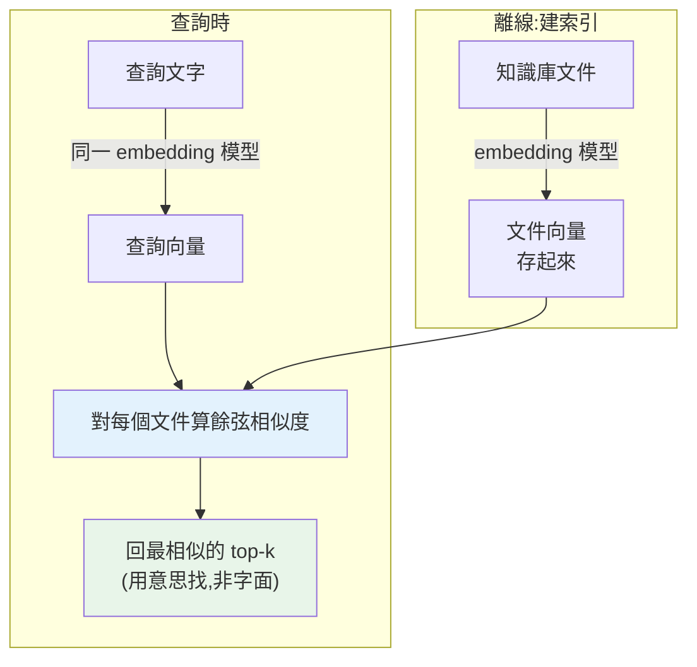

# Embeddings 與語意搜尋

> 關鍵字搜尋只能找「字面相同」的:搜「狗」找不到「犬」。**Embedding(嵌入)** 把文字轉成一個能捕捉**語意**的向量,讓「意思相近」的文字在向量空間裡靠得近——於是你能做**語意搜尋**:用意思找,而非字面。這是 RAG、推薦、語意去重的核心技術。這章講 embedding 與向量相似度。

## 💡 白話導讀(建議先讀)

關鍵字搜尋很笨:搜「狗」找不到「犬」,搜「怎麼退款」找不到寫著「退貨流程」的文件——
因為它只比對**字面**,不懂**意思**。**Embedding(嵌入)** 就是教電腦「懂意思」的技術。

核心概念一句話:**把每段文字變成一個座標(向量),意思越近的,座標離越近。**

想像一張巨大的「語意地圖」:
「狗」和「犬」幾乎疊在一起、「貓」在附近、「汽車」在很遠的另一區。
Embedding 模型就是把任意文字**放到這張地圖上的定位器**。
於是「找意思相近的文件」變成了「**找地圖上距離最近的點**」——
數學上用**餘弦相似度**量兩個向量的夾角,夾角越小、意思越近。

這張地圖神奇到能做**語意的算術**,經典例子:
`國王 − 男人 + 女人 ≈ 皇后`——向量捕捉到了「性別」這個方向。
它怎麼學會的?靠「**近朱者赤**」假說:
常出現在相似上下文的詞,就給相近的座標。

有了它,一整類應用就解鎖了:**語意搜尋**(用意思找,不用關鍵字)、
**推薦**(找相似的商品/文章)、**分類/去重**、
以及最重要的——**RAG 的地基**:
把公司文件全放上語意地圖,使用者一問問題,
就找出「意思最相關」的段落餵給 LLM 回答([Part 29](../29-ai-applications/README.md) 的主角)。
這章教你用 embedding API 把文字向量化、算相似度、做一個迷你語意搜尋。

## Why(為什麼)

傳統的關鍵字搜尋(見 [索引](../15-database/21-indexing.md))比對**字面**:搜「如何加速 Python」,只找含這些字的文件——但一篇講「Python 效能優化」的完美文章,因為用詞不同就漏掉了。它不懂**同義、改寫、語意相近**。

**Embedding** 解決這點:用一個 embedding 模型把每段文字轉成一個**高維向量**(如 1536 維),這個向量**捕捉文字的語意**。神奇之處是——**語意相近的文字,向量也相近**:「狗」和「犬」的向量很近、「Python 效能」和「如何加速 Python」很近,即使字面不同。

於是你能做**語意搜尋(semantic search)**:把查詢也轉成向量,找**向量最接近**的文件——用**意思**找,而非字面。這是一整類應用的基礎:

- **RAG(檢索增強生成)**:從知識庫語意檢索相關片段,餵給 LLM 回答(見 [AI 應用](../29-ai-applications/README.md))。
- **推薦、語意去重、分群、異常偵測**:全靠「語意相近 = 向量相近」。

這章講 embedding 是什麼、如何用**向量相似度(餘弦相似度)** 做語意搜尋,是 [向量資料庫](07-vector-databases.md) 與 RAG 的前置。

## Theory(理論:向量空間與相似度)

**Embedding 是什麼**:一個把「文字 → 固定長度數值向量」的函式(由訓練好的 embedding 模型提供)。這個向量是文字在**語意空間**裡的座標。關鍵性質——**幾何距離反映語意相似**:意思越近,向量夾角越小/距離越近。

模型是怎麼學到這種性質的?訓練時讓「常出現在相似脈絡的文字」產生相近的向量(分佈假說:語意由脈絡決定)。結果是一個「意思相近則向量相近」的空間——甚至能捕捉類比關係(經典例子:`king - man + woman ≈ queen`)。

**衡量向量相似度——餘弦相似度(cosine similarity)** 最常用:

- 計算兩個向量的**夾角餘弦值**:`cos(θ) = (A · B) / (|A| |B|)`(點積除以兩者長度)。
- 範圍 **-1 到 1**:**1 = 方向完全相同(語意最相似)**、0 = 正交(無關)、-1 = 完全相反。
- 只看**方向**不看長度——所以關注「語意方向」而非文字長短。

**語意搜尋流程**:

1. **離線**:把知識庫所有文件 embed 成向量,存起來。
2. **查詢時**:把查詢 embed 成向量,計算它和所有文件向量的相似度,回**最相似的前 k 個**(top-k)。

## Specification(規範:embedding 與相似度)

**產生 embedding**(用 embedding 模型——Anthropic 生態常用 Voyage AI,或開源 sentence-transformers):

```python
# 概念:把文字轉成向量(實際 API 依供應商)
# 例:sentence-transformers(開源,本地跑)
from sentence_transformers import SentenceTransformer
model = SentenceTransformer("all-MiniLM-L6-v2")
vectors = model.encode(["Python 是程式語言", "貓是動物"])   # → numpy 陣列
```

**餘弦相似度**(用 [numpy](../17-data-science/01-numpy-basics.md)):

```python
import numpy as np

def cosine_similarity(a, b):
    a, b = np.asarray(a), np.asarray(b)
    return float(np.dot(a, b) / (np.linalg.norm(a) * np.linalg.norm(b)))
```

**語意搜尋(top-k)**:對查詢向量與每個文件向量算相似度,取最高的 k 個。

**關鍵細節**:

- **查詢與文件用同一個 embedding 模型**:不同模型的向量空間不相容,不能比。
- **向量常先正規化(normalize)** 成單位長度:正規化後,餘弦相似度 = 點積(更快,見 [向量資料庫](07-vector-databases.md))。
- **維度固定**:同一模型輸出固定維度(如 384、1536),存進[向量資料庫](07-vector-databases.md)。

## Implementation(底層:為何餘弦、為何語意相近則向量相近)

**為何用餘弦而非歐氏距離**:文字向量的「**方向**」承載語意,長度往往受文字長短等因素影響。餘弦相似度只看**夾角**(方向),忽略長度——所以一篇長文和一句話,只要**語意方向相同**,相似度就高。歐氏距離會受長度影響,對文字語意較不理想。這是為何語意搜尋幾乎都用餘弦(或正規化後的點積,等價於餘弦)。

**為何「語意相近則向量相近」能成立**:embedding 模型在海量文字上訓練,學會把「在相似脈絡出現、可互換、意思相關」的文字映射到相近的向量。這不是規則寫死的,而是從資料學出的**表示(representation)**。結果是一個連續的語意空間:同義詞靠近、相關概念成群、無關概念遠離。這讓「用意思找」變成「找最近的向量」——一個純幾何問題,可用高效的向量運算(見 [numpy 向量化](../17-data-science/02-numpy-vectorization.md))和 [向量資料庫](07-vector-databases.md) 的近似最近鄰(ANN)加速。

**語意搜尋 vs 關鍵字搜尋——互補**:語意搜尋懂意思(找到改寫、同義),但可能漏掉「精確字面匹配」(產品編號、專有名詞);關鍵字搜尋(如 BM25)精於字面但不懂語意。實務常**混合檢索(hybrid search)**:兩者都做再合併(見 [RAG](../29-ai-applications/README.md)),取長補短。下面範例用 numpy 實作餘弦相似度與語意搜尋(用固定向量模擬 embedding,聚焦相似度的計算與排序)。

## Code Example(可執行的 Python 範例)

```python
# semantic_search.py — 餘弦相似度與語意搜尋(需要 numpy;用固定向量模擬 embedding)
from __future__ import annotations

import numpy as np


def cosine_similarity(a: list[float], b: list[float]) -> float:
    """餘弦相似度:兩向量夾角餘弦,1=同向(最相似)、0=正交、-1=相反。"""
    va = np.asarray(a, dtype=np.float64)
    vb = np.asarray(b, dtype=np.float64)
    return float(np.dot(va, vb) / (np.linalg.norm(va) * np.linalg.norm(vb)))


def semantic_search(
    query_vec: list[float], docs: dict[str, list[float]], top_k: int = 3
) -> list[tuple[float, str]]:
    """對查詢向量與每個文件向量算相似度,回最相似的 top-k。"""
    scored = [(cosine_similarity(query_vec, vec), text) for text, vec in docs.items()]
    scored.sort(reverse=True)  # 相似度高→低
    return scored[:top_k]


def main() -> None:
    # 模擬 embedding:每段文字是一個向量(真實由 embedding 模型產生)
    # 前兩維偏「程式語言」語意,第三維偏「動物」語意
    docs = {
        "Python 是程式語言": [0.90, 0.10, 0.05],
        "貓是可愛的動物": [0.05, 0.10, 0.90],
        "Java 也是程式語言": [0.70, 0.30, 0.10],
    }
    query = [0.88, 0.12, 0.05]  # 語意接近「程式語言」

    print("查詢語意接近「程式語言」,各文件相似度(高→低):")
    for score, text in semantic_search(query, docs):
        print(f"  {score:.3f}  {text}")

    # 相似度的邊界值
    print(f"\n相同向量: {cosine_similarity([1, 0, 0], [1, 0, 0]):.3f}（最相似）")
    print(f"正交向量: {cosine_similarity([1, 0, 0], [0, 1, 0]):.3f}（無關）")


if __name__ == "__main__":
    main()
```

**預期輸出**:

```pycon
$ python semantic_search.py
查詢語意接近「程式語言」,各文件相似度(高→低):
  1.000  Python 是程式語言
  0.962  Java 也是程式語言
  0.125  貓是可愛的動物
```

（後面還會印出相同向量 1.000、正交向量 0.000。）

逐段解說:

- **`cosine_similarity`**:點積除以兩者長度,算夾角餘弦。1 = 方向完全相同(語意最相似)、0 = 正交(無關)。
- **語意搜尋**:查詢向量(接近「程式語言」語意)對三個文件算相似度並排序——**Python(1.000)和 Java(0.962)排前面,貓(0.125)墊底**。查詢字面上沒提「Java」,但因為**語意相近**,Java 仍被找出來。這就是語意搜尋勝過關鍵字搜尋之處:**用意思找**。
- **邊界值**:相同向量相似度 1.000、正交向量 0.000——驗證餘弦的語意。
- **要點**:embedding 把文字轉成捕捉語意的向量,餘弦相似度衡量語意接近程度,語意搜尋 = 找最相似的 top-k。真實中用 embedding 模型產生向量、存進[向量資料庫](07-vector-databases.md)加速檢索。(此處用固定向量聚焦相似度計算;真實向量是幾百維、由模型產生。)

## Diagram(圖解:語意空間與檢索)



## Best Practice(最佳實踐)

- **查詢與文件用同一個 embedding 模型**:不同模型的向量空間不相容。
- **用餘弦相似度**(或正規化後的點積)衡量語意接近:只看方向。
- **向量先正規化成單位長度**:讓點積 = 餘弦,加速大量比較(見 [向量資料庫](07-vector-databases.md))。
- **大量文件用[向量資料庫](07-vector-databases.md)**:別線性比對全部(慢);用 ANN 索引。
- **考慮混合檢索**(語意 + 關鍵字):語意懂意思、關鍵字精於精確匹配,合併取長補短。
- **文件先分塊再 embed**(見 [RAG](../29-ai-applications/README.md)):過長的文件切成語意片段。
- **快取 embedding**:同一文字別重複 embed(有成本)。
- **選對 embedding 模型**:依語言、領域、維度、成本。

## Common Mistakes(常見誤解)

- **查詢與文件用不同 embedding 模型**:向量空間不相容,相似度無意義。
- **對大量文件線性算相似度**:O(n),慢;用向量資料庫的 ANN 索引。
- **以為語意搜尋能取代關鍵字**:精確字面(產品編號)語意搜尋可能漏;用混合檢索。
- **不正規化就比較又混用度量**:餘弦/歐氏/點積要一致。
- **整份長文件 embed 成一個向量**:語意被稀釋;先分塊。
- **重複 embed 相同文字**:浪費成本;快取。
- **以為 embedding 向量人看得懂**:它是抽象的語意座標,單維無明確意義。
- **不同維度的向量硬比**:維度要一致(同模型)。

## Interview Notes(面試重點)

- **能解釋 embedding 是什麼**:文字→捕捉語意的向量,語意相近則向量相近(從資料學出的表示)。
- **能定義餘弦相似度**及範圍(-1~1),並說明為何用它(只看方向/語意,忽略長度)。
- **能描述語意搜尋流程**:離線 embed 文件、查詢 embed、算相似度、取 top-k。
- **知道語意搜尋 vs 關鍵字搜尋的互補**(意思 vs 字面),及混合檢索。
- **知道查詢與文件要用同一模型、向量要正規化、大量用向量資料庫(ANN)**。
- **知道 embedding 是 RAG、推薦、去重、分群的共同基礎**。
- **知道文件要先分塊再 embed**(RAG 的前處理)。

---

➡️ 下一章:[向量資料庫 (pgvector / Chroma / FAISS)](07-vector-databases.md)

[⬆️ 回 Part 28 索引](README.md)
