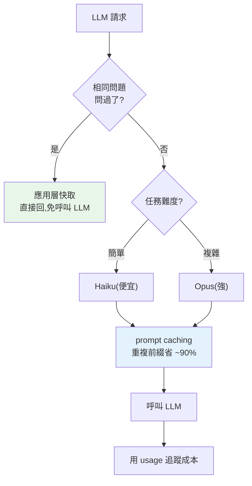

# 成本、延遲、快取與限流

> LLM 應用跑起來很容易,跑得**省錢又快**才是工程。每次呼叫都按 token 計費、都有延遲、都受 rate limit——不管理好,帳單爆炸、使用者等到不耐煩、尖峰被限流。這章講 LLM 應用的成本/延遲工程:token 計費、prompt caching、模型分流、快取與限流。

## Why(為什麼)

LLM 呼叫和一般函式呼叫不同——它**貴、慢、有配額**:

- **貴**:每次按 **token 計費**(輸入 + 輸出各有價),且不便宜。一個高流量應用,不控制成本,帳單一個月可能好幾萬美金。
- **慢**:每次呼叫幾百毫秒到幾秒——延遲直接影響使用者體驗。
- **有配額**:API 有 **rate limit**(每分鐘請求數/token 數),尖峰超過就被限流(429)。

所以 LLM 應用的工程,很大一部分是**成本與延遲的優化**:

- **算清楚成本**:每個請求花多少?哪個模型划算?
- **prompt caching**:重複的大 context(system prompt、知識庫)快取起來,省下重複處理的成本。
- **模型分流(routing)**:簡單任務用便宜的 Haiku、複雜的才用 Opus——成本差數倍。
- **應用層快取**:相同/相似的請求直接回快取,免呼叫 LLM。
- **限流與退避**:尊重 API 配額、被限流時退避重試。

這些讓 AI 應用**可負擔、夠快、穩定**。這章講清楚,是把 demo 變成生產系統的關鍵(連結 [效能優化](../18-performance/README.md)、[限流器](../20-security-system-design/11-system-design-rate-limiter.md))。

## Theory(理論:成本結構與優化槓桿)

**成本結構**:成本 = **輸入 token × 輸入單價 + 輸出 token × 輸出單價**。關鍵認知:

- **輸出比輸入貴**(Claude 通常輸出單價是輸入的 5 倍)——所以**控制輸出長度**(合理的 `max_tokens`、要求簡潔)省很多。
- **模型差數倍**:Opus 4.8 輸入 $5/輸出 $25、Sonnet 5 $3/$15、Haiku 4.5 $1/$5(每 1M token)。同一任務,選對模型省數倍。
- **長 context 貴**:塞一大堆 context(RAG 檢索、長對話歷史)每次都付整份 token 的錢。

**四大優化槓桿**:

- **Prompt caching(提示快取)**:若多個請求共用**相同的前綴**(system prompt、大文件、few-shot 範例),把這個前綴**快取在 API 端**——第一次全價「寫入」快取(~1.25×),之後「讀取」只要 **~0.1× 成本**。重複的大 context 可省 **90%**。關鍵:快取是**前綴比對**,把穩定內容放前面、變動內容放後面。
- **模型分流(routing)**:依任務難度選模型——分類/簡單問答用 Haiku,複雜推理/agent 用 Opus。用一個便宜模型先分類任務難度,再路由到合適的模型。
- **應用層快取**:相同輸入直接回上次結果(見 [lru_cache](../18-performance/04-caching.md))、語意相似的用[語意快取](06-embeddings-semantic-search.md)。
- **限流 + 退避**:控制送出速率(見 [限流器](../20-security-system-design/11-system-design-rate-limiter.md))、被 429 時指數退避重試(SDK 內建)。

## Specification(規範:成本控制手段)

**估算與追蹤成本**:用 `response.usage`(input/output tokens)× 單價;事前用 `count_tokens`(見 [呼叫 API](02-calling-llm-api.md))。

**Prompt caching**(Claude,`cache_control`):

```python
response = client.messages.create(
    model="claude-opus-4-8", max_tokens=1024,
    system=[{
        "type": "text",
        "text": LARGE_KNOWLEDGE_BASE,   # 大且穩定的 context
        "cache_control": {"type": "ephemeral"},   # 快取這段前綴
    }],
    messages=[{"role": "user", "content": user_question}],   # 變動的問題放後面
)
# 驗證快取命中:
print(response.usage.cache_read_input_tokens)   # >0 代表命中
```

**關鍵**:快取是**前綴比對**——任何位元組變動都讓後面失效。把**穩定內容(system、工具、大文件)放前面**、**變動內容(時間戳、每次不同的問題)放最後**。避免在前綴放 `datetime.now()`、隨機 id、未排序 JSON(會讓快取永遠 miss)。

**模型分流**:

```python
def route(task_complexity: str) -> str:
    return "claude-haiku-4-5" if task_complexity == "simple" else "claude-opus-4-8"
```

**限流**:控制送出速率([token bucket](../20-security-system-design/11-system-design-rate-limiter.md));SDK 對 429/5xx 自動指數退避重試。

## Implementation(底層:prompt caching 與分流的經濟學)

**Prompt caching 為何省這麼多**:很多應用的每個請求都帶**相同的大前綴**——一個 2000 token 的 system prompt、一份 8000 token 的知識庫、一組 few-shot 範例。不快取的話,**每次都付這整份前綴的輸入費**。prompt caching 讓 API **記住這個前綴的處理結果**:第一次付一點溢價寫入快取,之後的請求只要**引用**它(~0.1× 成本),不必重新處理。對「大且重複的前綴 + 小的變動尾巴」(RAG、多輪對話、批次處理同一文件),這能省 **70–90% 的輸入成本**。但它靠**前綴逐位元組比對**——所以穩定內容要放前面且不變,變動的放後面(見 [prompt 快取的架構原則](../18-performance/04-caching.md) 同理)。

**模型分流的經濟學**:不是每個任務都需要最強的模型。「把這句分類成正面/負面」用 Haiku($1/$5)就完美,用 Opus($5/$25)是浪費 5 倍。**分流**的做法:用一個規則或一個便宜模型**先判斷任務難度**,簡單的走便宜模型、複雜的才走貴模型。一個典型系統可能 80% 的請求是簡單的(走 Haiku)、20% 複雜(走 Opus)——平均成本大降,而品質不減(因為簡單任務便宜模型也做得好)。這是「**適材適所**」在成本上的體現。

**應用層快取 vs prompt caching**:兩者不同——prompt caching 快取的是「**前綴的處理**」(還是會呼叫 LLM,只是輸入部分便宜);應用層快取是「**相同問題直接回上次答案**」(完全免呼叫 LLM)。相同的 FAQ 問題,應用層快取(甚至[語意快取](06-embeddings-semantic-search.md):相似問題也命中)能完全省掉呼叫。下面範例用真實 Claude 定價計算成本,展示快取與分流的節省。

## Code Example(可執行的 Python 範例)

```python
# cost_optimization.py — LLM 成本計算、prompt caching 與模型分流(純標準庫)
from __future__ import annotations

# 真實 Claude 定價(每 1M token,USD;2026 初)
PRICING: dict[str, dict[str, float]] = {
    "claude-opus-4-8": {"input": 5.0, "output": 25.0},
    "claude-sonnet-5": {"input": 3.0, "output": 15.0},
    "claude-haiku-4-5": {"input": 1.0, "output": 5.0},
}


def cost(model: str, input_tokens: int, output_tokens: int) -> float:
    p = PRICING[model]
    return input_tokens / 1e6 * p["input"] + output_tokens / 1e6 * p["output"]


def route(task_kind: str) -> str:
    """簡單任務走便宜模型、複雜的走 Opus。"""
    return "claude-haiku-4-5" if task_kind == "simple" else "claude-opus-4-8"


def main() -> None:
    # 1. 同一請求、不同模型的成本(輸出比輸入貴)
    print("同一請求(2000 輸入 / 500 輸出)不同模型:")
    for model in PRICING:
        print(f"  {model:18} ${cost(model, 2000, 500):.5f}")

    # 2. prompt caching:100 次重複大 context 的請求
    n, context = 100, 10_000  # 每次帶 10K token 的相同 context
    without_cache = sum(cost("claude-opus-4-8", context + 200, 300) for _ in range(n))
    # 有快取:第一次全價,之後 context 部分只 ~0.1x
    first = cost("claude-opus-4-8", context + 200, 300)
    reads = sum(
        cost("claude-opus-4-8", 200, 300) + context / 1e6 * 5.0 * 0.1 for _ in range(n - 1)
    )
    with_cache = first + reads
    print(f"\n100 次重複大 context(10K token)請求:")
    print(f"  無快取: ${without_cache:.2f}")
    print(f"  有快取: ${with_cache:.2f}  (省 {(1 - with_cache / without_cache) * 100:.0f}%)")

    # 3. 模型分流:2 簡單 + 1 複雜
    tasks = [("simple", 500, 100), ("simple", 500, 100), ("complex", 3000, 800)]
    all_opus = sum(cost("claude-opus-4-8", i, o) for _, i, o in tasks)
    routed = sum(cost(route(k), i, o) for k, i, o in tasks)
    print(f"\n模型分流(2 簡單 + 1 複雜):")
    print(f"  全用 Opus: ${all_opus:.5f}")
    print(f"  智慧分流: ${routed:.5f}  (省 {(1 - routed / all_opus) * 100:.0f}%)")


if __name__ == "__main__":
    main()
```

**預期輸出**:

```pycon
$ python cost_optimization.py
同一請求(2000 輸入 / 500 輸出)不同模型:
  claude-opus-4-8    $0.02250
  claude-sonnet-5    $0.01350
  claude-haiku-4-5   $0.00450

100 次重複大 context(10K token)請求:
  無快取: $5.85
  有快取: $1.40  (省 76%)

模型分流(2 簡單 + 1 複雜):
  全用 Opus: $0.04500
  智慧分流: $0.03700  (省 18%)
```

逐段解說:

- **成本結構**:同一請求(2000 輸入 / 500 輸出),Opus $0.0225、Sonnet $0.0135、Haiku $0.0045——**模型差 5 倍**。注意輸出單價是輸入的 5 倍,所以控制輸出長度很重要。
- **prompt caching**:100 次帶相同 10K context 的請求,不快取 $5.85;快取後(context 部分之後只付 ~0.1×)$1.40——**省 76%**。對 RAG、多輪對話這種「大且重複的前綴」效果顯著。
- **模型分流**:2 個簡單任務(走 Haiku)+ 1 個複雜(走 Opus),比全用 Opus 省 18%。真實系統若簡單任務佔多數,省更多——簡單任務便宜模型做得一樣好。
- **要點**:成本 = token × 單價(輸出更貴);prompt caching 省重複前綴(70–90%);模型分流適材適所省數倍;應用層快取省重複呼叫。這些讓 AI 應用可負擔。

## Diagram(圖解:成本優化槓桿)



## Best Practice(最佳實踐)

- **追蹤每個請求的成本**(用 `usage`)、事前估算(`count_tokens`):看得見才控得住。
- **控制輸出長度**(合理 `max_tokens`、要求簡潔):輸出比輸入貴數倍。
- **用 prompt caching 省重複前綴**:穩定內容放前面、變動放後面;驗證 `cache_read_input_tokens > 0`。
- **模型分流**:簡單任務用 Haiku、複雜用 Opus;可用便宜模型先判斷難度。
- **應用層快取相同/相似請求**(見 [快取](../18-performance/04-caching.md));FAQ 用[語意快取](06-embeddings-semantic-search.md)。
- **尊重 rate limit + 指數退避**(SDK 內建);尖峰用[限流](../20-security-system-design/11-system-design-rate-limiter.md)/佇列削峰。
- **RAG 只檢索必要片段**:別塞過多 context(每個 token 都要錢)。
- **監控成本與延遲**(見 [可觀測性](../19-cloud-native/08-observability.md)):設預算告警。

## Common Mistakes(常見誤解)

- **不追蹤成本**:帳單爆了才發現。
- **無腦全用最強模型**:簡單任務浪費數倍成本;分流。
- **prompt 前綴放變動內容**(時間戳/隨機 id):快取永遠 miss,白付寫入溢價。
- **不控制輸出長度**:輸出貴,冗長回應燒錢。
- **RAG 塞過多 context**:每次付整份 token,又慢又貴;只檢索必要的。
- **相同 FAQ 每次都呼叫 LLM**:該用應用層/語意快取。
- **不處理 rate limit**:尖峰被 429 打掛;退避 + 削峰。
- **以為 prompt caching = 應用層快取**:前者快取前綴處理(仍呼叫)、後者免呼叫。

## Interview Notes(面試重點)

- **能講 LLM 成本結構**:輸入/輸出 token × 單價,輸出更貴,模型差數倍。
- **能解釋 prompt caching**:快取重複前綴(前綴比對)、之後 ~0.1× 成本,穩定內容放前面;省 70–90%。
- **能講模型分流**:依難度選模型(Haiku/Sonnet/Opus),適材適所省成本。
- **能區分 prompt caching(快取前綴處理,仍呼叫)與應用層/語意快取(免呼叫)**。
- **知道控制輸出長度、RAG 只檢索必要 context** 的成本意義。
- **知道 rate limit + 指數退避 + 削峰**。
- **知道用 usage 追蹤、count_tokens 估算、設預算告警**。

---

➡️ 下一章:[LLM 應用評估與 prompt 測試](09-evaluation.md)

[⬆️ 回 Part 28 索引](README.md)
