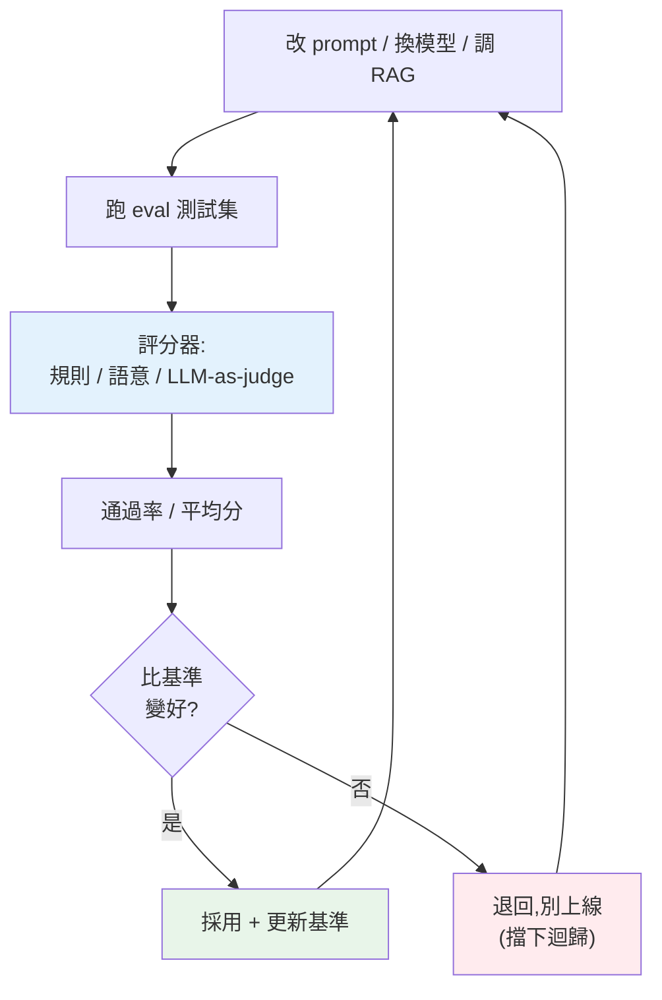

# LLM 應用評估與 prompt 測試

> LLM 的輸出是**非確定、開放式**的——你改了 prompt、換了模型,怎麼知道變好還是變壞?靠人工看幾個例子不可靠。**評估(evaluation / eval)** 用一套測試案例 + 自動評分,系統化地衡量 LLM 應用的品質,讓你能**用資料迭代**而非憑感覺。這是把 AI 應用做可靠的關鍵,也是全 Part 的收尾。

## 💡 白話導讀(建議先讀)

傳統程式好測:輸入 2+2,斷言等於 4,不對就是 bug。
但 LLM 的輸出是**開放式、每次還不一樣**的——
你改了 prompt、換了模型,**怎麼知道是變好還是變壞?**
靠「人工看幾個例子感覺一下」極不可靠(換了 prompt 修好三個、悄悄弄壞十個你沒看到的)。
**評估(evaluation / eval)** 就是給 LLM 應用建立客觀的「考試」。

難點在:**開放式答案怎麼自動評分?** 幾種方法,由易到難:

- **規則比對**:能用規則判對錯的最省事——
  分類任務比標籤、抽取任務比欄位、「是不是合法 JSON」「有沒有包含關鍵字」。
  **快、便宜、確定,能用就用。**
- **語意相似度**:用 [embedding](06-embeddings-semantic-search.md) 比對輸出和參考答案「意思有多近」——
  適合「意思對就好、字面不必一樣」的問答。
- **LLM-as-judge(用 LLM 當評審)**:拿另一個(或同一個)強模型,
  按你給的評分標準(準確性、語氣、有無幻覺)**替輸出打分**——
  最靈活,能評主觀品質,但要小心評審自己的偏誤(如偏愛長答案)。

最重要的觀念是**建立 eval 資料集 + 持續回歸測試**:
把「代表性的輸入 + 期望的輸出」收成一套測試集,
每次改 prompt/換模型都**跑一遍、比分數**——
這是 LLM 版的[單元測試](../12-testing/README.md),
讓你從「憑感覺調 prompt」進化到「用數據驅動迭代」。
沒有 eval,你的 LLM 應用就是在盲改——這章教你把它建起來,
也為 [Part 30 生產化 AI](../30-production-ai/README.md) 的監控鋪路。

## Why(為什麼)

傳統程式測試很明確:`add(2,3)` 應該 `== 5`,對就是對。但 LLM 應用不同——輸出是**自然語言、非確定、開放式**:同一個問題可以有很多種「對」的答法,而且每次可能不一樣([取樣的隨機性](01-llm-fundamentals.md))。這帶來一個嚴重問題:

**你改了 prompt、換了模型、調了 RAG,怎麼知道整體變好還是變壞?**

- 靠**人工看幾個例子**?不可靠、不可規模化、有偏見,而且改 A 修好了可能弄壞 B(你沒看到)。
- 靠**感覺**?更糟——「好像好一點」不是工程。

**評估(eval)** 是解法:準備一組**測試案例**(輸入 + 期望/評分標準),自動跑過你的 LLM 應用、**自動評分**,得到一個**量化的品質分數**。於是你能:

- **可靠地迭代**:改 prompt 前後跑 eval,分數升了才採用——[eval 驅動開發](../30-production-ai/README.md)。
- **防迴歸**:確保改動沒弄壞既有能力(像[測試](../12-testing/README.md)防程式迴歸)。
- **比較選項**:不同 prompt/模型客觀比分。

「**如果你不能衡量它,你就無法改進它**」——評估是把 AI 應用從「玄學調 prompt」變成「資料驅動工程」的關鍵。這章講評估的方法與 prompt 測試,呼應 [屬性測試](../12-testing/11-property-based-testing.md) 與 [測試](../12-testing/README.md) 的精神。

## Theory(理論:如何評分非確定的輸出)

評估的核心難點是:**開放式輸出怎麼自動評分?** 幾種方法,由易到難:

- **精確/規則匹配(exact / rule-based)**:輸出可用規則判斷對錯時最簡單。分類任務比對標籤、抽取任務比對欄位、「回答是否包含某關鍵字」、「是否合法 JSON」、「是否在允許的選項內」。**快、便宜、確定**——能用就用。
- **語意相似度**:用 [embedding](06-embeddings-semantic-search.md) 比對輸出與參考答案的語意接近程度——適合「意思對就好、字面不必相同」。
- **LLM-as-judge(用 LLM 當評審)**:用**另一個 LLM** 依 **rubric(評分標準)** 給輸出打分——「這個回答是否正確、完整、有禮貌?給 1–5 分」。適合**主觀/開放**的品質(語氣、有用性、忠實度)。強大但要小心:評審 LLM 也可能錯/有偏,rubric 要寫清楚。
- **人工評估**:最可靠但最貴、最慢——用於建立**黃金標準**、校準自動評分,不適合每次迭代都跑。

**評估的組成**:

- **測試集(eval set)**:一組有代表性的 `(輸入, 期望/評分標準)` 案例,涵蓋常見情況 + 邊界 + 曾出錯的案例(像[迴歸測試](../12-testing/README.md))。
- **評分器(scorer)**:上述方法之一,對每個案例的輸出打分。
- **匯總指標**:通過率、平均分、各維度分數——一個能追蹤的數字。

## Specification(規範:eval 的結構與指標)

**一個 eval 的結構**:

```python
test_cases = [
    {"input": "把「太爛了」分類", "expected": "negative"},   # 規則匹配
    {"input": "台北在哪個國家?", "must_contain": "台灣"},     # 關鍵字
    {"input": "寫個道歉信", "rubric": "有禮貌、誠懇、具體"},   # LLM-as-judge
]

def evaluate(app, test_cases, scorer):
    results = [scorer(case, app(case["input"])) for case in test_cases]
    pass_rate = sum(r.passed for r in results) / len(results)
    return pass_rate, results
```

**常見指標**:

- **分類/抽取**:準確率(accuracy)、精確率/召回率/F1(見 [ML 評估](../24-business-analytics/README.md))。
- **開放生成**:LLM-as-judge 的平均分、通過率(達某分數門檻的比例)。
- **RAG**:忠實度(答案是否只依據檢索到的資料,不幻覺)、檢索相關性、答案正確性。
- **安全**:拒絕率(該拒的有拒)、越獄成功率(見 [prompt injection](../20-security-system-design/07-owasp-xss-csrf.md))。

**prompt 測試/迴歸**:把 eval 接進 [CI](../19-cloud-native/05-ci-cd.md)——改 prompt 就跑 eval,分數低於基準就擋下(像 [pytest](../12-testing/README.md) 擋壞程式)。prompt 要**版本管理**(見 [prompt engineering](03-prompt-engineering.md)),每版對應一個 eval 分數。

## Implementation(底層:eval 驅動開發與 LLM-as-judge)

**為何 eval 驅動開發是必要的**:LLM 應用的改動(prompt、模型、RAG 參數)效果**不可預測**——直覺常錯。「這樣改 prompt 應該更好」可能實際上讓某類輸入變糟。唯一可靠的方式是**用資料驗證**:每次改動前後,跑同一組 eval,比分數。這把「憑感覺調 prompt」變成「假設 → 實驗 → 量測」的科學方法(同 [屬性測試](../12-testing/11-property-based-testing.md)、[效能優化先量測](../18-performance/01-profiling.md) 的精神)。沒有 eval,你是在黑暗中改——改好了不知道、改壞了也不知道,直到使用者抱怨。

**LLM-as-judge 的原理與陷阱**:用 LLM 評分開放式輸出,是因為**規則無法判斷主觀品質**(語氣好不好、有沒有用、忠不忠於來源)。給評審 LLM 一個清楚的 **rubric**(評分標準)+ 待評的輸出,讓它打分。它有效,但要注意:評審 LLM 也會**犯錯、有偏見**(如偏好長答案、偏好某風格、位置偏誤)。緩解:**rubric 要具體可衡量**(不是「好不好」而是「是否包含 X、是否正確、是否 ≤ Y 字」)、用強模型當評審、必要時用多個評審投票、用人工校準評審的準確度。LLM-as-judge 不完美,但**比人工快得多、比規則靈活**,是開放式評估的實用主力。

**測試集的品質決定 eval 的價值**:eval 只在測試集**有代表性**時有意義。要涵蓋:常見情況、邊界案例、曾出錯的真實案例(把生產事故變成迴歸案例)。太小或偏頗的測試集會給你**虛假的信心**。下面範例用純 Python 實作一個 eval harness(規則評分 + mock LLM-as-judge + 通過率),展示評估的核心結構。

## Code Example(可執行的 Python 範例)

```python
# evaluation.py — LLM 應用評估 harness(純標準庫,mock LLM 與評審)
from __future__ import annotations

from dataclasses import dataclass


@dataclass
class EvalResult:
    input: str
    output: str
    passed: bool
    reason: str


def rule_scorer(expected: str, output: str) -> tuple[bool, str]:
    """規則評分:輸出是否等於期望(分類/抽取用)。"""
    passed = output.strip().lower() == expected.strip().lower()
    return passed, "精確匹配" if passed else f"期望 {expected!r},得到 {output!r}"


def contains_scorer(keyword: str, output: str) -> tuple[bool, str]:
    """關鍵字評分:輸出是否包含必要關鍵字。"""
    passed = keyword in output
    return passed, f"{'包含' if passed else '缺少'}關鍵字 {keyword!r}"


def mock_llm_judge(rubric: str, output: str) -> tuple[bool, str]:
    """mock LLM-as-judge:真實中用另一個 LLM 依 rubric 打分。
    此處用簡單規則模擬:輸出夠長且含「抱歉」視為符合道歉 rubric。"""
    score = (len(output) >= 10) + ("抱歉" in output or "對不起" in output)
    passed = score >= 2  # 滿分 2:夠具體 + 有致歉語
    return passed, f"評審給分 {score}/2（rubric: {rubric}）"


def run_eval(cases: list[dict[str, str]], app: dict[str, str]) -> tuple[float, list[EvalResult]]:
    """跑一組測試案例,回 (通過率, 明細)。app 是 mock「輸入→輸出」。"""
    results: list[EvalResult] = []
    for case in cases:
        output = app.get(case["input"], "(無回應)")
        if "expected" in case:
            passed, reason = rule_scorer(case["expected"], output)
        elif "must_contain" in case:
            passed, reason = contains_scorer(case["must_contain"], output)
        else:
            passed, reason = mock_llm_judge(case["rubric"], output)
        results.append(EvalResult(case["input"], output, passed, reason))
    pass_rate = sum(r.passed for r in results) / len(results)
    return pass_rate, results


def main() -> None:
    # 測試集:混合規則、關鍵字、LLM-as-judge
    cases = [
        {"input": "分類:太爛了", "expected": "negative"},
        {"input": "台北在哪國?", "must_contain": "台灣"},
        {"input": "寫道歉信", "rubric": "有禮貌、誠懇、具體"},
    ]
    # 模擬某版 prompt 下應用的輸出
    app_v1 = {
        "分類:太爛了": "negative",
        "台北在哪國?": "台北位於台灣。",
        "寫道歉信": "很抱歉造成不便,我們會立即改進。",
    }
    rate, results = run_eval(cases, app_v1)
    print(f"版本 v1 通過率: {rate:.0%}")
    for r in results:
        mark = "✓" if r.passed else "✗"
        print(f"  {mark} [{r.input}] {r.reason}")

    # 迴歸:改壞的 v2(道歉信缺致歉語)→ 通過率下降,eval 擋下
    app_v2 = {**app_v1, "寫道歉信": "問題已修復。"}
    rate2, _ = run_eval(cases, app_v2)
    print(f"\n版本 v2(改壞)通過率: {rate2:.0%}  ← 低於 v1,eval 抓到迴歸")


if __name__ == "__main__":
    main()
```

**預期輸出**:

```pycon
$ python evaluation.py
版本 v1 通過率: 100%
  ✓ [分類:太爛了] 精確匹配
  ✓ [台北在哪國?] 包含關鍵字 '台灣'
  ✓ [寫道歉信] 評審給分 2/2（rubric: 有禮貌、誠懇、具體）

版本 v2(改壞)通過率: 67%  ← 低於 v1,eval 抓到迴歸
```

逐段解說:

- **混合評分器**:分類用**規則匹配**(輸出 == 期望)、事實問答用**關鍵字**(含「台灣」)、開放生成(道歉信)用 **LLM-as-judge**(依 rubric 打分)。**能用規則就用規則**(快、確定),主觀的才用 judge。
- **v1 通過率 100%**:三個案例全過——這一版 prompt 品質達標。
- **迴歸偵測**:v2 把道歉信改成「問題已修復」(缺致歉語、不誠懇)→ LLM-as-judge 判不過 → 通過率降到 67%。**eval 自動抓到這個迴歸**——若沒有 eval,你可能沒注意道歉信變糟了。這就是「用資料迭代」防迴歸。
- **要點**:eval = 測試集 + 評分器 + 通過率。改 prompt/模型前後跑 eval 比分數,才知道變好變壞。規則評分優先、開放品質用 LLM-as-judge。接進 [CI](../19-cloud-native/05-ci-cd.md) 就是 prompt 迴歸測試。

## Diagram(圖解:eval 驅動的迭代)



## Best Practice(最佳實踐)

- **建有代表性的測試集**:常見 + 邊界 + 曾出錯的真實案例(把事故變迴歸案例)。
- **能用規則評分就用規則**(快、確定);主觀品質才用 LLM-as-judge。
- **LLM-as-judge 的 rubric 要具體可衡量**、用強模型當評審、必要時多評審/人工校準。
- **eval 驅動開發**:改動前後跑 eval 比分數,升了才採用——別憑感覺。
- **eval 接進 [CI](../19-cloud-native/05-ci-cd.md)**:分數低於基準就擋下(prompt 迴歸測試)。
- **prompt 版本管理**,每版對應 eval 分數(見 [prompt engineering](03-prompt-engineering.md))。
- **針對場景選指標**:分類用準確率/F1、RAG 用忠實度、安全用拒絕率。
- **持續擴充測試集**:遇到新的失敗案例就加進去。

## Common Mistakes(常見誤解)

- **靠人工看幾個例子判斷好壞**:不可靠、不可規模化、看不到迴歸。
- **憑感覺調 prompt**:改好改壞不知道;要用 eval 量化。
- **沒有 eval 就改 prompt/換模型**:黑暗中改,可能弄壞既有能力。
- **測試集太小/偏頗**:給虛假信心;要有代表性。
- **LLM-as-judge 的 rubric 含糊**(「好不好」):評分不穩;要具體可衡量。
- **盲信評審 LLM**:它也會錯/有偏(偏好長答案等);要校準。
- **能用規則卻用 LLM-as-judge**:貴又慢;規則優先。
- **eval 不接 CI**:改 prompt 悄悄弄壞也沒人擋。

## Interview Notes(面試重點)

- **能說明為何 LLM 應用需要 eval**:輸出非確定/開放,人工/感覺不可靠,改動效果不可預測。
- **能列評分方法**:規則/精確匹配、語意相似度、LLM-as-judge、人工,及各自適用與取捨。
- **能講 LLM-as-judge 的原理與陷阱**(rubric 要具體、評審也會偏),及緩解。
- **能描述 eval 驅動開發**:改動前後跑 eval 比分數,升了才採用;接 CI 防迴歸。
- **知道測試集要有代表性**(常見+邊界+事故案例)、持續擴充。
- **知道依場景選指標**(分類 F1、RAG 忠實度、安全拒絕率)。
- **能連結到傳統測試/屬性測試的精神**(用資料把關品質)。

---

你已掌握用 LLM 建應用的地基:LLM 原理、呼叫 Claude API、prompt engineering、結構化輸出與 tool use、串流與非同步、embeddings 與語意搜尋、向量資料庫、成本優化、評估。這是 **AI Engineer / AI Application Engineer** 的核心基本功。接下來 **Part 29(AI 應用工程)** 將把這些組合成真實產品:RAG、agents、生產化。

➡️ 下一章：[Part 28 統整：LLM 與生成式 AI 全貌](10-summary.md)

[⬆️ 回 Part 28 索引](README.md)
