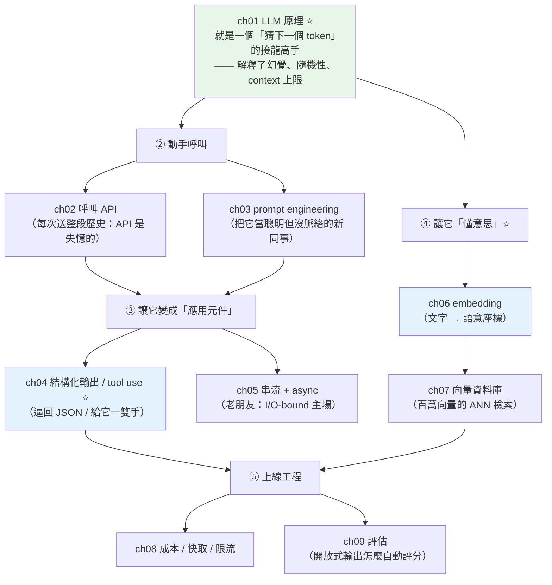

# Part 28 統整：LLM 與生成式 AI 全貌

> 把這 9 章串成一張圖——LLM 看起來很神，但它骨子裡只做一件樸素的事：**猜下一個 token。** 想清楚這件事，其餘全部合理。

## 🗺️ 知識地圖（這 9 章怎麼串起來）

Part 28 是 AI 工程的地基。它從**一個樸素的事實**出發，一路搭到能用 LLM 建應用：



**一句話串起來**：

**[LLM 就是一個「猜下一個 token」的接龍高手](01-llm-fundamentals.md)**（ch01）——
給定前文，算出下一個詞的機率分布、取樣一個、接上去、再猜。
**這個本質解釋了你對 LLM 的所有困惑**：
為什麼會**幻覺**（它只求「接得像」，不查證「是不是真的」）、
為什麼**每次答不一樣**（按機率取樣）、為什麼有 **context 上限**（一次能看的 token 有限）。

理解本質後，就能動手：
**[呼叫 API](02-calling-llm-api.md)**（ch02，記住 **API 是失憶的**，每次送整段歷史）、
**[prompt engineering](03-prompt-engineering.md)**（ch03，把它當**聰明但沒脈絡的新同事**）。

然後把「聊天機器人」升級成**應用元件**：
**[結構化輸出 / tool use](04-structured-output-tools.md)**（ch04，逼它回 JSON、給它一雙手去查資料）——
**這是所有 AI agent 的基石**。

而讓 LLM「**懂意思**」的關鍵是 **[embedding](06-embeddings-semantic-search.md)**（ch06）：
把文字變成**語意座標**，意思近的向量也近——
這是**語意搜尋與 RAG 的地基**（下面的小實作會演給你看）。

## ⚡ 速查表（什麼情境用什麼）

| 情境 | 怎麼做 | 章節 |
|------|--------|------|
| 估算成本／長度 | 一切按 **token** 算（英文約 4 字元/token，中文約 1~2 字元/token） | [ch01](01-llm-fundamentals.md) |
| 想要穩定、可重現的輸出 | 調低 **temperature**（高=有創意、低=穩定） | [ch01](01-llm-fundamentals.md) |
| 呼叫 Claude | Anthropic SDK；**每次送整段對話歷史**（API 無狀態） | [ch02](02-calling-llm-api.md) |
| 輸出品質不好 | **prompt engineering**：具體指令、給角色、few-shot 範例、要它逐步想 | [ch03](03-prompt-engineering.md) |
| **要「能用的資料」而非一段話** | **結構化輸出**（給 JSON schema，回保證可解析的 JSON） | [ch04](04-structured-output-tools.md) |
| **要 LLM 會「動手」**（查 DB、算數、呼叫 API） | **tool use**——描述工具，模型請你執行，你回結果 | [ch04](04-structured-output-tools.md) |
| 長回應等太久 | **串流**（邊生成邊顯示，TTFB 從幾秒降到零點幾秒） | [ch05](05-streaming-async.md) |
| 要同時打很多個 LLM 請求 | **async**（`asyncio.gather` + `Semaphore` 限流）——I/O-bound 主場 | [ch05](05-streaming-async.md) |
| **用「意思」搜尋**（搜「狗」找到「犬」） | **embedding** + 餘弦相似度 | [ch06](06-embeddings-semantic-search.md) |
| 百萬筆文件的語意搜尋 | **向量資料庫**（ANN 近似最近鄰；pgvector / FAISS） | [ch07](07-vector-databases.md) |
| **省錢** | 控制輸出長度（輸出比輸入貴 5 倍）、**選對模型**（簡單任務用便宜的） | [ch08](08-cost-latency-caching.md) |
| 固定的長 prompt 前綴 | **prompt caching**（重複部分大幅降價 + 加速） | [ch08](08-cost-latency-caching.md) |
| **改了 prompt，怎麼知道變好變壞** | **建 eval 資料集** + 自動評分（規則／語意／LLM-as-judge） | [ch09](09-evaluation.md) |

## 🔑 核心心智模型（帶得走的幾句話）

- **LLM ＝ 猜下一個 token 的接龍高手。** 記住這一句，你就能解釋它的一切：
  幻覺（求「接得像」不求「真」）、隨機（按機率取樣）、context 上限（一次能看的有限）。
- **API 是失憶的。** 它自己**不記得**上一輪——「記憶」全靠**你每次把歷史再送一遍**。
  所以對話越長越貴，而「記憶」是**你的程式**在管的。
- **token 是計費、長度、成本的單位。** 不是字、不是詞，是 tokenizer 切出來的碎片。
  一切工程決策（要不要塞這段 context、選哪個模型）都繞著它轉。
- **prompt engineering 不是玄學咒語。** 核心就一句：
  **把它當聰明但對你的情況一無所知的新同事**——講清楚要什麼格式、什麼背景、什麼限制。
- **tool use 是 agent 的基石。** LLM 本身不會查資料庫、不會算數——
  tool use 給它「一雙手」：它**判斷何時該用工具、請你執行、再據結果作答**。
- **embedding 讓 LLM「懂意思」。** 把文字變成語意地圖上的座標，
  「找相關的東西」變成「找地圖上最近的點」——這是**語意搜尋與 RAG 的整個基礎**。

## 🛠️ 小實作：LLM 應用的三個地基

不需要 API key，用純 Python 示範 Part 28 最核心的三件事：
**token 計數** → **embedding 語意搜尋** → **成本估算**。

```python
# llm_foundations_demo.py —— Part 28 主線：token、語意、成本
from __future__ import annotations

import math


# ── ch01 token：LLM 眼中的最小單位——計費、長度限制都按它算 ──
def rough_tokens(text: str) -> int:
    """粗估 token 數（真實請用 tokenizer；英文約 4 字元/token，中文約 1~2 字元/token）。"""
    ascii_chars = sum(1 for c in text if ord(c) < 128)
    cjk_chars = len(text) - ascii_chars
    return max(1, round(ascii_chars / 4 + cjk_chars * 1.5))


# ── ch06 embedding：把文字變成語意座標——意思近的，向量也近 ──
def cosine(a: list[float], b: list[float]) -> float:
    dot = sum(x * y for x, y in zip(a, b, strict=True))
    norm_a = math.sqrt(sum(x * x for x in a))
    norm_b = math.sqrt(sum(y * y for y in b))
    return dot / (norm_a * norm_b)


def semantic_search(
    query_vec: list[float], docs: dict[str, list[float]]
) -> list[tuple[str, float]]:
    scored = [(name, cosine(query_vec, vec)) for name, vec in docs.items()]
    return sorted(scored, key=lambda x: x[1], reverse=True)


# ── ch08 成本：輸出比輸入貴，選對模型省數倍 ──
def estimate_cost(in_tok: int, out_tok: int, in_price: float, out_price: float) -> float:
    """單位：$ / 1M token。"""
    return in_tok / 1e6 * in_price + out_tok / 1e6 * out_price


def demo() -> None:
    print("【ch01 token】文字在 LLM 眼中被切成 token（計費單位）")
    for text in ["Hello, world!", "你好，世界！", "Python 是一門很棒的程式語言"]:
        print(f"    {text!r:38s} ≈ {rough_tokens(text):2d} tokens")

    print("\n【ch06 embedding 語意搜尋】用「意思」找，不是關鍵字")
    # 假想的 3 維語意空間（真實是 1536 維等）
    docs = {
        "如何重設密碼": [0.9, 0.1, 0.1],
        "訂單退貨流程": [0.1, 0.9, 0.2],
        "忘記登入密碼怎麼辦": [0.85, 0.15, 0.05],
        "運費與配送說明": [0.2, 0.3, 0.9],
    }
    query = "登入不進去"                  # 意思接近「密碼」類
    query_vec = [0.88, 0.12, 0.08]
    print(f"    查詢: {query!r}（關鍵字完全沒出現在任何文件標題裡）")
    for name, score in semantic_search(query_vec, docs)[:3]:
        print(f"      相似度 {score:.3f}  {name}")
    print("    ← 靠語意找到了「重設密碼」「忘記登入密碼」—— 關鍵字搜尋做不到")

    print("\n【ch08 成本估算】同一個任務，選對模型省數倍")
    in_tok, out_tok = 2000, 500
    models = {
        "Opus  ($5/$25)": (5, 25),
        "Sonnet($3/$15)": (3, 15),
        "Haiku ($1/$5) ": (1, 5),
    }
    for name, (in_price, out_price) in models.items():
        cost = estimate_cost(in_tok, out_tok, in_price, out_price)
        print(f"    {name}: ${cost:.5f} / 次  → 100 萬次 ${cost * 1e6:,.0f}")
    print("    ← 簡單任務用 Haiku，難題才上 Opus：同任務成本差 5 倍")


if __name__ == "__main__":
    demo()
```

**預期輸出**：

```pycon
$ python llm_foundations_demo.py
【ch01 token】文字在 LLM 眼中被切成 token（計費單位）
    'Hello, world!'                        ≈  3 tokens
    '你好，世界！'                              ≈  6 tokens
    'Python 是一門很棒的程式語言'                   ≈ 17 tokens

【ch06 embedding 語意搜尋】用「意思」找，不是關鍵字
    查詢: '登入不進去'（關鍵字完全沒出現在任何文件標題裡）
      相似度 0.999  如何重設密碼
      相似度 0.999  忘記登入密碼怎麼辦
      相似度 0.328  運費與配送說明
    ← 靠語意找到了「重設密碼」「忘記登入密碼」—— 關鍵字搜尋做不到

【ch08 成本估算】同一個任務，選對模型省數倍
    Opus  ($5/$25): $0.02250 / 次  → 100 萬次 $22,500
    Sonnet($3/$15): $0.01350 / 次  → 100 萬次 $13,500
    Haiku ($1/$5) : $0.00450 / 次  → 100 萬次 $4,500
    ← 簡單任務用 Haiku，難題才上 Opus：同任務成本差 5 倍
```

**三段輸出，說完 LLM 工程的三個地基**：

**① token：一切的計量單位。**
`'Python 是一門很棒的程式語言'` ≈ 17 tokens——
中文比英文「貴」（每字約 1~2 token，英文每 4 字元才 1 token）。
**你的每一個工程決策**（要不要塞這段 context、對話留多長、選哪個模型）
**都是在算 token**。

**② embedding：語意搜尋做到關鍵字搜尋做不到的事。**
查詢 `'登入不進去'` 這五個字，**完全沒出現在任何文件標題裡**——
關鍵字搜尋會**一無所獲**。
但 embedding 把它放到語意地圖上，找到了最近的兩個點：
**「重設密碼」「忘記登入密碼」**（相似度 0.999）。
**這就是 RAG 的第一步**：把使用者問題和知識庫都變成向量，找最近的幾段餵給 LLM。

**③ 成本：選對模型，帳單差 5 倍。**
同一個任務（2000 in / 500 out），**Opus 一百萬次要 $22,500，Haiku 只要 $4,500**。
**簡單任務（分類、抽取）用 Haiku，難題（複雜推理）才上 Opus**——
這是 LLM 應用「養得起」的關鍵。

## ✅ 自測清單（答不出來就回去讀）

- [ ] LLM 到底在做什麼？（提示：接龍）這解釋了它的哪些特性？（[ch01](01-llm-fundamentals.md)）
- [ ] 為什麼 LLM 會「幻覺」？temperature 控制什麼？（[ch01](01-llm-fundamentals.md)）
- [ ] token 是什麼？中文和英文的 token 密度差在哪？（[ch01](01-llm-fundamentals.md)）
- [ ] 為什麼說「API 是失憶的」？「記憶」是誰在管？（[ch02](02-calling-llm-api.md)）
- [ ] prompt engineering 的核心心法一句話怎麼說？（[ch03](03-prompt-engineering.md)）
- [ ] 結構化輸出解決什麼問題？（[ch04](04-structured-output-tools.md)）
- [ ] **tool use 的多步循環是怎麼運作的？誰執行工具？**（[ch04](04-structured-output-tools.md)）
- [ ] 串流解決什麼體驗問題？為什麼 LLM 特別適合 async？（[ch05](05-streaming-async.md)）
- [ ] embedding 是什麼？「語意的算術」（king - man + woman ≈ queen）代表什麼？（[ch06](06-embeddings-semantic-search.md)）
- [ ] 向量資料庫為什麼要用 ANN 而不是精確搜尋？（[ch07](07-vector-databases.md)）
- [ ] LLM 成本的三大省錢槓桿是什麼？（[ch08](08-cost-latency-caching.md)）
- [ ] prompt caching 怎麼省錢？（[ch08](08-cost-latency-caching.md)）
- [ ] LLM 的輸出是開放式的，怎麼「自動評分」？（[ch09](09-evaluation.md)）

## 🎯 面試速查

| 考點 | 面試官想聽到什麼 | 章節 |
|------|------------------|------|
| **LLM 的運作原理？** | 「本質是**自迴歸的下一個 token 預測器**：給定前文，輸出詞彙表上每個 token 的機率分布，取樣一個、接上、再預測——直到結束符。這解釋了它的一切：**幻覺**（只求接得像，不查證真假）、**隨機性**（按機率取樣，temperature 控制）、**context 上限**。」 | [ch01](01-llm-fundamentals.md) |
| **為什麼 API「無狀態」很重要？** | 「LLM API **不記得**上一輪——每次呼叫**都要送整段對話歷史**，模型才有上下文。所以：① 對話越長越貴（送的 token 越多）；② 『記憶』是**你的應用程式**在管理的（存歷史、每次附上）。」 | [ch02](02-calling-llm-api.md) |
| **tool use / function calling？** | 「一個**多步循環**：① 你在請求裡**描述工具**（名稱、參數 schema）；② 模型**判斷需要時，回一個「請呼叫 X(參數)」的請求**——**注意它不自己執行**；③ **你的程式執行**，把結果回傳；④ 模型據此繼續作答。這是所有 **AI agent** 的基石。」 | [ch04](04-structured-output-tools.md) |
| **embedding 是什麼？** | 「把文字轉成**固定長度的語意向量**——**幾何距離反映語意相似度**（意思越近，向量夾角越小）。用餘弦相似度衡量。它讓『找相關的東西』變成『找向量空間裡最近的點』，是**語意搜尋、推薦、RAG** 的共同基礎。」 | [ch06](06-embeddings-semantic-search.md) |
| **怎麼控制 LLM 成本？** | 「三個槓桿：① **輸出比輸入貴**（約 5 倍）→ 控制輸出長度、要求簡潔；② **選對模型**——簡單任務（分類/抽取）用 Haiku，難題才上 Opus，**同任務差數倍**；③ **prompt caching**——固定的長前綴（系統指令、知識庫）快取後重複部分大幅降價。」 | [ch08](08-cost-latency-caching.md) |
| **LLM 應用怎麼評估？** | 「開放式輸出不能靠『人工看幾個』。要**建 eval 資料集 + 自動評分**：① **規則比對**（分類比標籤、是否合法 JSON）——能用就用；② **語意相似度**（用 embedding 比對參考答案）；③ **LLM-as-judge**（用強模型按評分標準打分）。改 prompt/換模型就**跑一遍比分數**，像單元測試。」 | [ch09](09-evaluation.md) |

---

🎉 **恭喜完成 Part 28！** 你有了用 LLM 建應用的**全部地基**——
token、prompt、tool use、embedding、成本、評估。

這 9 章是整條 **AI 工程線的核心**。往上，
[Part 29 AI 應用工程](../29-ai-applications/README.md) 會把 embedding + 向量庫組成 **RAG**、
把 tool use 組成 **agent**；
[Part 30 生產化 AI](../30-production-ai/README.md) 則把這一切推上生產
（可靠性、護欄、評估回歸 CI）。

而你會一路發現：**前面 27 個 Part 學的東西——async、快取、可觀測性、
依賴注入、冪等——在 LLM 應用裡全部重新派上用場。**

➡️ 下一 Part：[AI 應用工程 AI Applications](../29-ai-applications/README.md)

[⬆️ 回 Part 28 索引](README.md)
