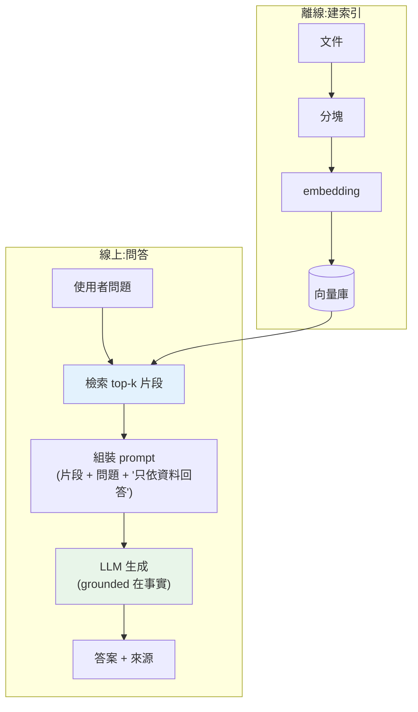

# RAG 全流程:檢索 → 組裝 → 生成

> LLM 有兩個致命限制:知識有**截止日**(不知道最新/私有資料)、會**幻覺**(編造看似合理的假話)。**RAG(Retrieval-Augmented Generation,檢索增強生成)** 解決這兩點——先從你的知識庫**檢索**相關資料,把它塞進 prompt,讓 LLM **根據檢索到的事實**回答。這是最重要、最實用的 LLM 應用模式。這章講 RAG 的完整流程。

## 💡 白話導讀(建議先讀)

LLM 再聰明也有兩個硬傷:知識有**截止日**(不知道你公司的內部文件、不知道昨天的新聞)、
而且會**一本正經地幻覺**(不知道時,它會編一個聽起來很合理的假答案)。
**RAG(檢索增強生成)** 就是治這兩個病的良方,核心概念一句話:

> **不要讓模型「憑記憶」回答,先幫它「翻書」再回答。**

想像一場**開書考試**:題目來了,你不是靠死背,而是**先翻到相關那幾頁、再據此作答**。
RAG 就是給 LLM 開書考:使用者一問問題,系統先去知識庫**撈出最相關的幾段文件**,
連同問題一起塞給模型,並下令「**只根據這些資料回答**」——
答案有了依據,幻覺大減,還能引用來源。

它分兩個階段,想成「先建圖書館,再開放借閱」:

- **離線建索引(只做一次)**:把文件[切塊](02-chunking-strategies.md)、
  每塊用 [embedding](../28-llm-genai/06-embeddings-semantic-search.md) 轉成向量、
  存進[向量資料庫](../28-llm-genai/07-vector-databases.md)——把整座圖書館編好目錄上架。
- **線上問答(每次查詢)**:問題也轉成向量 → 找出最相似的幾段 →
  組進 prompt → 模型根據這些段落作答。

RAG 是目前**企業導入 LLM 最主流的架構**(客服知識庫、文件問答、內部搜尋),
這章先鳥瞰全流程,後面各章再逐一深挖每個環節。它把前一個 Part 的 embedding、
向量庫、prompt 全串成一個能落地的系統。

## Why(為什麼)

直接問 LLM 有兩個問題:

- **知識截止 + 沒有私有資料**:模型只知道訓練時看過的東西——不知道你公司的內部文件、今天的新聞、某產品的最新規格。問它「我們的退貨政策是什麼」,它要嘛不知道,要嘛**瞎編**。
- **幻覺(hallucination)**:LLM 是[機率化的文字生成器](../28-llm-genai/01-llm-fundamentals.md),它會產生「看起來很合理但其實是錯的」內容——編造不存在的 API、捏造引用、給錯數字。對需要**準確、可信**的應用(客服、知識問答、法律/醫療),幻覺是致命的。

**RAG** 是解法,也是目前**最主流的 LLM 應用架構**。核心洞見:**不要讓模型從記憶回答,而是給它相關的事實、要它根據事實回答**。流程:

1. **檢索(Retrieve)**:把使用者問題拿去你的知識庫做[語意搜尋](../28-llm-genai/06-embeddings-semantic-search.md),找出最相關的文件片段。
2. **組裝(Augment)**:把這些片段塞進 prompt 的 context,加上「只根據以下資料回答」的指令。
3. **生成(Generate)**:LLM 根據**檢索到的事實**產生答案。

好處:**能回答私有/最新資料**(檢索的是你的知識庫)、**大幅減少幻覺**(答案有事實根據)、**可溯源**(能指出答案來自哪份文件)、**不必重訓模型**(換知識庫即可)。這章講 RAG 的完整骨架,後續章節深入 [chunking](02-chunking-strategies.md)、[檢索](03-hybrid-retrieval-rerank.md)、[評估](04-rag-evaluation.md)。

## Theory(理論:RAG 的兩階段)

RAG 分**離線建索引**與**線上問答**兩階段:

**離線(索引建立,ingestion)**——只做一次(資料更新時重做):

1. **載入 + 分塊(chunking)**:把文件切成語意片段(見 [chunking](02-chunking-strategies.md))——太長的文件要切,否則塞不進 context 也稀釋語意。
2. **embedding**:每個片段用 embedding 模型轉成向量(見 [embeddings](../28-llm-genai/06-embeddings-semantic-search.md))。
3. **存進[向量資料庫](../28-llm-genai/07-vector-databases.md)**:向量 + 原文 + 中繼資料。

**線上(查詢時,每次問答)**:

1. **檢索(Retrieve)**:問題 embed 成向量,在向量庫找**最相似的 top-k 片段**。
2. **組裝(Augment)**:把 top-k 片段組進 prompt——「根據以下資料回答:{片段}\n問題:{問題}」。
3. **生成(Generate)**:送 LLM,它**根據 context 裡的事實**回答(見 [呼叫 API](../28-llm-genai/02-calling-llm-api.md))。

**關鍵指令**:prompt 要明確要求「**只根據提供的資料回答,資料裡沒有就說不知道**」——這把模型「錨定」在檢索到的事實上,大幅減少幻覺,並讓它在資料不足時誠實地說不知道(而非瞎編)。

## Specification(規範:RAG 的組件與 prompt)

**組件**:

- **知識庫 + 向量索引**:文件分塊、embed、存[向量庫](../28-llm-genai/07-vector-databases.md)。
- **檢索器(retriever)**:問題 → top-k 相關片段。
- **prompt 模板**:把片段 + 問題 + 指令組成 prompt。
- **LLM**:根據 context 生成答案。

**RAG prompt 模板**(關鍵是「錨定事實 + 誠實退路」):

```text
你是知識庫助理。只根據以下「資料」回答問題。
若資料中沒有答案,就說「資料中找不到相關資訊」,不要編造。

資料:
- {片段1}
- {片段2}
- {片段3}

問題:{使用者問題}
回答:
```

**回應處理**:除了答案,常一併回**來源**(檢索到哪些片段)——讓使用者可溯源、可驗證(引用)。

**參數**:`top_k`(檢索幾個片段)——太少可能漏掉答案、太多稀釋 + 貴([成本](../28-llm-genai/08-cost-latency-caching.md));常 3–8。

## Implementation(底層:為何 RAG 減少幻覺、grounding)

**為何 RAG 能減少幻覺**:LLM 幻覺的根源是「被迫從不完整/不確定的記憶生成」——沒有確切資訊時,它仍會產生**看似合理**的 token(機率上最可能的下一個字),於是編出假話。RAG 改變了這個處境:把**相關的真實資料放進 context**,模型不必從模糊記憶挖,而是**根據眼前的事實**回答——這叫 **grounding(接地)**。當答案就在 context 裡,模型「照抄/綜合」比「編造」的機率高得多。再加上「資料沒有就說不知道」的指令,給模型一個**誠實的退路**,不必硬編。這不是 100% 消除幻覺(模型仍可能誤讀 context),但大幅降低,且讓答案**可溯源**(能對照 context 驗證)。

**為何用語意檢索而非關鍵字**:使用者的問法和文件的用詞常不同(「怎麼退貨」vs 文件寫「退換貨流程」)。[語意檢索](../28-llm-genai/06-embeddings-semantic-search.md)用 embedding 找**意思相近**的片段,即使字面不同也能找到——這是 RAG 檢索的核心。實務常再加**混合檢索**(語意 + 關鍵字,見 [混合檢索](03-hybrid-retrieval-rerank.md))補足精確匹配。

**RAG vs fine-tuning**:兩種給模型「新知識」的方式。**RAG** 把知識放**外部**(向量庫),查詢時檢索——**易更新**(改知識庫即可)、可溯源、成本低。**Fine-tuning** 把知識**訓進模型權重**——適合教「風格/格式/技能」,但更新知識要重訓、貴、不可溯源、易幻覺。**多數「讓模型知道我的資料」的需求,RAG 是首選**(見 [生產化](../30-production-ai/README.md) 的取捨)。下面範例實作 RAG 的完整骨架(檢索 → 組裝 → 生成,用 mock 聚焦流程)。

## Code Example(可執行的 Python 範例)

```python
# rag_pipeline.py — RAG 全流程:檢索 → 組裝 → 生成(需要 numpy;用 mock embedding/LLM)
from __future__ import annotations

import numpy as np


def cosine(a: list[float], b: list[float]) -> float:
    va, vb = np.asarray(a, np.float64), np.asarray(b, np.float64)
    return float(np.dot(va, vb) / (np.linalg.norm(va) * np.linalg.norm(vb)))


def mock_embed(text: str) -> list[float]:
    """mock embedding:依關鍵字給向量(真實由 embedding 模型產生)。"""
    if "GIL" in text or "執行緒" in text:
        return [0.80, 0.20, 0.10]
    if "發布" in text or "誰" in text or "Guido" in text:
        return [0.90, 0.10, 0.00]
    if "動物" in text or "貓" in text:
        return [0.00, 0.10, 0.90]
    return [0.33, 0.33, 0.33]


# 知識庫:片段 → 向量(離線建好)
KNOWLEDGE_BASE: dict[str, list[float]] = {
    doc: mock_embed(doc)
    for doc in [
        "Python 由 Guido van Rossum 於 1991 年發布。",
        "Python 的 GIL 限制多執行緒無法真正平行執行 CPU 密集任務。",
        "貓是可愛的哺乳類動物。",
    ]
}


def retrieve(query: str, top_k: int = 2) -> list[str]:
    """語意檢索:問題 embed,找最相似的 top-k 片段。"""
    qv = mock_embed(query)
    scored = sorted(((cosine(qv, v), doc) for doc, v in KNOWLEDGE_BASE.items()), reverse=True)
    return [doc for _, doc in scored[:top_k]]


def build_rag_prompt(query: str, contexts: list[str]) -> str:
    """組裝:把檢索到的片段 + 誠實退路指令組成 prompt。"""
    ctx = "\n".join(f"- {c}" for c in contexts)
    return (
        "只根據以下資料回答,資料中沒有就說「找不到」,不要編造。\n"
        f"資料:\n{ctx}\n問題:{query}\n回答:"
    )


def mock_generate(query: str, contexts: list[str]) -> str:
    """mock LLM:grounded 回答(根據檢索到的最相關片段)。真實由 LLM 綜合 context 生成。"""
    return contexts[0] if contexts else "找不到相關資訊。"


def rag_answer(query: str) -> tuple[str, list[str]]:
    """RAG 全流程:檢索 → 組裝 → 生成。回 (答案, 來源片段)。"""
    contexts = retrieve(query)          # 1. 檢索
    _prompt = build_rag_prompt(query, contexts)  # 2. 組裝(送 LLM)
    answer = mock_generate(query, contexts)      # 3. 生成
    return answer, contexts


def main() -> None:
    for query in ["Python 是誰發布的?", "GIL 有什麼限制?", "外星人存在嗎?"]:
        answer, sources = rag_answer(query)
        print(f"問: {query}")
        print(f"  檢索來源: {sources[0][:20]}...")
        print(f"  答: {answer}\n")


if __name__ == "__main__":
    main()
```

**預期輸出**:

```pycon
$ python rag_pipeline.py
問: Python 是誰發布的?
  檢索來源: Python 由 Guido van Rossum 於...
  答: Python 由 Guido van Rossum 於 1991 年發布。

問: GIL 有什麼限制?
  檢索來源: Python 的 GIL 限制多執行緒無...
  答: Python 的 GIL 限制多執行緒無法真正平行執行 CPU 密集任務。

問: 外星人存在嗎?
  檢索來源: Python 由 Guido van Rossum 於...
  答: Python 由 Guido van Rossum 於 1991 年發布。
```

逐段解說:

- **知識庫(離線)**:每個片段 embed 成向量存起來。真實中是[分塊](02-chunking-strategies.md) + embedding + [向量庫](../28-llm-genai/07-vector-databases.md)。
- **檢索**:問題 embed,找語意最相似的 top-k 片段。「Python 是誰發布的」→ 找到 Guido 那段;「GIL 有什麼限制」→ 找到 GIL 那段。**用意思找,不靠字面**。
- **組裝**:`build_rag_prompt` 把片段 + 「沒有就說找不到」指令組成 prompt——把模型錨定在事實上、給誠實退路。
- **生成**:模型根據 context 回答(此 mock 用「最相關片段」代表 grounded 答案;真實 LLM 會綜合多個片段、用自然語言回答)。答案**有事實根據、可溯源**(附來源)。
- **注意最後一題**:「外星人存在嗎」知識庫沒有,檢索仍回**最接近的**(但不相關)片段——真實 RAG 會因相似度過低而觸發「找不到」,或答案品質差。這凸顯**檢索品質**的重要(見 [檢索](03-hybrid-retrieval-rerank.md))與**設相似度門檻**的必要。
- **要點**:RAG = 檢索相關事實 → 組裝進 prompt(錨定事實 + 誠實退路)→ LLM 根據事實生成。減少幻覺、能答私有/最新資料、可溯源。

## Diagram(圖解:RAG 兩階段)



## Best Practice(最佳實踐)

- **prompt 明確要求「只依資料回答、沒有就說不知道」**:錨定事實、給誠實退路,減少幻覺。
- **回傳來源(檢索到的片段)**:可溯源、可驗證(引用)。
- **設相似度門檻**:檢索結果太不相關時觸發「找不到」,別硬塞不相關 context。
- **調 `top_k`**:太少漏答案、太多稀釋 + 貴;常 3–8,依評估調。
- **檢索品質決定 RAG 品質**:垃圾進垃圾出——投資 [chunking](02-chunking-strategies.md)、[混合檢索/rerank](03-hybrid-retrieval-rerank.md)。
- **知識更新就重建索引**(重新 embed 變動的文件)。
- **用 [RAG 評估](04-rag-evaluation.md) 量化品質**(檢索相關性、答案忠實度)。
- **多數「讓模型知道我的資料」用 RAG 而非 fine-tuning**:易更新、可溯源、便宜。

## Common Mistakes(常見誤解)

- **不加「只依資料回答」指令**:模型混用記憶 + context,仍幻覺。
- **不設相似度門檻**:硬塞不相關的 top-k,答案基於錯誤 context。
- **不回來源**:使用者無法驗證,信任度低。
- **`top_k` 太大**:context 稀釋(相關片段被淹沒)+ 成本暴增。
- **忽略檢索品質**:檢索不準,再強的 LLM 也答不對(垃圾進垃圾出)。
- **知識更新不重建索引**:檢索到過時內容。
- **以為 RAG 完全消除幻覺**:大幅減少但非零(模型可能誤讀 context);要[評估](04-rag-evaluation.md)。
- **該用 RAG 卻去 fine-tune**:更新貴、不可溯源、易幻覺。

## Interview Notes(面試重點)

- **能說明 RAG 解決什麼**:LLM 的知識截止 + 幻覺;用檢索到的事實錨定(grounding)回答。
- **能描述 RAG 兩階段**:離線(分塊→embed→向量庫)、線上(檢索→組裝→生成)。
- **能解釋為何 RAG 減少幻覺**(grounding:根據 context 事實而非模糊記憶)+ 誠實退路指令。
- **能對比 RAG vs fine-tuning**:外部知識易更新可溯源 vs 訓進權重(風格/技能),多數用 RAG。
- **知道檢索品質決定 RAG 品質**、要回來源、設相似度門檻、調 top_k。
- **知道 RAG 是最主流的 LLM 應用架構**,能答私有/最新資料。

---

➡️ 下一章:[文件 chunking 與檢索策略](02-chunking-strategies.md)

[⬆️ 回 Part 29 索引](README.md)
