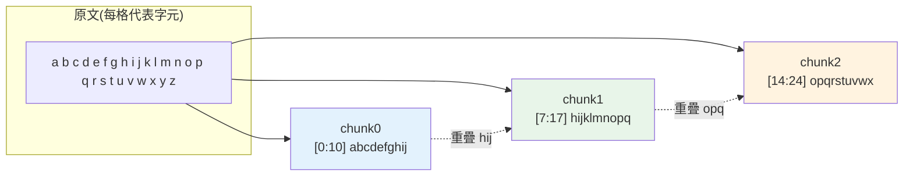

# 文件 chunking 與檢索策略

> [RAG](01-rag-pipeline.md) 的品質**上限由檢索決定**,而檢索的品質**從 chunking(分塊)開始**。你把文件切成什麼樣的片段,決定了 embedding 能不能抓到語意、檢索能不能命中、塞進 context 的內容有沒有用。這章講如何把文件切好——固定大小、重疊、按語意/結構切,以及各自的取捨。

## 💡 白話導讀(建議先讀)

[RAG](01-rag-pipeline.md) 有一條殘酷的定律:**檢索的品質決定答案的上限**,
而檢索的品質**從「怎麼切文件」就決定了**。切壞了,後面模型再強也救不回來——
這是最多人忽略、卻最關鍵的一步。

為什麼要切?因為你不能把整本 500 頁的手冊塞進模型([context 有上限](../28-llm-genai/01-llm-fundamentals.md)),
得切成小段,才能「只撈出相關的那幾段」。問題是**切在哪裡**,是一門張力的藝術:

- **切太大**:一段塞了五個主題,語意被稀釋——撈出來一大坨,相關的重點被雜訊淹沒,又貴。
- **切太小**:把「因為 X,所以 Y」硬切成兩半——單獨撈出「所以 Y」誰看得懂?語意破碎。

所以目標是:**每一塊都語意自足**(單獨拿出來也讀得懂、能回答問題),又不臃腫。

這章給你一整套切法,由笨到聰明:

- **固定大小 + 重疊(overlap)**:每 N 個 token 切一段,相鄰段**重疊**一小截——
  重疊是為了避免「答案剛好被切在接縫上」而兩邊都撈不全。
- **按結構切**:沿著段落、標題、Markdown 章節切——尊重文件本來的語意邊界,通常更好。
- **語意切分**:偵測「主題轉換」的地方才切——最聰明,也最花工。

還有進階招式:**父子分塊**(用小塊精準檢索、回傳它所屬的大塊給模型看全貌)。
沒有唯一正解,但這章教你按文件類型選對策略,並用 [RAG 評估](04-rag-evaluation.md)驗證——
**chunking 是 RAG 的 CP 值最高的優化點**。

## Why(為什麼)

為什麼不整份文件直接 embed 就好?三個問題:

- **context 塞不下 / 很貴**:一份 100 頁 PDF 有幾十萬 token,塞不進 prompt,就算塞得下也[貴到爆](../28-llm-genai/08-cost-latency-caching.md)。RAG 只想給模型**相關的那幾段**,不是整本書。
- **embedding 會「語意稀釋」**:embedding 把一段文字壓成**一個**向量。文字越長、涵蓋越多主題,這個向量就越「平均」、越模糊——一段講了 5 件事的長文,它的向量誰都不像。切成小片段,每片專注一個主題,向量才**銳利**、檢索才準。
- **檢索粒度**:使用者問一個具體問題,你想檢索到**剛好回答那個問題的那一小段**,不是「包含答案的那一整章」。粒度太粗,相關資訊被無關內容淹沒。

所以要 **chunking**:把文件切成**大小適中、語意完整**的片段,再各自 embed、存索引。**怎麼切**是門學問——切太大語意稀釋、切太小語意破碎(一句話被切兩半、失去上下文)。這章講常見策略與取捨。

## Theory(理論:chunking 的核心張力)

chunking 在兩個目標間拉扯:

- **語意完整**:一個 chunk 應是**自足**的——包含足夠上下文,讓它被單獨檢索出來時仍可理解、可回答問題。切太細會破壞這點(把「因為 X,所以 Y」切成兩半)。
- **粒度精準 + 省成本**:chunk 越小,檢索越精準、context 越省。切太大會語意稀釋、塞不下、貴。

**兩個關鍵參數**:

- **chunk size(片段大小)**:每片多長(字元/token)。太大稀釋、太小破碎。常見 200–1000 token,依內容調。
- **overlap(重疊)**:相鄰片段**重疊**一部分。為什麼?怕答案剛好落在切割線上——「...退貨要在 | 7 天內...」被切兩半,兩片都不完整。重疊讓邊界的資訊在**兩片都出現**,不會漏。代價是儲存/成本略增。常見 overlap 為 size 的 10–20%。

**chunking 策略**(由粗到細):

1. **固定大小(fixed-size)**:每 N 字元切一刀 + overlap。最簡單、通用,但可能切斷句子/語意。
2. **按結構(structural)**:依段落、標題、Markdown section、程式碼函式切。尊重文件的自然邊界,語意較完整。
3. **按語意(semantic)**:用句子/語意相似度找「話題轉折」處切。最貼語意,但最複雜(要額外算)。

## Specification(規範:策略與參數)

| 策略 | 怎麼切 | 優點 | 缺點 | 適用 |
|------|--------|------|------|------|
| 固定大小 + overlap | 每 N 字元/token,重疊 M | 簡單、通用、可控大小 | 可能切斷語意 | 通用、非結構化文字 |
| 按句子 | 句號斷句,累積到上限 | 不切斷句子 | 大小不均 | 一般散文 |
| 按段落/結構 | 段落、標題、`##` section | 語意完整、尊重結構 | 大小不均、需解析 | Markdown/HTML/有結構文件 |
| 按語意 | 相鄰句 embedding 相似度低處切 | 最貼語意 | 貴、複雜 | 高品質需求 |
| 遞迴(recursive) | 先試大分隔符(段落),太大再退而求其次(句、字) | 兼顧結構與大小 | 實作較繁 | 實務常用預設 |

**經驗參數**:chunk size 200–1000 token、overlap 為 size 的 10–20%。**沒有萬用值**——依內容(程式碼 vs 散文 vs 表格)、embedding 模型、問題類型調,用 [RAG 評估](04-rag-evaluation.md) 量化後迭代。

**進階**:**中繼資料(metadata)**——每個 chunk 附來源(檔名、頁碼、章節),讓答案可溯源、可過濾(見 [向量庫](../28-llm-genai/07-vector-databases.md) 的 metadata 過濾)。

## Implementation(底層:overlap 步長、遞迴切分)

**固定大小 + overlap 的步長**:每次前進的距離是 `size - overlap`(不是 `size`)。若 size=1000、overlap=200,第一片 `[0:1000]`、第二片 `[800:1800]`、第三片 `[1600:2600]`……相鄰片共享 200 字元。**重疊越大,冗餘越多、chunk 數越多、成本越高**——這是「不漏答案」的代價。

**為什麼 overlap 有效**:答案可能橫跨切割線。無 overlap 時,「保固期為 | 兩年」被切開,檢索到任一片都不完整;有 overlap,「保固期為兩年」在某一片完整出現。**overlap 是保險,不是免費**——夠用即可,別過大。

**遞迴切分(recursive character splitting)** 是實務最常用的預設(LangChain 的 `RecursiveCharacterTextSplitter`):給一個**分隔符優先序** `["\n\n", "\n", "。", " ", ""]`,先用最強的邊界(段落)切;若某片仍超過 size,就用次強的(換行、句號…)再切。這樣**盡量沿自然邊界切**,同時保證不超過 size——兼顧語意完整與大小可控。

**單句超過上限怎麼辦**:按句子切時,若**一句話本身就超過 max**,通常保留整句(不硬切),寧可略超也不破壞語意——見下面範例最後一片。下面範例實作固定大小 + overlap 與按句子兩種策略。

## Code Example(可執行的 Python 範例)

```python
# chunking.py — 文件 chunking 策略:固定大小 + overlap、按句子(純標準庫)
from __future__ import annotations

import re


def chunk_fixed(text: str, size: int, overlap: int) -> list[str]:
    """固定大小 + overlap:每片 size 字元,相鄰重疊 overlap;步長 = size - overlap。"""
    if overlap >= size:
        raise ValueError("overlap 必須小於 size")
    chunks: list[str] = []
    start = 0
    while start < len(text):
        chunks.append(text[start : start + size])
        start += size - overlap
    return chunks


def chunk_by_sentence(text: str, max_chars: int) -> list[str]:
    """按句子切:累積句子到接近 max_chars 才換片;單句超長則保留整句(不硬切)。"""
    sentences = [s for s in re.split(r"(?<=[。!?])", text) if s]
    chunks: list[str] = []
    current = ""
    for sent in sentences:
        if len(current) + len(sent) > max_chars and current:
            chunks.append(current)  # 目前累積夠長,先收一片
            current = sent
        else:
            current += sent
    if current:
        chunks.append(current)
    return chunks


def main() -> None:
    text = "abcdefghijklmnopqrstuvwxyz"
    fixed = chunk_fixed(text, size=10, overlap=3)
    print("固定大小 size=10 overlap=3(步長 7):")
    for c in fixed:
        print(f"  {c!r} (len={len(c)})")

    doc = "Python 很好。它易學。GIL 限制平行。asyncio 解決 IO。"
    print("\n按句子 max_chars=12:")
    for i, c in enumerate(chunk_by_sentence(doc, max_chars=12)):
        print(f"  [{i}] len={len(c)}")


if __name__ == "__main__":
    main()
```

**預期輸出**:

```pycon
$ python chunking.py
固定大小 size=10 overlap=3(步長 7):
  'abcdefghij' (len=10)
  'hijklmnopq' (len=10)
  'opqrstuvwx' (len=10)
  'vwxyz' (len=5)
按句子 max_chars=12:
  [0] len=10
  [1] len=4
  [2] len=9
  [3] len=14
```

逐段解說:

- **`chunk_fixed`**:步長 = `size - overlap` = 10 − 3 = 7,所以片段從 index 0、7、14、21 開始。看相鄰片的重疊:`abcdefghij` 與 `hijklmnopq` 共享 `hij`(3 字元)——**邊界資訊不會漏**。最後一片不足 size 就取到結尾。
- **`chunk_by_sentence`**:用 `(?<=[。!?])` 在標點**後**斷句(lookbehind 保留標點),累積句子直到超過 `max_chars` 才收一片。`Python 很好。`(10)先成一片;`它易學。`(4)自成一片(加上前面會超 12);依此類推。
- **注意最後一片 len=14 > max_chars=12**:因為 `asyncio 解決 IO。` 本身就 14 字元——**單句超長時保留整句**,寧可略超也不硬切破壞語意。這是刻意的設計取捨。
- **實務**:用成熟的遞迴切分器(如 LangChain `RecursiveCharacterTextSplitter`),它結合結構邊界與大小上限;但理解上面的步長/overlap 原理,才知道怎麼調參與 debug。

## Diagram(圖解:固定大小 + overlap)



## Best Practice(最佳實踐)

- **預設用遞迴切分器**(結構邊界 + 大小上限),別自己從零寫。
- **overlap 設 size 的 10–20%**:防止答案落在切割線上被切斷。
- **尊重結構**:Markdown 按 `##`、程式碼按函式/類別、有標題就沿標題切——語意較完整。
- **附 metadata**:每個 chunk 記來源(檔名、頁碼、章節),可溯源、可過濾。
- **chunk size 依內容調**:程式碼、表格、散文適合的大小不同;用 [RAG 評估](04-rag-evaluation.md) 量化後迭代。
- **單句超長保留整句**,別硬切破壞語意。
- **考慮 late chunking / contextual retrieval**(進階):給每片加一句「它在整份文件的定位」摘要,提升檢索命中。

## Common Mistakes(常見誤解)

- **chunk 太大**:語意稀釋(向量誰都不像)、context 塞不下、貴。
- **chunk 太小**:語意破碎,單獨檢索出來看不懂(缺上下文)。
- **沒有 overlap**:答案落在切割線上被切斷,兩片都不完整,檢索不到。
- **overlap 過大**:冗餘爆炸,chunk 數與成本大增。
- **忽略文件結構**:硬用固定大小切 Markdown/程式碼,把標題和內文、函式簽章和主體切散。
- **不附 metadata**:答案無法溯源、無法按來源過濾。
- **以為有「最佳 chunk size」**:沒有——依內容、模型、問題調,要靠[評估](04-rag-evaluation.md)。
- **切完不評估**:chunking 是 RAG 品質的源頭,改了要用評估驗證是否變好。

## Interview Notes(面試重點)

- **能說明為何要 chunking**:context 限制 + embedding 語意稀釋 + 檢索粒度。
- **能解釋 chunk size 與 overlap 的取捨**:太大稀釋、太小破碎;overlap 防切割線切斷答案,步長 = size − overlap。
- **能列 chunking 策略**:固定大小、按句/段/結構、語意、遞迴切分(實務預設)。
- **知道要附 metadata**(來源、頁碼)供溯源與過濾。
- **知道沒有萬用參數**,要用 [RAG 評估](04-rag-evaluation.md) 迭代。
- **加分**:contextual retrieval / late chunking 等提升檢索命中的進階技巧。

---

➡️ 下一章:[混合檢索與 rerank(BM25 + 向量)](03-hybrid-retrieval-rerank.md)

[⬆️ 回 Part 29 索引](README.md)
