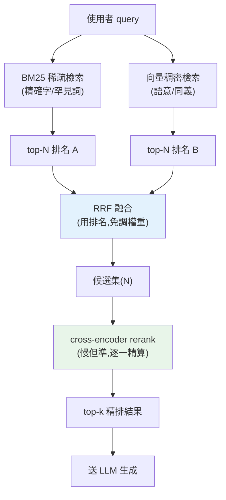

# 混合檢索與 rerank(BM25 + 向量)

> 純語意([向量](../28-llm-genai/06-embeddings-semantic-search.md))檢索有盲點:遇到專有名詞、產品型號、程式碼識別字、罕見縮寫,它常輸給老派的**關鍵字**檢索。反過來,關鍵字不懂同義與換句話說。**混合檢索(hybrid search)** 把兩者合起來,再用 **rerank(重排)** 精修排序——這是生產級 RAG 拉高檢索品質的標準組合。

## 💡 白話導讀(建議先讀)

[純語意(向量)檢索](../28-llm-genai/06-embeddings-semantic-search.md)很強,但有個盲點:
遇到**專有名詞、產品型號、人名、錯誤碼**(如「錯誤碼 E-4021」),
它可能因為「意思相近」撈回一堆語意像、但**那個關鍵字根本不對**的東西。
這章講怎麼補上這個洞,把檢索做到生產級。

兩種檢索是互補的兩隻眼睛:

- **關鍵字檢索(稀疏,BM25)＝精確比對**:認得「E-4021」這種**字面**必須一致的東西,
  可解釋、無需訓練。老派但可靠。
- **語意檢索(稠密,向量)＝理解意思**:搜「怎麼退錢」找得到「退款流程」,
  但對精確字串不敏感。

**混合檢索(hybrid)** 就是**兩隻眼睛一起用**:兩邊各撈一批,
再用 **RRF(倒數排名融合)** 這類方法把兩份排名合併——
關鍵字和語意都認同的,排最前。魚與熊掌兼得。

撈回來之後還有殺手鐧——**重排(rerank)**:
初步檢索為了快,用的是「粗略但便宜」的方法,難免混入次相關的結果。
**reranker**(一種更精準但較慢的模型)只對這**一小批候選**重新精算相關度、
把最相關的頂上來。這就是「**先海選、再精挑**」——
海選(retrieval)要快要廣(高召回),精挑(rerank)要準(高精確)。

這個「召回 + 精排」兩段式,是搜尋引擎與推薦系統的通用架構,
也是把 RAG 從「堪用」推到「好用」的關鍵一躍。這章實作 BM25、向量、RRF 融合與 rerank。

## Why(為什麼)

[RAG 全流程](01-rag-pipeline.md)用語意檢索找相關片段,但**純語意檢索會漏**:

- **專有名詞/精確匹配**:使用者問「錯誤碼 `E1042` 是什麼」、「`get_user_by_id` 這個函式」、「型號 `RTX-4090`」——這些**精確字串**的語意向量沒什麼「意思」,embedding 抓不準,反而傳統**關鍵字比對**一擊命中。
- **罕見詞 / 縮寫 / 代碼**:embedding 對訓練時少見的 token 表示力弱;關鍵字不管常不常見,字面對上就是對上。
- **反過來,關鍵字不懂語意**:「怎麼退貨」對不上「退換貨流程」(沒有共同字);「car」對不上「automobile」。這正是[向量檢索](../28-llm-genai/06-embeddings-semantic-search.md)的強項。

兩種方法**優缺互補**:向量懂語意但對精確字弱、關鍵字精確但不懂語意。**混合檢索**同時跑兩路、把結果**融合**,兼得兩者之長。融合後再加一道 **rerank**:用更精準(但更貴)的模型對候選重新打分排序,把最相關的頂上來。這套「**混合召回 + rerank 精排**」是生產級 RAG 提升檢索品質最有效、最常見的手段。

## Theory(理論:稀疏 vs 稠密、召回 vs 精排)

**兩種檢索的本質**:

- **稀疏檢索(sparse,關鍵字)**:文件表示成一個**超高維、多數為 0** 的向量(每維對應一個詞)。代表演算法 **BM25**——依詞頻(TF)、逆文件頻率(IDF)、文件長度算相關分。**精確匹配、可解釋、無需訓練**。
- **稠密檢索(dense,語意)**:文件表示成一個**低維、稠密**的 [embedding 向量](../28-llm-genai/06-embeddings-semantic-search.md),用[餘弦相似度](../28-llm-genai/06-embeddings-semantic-search.md)比意思。**懂同義、懂語境**,但對精確字/罕見詞弱。

**兩階段:召回(recall)→ 精排(rerank)**——這是搜尋/推薦系統的經典架構:

1. **召回**:用**快但粗**的方法(BM25 + 向量,各取 top-N,N 較大如 50)撈出候選集。目標是**別漏掉**相關文件(高 recall)。
2. **精排(rerank)**:用**慢但準**的方法(cross-encoder 重排模型)對這 N 個候選**逐一精算** query 與 doc 的相關度,取 top-k(小,如 5)。目標是**排序精準**(高 precision)。

為什麼分兩段?精排模型準但貴(每個候選都要跑一次模型),不可能對整個知識庫跑;所以先用便宜方法召回一小撮,再對這一小撮精排——**兼顧品質與成本**。

## Specification(規範:融合與 rerank)

**融合兩路結果**——最常用 **RRF(Reciprocal Rank Fusion,倒數排名融合)**:

不看原始分數(BM25 分和餘弦分**量綱不同、不可直接相加**),只看**排名**。每個文件的融合分:

```text
RRF_score(d) = Σ_over_each_ranking  1 / (k + rank_in_that_ranking(d))
```

`rank` 從 0 起算,`k` 是平滑常數(常用 60)。文件在**任一路排得越前面**,貢獻越大;在**多路都出現**,分數疊加。RRF 的好處:**不需要調兩路分數的權重、不受量綱影響、簡單穩健**。

**rerank(重排)**——用 **cross-encoder**:

- 一般檢索用 **bi-encoder**:query 和 doc **各自**編碼成向量,再算相似度(快,可預先算 doc 向量)。
- **cross-encoder**:把 `[query, doc]` **一起**餵進模型,直接輸出相關分。因為 query 和 doc 有**交互注意力**,判斷更準;但**每個候選都要跑一次、無法預算**,所以只用在召回後的小候選集。商用如 Cohere Rerank、開源如 `bge-reranker`。

## Implementation(底層:BM25、RRF、為何 cross-encoder 更準)

**BM25 直覺**:一個詞對某文件的貢獻 = **TF**(這詞在文件出現幾次,越多越相關,但有飽和上限)× **IDF**(這詞在整個語料多罕見,越罕見越有鑑別力)。所以「the」這種到處都有的詞 IDF 低、幾乎不貢獻;「E1042」這種罕見詞 IDF 高、一命中就大幅拉分。下面範例用簡化版(`tf * log(N/df + 1)`)示意,真實 BM25 還含文件長度正規化與可調參數 `k1`、`b`。

**為何 RRF 用排名而非分數**:BM25 分可能是 0～20、餘弦分是 −1～1,直接相加 BM25 會壓垮餘弦。用**排名**就把兩者放到同一個尺度(第 1 名就是第 1 名),`1/(k+rank)` 讓前段名次差異大、後段趨於平緩——穩健又免調權重。

**為何 cross-encoder 更準**:bi-encoder 把 query 和 doc 壓成兩個**獨立**向量,壓縮時already丟了細節,比對時看不到彼此;cross-encoder 讓 query 的每個詞**直接注意** doc 的每個詞(交互),能捕捉「這個 query 詞是否被這個 doc 精確回應」的細膩訊號——代價是計算量大(N 個候選要跑 N 次),故只用於精排小候選集。下面範例實作 BM25-lite + 向量 + RRF 融合(rerank 概念以更精準的重算分數示意)。

## Code Example(可執行的 Python 範例)

```python
# hybrid_retrieval.py — 混合檢索:BM25-lite + 向量 + RRF 融合(需要 numpy)
from __future__ import annotations

import math

import numpy as np

# 文件已斷詞(以空白分隔;中文正式系統用 jieba 等斷詞器)
DOCS: dict[str, str] = {
    "d1": "python asyncio 事件迴圈 並發 io",
    "d2": "python gil 多執行緒 平行",
    "d3": "貓 哺乳類 動物 可愛",
}


def tokenize(text: str) -> list[str]:
    return text.lower().split()


def bm25_lite(query: str, docs: dict[str, str]) -> dict[str, float]:
    """簡化 BM25:tf * log(N/df + 1)。真實版另含文件長度正規化與 k1/b 參數。"""
    q_terms = tokenize(query)
    n_docs = len(docs)
    df = {t: sum(1 for d in docs.values() if t in tokenize(d)) for t in set(q_terms)}
    scores: dict[str, float] = {}
    for doc_id, text in docs.items():
        toks = tokenize(text)
        scores[doc_id] = sum(
            toks.count(t) * math.log(n_docs / df[t] + 1) for t in q_terms if df.get(t)
        )
    return scores


def mock_embed(text: str) -> np.ndarray:
    v = np.zeros(3)
    if "asyncio" in text or "並發" in text:
        v += [1, 0, 0]
    if "gil" in text or "多執行緒" in text:
        v += [0, 1, 0]
    if "貓" in text or "動物" in text:
        v += [0, 0, 1]
    return v


def vector_scores(query: str, docs: dict[str, str]) -> dict[str, float]:
    qv = mock_embed(query)
    out: dict[str, float] = {}
    for doc_id, text in docs.items():
        dv = mock_embed(text)
        out[doc_id] = float(np.dot(qv, dv) / (np.linalg.norm(qv) * np.linalg.norm(dv) + 1e-9))
    return out


def rank(scores: dict[str, float]) -> list[str]:
    return sorted(scores, key=lambda d: scores[d], reverse=True)


def reciprocal_rank_fusion(rankings: list[list[str]], k: int = 60) -> list[str]:
    """RRF:只看排名不看分數,融合多路檢索結果。"""
    fused: dict[str, float] = {}
    for ranking in rankings:
        for position, doc_id in enumerate(ranking):
            fused[doc_id] = fused.get(doc_id, 0.0) + 1 / (k + position + 1)
    return rank(fused)


def hybrid_search(query: str, docs: dict[str, str]) -> list[str]:
    kw_rank = rank(bm25_lite(query, docs))
    vec_rank = rank(vector_scores(query, docs))
    return reciprocal_rank_fusion([kw_rank, vec_rank])


def main() -> None:
    query = "gil 並發"  # 同時含精確關鍵字(gil)與語意詞(並發)
    print(f"query: {query}")
    print("BM25 排名:", rank(bm25_lite(query, DOCS)))
    print("向量排名:", rank(vector_scores(query, DOCS)))
    print("混合(RRF):", hybrid_search(query, DOCS))


if __name__ == "__main__":
    main()
```

**預期輸出**:

```pycon
$ python hybrid_retrieval.py
query: gil 並發
BM25 排名: ['d1', 'd2', 'd3']
向量排名: ['d1', 'd2', 'd3']
混合(RRF): ['d1', 'd2', 'd3']
```

逐段解說:

- **`bm25_lite`**:query `gil 並發`——`gil` 只在 d2 出現(IDF 高)、`並發` 只在 d1 出現(IDF 高),所以 **d1、d2 都得高分**(各命中一個罕見詞),d3 命中 0。BM25 靠**精確字面 + 罕見度**打分。
- **`vector_scores`**:語意上 `gil` 對應 d2、`並發` 對應 d1,兩者向量都與 query 有夾角,**d1、d2 相似度都高**,d3 為 0。向量靠**語意相近**打分。
- **`reciprocal_rank_fusion`**:兩路都把 d1、d2 排前、d3 墊底,RRF 融合後 **d1、d2 穩居前二**,把不相關的 d3 壓到最後。這就是混合的價值:**兩路都認同的、更可信**。
- **關鍵**:BM25 擅長精確字(產品型號、錯誤碼、函式名),向量擅長語意(同義、換句話說);RRF 用排名融合,**免調權重、不受量綱影響**。
- **rerank(下一步)**:對 RRF 的 top-N 候選,再用 cross-encoder 逐一精算 query-doc 相關度、取 top-k——本例候選少省略,生產級務必加。

## Diagram(圖解:混合召回 + rerank)



## Best Practice(最佳實踐)

- **生產級 RAG 用混合檢索**:BM25 + 向量,別只靠單一路——尤其有專有名詞/代碼/型號時。
- **用 RRF 融合**:免調兩路權重、不受分數量綱影響、簡單穩健。
- **召回多、精排少**:各路召回 top-N(如 50),融合後 rerank 取 top-k(如 5)。
- **加 rerank(cross-encoder)**:對候選精排,顯著提升 top-k 相關度(Cohere Rerank / bge-reranker)。
- **中文要斷詞**:BM25 依賴 token,中文用 jieba 等斷詞器,別用空白切。
- **用 [RAG 評估](04-rag-evaluation.md) 量化**:混合/rerank 是否真的比單路好,要用指標驗證,別憑感覺。
- **注意 rerank 的延遲成本**:多一次模型呼叫,對延遲敏感場景要權衡(見 [成本延遲](../28-llm-genai/08-cost-latency-caching.md))。

## Common Mistakes(常見誤解)

- **只用向量檢索**:遇到型號、錯誤碼、函式名、罕見縮寫就漏。
- **只用關鍵字**:遇到同義、換句話說就漏。
- **直接相加 BM25 分和餘弦分**:量綱不同,BM25 壓垮餘弦;要用 RRF(排名)或先正規化。
- **不做 rerank**:融合後 top-k 排序仍不夠精,漏掉最相關的。
- **對整個知識庫跑 cross-encoder**:太慢太貴;rerank 只用於召回後的小候選集。
- **中文用空白斷詞**:切不出詞,BM25 失效;要用斷詞器。
- **改了檢索不評估**:無法確認混合/rerank 真的更好。
- **召回 N 設太小**:相關文件在召回階段就被漏掉,rerank 再強也救不回。

## Interview Notes(面試重點)

- **能說明混合檢索的動機**:向量懂語意但對精確字弱、關鍵字精確但不懂語意,兩者互補。
- **能對比稀疏(BM25)vs 稠密(embedding)**:精確匹配/可解釋 vs 語意/同義。
- **能解釋召回 → 精排兩階段**:便宜方法召回一撮(高 recall)、貴模型精排(高 precision),兼顧品質與成本。
- **能解釋 RRF**:用排名而非分數融合,免調權重、不受量綱影響。
- **能對比 bi-encoder vs cross-encoder**:各自編碼(快、可預算)vs 一起編碼有交互注意力(準、只用於精排)。
- **知道中文要斷詞、要用評估量化改善**。

---

➡️ 下一章:[RAG 評估與 eval 驅動迭代](04-rag-evaluation.md)

[⬆️ 回 Part 29 索引](README.md)
