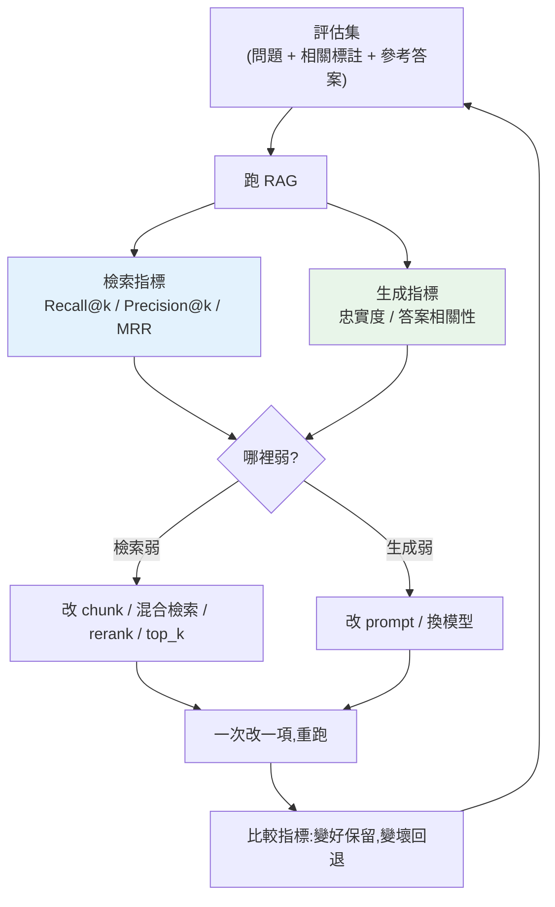

# RAG 評估與 eval 驅動迭代

> RAG 有太多旋鈕:[chunk 大小](02-chunking-strategies.md)、overlap、top_k、[混合檢索權重](03-hybrid-retrieval-rerank.md)、要不要 rerank、prompt 寫法、換哪個模型……每個都會影響品質。問題是——**你怎麼知道改了以後變好還是變壞?** 靠「感覺」試幾個問題不算數。這章講如何**量化** RAG 品質,用資料驅動迭代,而不是憑感覺瞎調。

## Why(為什麼)

RAG 系統的殘酷現實:**你調的每個參數都可能讓某些問題變好、某些問題變壞**。把 chunk 改小,精確問題變準了,但需要大段上下文的問題變差了;加了 rerank,多數問題變好,但延遲翻倍、少數問題被 rerank 排錯。**沒有量化,你在盲改**——手動試三五個問題「看起來還行」就上線,結果對真實使用者的一堆問題爛掉。

這正是 [LLM 評估](../28-llm-genai/09-evaluation.md) 的延伸,但 RAG 有**額外的評估維度**:不只「答案好不好」,還要拆開看「**檢索**準不準」和「**生成**忠不忠實」。因為 RAG 失敗有兩種截然不同的根因:

- **檢索錯**:根本沒撈到含答案的片段——再強的 LLM 也巧婦難為無米之炊。
- **生成錯**:撈到了對的片段,但 LLM 沒用好(忽略 context、幻覺、答非所問)。

這兩種要**分開量測**,才知道該去修 chunking/檢索,還是修 prompt/模型。**eval 驅動開發(eval-driven development)**——先建評估集與指標,任何改動都用它量化——是把 RAG 從「玄學調參」變成「工程」的關鍵。

## Theory(理論:RAG 的評估維度)

RAG 品質拆成**檢索**與**生成**兩層,各有指標:

**檢索指標**(檢索器有沒有撈到相關片段?需要標註「哪些片段對這問題相關」的評估集):

- **Recall@k(召回率)**:前 k 個結果中,含相關片段的比例。答案在不在撈回來的東西裡?**RAG 的地基**——recall 低,後面全白搭。
- **Precision@k(精確率)**:前 k 個中相關的比例。撈回來的有多少是真相關(別塞太多雜訊)。
- **MRR(Mean Reciprocal Rank,平均倒數排名)**:第一個相關片段排在第幾位的倒數(排第 1 → 1.0、第 2 → 0.5、第 3 → 0.33)。**相關的有沒有排在前面**(排序品質)。
- **NDCG**:考慮多個相關片段的排序品質(進階)。

**生成指標**(有了 context,答案好不好?常用 [LLM-as-judge](../28-llm-genai/09-evaluation.md)):

- **忠實度(faithfulness / groundedness)**:答案的每個宣稱是否**被 context 支持**?抓幻覺的關鍵——答案不能超出檢索到的事實。
- **答案相關性(answer relevance)**:答案有沒有真的回答問題(別答非所問)。
- **context 相關性(context relevance)**:檢索到的 context 對問題有多相關(呼應檢索指標)。

這三個(context 相關、忠實度、答案相關)常合稱 **RAG triad**。

## Specification(規範:評估集與指標)

**評估集(evaluation set)** 的組成——每筆:

- **問題(query)**
- **相關片段標註**(哪些 doc_id 對此問題相關)——算檢索指標用。
- **參考答案(ground truth,可選)**——算生成品質用。

**怎麼建評估集**:人工標註(準但貴)、從文件用 LLM 生成問答對(快,需抽查)、上線後收集真實問題 + 使用者回饋(最真實)。**由小做起**(20–50 題涵蓋主要類型)勝過沒有。

**指標公式**:

```text
Recall@k    = |前 k 個 ∩ 相關集| / |相關集|
Precision@k = |前 k 個 ∩ 相關集| / k
MRR         = 1 / (第一個相關片段的排名)         # 排名從 1 起算,沒命中為 0
Faithfulness= 被 context 支持的宣稱數 / 總宣稱數
```

**迭代流程**:建評估集 → 跑 baseline 得指標 → 改一個參數(chunk/top_k/rerank/prompt)→ 重跑 → **比較指標** → 保留變好的、回退變壞的 → 重複。**一次只改一個變數**,才知道是哪個改動的功勞。

## Implementation(底層:離線指標 vs LLM-judge、為何分層)

**檢索指標是「離線可算」的**:只要有相關片段標註,Recall/Precision/MRR 都是**純集合運算**,快、便宜、確定性、可放 CI 天天跑。這是 RAG 評估的**第一道防線**——先確保檢索沒退化。

**生成指標多靠 LLM-as-judge**:忠實度、答案相關性難用規則判(要理解語意),常用一個 LLM 當裁判打分(見 [LLM-as-judge](../28-llm-genai/09-evaluation.md))。**注意**:judge 本身也會錯、也有成本,要用少量人工標註校準 judge、固定 judge 的 prompt 與模型版本。也有不靠 LLM 的近似法(如把答案拆成宣稱、檢查每個宣稱的關鍵字/實體是否在 context 出現——下面範例的簡化版)。

**為何一定要分層量測**:假設整體答對率從 70% 掉到 60%。若只看整體,你不知道去修哪。分層一看:Recall@5 從 0.9 掉到 0.6——問題在**檢索**(可能 chunk 改壞了),去修檢索,別浪費時間調 prompt。反之 Recall 沒變但忠實度掉了——問題在**生成**,去修 prompt/模型。**分層讓你定位根因**。下面範例實作檢索指標 + 簡化忠實度。

## Code Example(可執行的 Python 範例)

```python
# rag_eval.py — RAG 評估:檢索指標 + 簡化忠實度(純標準庫)
from __future__ import annotations


def recall_at_k(retrieved: list[str], relevant: list[str], k: int) -> float:
    """前 k 個結果中,含相關片段的比例(答案在不在撈回來的裡)。"""
    top = set(retrieved[:k])
    rel = set(relevant)
    return len(top & rel) / len(rel) if rel else 0.0


def precision_at_k(retrieved: list[str], relevant: list[str], k: int) -> float:
    """前 k 個中相關的比例(撈回來的雜訊多不多)。"""
    top = retrieved[:k]
    rel = set(relevant)
    return sum(1 for d in top if d in rel) / k if k else 0.0


def mrr(retrieved: list[str], relevant: list[str]) -> float:
    """第一個相關片段排名的倒數(相關的有沒有排前面)。"""
    rel = set(relevant)
    for i, doc in enumerate(retrieved):
        if doc in rel:
            return 1 / (i + 1)
    return 0.0


def faithfulness(claims: list[str], context: str) -> float:
    """簡化忠實度:答案的每個宣稱(關鍵字)是否出現在 context。
    真實版用 LLM-as-judge 判斷語意支持,而非字面比對。"""
    if not claims:
        return 0.0
    supported = sum(1 for c in claims if c in context)
    return supported / len(claims)


def evaluate_retrieval(cases: list[dict[str, list[str]]], k: int) -> dict[str, float]:
    """對整個評估集算平均檢索指標。"""
    n = len(cases)
    return {
        f"recall@{k}": sum(recall_at_k(c["retrieved"], c["relevant"], k) for c in cases) / n,
        f"precision@{k}": sum(precision_at_k(c["retrieved"], c["relevant"], k) for c in cases) / n,
        "mrr": sum(mrr(c["retrieved"], c["relevant"]) for c in cases) / n,
    }


def main() -> None:
    # 評估集:每題有檢索結果與相關片段標註
    eval_set = [
        {"retrieved": ["d3", "d1", "d5"], "relevant": ["d1"]},        # d1 排第 2
        {"retrieved": ["d2", "d4", "d1"], "relevant": ["d2", "d1"]},  # d2 第 1、d1 第 3
    ]
    metrics = evaluate_retrieval(eval_set, k=3)
    print("檢索指標(平均):")
    for name, value in metrics.items():
        print(f"  {name} = {value:.3f}")

    context = "python 由 guido 於 1991 發布 gil 限制平行"
    print("\n忠實度:")
    print(f"  全支持 ['guido','1991'] = {faithfulness(['guido', '1991'], context):.2f}")
    print(f"  半幻覺 ['guido','2050'] = {faithfulness(['guido', '2050'], context):.2f}")


if __name__ == "__main__":
    main()
```

**預期輸出**:

```pycon
$ python rag_eval.py
檢索指標(平均):
  recall@3 = 1.000
  precision@3 = 0.500
  mrr = 0.750

忠實度:
  全支持 ['guido','1991'] = 1.00
  半幻覺 ['guido','2050'] = 0.50
```

逐段解說:

- **`recall@3` = 1.0**:兩題的相關片段都在前 3 出現——**檢索沒漏**(地基穩)。
- **`precision@3` = 0.5**:case0 前 3 個只有 1 個相關(1/3)、case1 有 2 個相關(2/3),平均 0.5——撈回來的**有一半是雜訊**(可縮小 top_k 或加 rerank)。
- **`mrr` = 0.75**:case0 第一個相關排第 2(1/2=0.5)、case1 排第 1(1/1=1.0),平均 0.75——**相關的大致排在前面**,但 case0 有進步空間(rerank 可把它頂到第 1)。
- **`faithfulness`**:`['guido','1991']` 兩個宣稱都在 context → 1.0(**忠實**);`['guido','2050']` 只有 guido 被支持、2050 是**幻覺** → 0.5。真實版用 [LLM-as-judge](../28-llm-genai/09-evaluation.md) 判語意,不只字面比對。
- **怎麼用這些數字**:precision 偏低 → 調 top_k 或加 rerank;mrr 不夠高 → 加 rerank 改排序;忠實度低 → 修 prompt(強調「只依 context」)或換模型。**指標告訴你去修哪**。

## Diagram(圖解:eval 驅動迭代)



## Best Practice(最佳實踐)

- **先建評估集再調參**:20–50 題涵蓋主要問題類型,勝過憑感覺。
- **檢索、生成分層量測**:才知道去修檢索還是生成(定位根因)。
- **檢索指標放 CI**:離線、便宜、確定性,每次改動自動跑防退化。
- **忠實度優先(抓幻覺)**:RAG 最怕答案超出 context;把 faithfulness 當守門指標。
- **一次只改一個變數**:才知道是哪個改動的功勞。
- **LLM-judge 要校準**:用少量人工標註對齊 judge、固定 judge 版本(見 [評估](../28-llm-genai/09-evaluation.md))。
- **收集線上真實問題回饋**:最真實的評估集來源,持續擴充。
- **追蹤指標歷史**:每次改動記錄指標,看趨勢而非單點。

## Common Mistakes(常見誤解)

- **不評估,憑感覺調**:試三五題「看起來行」就上線,對真實流量爛掉。
- **只看整體答對率**:不分層,不知道該修檢索還是生成。
- **沒有評估集**:無法量化,改動變盲賭。
- **忽略檢索指標**:檢索漏了答案(recall 低),再怎麼調 prompt 都沒用。
- **一次改一堆參數**:分不清是哪個的功勞或禍首。
- **完全信任 LLM-judge**:judge 也會錯、有成本、版本漂移;要校準、固定版本。
- **評估集不更新**:蓋不到新問題類型,指標好看但實際爛。
- **忽略忠實度**:只看答案「像不像對的」,沒抓答案有沒有超出 context(幻覺)。

## Interview Notes(面試重點)

- **能說明為何 RAG 要分層評估**:失敗根因分檢索錯 vs 生成錯,分開量測才能定位。
- **能列檢索指標**:Recall@k(有沒有撈到)、Precision@k(雜訊多不多)、MRR(排序好不好)。
- **能列生成指標(RAG triad)**:context 相關、忠實度(抓幻覺)、答案相關。
- **能解釋 eval 驅動迭代**:建評估集 → 量 baseline → 一次改一項 → 比指標 → 保留/回退。
- **知道檢索指標離線可算放 CI、生成指標多靠 LLM-judge(要校準)**。
- **知道 recall 是地基**(撈不到答案,後面全白搭)、忠實度是幻覺守門。

---

➡️ 下一章:[Agents、ReAct 與工具編排](05-agents-react.md)

[⬆️ 回 Part 29 索引](README.md)
