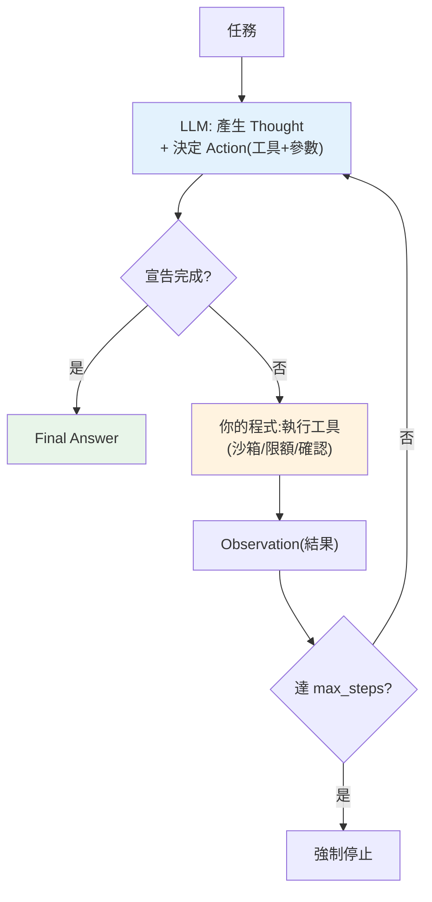

# Agents、ReAct 與工具編排

> [RAG](01-rag-pipeline.md) 讓 LLM 能查資料,但仍是「問一次、答一次」的單步流程。**Agent(代理人)** 更進一步:讓 LLM **自己決定要做哪些步驟、用哪些工具、依觀察結果調整**,循環往復直到解決任務。核心模式是 **ReAct(Reasoning + Acting)**——思考、行動、觀察的迴圈。這章講 agent 的原理、ReAct 迴圈,以及怎麼安全地編排工具。

## Why(為什麼)

有了 [tool use](../28-llm-genai/04-structured-output-tools.md),LLM 能呼叫一個工具。但真實任務常需要**多步、且步驟取決於中間結果**:

- 「幫我查台北人口的兩倍是多少」→ 要先**查**人口(工具 A),拿到數字再**算**兩倍(工具 B)。第二步的輸入來自第一步的結果——**無法預先寫死流程**。
- 「這個 bug 為什麼發生」→ 讀 log、查程式碼、跑測試、再讀更多 log……**下一步取決於上一步看到什麼**。
- 「訂一張最便宜的機票」→ 搜尋、比價、可能改日期再搜、確認、下單——**動態、多輪、有分支**。

這些任務的共同點:**步驟數與順序無法事先確定,要邊做邊決定**。[工作流(workflow)](09-frameworks.md) 適合流程固定的情況(你寫死步驟);但當**流程本身要由模型動態決定**,就需要 **agent**——讓 LLM 在一個**迴圈**裡:看現況 → 想下一步 → 執行工具 → 看結果 → 再想……直到完成。**ReAct** 是實現這迴圈最經典、最有效的模式。

⚠️ 但先記住(見 [claude-api 的「該不該建 agent」](../28-llm-genai/README.md)):**agent 貴、慢、難預測、可能失控**。能用單次呼叫或固定 workflow 解決的,別上 agent。只有任務**真的**多步、難預先指定、且值得這代價時才用。

## Theory(理論:ReAct 迴圈)

**ReAct = Reasoning + Acting**(推理 + 行動),交錯進行。每一輪 agent 產生三樣東西:

1. **Thought(思考)**:模型用自然語言推理「現在該做什麼、為什麼」。這是 chain-of-thought——把推理**外顯**,讓模型想清楚再動,也讓你能 debug。
2. **Action(行動)**:模型決定呼叫哪個**工具**、給什麼參數(對應 [tool use](../28-llm-genai/04-structured-output-tools.md))。
3. **Observation(觀察)**:工具執行的**結果**回饋給模型,成為下一輪的輸入。

然後**回到 Thought**,依觀察結果決定下一步——直到模型認為任務完成,輸出 **Final Answer**。

```text
Thought → Action → Observation → Thought → Action → Observation → … → Final Answer
```

**為什麼「思考」有用**:直接讓模型輸出動作,它容易亂跳、選錯工具。先「想」再「動」(把推理寫出來),模型的決策品質顯著提升——這是 [CoT](03-prompt-engineering.md 的延伸)在 agent 上的應用。**為什麼要「觀察」**:模型不是預先規劃好所有步驟,而是**看到真實結果再決定下一步**——這讓 agent 能適應意外(工具回錯、資料不如預期),比死板的預定流程健壯。

## Specification(規範:agent 的組成與控制)

**一個 agent 需要**:

- **LLM(大腦/policy)**:每輪決定 thought + action(或宣告完成)。
- **工具集(tools)**:agent 能呼叫的能力——搜尋、計算、查 DB、呼叫 API、[RAG 檢索](01-rag-pipeline.md)……每個工具有名稱、說明、參數 schema(見 [tool use](../28-llm-genai/04-structured-output-tools.md))。
- **迴圈驅動(orchestrator)**:你的程式碼,負責:送 prompt 給 LLM → 解析它要呼叫的工具 → **執行工具** → 把結果(observation)回饋 → 重複。
- **停止條件**:模型宣告 Final Answer,**或**達到 `max_steps` 上限(防無限迴圈)。

**關鍵控制**(agent 會失控,必須設防):

- **步數上限(max_steps)**:模型可能鬼打牆、反覆呼叫工具不收斂——**硬性上限**是安全網。
- **工具權限與沙箱**:agent 執行的是**模型決定**的動作——絕不能讓它跑任意程式碼、刪檔、無限花錢。**危險工具要沙箱、要人工確認(human-in-the-loop)、要限額**。
- **錯誤處理**:工具會失敗;要把錯誤當 observation 回饋給模型,讓它重試或換路(而非整個崩潰)。
- **可觀測性**:記錄每一步 thought/action/observation,才能 debug、算成本、抓失控。

## Implementation(底層:現代 agent 靠原生 tool use、迴圈由你掌控)

**兩種實作 ReAct 的方式**:

- **文字解析(舊)**:prompt 教模型輸出固定格式文字(`Thought: ...\nAction: ...\nAction Input: ...`),你用正則解析。脆弱——模型格式跑掉就爆。
- **原生 tool use(現代,推薦)**:用模型的[結構化 tool use](../28-llm-genai/04-structured-output-tools.md)——模型回傳結構化的 `tool_use` block(工具名 + 參數 JSON),你執行後把結果當 `tool_result` 送回。**穩、免解析、官方支援**。Claude 的 agentic loop 就是這樣:`stop_reason == "tool_use"` 時執行工具、回饋、再呼叫,直到 `stop_reason == "end_turn"`。

**迴圈是「你的程式碼」在跑,不是模型**:很多人誤以為 agent 是模型自己一直跑。實際上——**模型只負責「決定下一步」,執行工具、回饋結果、控制迴圈的是你的程式**。這點很重要:代表**你**掌握所有控制權(可設上限、可攔截危險動作、可加人工確認、可記錄)。模型不能自己執行任何東西,它只能「請求」呼叫工具,由你決定要不要真的執行。

**為何 max_steps 不可省**:LLM 可能陷入迴圈——反覆呼叫同一工具、或兩個工具間震盪、或永遠覺得「還沒完成」。沒有上限,agent 會燒光你的 [token 預算](../28-llm-genai/08-cost-latency-caching.md)或卡死。下面範例實作一個最小 ReAct 迴圈(mock policy 代替 LLM,聚焦迴圈結構)。

## Code Example(可執行的 Python 範例)

```python
# react_agent.py — 最小 ReAct 迴圈:Thought → Action → Observation(mock policy)
from __future__ import annotations

from dataclasses import dataclass


# --- 工具集 ---
def calculator(expr: str) -> str:
    """算術計算。⚠️ 示範用受限 eval;正式環境務必用安全的運算式解析(見下方警告)。"""
    return str(eval(expr, {"__builtins__": {}}, {}))  # noqa: S307 - 教學示範,已限制 builtins


def lookup(name: str) -> str:
    """查資料(mock 知識庫)。"""
    db = {"台北人口": "約 250 萬(數字:2500000)", "地球半徑": "6371 公里"}
    return db.get(name, "查無資料")


TOOLS = {"calculator": calculator, "lookup": lookup}


@dataclass
class Step:
    thought: str
    action: str | None  # None 表示宣告完成
    action_input: str | None
    observation: str | None = None


def mock_policy(question: str, history: list[Step]) -> Step:
    """mock LLM policy:依問題與歷史決定下一步。真實由 LLM 產生 thought + tool_use。"""
    n = len(history)
    if question == "台北人口的兩倍是多少?":
        if n == 0:
            return Step("要先查台北人口", "lookup", "台北人口")
        if n == 1:
            return Step("查到 250 萬,換算成數字再乘 2", "calculator", "2500000*2")
        return Step("已算出答案,可以回答", None, None)
    return Step("直接回答", None, None)


def run_agent(question: str, max_steps: int = 5) -> list[Step]:
    """ReAct 迴圈:由『你的程式』驅動,模型只決定下一步。"""
    history: list[Step] = []
    print(f"問題:{question}")
    for _ in range(max_steps):  # max_steps 防止失控
        step = mock_policy(question, history)
        print(f"  [Thought] {step.thought}")
        if step.action is None:  # 模型宣告完成
            print("  [Final] 任務完成")
            return history
        observation = TOOLS[step.action](step.action_input or "")  # 你的程式執行工具
        done = Step(step.thought, step.action, step.action_input, observation)
        history.append(done)
        print(f"  [Action] {step.action}({step.action_input!r})")
        print(f"  [Observation] {observation}")
    print("  [Stop] 達到步數上限")
    return history


if __name__ == "__main__":
    run_agent("台北人口的兩倍是多少?")
```

**預期輸出**:

```pycon
$ python react_agent.py
問題:台北人口的兩倍是多少?
  [Thought] 要先查台北人口
  [Action] lookup('台北人口')
  [Observation] 約 250 萬(數字:2500000)
  [Thought] 查到 250 萬,換算成數字再乘 2
  [Action] calculator('2500000*2')
  [Observation] 5000000
  [Thought] 已算出答案,可以回答
  [Final] 任務完成
```

逐段解說:

- **迴圈結構**:每輪 `mock_policy` 產生 `Step`(thought + 要呼叫的 action)。真實中這是 LLM 呼叫,回傳 [結構化 tool_use](../28-llm-genai/04-structured-output-tools.md)。
- **第一輪**:模型想「要先查人口」→ 呼叫 `lookup` → observation「約 250 萬(2500000)」。它**沒有預先規劃兩步**,只是決定「現在該查」。
- **第二輪**:模型**看到 observation** 後才決定下一步——「換算數字再乘 2」→ 呼叫 `calculator` → observation「5000000」。這就是 ReAct 的精髓:**依觀察結果動態決定**。
- **第三輪**:模型判斷已有答案,`action=None` → 宣告 Final。
- **控制權在你手上**:`run_agent`(你的程式)驅動迴圈、執行工具、設 `max_steps`。模型只「請求」,執行與否由你決定。
- **⚠️ 安全**:`calculator` 用了 `eval`(即使限制 builtins 仍有風險)——**這只是示範**。正式環境:工具執行要沙箱、危險操作要人工確認、`eval` 改用安全的運算式解析器。**agent 執行的是模型決定的動作,信任邊界必須嚴守**(見 [Part 20 安全](../20-security-system-design/README.md))。

## Diagram(圖解:ReAct 迴圈)



## Best Practice(最佳實踐)

- **先問「真的需要 agent 嗎」**:能用單次呼叫或固定 [workflow](09-frameworks.md) 就別上 agent(貴、慢、難測)。
- **用原生 tool use 實作**,別靠文字解析(脆弱)。
- **一定要設 max_steps**:防止模型鬼打牆燒光預算。
- **工具執行要沙箱 + 限權**:agent 跑的是模型決定的動作,危險操作要隔離、限額、人工確認(human-in-the-loop)。
- **工具說明寫清楚**:名稱、用途、參數——模型靠說明決定用哪個(見 [tool use](../28-llm-genai/04-structured-output-tools.md))。
- **把工具錯誤當 observation 回饋**:讓模型重試/換路,而非崩潰。
- **全程記錄 thought/action/observation**:debug、算成本、抓失控的唯一依據。
- **工具少而精**:太多工具模型會選錯;聚焦任務真正需要的。

## Common Mistakes(常見誤解)

- **該用 workflow 卻上 agent**:流程其實固定,硬用 agent 徒增不確定性與成本。
- **不設 max_steps**:模型陷入迴圈,燒光 token 或卡死。
- **讓 agent 執行未沙箱的危險操作**:模型決定的動作直接跑 = 安全災難(刪檔、注入、花光錢)。
- **以為 agent 是模型自己跑**:迴圈是你的程式在驅動,控制權在你手上。
- **用文字格式解析 action**:格式跑掉就爆;用原生 tool use。
- **工具說明含糊**:模型選錯工具或給錯參數。
- **工具出錯就讓整個 agent 崩潰**:應把錯誤當 observation 回饋讓模型應對。
- **不記錄中間步驟**:agent 出錯完全無法 debug。

## Interview Notes(面試重點)

- **能解釋 ReAct**:Thought(推理)→ Action(呼叫工具)→ Observation(結果)迴圈,依觀察動態決定下一步。
- **能說明 agent vs workflow**:流程要模型動態決定 → agent;流程固定 → workflow(先選簡單的)。
- **能說明迴圈由誰驅動**:你的程式,模型只「請求」呼叫工具,執行與控制權在你。
- **知道必設 max_steps + 工具沙箱/限權**(agent 會失控、跑的是模型決定的動作)。
- **知道現代用原生 tool use 實作**(非文字解析),錯誤當 observation 回饋。
- **能判斷該不該用 agent**:複雜度/價值/可行性/錯誤成本四準則,能簡單解決就別上 agent。

---

➡️ 下一章:[MCP(Model Context Protocol)與工具生態](06-mcp.md)

[⬆️ 回 Part 29 索引](README.md)
