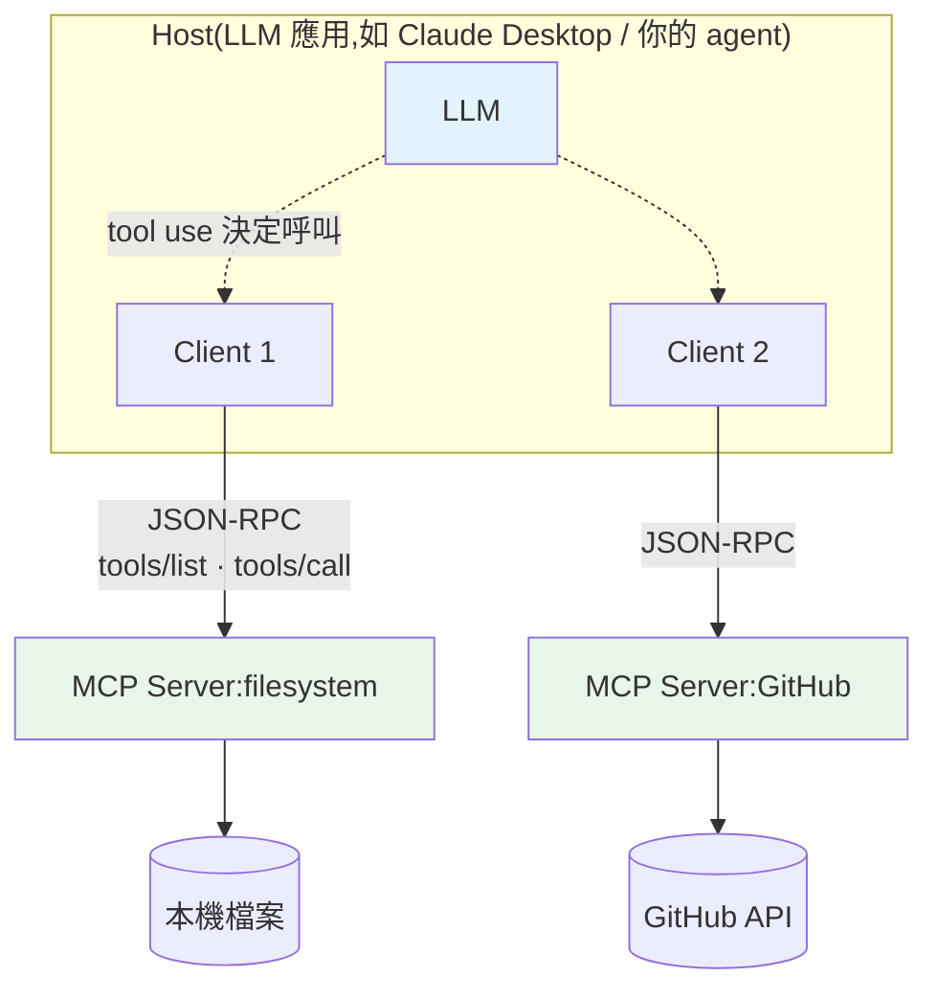

# MCP(Model Context Protocol)與工具生態

> 每個 [agent](05-agents-react.md) 都要接工具:查資料庫、讀檔案、呼叫 API、搜尋……但每接一個工具、每換一個 LLM 應用,你就要重寫一次接法——這是 M×N 的重工。**MCP(Model Context Protocol)** 是 Anthropic 於 2024 年底開源的**標準協定**,把「LLM 應用 ↔ 工具/資料源」的連接標準化,像 USB-C 之於周邊裝置。這章講 MCP 解決什麼、架構,以及怎麼用 Python 實作一個 MCP server。

## 💡 白話導讀(建議先讀)

[agent](05-agents-react.md) 要接一堆工具:查資料庫、讀檔案、呼叫 API、搜尋……
問題是——**每個 agent 框架接工具的方式都不一樣**。
你為 A 框架寫的「查資料庫工具」,換到 B 框架、換個模型,又要重寫一遍。
**N 個工具 × M 個 agent = N×M 種接法**,重複勞動的惡夢。

**MCP(Model Context Protocol,模型脈絡協定)** 就是來終結這件事的——
它是 AI 工具界的 **USB 標準**。

想想 USB 出現前:每種裝置一種接頭,滑鼠、印表機、隨身碟各插各的孔。
USB 統一之後,任何裝置只要做成 USB,插上任何電腦就能用。
MCP 對 AI 工具做的是同一件事:**你把工具/資料源包成一個標準的 MCP server,
任何支援 MCP 的 host(Claude Desktop、IDE、你的 agent)都能直接接上使用**——
一次實作,到處可用,N+M 取代 N×M。

它的架構是 client-server(基於 JSON-RPC):

- **Host**:使用者用的 LLM 應用(如 Claude Desktop)。
- **Server**:包裝某個能力的程式(檔案系統、資料庫、GitHub API…),
  對外暴露三種東西:**Tools**(可呼叫的動作)、**Resources**(可讀的資料)、
  **Prompts**(預設的提示模板)。

MCP 是 2024 年 Anthropic 推出、正在快速成為業界標準的協定。
這章帶你**用 Python 寫一個自己的 MCP server**、理解協定的三種能力,
並看它怎麼讓 agent 的工具生態從「各自為政」走向「隨插即用」。

## Why(為什麼)

沒有 MCP 之前,把工具接進 LLM 應用是**碎片化的重工**:

- 你有 **M 個** LLM 應用(Claude Desktop、你的客服 bot、IDE 助理…),每個要接 **N 個** 資料源/工具(Google Drive、Postgres、GitHub、內部 API…)。若每個應用各自實作每個接法,就是 **M×N** 種客製整合——每加一個工具要改所有應用,每加一個應用要重接所有工具。
- 每家工具/每個應用的接法**都不一樣**:工具怎麼宣告、參數怎麼傳、結果怎麼回、認證怎麼做——沒有標準,生態無法共享。
- 結果:大家重複造輪子,好用的工具整合無法跨應用複用。

**MCP** 把這變成 **M+N**:定義一套**標準協定**,規範「工具/資料源如何暴露能力」與「應用如何發現、呼叫這些能力」。工具方寫一個 **MCP server**(一次),任何支援 MCP 的應用(**MCP client/host**)都能接;應用方實作一次 MCP client,就能接上整個 MCP server 生態。**像 USB-C**——統一介面,周邊與主機各自遵循標準即可互通。這讓工具整合**可複用、可共享**,催生了一個快速成長的開源 MCP server 生態(檔案系統、GitHub、Slack、各種 DB、瀏覽器…)。

## Theory(理論:MCP 的角色與能力)

MCP 是 **client-server 架構**,基於 **JSON-RPC 2.0**:

**三種角色**:

- **Host(宿主)**:使用者互動的 LLM 應用(Claude Desktop、IDE 外掛、你的 agent app)。內含一或多個 client。
- **Client(客戶端)**:host 內、與**單一** server 維持連線的連接器。
- **Server(伺服器)**:暴露能力的程式——包裝某個工具/資料源(檔案系統、DB、API…)。

**Server 可暴露三類能力**:

- **Tools(工具)**:可被模型呼叫、會執行動作的函式(查天氣、寫檔、發訊息)。對應 [tool use](../28-llm-genai/04-structured-output-tools.md)——**模型控制**,agent 決定何時呼叫。
- **Resources(資源)**:可讀取的資料(檔案內容、DB 記錄、API 回應)。**應用控制**,像檔案一樣被讀。
- **Prompts(提示模板)**:預先寫好、可重用的 prompt 模板。**使用者控制**,像 slash command。

**傳輸(transport)**:本地用 **stdio**(host 啟動 server 子行程,透過標準輸入輸出通訊)、遠端用 **HTTP + SSE**(Streamable HTTP)。協定本身與傳輸無關。

## Specification(規範:核心方法與流程)

MCP 用 **JSON-RPC** 定義一組標準方法(節選):

| 方法 | 作用 |
|------|------|
| `initialize` | client/server 握手,協商協定版本與能力 |
| `tools/list` | 列出 server 提供的所有工具(名稱、說明、input schema) |
| `tools/call` | 呼叫某工具,傳參數,回結果 |
| `resources/list` / `resources/read` | 列出/讀取資源 |
| `prompts/list` / `prompts/get` | 列出/取得 prompt 模板 |

**典型流程**:

1. **連線 + 初始化**:host 啟動 server(或連上遠端),`initialize` 握手協商能力。
2. **發現(discovery)**:client 呼叫 `tools/list` 拿到工具清單(含 JSON Schema 描述)。
3. **提供給模型**:host 把這些工具轉成 LLM 的 [tool 定義](../28-llm-genai/04-structured-output-tools.md),放進 API 呼叫。
4. **執行**:模型決定呼叫某工具([agent 迴圈](05-agents-react.md))→ host 透過 client 發 `tools/call` → server 執行 → 回結果 → 當 observation 回饋模型。

**工具描述**含 `name`、`description`、`inputSchema`(JSON Schema)——和你手寫 tool use 的格式一致,差別是**來自 server 動態發現**,而非寫死在應用裡。

## Implementation(底層:MCP 與 tool use 的關係、安全)

**MCP 是「工具從哪來」的標準,tool use 是「模型怎麼用工具」的機制**——兩者互補。你在 [Part 28 tool use](../28-llm-genai/04-structured-output-tools.md) 手寫工具定義塞進 API;MCP 讓這些定義**從外部 server 動態發現**,你的應用不必為每個工具寫死程式碼。實務上:MCP client 呼叫 `tools/list` → 把回來的工具描述轉成 Anthropic API 的 `tools` 參數 → [agent 迴圈](05-agents-react.md) 跑起來,模型要呼叫工具時,client 轉發成 `tools/call` 給對應 server。**MCP 沒有取代 tool use,而是把工具的來源標準化、可插拔化。**

**官方 SDK**:Python 用 `mcp` 套件(`pip install mcp`),`FastMCP` 讓你用 decorator 快速寫 server:

```python
# 真實 MCP server(用官方 mcp 套件,示意)
from mcp.server.fastmcp import FastMCP

mcp = FastMCP("weather")

@mcp.tool()
def get_temp(city: str) -> str:
    """查詢城市氣溫。"""
    return f"{city} 氣溫 25°C"

if __name__ == "__main__":
    mcp.run()  # 預設 stdio transport
```

**⚠️ 安全是 MCP 的重中之重**:MCP server 可能執行動作、讀敏感資料、來自第三方。風險:惡意 server、prompt injection(工具回傳惡意內容操縱模型)、過度授權。**原則**:只連信任的 server、最小權限、敏感操作要人工確認、把 server 回傳當**不可信輸入**看待(見 [agent 安全](05-agents-react.md) 與 [Part 20](../20-security-system-design/README.md))。下面用純標準庫實作一個 mock MCP server/client,示範 `tools/list` 與 `tools/call` 的核心語意(不依賴 `mcp` 套件,聚焦協定概念)。

## Code Example(可執行的 Python 範例)

```python
# mcp_mock.py — mock MCP server/client:工具發現(tools/list)與呼叫(tools/call)
from __future__ import annotations

from collections.abc import Callable
from dataclasses import dataclass


@dataclass
class ToolSpec:
    name: str
    description: str
    input_schema: dict[str, object]


class MCPServer:
    """mock MCP server:暴露工具供 client 發現與呼叫(仿 MCP 語意)。"""

    def __init__(self, name: str) -> None:
        self.name = name
        self._tools: dict[str, tuple[ToolSpec, Callable[..., str]]] = {}

    def register(self, spec: ToolSpec, func: Callable[..., str]) -> None:
        self._tools[spec.name] = (spec, func)

    def list_tools(self) -> list[ToolSpec]:  # MCP: tools/list
        return [spec for spec, _ in self._tools.values()]

    def call_tool(self, name: str, arguments: dict[str, object]) -> dict[str, object]:  # tools/call
        if name not in self._tools:
            return {"isError": True, "content": f"unknown tool {name}"}
        _, func = self._tools[name]
        return {"isError": False, "content": func(**arguments)}


class MCPClient:
    """mock MCP client:連多個 server、發現工具、轉發呼叫。"""

    def __init__(self) -> None:
        self._servers: dict[str, MCPServer] = {}

    def connect(self, server: MCPServer) -> None:
        self._servers[server.name] = server

    def discover(self) -> dict[str, list[str]]:
        return {name: [t.name for t in s.list_tools()] for name, s in self._servers.items()}

    def call(self, server: str, tool: str, args: dict[str, object]) -> dict[str, object]:
        return self._servers[server].call_tool(tool, args)


def main() -> None:
    weather = MCPServer("weather")
    weather.register(
        ToolSpec("get_temp", "查城市氣溫", {"type": "object", "properties": {"city": {}}}),
        lambda city: f"{city} 氣溫 25 度",
    )
    files = MCPServer("filesystem")
    files.register(
        ToolSpec("read_file", "讀檔", {"type": "object", "properties": {"path": {}}}),
        lambda path: f"<{path} 的內容>",
    )

    client = MCPClient()
    client.connect(weather)
    client.connect(files)

    print("發現工具:", client.discover())
    print("呼叫 weather.get_temp:", client.call("weather", "get_temp", {"city": "Taipei"}))
    print("呼叫 filesystem.read_file:", client.call("filesystem", "read_file", {"path": "/x"}))
    print("呼叫未知工具:", client.call("weather", "nope", {}))


if __name__ == "__main__":
    main()
```

**預期輸出**:

```pycon
$ python mcp_mock.py
發現工具: {'weather': ['get_temp'], 'filesystem': ['read_file']}
呼叫 weather.get_temp: {'isError': False, 'content': 'Taipei 氣溫 25 度'}
呼叫 filesystem.read_file: {'isError': False, 'content': '</x 的內容>'}
呼叫未知工具: {'isError': True, 'content': 'unknown tool nope'}
```

逐段解說:

- **`MCPServer`**:每個 server 包裝一組工具,提供 `list_tools`(對應 MCP 的 `tools/list`)與 `call_tool`(對應 `tools/call`)。這正是 MCP 協定的兩個核心動作。
- **`register`**:把工具的**描述(ToolSpec:名稱/說明/JSON Schema)** 與**實作(函式)** 綁一起。描述給模型看(決定用不用),實作給程式執行。
- **`MCPClient.discover`**:連上多個 server,一次發現所有工具——`{'weather': ['get_temp'], 'filesystem': ['read_file']}`。真實 host 會把這些轉成 LLM 的 `tools` 參數。
- **`call`**:client 轉發 `tools/call` 給對應 server 執行。未知工具回 `isError: True`——**協定層的錯誤處理**,讓 [agent](05-agents-react.md) 能把錯誤當 observation 應對。
- **關鍵**:MCP 把「工具在哪、怎麼發現、怎麼呼叫」標準化。寫一個 server,任何 MCP host 都能用;這就是 M×N → M+N 的價值。真實用官方 `mcp` 套件 + `FastMCP`,傳輸走 stdio/HTTP。

## Diagram(圖解:MCP 架構)



## Best Practice(最佳實踐)

- **用官方 SDK**(`mcp` 套件 + `FastMCP`),別自己重刻協定。
- **只連信任的 server**:MCP server 會執行動作、讀資料;第三方 server 視為潛在風險。
- **把 server 回傳當不可信輸入**:防 prompt injection(工具結果可能含操縱模型的內容)。
- **最小權限 + 敏感操作人工確認**:如同 [agent 工具安全](05-agents-react.md)。
- **善用生態**:filesystem、GitHub、Slack、DB 等已有開源 MCP server,別重造。
- **工具描述寫清楚**:`description` 與 `inputSchema` 決定模型會不會、能不能正確呼叫。
- **本地用 stdio、遠端用 HTTP**,依部署選傳輸。

## Common Mistakes(常見誤解)

- **以為 MCP 取代 tool use**:MCP 是「工具從哪來」的標準,tool use 是「模型怎麼用」的機制,互補。
- **連不信任的 server**:等於讓外部程式在你的信任邊界內執行動作,危險。
- **把工具回傳當可信**:忽略 prompt injection,工具結果可操縱模型。
- **自己刻協定**:JSON-RPC 細節多,用官方 SDK。
- **給 server 過大權限**:違反最小權限,一旦被利用損害大。
- **工具描述含糊**:模型不知何時該用、參數怎麼給。
- **混淆 tools/resources/prompts**:工具是模型控制(執行動作)、資源是應用控制(讀資料)、prompt 是使用者控制(模板)。

## Interview Notes(面試重點)

- **能說明 MCP 解決什麼**:M×N 工具整合碎片化 → M+N 標準協定(USB-C 類比)。
- **能描述架構**:host / client / server,JSON-RPC,server 暴露 tools/resources/prompts。
- **能說明核心方法**:`tools/list`(發現)、`tools/call`(呼叫),stdio/HTTP 傳輸。
- **能講 MCP 與 tool use 的關係**:MCP 動態提供工具定義,轉成 tool use 給模型,互補不取代。
- **能講安全考量**:只連信任 server、回傳當不可信輸入(prompt injection)、最小權限、人工確認。
- **知道有活躍的開源 server 生態**(filesystem/GitHub/Slack/DB),用官方 SDK 開發。

---

➡️ 下一章:[對話狀態、記憶與 context 管理](07-memory-context.md)

[⬆️ 回 Part 29 索引](README.md)
