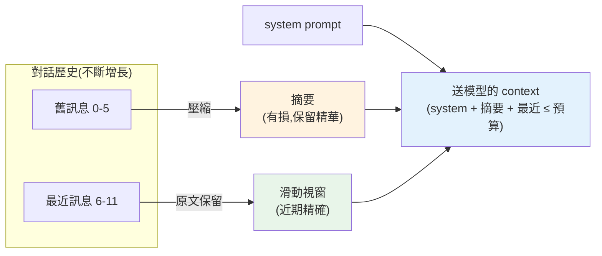

# 對話狀態、記憶與 context 管理

> LLM API 是[無狀態的](../28-llm-genai/02-calling-llm-api.md)——它不記得上一輪你說了什麼,每次呼叫你都得把**完整對話歷史**送過去。但對話越長,歷史越大,遲早**撐爆 context window、成本爆炸、還可能變笨**。這章講如何管理對話「記憶」:滑動視窗、摘要壓縮、token 預算控制——讓 agent/chatbot 能長時間對話而不失控。

## 💡 白話導讀(建議先讀)

還記得 [LLM API 是失憶的](../28-llm-genai/02-calling-llm-api.md)嗎?
它不記得上一輪你說了什麼,「記憶」全靠**你每次把歷史再送一遍**。
但這裡有個硬限制:[context window 有上限](../28-llm-genai/01-llm-fundamentals.md),
對話一長,歷史塞不下、也越送越貴。這章講怎麼在有限預算內,**幫 agent 管理記憶**。

問題像一個**只有一張小白板的人**:空間有限,你得決定「留什麼、擦什麼」。
幾種策略,各有取捨:

- **全量歷史**:每次送全部——最完整,但**長對話必爆**預算。
- **滑動視窗**:只留**最近 N 輪**——簡單,近期最相關;但**早先說的真的忘光**
  (使用者一開始講的名字、偏好,滑出視窗就沒了)。
- **摘要記憶**:把舊對話**壓成一段摘要**保留精華——省空間又不全忘,
  但摘要會遺失細節。
- **向量記憶(長期記憶)**:把過往對話存進[向量庫](../28-llm-genai/07-vector-databases.md),
  需要時**檢索相關的幾段**調回來——這其實就是**把 [RAG](01-rag-pipeline.md) 用在對話歷史上**!
  這是讓 agent 有「長期記憶」(記得你上週說過的事)的主流做法。

實務通常是**混搭**:近期用滑動視窗(精確)、久遠的靠摘要 + 向量檢索(壓縮 + 可回溯)。
還要分清兩種記憶:**短期**(這場對話的上下文)vs **長期**
(跨對話的使用者畫像、知識)。這章實作各種記憶策略,
並教你依「對話長度 × 成本 × 需要記多久」選對組合——這是 agent 好不好用的關鍵體驗。

## Why(為什麼)

[呼叫 LLM API](../28-llm-genai/02-calling-llm-api.md) 那章講過:模型**無狀態**,多輪對話靠你**每次把整段歷史送回去**。這在短對話沒問題,但長對話會撞上三堵牆:

- **context window 有上限**:模型一次能吃的 token 有限(即使現在動輒 200K–1M,仍是有限)。對話+檢索內容+工具結果一直累積,遲早**塞不下**——超過就報錯或被截斷。
- **成本隨歷史線性增長**:[每次呼叫按輸入 token 計費](../28-llm-genai/08-cost-latency-caching.md)。對話第 50 輪要把前 49 輪全送回去——**每輪都在為整段歷史付費**,成本隨對話長度暴漲。
- **長 context 反而降品質**:context 太長,模型注意力被稀釋,容易「忘記中間」(lost in the middle)、被無關舊訊息干擾——**塞越多不一定越好**。

所以需要**記憶管理(memory management)**:決定**每次呼叫要帶哪些歷史**——保留重要的、壓縮或丟棄次要的,讓對話能持續進行而不撞牆。這是所有 [chatbot](../28-llm-genai/README.md)、[agent](05-agents-react.md) 的必備工程。

## Theory(理論:記憶策略)

核心問題:對話歷史會無限增長,但能送進 context 的預算有限。策略是**在預算內,保留最有價值的資訊**。常見做法:

- **全量(full history)**:每次送完整歷史。最簡單、資訊最全,但**只適合短對話**——長了必爆。
- **滑動視窗(sliding window / buffer)**:只保留**最近 N 輪**。近期對話通常最相關,實作簡單。缺點:**丟掉的舊資訊真的忘了**(使用者早先說的名字、偏好)。
- **摘要記憶(summary memory)**:把**舊訊息壓成一段摘要**(用 LLM 生成),摘要 + 最近幾輪一起送。**保留舊資訊的精華**又省 token。缺點:摘要有損、要額外 LLM 呼叫。
- **混合(summary + window)**:最常用——**近期用原文(精確),遠期用摘要(壓縮)**。兼顧細節與長度。
- **向量記憶(retrieval memory)**:把歷史存進[向量庫](../28-llm-genai/07-vector-databases.md),需要時才**檢索相關的舊對話**(等於對記憶做 [RAG](01-rag-pipeline.md))。適合超長、跨 session 的記憶。

**token 預算(token budget)** 是總指揮:`system prompt + 記憶 + 本輪輸入 ≤ 預算`。記憶管理就是在這個約束下,決定塞什麼。

## Specification(規範:context 的組成與預算)

**送進模型的 context 通常分成幾塊,各佔預算**:

```text
[system prompt]  固定,佔一塊(角色、指令、工具說明)
[長期記憶/摘要]  舊對話壓縮 or 檢索到的相關歷史
[最近對話]       最近 N 輪原文(滑動視窗)
[檢索內容]       RAG 檢索到的片段(若是 RAG agent)
[本輪使用者輸入]
─────────────────
總和 ≤ context 預算(且要留 output 的空間)
```

**關鍵規則**:

- **預留輸出空間**:context 上限是**輸入 + 輸出**共享;要為模型回覆留 `max_tokens` 的餘裕,別把輸入塞滿。
- **system prompt 與工具說明是固定成本**:先扣掉,剩下才是記憶能用的。
- **記憶預算內優先近期**:近期對話最相關;不夠再壓縮/丟棄遠期。
- **觸發摘要的時機**:歷史超過某門檻(如佔預算 70%)就把最舊一批壓成摘要。

**token 計數**:用[模型的 tokenizer 精確計](../28-llm-genai/README.md)(Claude 用 `count_tokens` API,**別用 tiktoken**——那是 OpenAI 的);別用「字元數 / 4」瞎猜(中文尤其不準)。下面範例為求可執行/確定性,用「1 字元 = 1 token」的 mock 計數。

## Implementation(底層:滑動視窗 + 摘要 + 預算)

**滑動視窗的實作**:從**最新往回**累加訊息,直到再加一則就超過預算,就停——保留的是「能塞進預算的最近一段」。為什麼從新往回?因為近期最相關,要優先保住。

**摘要的時機與有損性**:被視窗擠掉的舊訊息不是直接丟,而是**壓成摘要**(呼叫一次 LLM:「用兩句話總結以下對話」)。摘要**有損**——會丟細節,但保住主旨(討論過什麼、使用者的關鍵偏好)。實務常「滾動摘要」:新的溢出訊息不斷併入既有摘要。

**摘要也要佔預算**:一個常見 bug 是「保留最近訊息填滿預算,才發現摘要沒地方放」。正確做法:**先預留摘要的額度**,剩下的才給最近訊息——這樣總量才不會超支。下面範例就用「預留摘要額度」的方式,保證 `system + 摘要 + 最近訊息 ≤ 預算` 恆成立。

**為何要精確計 token**:預算控制的前提是知道每塊多大。估錯會導致塞爆(超限報錯)或浪費(留太多空位)。生產環境用模型原生 tokenizer 計數,對長 context/計費尤其重要。下面範例實作滑動視窗 + 摘要 + 預算控制。

## Code Example(可執行的 Python 範例)

```python
# memory.py — 對話記憶管理:滑動視窗 + 摘要 + token 預算(純標準庫)
from __future__ import annotations

from dataclasses import dataclass, field


def count_tokens(text: str) -> int:
    """mock:1 字元 = 1 token。真實用模型 tokenizer(Claude 的 count_tokens API)。"""
    return len(text)


@dataclass
class Msg:
    role: str
    content: str


def summarize(msgs: list[Msg]) -> str:
    """mock 摘要器:把舊訊息壓成短摘要。真實由 LLM 生成(『用兩句話總結』)。"""
    return f"[摘要] 先前 {len(msgs)} 則已省略"


@dataclass
class ConversationMemory:
    budget: int
    system: str = ""
    summary_reserve: int = 20  # 預留給摘要的 token 額度
    messages: list[Msg] = field(default_factory=list)

    def add(self, role: str, content: str) -> None:
        self.messages.append(Msg(role, content))

    def build_context(self) -> tuple[str, list[Msg], int]:
        """組 context:保證 system + 摘要 + 最近訊息 <= budget。"""
        # 1. 最近訊息可用額度 = 預算 - system - 預留摘要
        avail = self.budget - count_tokens(self.system) - self.summary_reserve
        # 2. 滑動視窗:從最新往回保留能放進 avail 的訊息
        kept: list[Msg] = []
        running = 0
        for m in reversed(self.messages):
            c = count_tokens(m.content)
            if running + c > avail:
                break
            kept.insert(0, m)
            running += c
        # 3. 被擠掉的舊訊息壓成摘要
        overflow = self.messages[: len(self.messages) - len(kept)]
        summary = summarize(overflow) if overflow else ""
        used = count_tokens(self.system) + count_tokens(summary) + running
        return summary, kept, used


def main() -> None:
    mem = ConversationMemory(budget=60, system="你是助理")
    for i in range(6):
        mem.add("user", f"問題{i}")
        mem.add("assistant", f"這是問題{i}的回覆")

    summary, kept, used = mem.build_context()
    print(f"總訊息數: {len(mem.messages)}")
    print(f"保留最近: {len(kept)} 則")
    print(f"保留內容: {[m.content for m in kept]}")
    print(f"摘要: {summary}")
    print(f"用量 {used} <= budget {mem.budget}: {used <= mem.budget}")


if __name__ == "__main__":
    main()
```

**預期輸出**:

```pycon
$ python memory.py
總訊息數: 12
保留最近: 6 則
保留內容: ['問題3', '這是問題3的回覆', '問題4', '這是問題4的回覆', '問題5', '這是問題5的回覆']
摘要: [摘要] 先前 6 則已省略
用量 51 <= budget 60: True
```

逐段解說:

- **12 則訊息、預算 60**:全送會超,必須管理。`system`「你是助理」佔 4、預留摘要 20,剩 36 給最近訊息。
- **滑動視窗**:從最新往回累加,保留了最近 **6 則**(問題 3~5 的來回),再往前加就超過 36,停。**近期原文精確保留**。
- **摘要**:被擠掉的前 6 則壓成 `[摘要] 先前 6 則已省略`(真實會是 LLM 生成的重點總結,如「使用者詢問了問題 0-2,助理已回覆」)。**遠期資訊不全丟,保留精華**。
- **預算恆不超支**:`system(4) + 摘要 + 最近(33) = 51 ≤ 60`。因為**先預留摘要額度**再填最近訊息,不會發生「填滿才發現摘要沒位置」的 bug。
- **一致性**:摘要說「先前 6 則」= 溢出的 6 則、保留 6 則,合計 12,對得上。
- **實務**:近期原文 + 遠期摘要是最常用的混合策略;超長/跨 session 再上[向量記憶](01-rag-pipeline.md)。token 用模型原生 tokenizer 精算。

## Diagram(圖解:記憶隨對話增長的處理)



## Best Practice(最佳實踐)

- **用 token 預算統管 context**:`system + 記憶 + 輸入 ≤ 上限`,且**預留輸出空間**。
- **混合策略**:近期原文(精確)+ 遠期摘要(壓縮),兼顧細節與長度。
- **先預留摘要額度再填最近訊息**:避免「填滿才發現摘要沒位置」超支。
- **精確計 token**:用模型原生 tokenizer(Claude 的 `count_tokens`),**別用 tiktoken**(那是 OpenAI 的)、別用字元數瞎估。
- **超長/跨 session 用向量記憶**:歷史存向量庫,需要時檢索(對記憶做 RAG)。
- **保留關鍵事實**:使用者名字、偏好、決定等別被摘要糊掉;可單獨存成結構化「事實記憶」。
- **善用 [prompt caching](../28-llm-genai/08-cost-latency-caching.md)**:固定的 system/前綴可快取,省重複輸入成本。
- **監控 context 用量**:記錄每輪 token,及早發現逼近上限。

## Common Mistakes(常見誤解)

- **每次送全量歷史**:長對話撐爆 context、成本暴漲。
- **摘要不算進預算**:填滿最近訊息才發現摘要放不下,結果超支。
- **不預留輸出空間**:輸入塞滿上限,模型沒空間回覆(被截斷或報錯)。
- **用字元數 / 4 估 token**:中文尤其不準,估錯導致塞爆或浪費。
- **用 tiktoken 算 Claude 的 token**:那是 OpenAI 的分詞器,數字不對(見 [Part 28](../28-llm-genai/README.md))。
- **滑動視窗直接丟舊訊息不摘要**:使用者早先說的關鍵資訊(名字、需求)全忘。
- **以為 context 越長越好**:太長注意力稀釋(lost in the middle),品質反降 + 更貴。
- **關鍵事實被摘要糊掉**:重要決定/偏好應結構化保存,別只靠有損摘要。

## Interview Notes(面試重點)

- **能解釋為何要記憶管理**:LLM 無狀態要送全歷史,長對話撞 context 上限 + 成本暴漲 + 長 context 降品質。
- **能列記憶策略**:全量、滑動視窗、摘要、混合(近期原文+遠期摘要)、向量記憶(對記憶做 RAG)。
- **能講 token 預算**:system + 記憶 + 輸入 ≤ 上限,且預留輸出空間;先預留摘要額度。
- **知道要用模型原生 tokenizer 精算**(Claude 用 count_tokens,非 tiktoken)。
- **知道長 context 的 lost-in-the-middle 問題**,不是越長越好。
- **加分**:結構化事實記憶、prompt caching 省成本、跨 session 向量記憶。

---

➡️ 下一章:[多 agent 協作與工作流](08-multi-agent.md)

[⬆️ 回 Part 29 索引](README.md)
