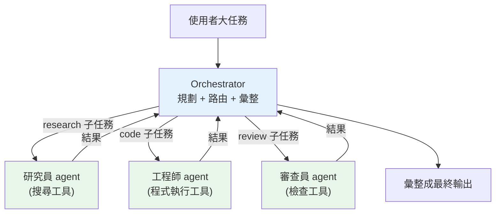

# 多 agent 協作與工作流

> 一個 [ReAct agent](05-agents-react.md) 什麼都自己做,遇到複雜任務會**塞太多工具、context 爆炸、責任不清**。**多 agent 系統**把大任務拆給多個**專職 agent**,由一個**協調者(orchestrator)** 分派、彙整——像把「一個全才」換成「一個團隊」。這章講多 agent 的常見架構(orchestrator-worker、pipeline)、何時該用、以及它的代價。

## 💡 白話導讀(建議先讀)

一個 [ReAct agent](05-agents-react.md) 什麼都自己扛,遇到複雜任務就會出事:
工具塞太多(它挑花眼)、context 爆炸、一個 prompt 要同時當研究員又當工程師又當編輯——
**樣樣通、樣樣鬆**。解法和人類公司一樣:**分工**。

**多 agent 系統**就是**組一個團隊**,每個 agent 專職一件事、各有自己的工具和 prompt。
幾種常見的組織架構,對號入座你熟悉的職場:

- **協調者—工人(Orchestrator-Worker,最常用)＝主管帶團隊**:
  一個 orchestrator 負責**拆解任務、分派**給對的 worker
  (研究交給搜尋 agent、寫程式交給 coding agent),再**彙整**結果。
  彈性最高,能動態決定要用哪些人。
- **流水線(Pipeline)＝工廠產線**:A 的輸出 → B 的輸入 → C……**固定順序**,
  適合步驟明確的流程(草稿 → 潤稿 → 翻譯)。
- **辯論/評審(debate)＝多人審稿**:多個 agent 各抒己見或互相批評,
  提升品質、減少單一觀點的偏誤。

分工的好處是**專職專責**(每個 agent 的 prompt 和工具都聚焦、好維護、好測),
代價是**協調成本**(agent 間怎麼傳訊息、怎麼避免傳話失真、成本上升)。

一個重要的務實提醒貫穿全章:**多 agent 不是越多越好**——
能用單 agent + 好工具解決的,別硬拆成一個團隊(複雜度和成本都翻倍)。
先窮盡單 agent,真的撞牆了再分工。這章實作 orchestrator-worker 架構,
並談 agent 間的通訊與常見陷阱。

## Why(為什麼)

單一 agent 隨任務變複雜會遇到瓶頸:

- **工具太多,模型選錯**:一個 agent 要能研究、寫程式、查 DB、發信、審查……掛上幾十個工具,模型**選錯工具、參數給錯**的機率大增(工具越多越難選)。
- **context 爆炸**:所有子任務的中間結果、工具輸出全擠在**同一個** context 裡,很快撞上[記憶上限](07-memory-context.md),且互相干擾(研究的雜訊污染寫程式的判斷)。
- **責任不清、難維護**:一個巨大的 system prompt 想涵蓋所有職責,難寫、難調、難 debug——改了「研究」的指令可能弄壞「審查」。
- **無法平行**:單 agent 一步一步來,獨立的子任務(同時查三個來源)無法並行。

**多 agent 系統**把任務**分而治之**:每個 agent **專職**一件事(研究員、工程師、審查員),有自己**聚焦的工具集與 prompt**、自己**獨立的 context**;一個**協調者**負責拆解任務、分派給對的 agent、彙整結果。好處:**每個 agent 更專注更準、context 隔離不互相污染、可平行、職責清晰好維護**。這是把複雜 LLM 應用**規模化**的關鍵架構。

⚠️ 但多 agent **更貴、更慢、更難除錯、更難預測**(多個 LLM 迴圈疊加)。**能用單 agent 或 [workflow](09-frameworks.md) 解決的,別上多 agent**——只有任務真的複雜到需要分工才值得。

## Theory(理論:常見多 agent 架構)

- **Orchestrator-Worker(協調者—工人,最常用)**:一個 orchestrator agent 負責**規劃**(把任務拆成子任務)與**分派**(依子任務類型交給對的 worker),各 worker **專職執行**,結果回 orchestrator **彙整**。像技術主管帶團隊。彈性高、可動態決定要哪些 worker。
- **Pipeline / 順序鏈(sequential)**:agent A 的輸出 → agent B 的輸入 → agent C……**固定順序**的流水線(草稿→編輯→校對)。適合流程明確的任務,更接近 [workflow](09-frameworks.md)。
- **平行 + 彙整(parallel + aggregate)**:同一任務**同時**交給多個 agent(不同角度/來源),再由一個 agent 彙整(map-reduce 式)。適合可並行的子任務(同時查多個資料源)。
- **辯論 / 評審(debate / critic)**:一個 agent 產出、另一個 agent **批判**,來回改進(generator-critic)。提升品質,但更貴。

**共通元素**:**專職角色**(每 agent 聚焦一職)、**協調機制**(誰分派、怎麼傳遞)、**共享 or 隔離的狀態**(結果怎麼彙整)。

## Specification(規範:協調者與 worker 的介面)

**Orchestrator-worker 的組件**:

- **Worker(工人 agent)**:有**名稱、專長、工具集、prompt**。給它一個子任務,回一個結果。每個 worker 是一個完整的(可能是 ReAct)agent 或單次 LLM 呼叫。
- **Orchestrator(協調者)**:
  - **規劃(plan)**:把使用者的大任務拆成有序/可並行的子任務(可由 LLM 動態產生,或寫死的流程)。
  - **路由(route)**:依子任務類型分派給對的 worker。
  - **彙整(aggregate)**:收集 worker 結果,組成最終輸出(可能再交給一個「彙整 agent」潤飾)。
- **通訊協定**:子任務與結果的資料格式(結構化,別靠自由文字亂傳)。

**控制與安全**(繼承 [agent](05-agents-react.md) 的所有考量,且更嚴):

- **每個 agent 各自 max_steps**、全系統的**總步數/總成本上限**(多 agent 更易失控燒錢)。
- **錯誤傳播**:某 worker 失敗,orchestrator 要能重試、換 worker、或優雅降級,而非整體崩潰。
- **可觀測性**:記錄「哪個 agent 做了什麼、傳給誰」——多 agent 的除錯全靠這個 trace。

## Implementation(底層:context 隔離、成本疊加、何時值得)

**context 隔離是多 agent 的核心價值**:每個 worker 有**自己乾淨的 context**——研究員的 context 只有研究相關的東西,不被寫程式的工具輸出污染。orchestrator 只在 worker 間傳遞**精煉的結果**(不是整段對話)。這讓每個 agent 更聚焦、更準,也繞開單一 context 的容量上限(等於把記憶分散到多個 context)。

**成本與延遲是疊加的**:單 agent 一個 LLM 迴圈;orchestrator-worker 是「orchestrator 的迴圈 × 每個 worker 的迴圈」——LLM 呼叫次數、[token 成本](../28-llm-genai/08-cost-latency-caching.md)、延遲都成倍增加。平行架構能降延遲(worker 同時跑),但總成本仍高。**這是分工的代價,必須確認任務值得**。

**何時真的需要多 agent**(Anthropic 的經驗法則):任務**可清楚拆成獨立子任務**、子任務需要**不同專長/工具**、且**單 agent 因工具過多或 context 過載而表現變差**時。若任務其實是固定流程,用 [workflow](09-frameworks.md)(程式碼編排、每步一次 LLM 呼叫)更簡單、更可控、更便宜。下面範例用純標準庫實作一個 orchestrator-worker(mock worker 代替真實 agent,聚焦協調結構)。

## Code Example(可執行的 Python 範例)

```python
# multi_agent.py — orchestrator-worker 多 agent 協作(純標準庫,mock worker)
from __future__ import annotations

from collections.abc import Callable
from dataclasses import dataclass


@dataclass
class Task:
    kind: str  # 子任務類型,決定分派給誰
    payload: str


@dataclass
class Result:
    worker: str
    output: str


class Worker:
    """專職 agent:有名稱與處理邏輯(真實中是含專屬工具/prompt 的 agent)。"""

    def __init__(self, name: str, handler: Callable[[str], str]) -> None:
        self.name = name
        self.handler = handler

    def run(self, task: Task) -> Result:
        return Result(self.name, self.handler(task.payload))


class Orchestrator:
    """協調者:依任務類型路由給專職 worker,彙整結果。"""

    def __init__(self) -> None:
        self.routes: dict[str, Worker] = {}

    def register(self, kind: str, worker: Worker) -> None:
        self.routes[kind] = worker

    def dispatch(self, task: Task) -> Result:
        worker = self.routes.get(task.kind)
        if worker is None:  # 沒有能處理的 worker → 優雅降級
            return Result("orchestrator", f"無法處理任務類型 {task.kind}")
        return worker.run(task)

    def run_plan(self, tasks: list[Task]) -> list[Result]:
        """執行一個計畫(有序子任務);獨立子任務也可改成平行。"""
        return [self.dispatch(t) for t in tasks]


def main() -> None:
    orch = Orchestrator()
    orch.register("research", Worker("研究員", lambda p: f"查到關於「{p}」的 3 篇資料"))
    orch.register("code", Worker("工程師", lambda p: f"寫好 {p} 的函式"))
    orch.register("review", Worker("審查員", lambda p: f"審完 {p}:通過"))

    plan = [
        Task("research", "asyncio"),
        Task("code", "下載器"),
        Task("review", "下載器"),
        Task("deploy", "x"),  # 沒有對應 worker → 降級
    ]
    for result in orch.run_plan(plan):
        print(f"[{result.worker}] {result.output}")


if __name__ == "__main__":
    main()
```

**預期輸出**:

```pycon
$ python multi_agent.py
[研究員] 查到關於「asyncio」的 3 篇資料
[工程師] 寫好 下載器 的函式
[審查員] 審完 下載器:通過
[orchestrator] 無法處理任務類型 deploy
```

逐段解說:

- **`Worker`**:每個是一個**專職 agent**——名稱 + 專屬處理邏輯。真實中,`handler` 是一個含專屬工具集與 prompt 的 [ReAct agent](05-agents-react.md)(研究員有搜尋工具、工程師有程式執行工具)。
- **`Orchestrator.dispatch`**:依 `task.kind` **路由**給對的 worker——研究任務給研究員、寫程式給工程師。這就是「協調者—工人」的核心:**協調者不做事,只分派與彙整**。
- **`run_plan`**:依序執行子任務清單。**獨立子任務可改平行**(研究和另一個研究同時跑),降低延遲——這是多 agent 的效能優勢之一。
- **優雅降級**:`deploy` 沒有對應 worker,orchestrator 不崩潰,回「無法處理」——**錯誤在協調層被接住**,可再交人工或其他處理。
- **context 隔離**:每個 worker 只拿到自己的 `payload`,不共享彼此的中間狀態——研究員的雜訊不會污染工程師。這是多 agent 準確度的關鍵。
- **成本意識**:這裡是 4 次 mock 呼叫;真實中是 orchestrator 規劃(1+ 次 LLM)+ 每個 worker 的迴圈(各數次 LLM)——**成本疊加**,確認任務值得才用。

## Diagram(圖解:orchestrator-worker)



## Best Practice(最佳實踐)

- **先確認真的需要多 agent**:單 agent/workflow 能解決就別上(多 agent 貴、慢、難測)。
- **每個 agent 專職 + 聚焦工具集**:職責單一、工具精簡,選錯機率低、準確度高。
- **context 隔離**:worker 間只傳精煉結果,別共享整段對話(避免污染與爆量)。
- **結構化通訊**:子任務與結果用結構化格式(dataclass/JSON),別靠自由文字亂傳。
- **設全系統成本/步數上限**:多 agent 更易失控燒錢,總量守門不可少。
- **獨立子任務平行化**:降延遲(但總成本仍高)。
- **優雅降級 + 錯誤傳播處理**:某 worker 失敗能重試/換路/交人工,別整體崩潰。
- **完整 trace**:記錄哪個 agent 做了什麼、傳給誰——多 agent 除錯的唯一依據。

## Common Mistakes(常見誤解)

- **過度工程,任務其實不需要多 agent**:徒增成本、延遲、不確定性與除錯難度。
- **worker 職責重疊或工具太雜**:失去「專職」的意義,又回到選錯工具的老問題。
- **共享同一個大 context**:失去 context 隔離的價值,污染 + 爆量。
- **靠自由文字在 agent 間傳訊**:格式不穩,解析易錯;用結構化。
- **沒有全系統成本上限**:多個 agent 迴圈疊加,悄悄燒光預算。
- **忽略錯誤傳播**:一個 worker 掛掉整個系統崩潰。
- **沒有 trace**:多 agent 出錯完全無從查起。
- **以為多 agent 一定比單 agent 好**:多數任務單 agent 或 workflow 更簡單可靠。

## Interview Notes(面試重點)

- **能說明多 agent 的動機**:單 agent 工具過多易選錯、context 爆炸、責任不清、無法平行;多 agent 分而治之。
- **能列常見架構**:orchestrator-worker(最常用)、pipeline、平行+彙整、generator-critic。
- **能講 context 隔離的價值**:每 agent 乾淨聚焦的 context,不互相污染,繞開容量上限。
- **能講代價**:成本/延遲疊加、更難除錯與預測——能簡單解決就別上。
- **知道何時值得**:任務可拆成需不同專長的獨立子任務、單 agent 已因過載變差時。
- **知道要設全系統成本上限、結構化通訊、完整 trace**。

---

➡️ 下一章:[應用框架 LangChain / LlamaIndex](09-frameworks.md)

[⬆️ 回 Part 29 索引](README.md)
