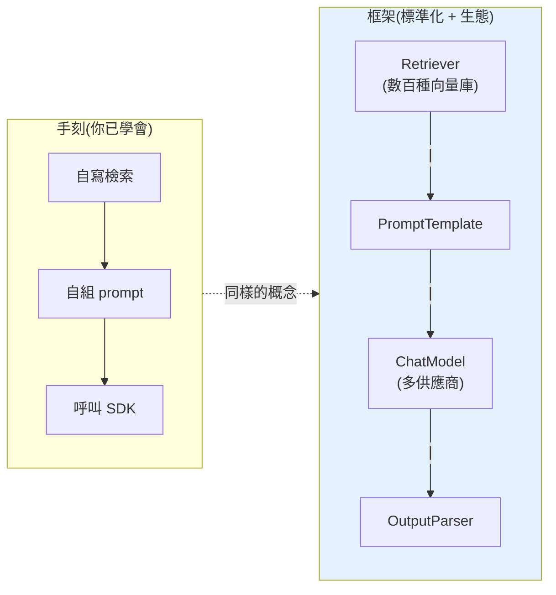

# 應用框架 LangChain / LlamaIndex

> 前面幾章你**手刻**了 [RAG](01-rag-pipeline.md)、[agent](05-agents-react.md)、[記憶](07-memory-context.md)——這很好,你懂了原理。但實務上有成熟框架把這些封裝好:**LangChain**(通用 LLM 應用編排)、**LlamaIndex**(專精 RAG/資料索引)。這章講這些框架解決什麼、核心抽象、以及**該不該用**——因為框架是雙面刃。

## Why(為什麼)

手刻 LLM 應用會重複遇到同樣的「膠水工程」:

- **接不同模型/供應商**:換一家 LLM 就要改一套 API 呼叫;想要統一介面。
- **RAG 的每個環節**:[文件載入](02-chunking-strategies.md)、[分塊](02-chunking-strategies.md)、[embedding](../28-llm-genai/06-embeddings-semantic-search.md)、[向量庫](../28-llm-genai/07-vector-databases.md)、[檢索](03-hybrid-retrieval-rerank.md)——每個都有一堆整合(幾十種 loader、十幾種向量庫),自己接很煩。
- **組裝流程**:prompt 模板、把步驟串成管線、[agent 迴圈](05-agents-react.md)、[記憶](07-memory-context.md)——都是重複的樣板。

**框架**把這些標準化、提供現成元件與整合:

- **LangChain**:通用的 LLM 應用**編排**框架。核心是把元件(模型、prompt、retriever、工具、記憶)**組合成鏈/圖**。生態龐大(數百種整合)、含 **LangGraph**(建有狀態的 agent 圖)、**LangSmith**(觀測/評估)。
- **LlamaIndex**:專精 **RAG / 資料框架**。強在把各種資料源**索引**起來供檢索——豐富的 loader、索引結構(向量/樹/知識圖)、query engine。做「跟你的資料對話」特別順。

框架讓你**少寫膠水、快速起步、複用生態**。但它們也帶來抽象層、學習曲線、版本變動快——**用不用、用哪個,是要權衡的工程決策**,不是預設一定要用。

## Theory(理論:框架的核心抽象)

儘管 API 不同,主流框架的核心抽象相通:

- **統一的模型介面**:把不同供應商的 LLM 包成一致的 `invoke`/`stream` 介面,換模型不改業務碼。
- **Prompt 模板(prompt template)**:把變數填進 prompt 骨架(對應 [prompt engineering](../28-llm-genai/03-prompt-engineering.md))。
- **可組合的管線(chain / pipeline)**:把「prompt → 模型 → 解析 → 下一步」串成一條可執行的鏈。LangChain 的 **LCEL(LangChain Expression Language)** 用 `|` 運算子組合(像 shell pipe):`prompt | model | parser`。
- **Retriever(檢索器)**:統一的「query → 相關文件」介面,背後可接任何[向量庫](../28-llm-genai/07-vector-databases.md)或[混合檢索](03-hybrid-retrieval-rerank.md)。
- **Agent / Graph**:封裝 [ReAct 迴圈](05-agents-react.md)、工具編排、狀態管理(LangGraph 用「節點 + 邊」建有狀態、可循環的 agent 流程)。
- **Memory(記憶)**:封裝[對話歷史管理](07-memory-context.md)(緩衝、摘要、向量記憶)。
- **Callbacks / 觀測**:掛鉤每一步,供 log、追蹤、評估([LangSmith](04-rag-evaluation.md))。

理解這些抽象後,任何框架都只是「同一套概念的不同包裝」——你在前面章節手刻的東西,框架都有對應元件。

## Specification(規範:LCEL 管線與 RAG chain)

**LCEL 的組合語意**(LangChain 的核心 DSL):

```python
# 概念示意(真實 LangChain API)
from langchain_anthropic import ChatAnthropic
from langchain_core.prompts import ChatPromptTemplate
from langchain_core.output_parsers import StrOutputParser

prompt = ChatPromptTemplate.from_template("用一句話解釋 {topic}")
model = ChatAnthropic(model="claude-opus-4-8")
chain = prompt | model | StrOutputParser()   # | 串接
result = chain.invoke({"topic": "RAG"})       # 執行整條鏈
```

`|` 把左邊的輸出接到右邊的輸入,`invoke` 從頭跑到尾。每個元件都實作統一的 `Runnable` 介面(`invoke`/`stream`/`batch`/`ainvoke`),所以能自由組合、串流、批次、非同步。

**典型 RAG chain**(把[前面手刻的流程](01-rag-pipeline.md)組件化):

```text
retriever(取相關文件) → 組裝 prompt(填入 context + question) → model(生成) → parser(取文字)
```

**LlamaIndex 的 RAG**(更高階,幾行搞定):

```python
# 概念示意(真實 LlamaIndex API)
from llama_index.core import VectorStoreIndex, SimpleDirectoryReader

docs = SimpleDirectoryReader("data/").load_data()   # 載入
index = VectorStoreIndex.from_documents(docs)        # 分塊+embed+索引(一步)
answer = index.as_query_engine().query("問題")        # 檢索+生成(一步)
```

它把[分塊、embedding、建索引、檢索、生成](01-rag-pipeline.md)全封裝——起步極快,但也把細節藏起來(要調要懂底層)。

## Implementation(底層:框架的取捨、何時用/不用)

**框架的價值**:現成的數百種整合(loader、向量庫、模型)、標準化的元件與管線、內建串流/批次/非同步/記憶/觀測——**快速起步、少寫膠水**。對「連 20 種資料源做 RAG」「快速做 PoC」「用團隊已採用的框架」特別划算。

**框架的代價**:

- **抽象洩漏 + debug 變難**:出事時要穿透好幾層抽象才找到真正的 API 呼叫;framework「魔法」越多越難查。
- **學習曲線 + API 變動快**:LangChain 早期以 API 頻繁破壞性變更聞名(近年趨穩),學框架本身也要成本。
- **黑箱與過度封裝**:高階 API 藏起 prompt、chunking 策略等關鍵細節,想精調反而要繞過框架。
- **相依與臃腫**:一堆傳遞依賴,鎖定框架的抽象。

**何時該用 vs 手刻**:

- **簡單需求(單次呼叫、簡單 RAG)**:直接用[官方 SDK](../28-llm-genai/02-calling-llm-api.md) 手刻,幾十行就好,無需框架——更透明、更好控。
- **複雜編排、要多種整合、快速 PoC**:框架划算(別重造 loader/向量庫整合)。
- **關鍵、要精細控制的生產系統**:常見做法是**理解框架的做法,但關鍵路徑自己控**(或用較薄的框架)——你在前面章節學的原理,正是能做這判斷的底氣。

**核心建議**:**先懂原理(手刻過),再決定用不用框架**。不懂原理就用框架 = 出事無從查、無法精調。下面用純標準庫寫一個 mini「LCEL 式」管線,示範框架 `|` 組合的核心概念(不依賴 LangChain,聚焦抽象)。

## Code Example(可執行的 Python 範例)

```python
# mini_chain.py — mini LCEL 式管線:用 | 組合步驟(純標準庫,示意框架概念)
from __future__ import annotations

from collections.abc import Callable
from dataclasses import dataclass

State = dict[str, str]


@dataclass
class Chain:
    """mini 版 LCEL:用 | 串接『對 state 操作』的步驟,invoke 依序執行。"""

    steps: list[Callable[[State], State]]

    def __or__(self, step: Callable[[State], State]) -> Chain:
        return Chain(self.steps + [step])

    def invoke(self, state: State) -> State:
        for step in self.steps:
            state = step(state)
        return state


def chain() -> Chain:
    return Chain([])


# --- RAG 管線的各步驟(對應手刻 RAG 的環節)---
KB = {"RAG": "檢索增強生成,先檢索再讓 LLM 依事實回答"}


def retrieve(s: State) -> State:  # retriever
    key = s["question"].replace("什麼是 ", "").rstrip("?")
    return {**s, "context": KB.get(key, "查無資料")}


def build_prompt(s: State) -> State:  # prompt template
    return {**s, "prompt": f"根據「{s['context']}」回答:{s['question']}"}


def mock_llm(s: State) -> State:  # model
    return {**s, "answer": f"{s['question']}——{s['context']}"}


def main() -> None:
    # 像 LangChain 一樣用 | 組合:retriever | prompt | model
    pipeline = chain() | retrieve | build_prompt | mock_llm
    result = pipeline.invoke({"question": "什麼是 RAG"})
    print("context:", result["context"])
    print("answer :", result["answer"])


if __name__ == "__main__":
    main()
```

**預期輸出**:

```pycon
$ python mini_chain.py
context: 檢索增強生成,先檢索再讓 LLM 依事實回答
answer : 什麼是 RAG——檢索增強生成,先檢索再讓 LLM 依事實回答
```

逐段解說:

- **`Chain.__or__`**:多載 `|` 運算子,把新步驟接到管線尾。這正是 LangChain **LCEL 的 `prompt | model | parser`** 背後的機制——`|` 就是「組合」。
- **state 傳遞**:每步接收 state dict、加上自己的欄位再往下傳(`retrieve` 加 `context`、`build_prompt` 加 `prompt`、`mock_llm` 加 `answer`)。真實 LCEL 也是這種「一步的輸出是下一步的輸入」的資料流。
- **對應手刻 RAG**:`retrieve`(檢索器)→ `build_prompt`(prompt 模板)→ `mock_llm`(模型)——就是[第 1 章 RAG](01-rag-pipeline.md) 的三步,只是**組件化**成可 `|` 組合的單元。框架的價值就是把這些做成標準、可複用、可交換的元件。
- **看穿框架**:理解了這個 40 行的 mini 版,你就懂 LangChain `|` 的本質——框架只是加上「數百種現成元件 + 串流/批次/非同步/觀測」。**原理你已經會了**,框架是生產力工具,不是魔法。

## Diagram(圖解:框架把手刻元件標準化)



## Best Practice(最佳實踐)

- **先懂原理再用框架**:手刻過 RAG/agent,才有能力判斷框架的取捨、出事能 debug、能精調。
- **簡單需求直接用官方 SDK**:單次呼叫、簡單 RAG 幾十行就好,別為此扛整個框架。
- **複雜整合/快速 PoC 才上框架**:別重造數百種 loader/向量庫整合。
- **關鍵路徑保留控制**:生產系統可「理解框架做法但關鍵步驟自己控」,或用較薄的框架。
- **LlamaIndex 偏 RAG/資料、LangChain 偏通用編排**:依需求選,不必二選一(可混用)。
- **善用觀測工具**(LangSmith 等):框架的抽象讓 debug 變難,觀測補回可見度。
- **鎖定版本**:框架 API 變動快,鎖版本避免升級破壞。
- **別被高階 API 藏住關鍵細節**:chunking/prompt 等要能穿透調整。

## Common Mistakes(常見誤解)

- **不懂原理就用框架**:出事無從查、無法精調、被框架綁死。
- **簡單需求硬套框架**:為一次 API 呼叫扛一堆依賴與抽象,得不償失。
- **以為框架是魔法**:它只是把你會的概念標準化 + 加生態,沒有免費的智慧。
- **被高階 API 的「幾行搞定」迷惑**:PoC 快,但要精調/上生產時發現細節全被藏住。
- **不鎖版本**:框架破壞性更新打爆你的程式。
- **忽略框架的 debug 成本**:多層抽象讓追問題變難,不配觀測工具很痛苦。
- **以為一定要選框架**:很多生產系統直接用官方 SDK 手刻關鍵路徑,反而更穩。

## Interview Notes(面試重點)

- **能說明框架解決什麼**:統一模型介面、現成 RAG 元件與數百種整合、標準化管線/agent/記憶,少寫膠水。
- **能對比 LangChain vs LlamaIndex**:通用編排(+LangGraph/LangSmith)vs 專精 RAG/資料索引。
- **能解釋 LCEL 的 `|` 組合**:把 Runnable 元件串成管線,一步輸出接下一步輸入。
- **能講框架的取捨**:快速起步/生態 vs 抽象洩漏/debug 難/API 變動/黑箱。
- **能判斷何時用/不用**:簡單需求手刻、複雜整合或 PoC 用框架、關鍵路徑保留控制。
- **核心態度**:先懂原理(手刻過)再決定用框架,不把框架當魔法。

---

➡️ 下一章:[🏗️ Capstone:生產級 RAG 知識庫問答](10-capstone-rag.md)

[⬆️ 回 Part 29 索引](README.md)
