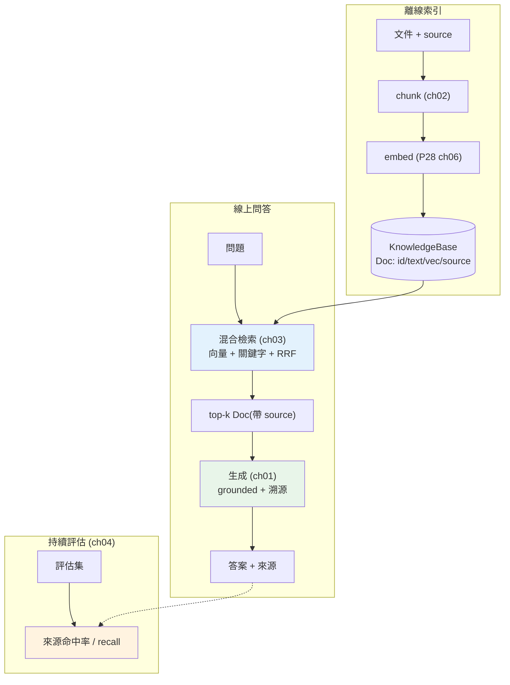

# 🏗️ Capstone:生產級 RAG 知識庫問答

> 這是 Part 29 的整合實戰:把[分塊](02-chunking-strategies.md)、[索引](../28-llm-genai/07-vector-databases.md)、[混合檢索](03-hybrid-retrieval-rerank.md)、[組裝生成](01-rag-pipeline.md)、[評估](04-rag-evaluation.md)串成一個**端到端、可執行、可評估**的 RAG 知識庫問答系統。這章不再教新概念,而是示範**怎麼把它們組裝成一個真實系統**,並討論從這個骨架走向生產的要點。

## 💡 白話導讀(建議先讀)

這是 Part 29 的**畢業專題**:把本 Part 的每一塊——
[分塊](02-chunking-strategies.md)、[混合檢索](03-hybrid-retrieval-rerank.md)、
[重排](03-hybrid-retrieval-rerank.md)、[評估](04-rag-evaluation.md)——
組裝成一個**完整、可上線的 RAG 問答系統**,而不只是玩具 demo。

整個系統的資料流,把散落各章的零件串成一條線:

```text
離線(建知識庫):
  文件 → 分塊 → 每塊 embed → 存進向量索引(帶來源 metadata)

線上(每次問答):
  問題 → 混合檢索(向量+關鍵字, RRF 融合) → rerank 精排 top-k
       → 組裝 prompt(問題 + 撈到的片段 + 「只依據資料回答」)
       → LLM 生成(附引用來源) → 回答

持續:
  用評估集量 recall / faithfulness,調參,回歸測試
```

這章的重點不是再學新東西,而是**把原則落實成工程**:
來源引用(讓答案可追溯、可信)、找不到資料時**誠實說「不知道」**
(而不是[幻覺](../28-llm-genai/01-llm-fundamentals.md))、
處理 context 超長、以及把整套包成一個乾淨的 API(呼應 [Part 14 的 FastAPI](../14-web/README.md))。

走完這章,你就擁有一套**可複用的生產級 RAG 骨架**——
這正是當前業界最搶手的 AI 工程能力。
接著 [Part 30 生產化 AI](../30-production-ai/README.md)會講怎麼把它**穩定地運營**
(監控、版本、A/B、成本控管),讓這個系統真正對得起「上線」兩個字。

## Why(為什麼)

前面每一章各講一個環節,但真實系統的價值在於**把它們正確地組裝起來**——而組裝本身有工程門檻:

- **各環節要對接**:分塊產出的 chunk 要能被索引、索引要能被檢索、檢索結果要能組進 prompt、生成要能溯源、整條線要能被評估。介面沒設計好,環節就接不起來。
- **要能溯源**:生產級 RAG 必須能回答「這答案是根據哪份文件說的」——所以 chunk 從頭到尾要帶著 **metadata(來源)**。
- **要能評估與迭代**:系統上線後要能量化品質、改一個環節看整體變好還變壞——[eval 驅動](04-rag-evaluation.md)必須內建,不是事後補。

這章用一個**完整可跑**的實作,示範這些如何合為一體,並在最後討論「這個教學骨架」與「真正的生產系統」的差距——讓你知道下一步(交給 [Part 30 生產化](../30-production-ai/README.md))要補什麼。

## Theory(理論:端到端 RAG 的資料流)

一個完整 RAG 系統 = **離線索引** + **線上問答** + **持續評估**(見 [RAG 全流程](01-rag-pipeline.md)),把各章串起來:

```text
離線(建知識庫):
  原始文件 → 分塊(ch02) → 每塊 embed(Part28 ch06) → 存索引(帶 metadata,Part28 ch07)

線上(問答):
  問題 → 混合檢索(ch03:向量+關鍵字, RRF) → 取 top-k(帶來源)
       → 組裝 prompt(ch01:context + 誠實退路) → LLM 生成(grounded)
       → 回傳「答案 + 來源」

持續(評估):
  評估集 → 跑系統 → 檢索/生成指標(ch04) → 定位弱點 → 改一環 → 重評
```

**設計原則**:

- **chunk 是一等公民**:每個 chunk 有 `id、text、vector、source`——貫穿索引、檢索、溯源。
- **檢索與生成解耦**:檢索器只管「找相關 chunk」,生成只管「依 context 回答」——各自可獨立替換、評估。
- **評估內建**:系統從第一天就能被量化,不是黑箱。

## Specification(規範:系統組件)

| 組件 | 職責 | 對應章節 |
|------|------|----------|
| `chunk()` | 把文件切成帶重疊的片段 | [ch02](02-chunking-strategies.md) |
| `embed()` | 片段/問題轉向量 | [Part 28 ch06](../28-llm-genai/06-embeddings-semantic-search.md) |
| `KnowledgeBase.index()` | 分塊 + embed + 存(帶 source) | [Part 28 ch07](../28-llm-genai/07-vector-databases.md) |
| `KnowledgeBase.retrieve()` | 混合檢索 + RRF 融合 + top-k | [ch03](03-hybrid-retrieval-rerank.md) |
| `generate()` | 依 context grounded 生成 + 溯源 | [ch01](01-rag-pipeline.md) |
| `answer()` | 串起檢索 → 生成 | [ch01](01-rag-pipeline.md) |
| `evaluate()` | 用評估集量化品質 | [ch04](04-rag-evaluation.md) |

**介面契約**:`retrieve(query, k) -> list[Doc]`(每個 `Doc` 帶 `source`);`answer(query) -> (答案, 來源清單, chunk_ids)`——**溯源資訊全程攜帶**。

## Implementation(底層:組裝與生產差距)

**組裝的關鍵是介面**:每個 chunk 是 `Doc(id, text, vec, source)`,索引存 `Doc` list,檢索回 `Doc` list,生成從 `Doc` 讀 `text` 與 `source`——**同一個資料結構貫穿全程**,溯源自然成立。混合檢索用 [RRF](03-hybrid-retrieval-rerank.md) 融合向量與關鍵字兩路排名,免調權重。生成用 grounded mock(取最相關 chunk 為答案根據)。評估用「來源命中率」(檢索到的 chunk 來源是否含正確文件)——這是 [recall](04-rag-evaluation.md) 的實用變體。

**這個骨架離生產有多遠**(誠實面對,交給 [Part 30](../30-production-ai/README.md)):

- **embedding/LLM 是 mock**:真實要接 embedding 模型與 [Claude API](../28-llm-genai/02-calling-llm-api.md)(串流、重試、逾時)。
- **向量索引是暴力線性掃描**:小資料可以,大規模要 [ANN 向量庫](../28-llm-genai/07-vector-databases.md)(pgvector/Chroma/FAISS)。
- **缺 rerank**:生產級要加 [cross-encoder 精排](03-hybrid-retrieval-rerank.md)。
- **缺生產要素**:[成本/延遲/快取](../28-llm-genai/08-cost-latency-caching.md)、[API 化](../14-web/README.md)、監控、[安全](../20-security-system-design/README.md)(prompt injection、存取控制)、資料更新管線、[LLMOps](../30-production-ai/README.md)。

但**架構是對的**——生產化是把每個 mock 換成真實元件、加上工程韌性,骨架不變。下面是完整可跑的系統。

## Code Example(可執行的 Python 範例)

```python
# capstone_rag.py — 端到端 RAG 知識庫問答:分塊→索引→混合檢索→生成→評估(需 numpy)
from __future__ import annotations

from dataclasses import dataclass, field

import numpy as np


# ===== ch02 分塊 =====
def chunk(text: str, size: int, overlap: int) -> list[str]:
    out: list[str] = []
    start = 0
    while start < len(text):
        out.append(text[start : start + size])
        start += size - overlap
    return out


# ===== Part28 ch06 mock embedding(關鍵字向量;真實用 embedding 模型)=====
VOCAB = ["asyncio", "gil", "並發", "執行緒", "向量", "embedding", "檢索", "rag"]


def embed(text: str) -> np.ndarray:
    t = text.lower()
    return np.array([1.0 if w in t else 0.0 for w in VOCAB])


def cosine(a: np.ndarray, b: np.ndarray) -> float:
    denom = np.linalg.norm(a) * np.linalg.norm(b)
    return float(np.dot(a, b) / denom) if denom else 0.0


# ===== chunk 是一等公民:貫穿索引/檢索/溯源 =====
@dataclass
class Doc:
    id: str
    text: str
    vec: np.ndarray
    source: str


@dataclass
class KnowledgeBase:
    docs: list[Doc] = field(default_factory=list)

    def index(self, doc_id: str, text: str, source: str, size: int = 30, overlap: int = 5) -> None:
        """離線:分塊 + embed + 存(帶 source)。"""
        for i, c in enumerate(chunk(text, size, overlap)):
            self.docs.append(Doc(f"{doc_id}#{i}", c, embed(c), source))

    def _vec_rank(self, query: str) -> list[str]:
        qv = embed(query)
        return [d.id for d in sorted(self.docs, key=lambda d: cosine(qv, d.vec), reverse=True)]

    def _kw_rank(self, query: str) -> list[str]:
        terms = query.lower().split()
        return [
            d.id
            for d in sorted(
                self.docs, key=lambda d: sum(d.text.lower().count(t) for t in terms), reverse=True
            )
        ]

    def retrieve(self, query: str, k: int = 2) -> list[Doc]:
        """ch03 混合檢索:向量 + 關鍵字,RRF 融合,取 top-k。"""
        fused: dict[str, float] = {}
        for ranking in (self._vec_rank(query), self._kw_rank(query)):
            for pos, doc_id in enumerate(ranking):
                fused[doc_id] = fused.get(doc_id, 0.0) + 1 / (60 + pos + 1)
        top = sorted(fused, key=lambda d: fused[d], reverse=True)[:k]
        by_id = {d.id: d for d in self.docs}
        return [by_id[t] for t in top]


# ===== ch01 生成(grounded)+ 溯源 =====
def generate(query: str, contexts: list[Doc]) -> tuple[str, list[str]]:
    if not contexts:
        return "找不到相關資訊。", []
    return contexts[0].text.strip(), [c.source for c in contexts]


def answer(kb: KnowledgeBase, query: str, k: int = 2) -> tuple[str, list[str], list[str]]:
    contexts = kb.retrieve(query, k)
    ans, sources = generate(query, contexts)
    return ans, sources, [c.id for c in contexts]


# ===== ch04 評估:來源命中率 =====
def evaluate(kb: KnowledgeBase, cases: list[dict[str, str]]) -> float:
    hits = 0
    for case in cases:
        _, sources, _ = answer(kb, case["query"])
        hits += case["relevant_source"] in sources
    return hits / len(cases)


def main() -> None:
    kb = KnowledgeBase()
    kb.index("d1", "asyncio 用事件迴圈實現並發。GIL 限制多執行緒平行執行。", "concurrency.md")
    kb.index("d2", "RAG 用向量檢索找相關片段,再讓 LLM 依事實回答。embedding 是關鍵。", "rag.md")

    for query in ["gil 執行緒", "rag 檢索"]:
        ans, sources, chunk_ids = answer(kb, query)
        print(f"Q: {query}")
        print(f"  來源: {sources}")
        print(f"  A: {ans[:24]}...")

    cases = [
        {"query": "gil 執行緒", "relevant_source": "concurrency.md"},
        {"query": "rag 檢索", "relevant_source": "rag.md"},
    ]
    print(f"\n評估(來源命中率): {evaluate(kb, cases):.0%}")


if __name__ == "__main__":
    main()
```

**預期輸出**:

```pycon
$ python capstone_rag.py
Q: gil 執行緒
  來源: ['concurrency.md', 'concurrency.md']
  A: asyncio 用事件迴圈實現並發。GIL 限制多執行緒平行執行。...
Q: rag 檢索
  來源: ['rag.md', 'concurrency.md']
  A: RAG 用向量檢索找相關片段,再讓 LLM 依事實回答。...

評估(來源命中率): 100%
```

逐段解說:

- **建庫(離線)**:`index` 把兩份文件各自分塊、embed、存進 `docs`,每個 chunk 帶 `source`。這是[離線索引階段](01-rag-pipeline.md)。
- **問答(線上)**:`answer` → `retrieve`(混合檢索 + RRF)→ `generate`(grounded)。`gil 執行緒` 命中 concurrency.md 的 chunk;`rag 檢索` 命中 rag.md 的 chunk **排第一**(來源正確)——混合檢索讓關鍵字(rag/檢索)與語意都發揮作用。
- **溯源**:每個答案都回 `sources`——使用者能驗證答案來自哪份文件。這是生產級 RAG 的必要條件,靠「chunk 全程帶 source」實現。
- **評估**:`evaluate` 用「來源命中率」量化——兩題都檢索到正確來源,**100%**。這讓你改任何環節(chunk size、加 rerank、換 embedding)都能量化影響。
- **整合的價值**:每個環節你在前面章節都學過,這裡示範**正確的介面設計**讓它們合為一體——`Doc` 貫穿全程、檢索與生成解耦、評估內建。**架構對了,生產化就是換元件。**

## Diagram(圖解:端到端系統)



## Best Practice(最佳實踐)

- **chunk 全程帶 metadata(source)**:溯源、過濾、除錯全靠它。
- **檢索與生成解耦**:各自可獨立替換、評估、優化。
- **評估內建、從第一天**:任何改動都能量化(來源命中率、[recall/忠實度](04-rag-evaluation.md))。
- **先跑通端到端骨架,再逐環節優化**:別一開始就追求每環最佳;先有可評估的整體,再迭代。
- **生產化路線**:mock → 真實 embedding/LLM(含[重試/串流](../28-llm-genai/05-streaming-async.md))→ [ANN 向量庫](../28-llm-genai/07-vector-databases.md) → 加 [rerank](03-hybrid-retrieval-rerank.md) → [快取/成本控制](../28-llm-genai/08-cost-latency-caching.md) → [API 化](../14-web/README.md) + 監控 + [安全](../20-security-system-design/README.md)。
- **安全別漏**:知識庫存取控制、prompt injection 防護、輸出過濾(見 [Part 20](../20-security-system-design/README.md) 與 [Part 30](../30-production-ai/README.md))。

## Common Mistakes(常見誤解)

- **chunk 不帶 source**:答案無法溯源,生產級不可接受。
- **檢索與生成耦死**:無法獨立優化/替換/評估某一環。
- **沒有評估就迭代**:改了不知變好變壞,盲調。
- **一開始就追求每環最優**:應先跑通可評估的端到端,再逐步優化。
- **以為 mock 骨架 = 生產系統**:還差真實模型、ANN 索引、rerank、快取、監控、安全一大段(見 [Part 30](../30-production-ai/README.md))。
- **忽略安全**:RAG 系統的存取控制、注入防護、輸出過濾常被忽略,是生產隱患。
- **暴力線性檢索用到大規模**:資料一大就慢爆,要換 ANN 向量庫。

## Interview Notes(面試重點)

- **能畫出端到端 RAG 架構**:離線(分塊→embed→索引)+ 線上(混合檢索→組裝→生成→溯源)+ 持續評估。
- **能說明整合的設計原則**:chunk 帶 metadata 貫穿全程、檢索與生成解耦、評估內建。
- **能講從骨架到生產的差距**:真實模型、ANN 索引、rerank、快取/成本、API 化、監控、安全([LLMOps](../30-production-ai/README.md))。
- **能講溯源怎麼實現**:chunk 全程攜帶 source,答案回傳來源供驗證。
- **能講評估怎麼內建**:來源命中率/recall/忠實度,改一環量化整體影響。
- **能連結前面各章**:這個 Capstone 是 Part 28–29 所有概念的整合體現。

---

🎉 **恭喜你完成 Part 29!** 你已能把 LLM 組裝成真實產品——RAG、agents、記憶、多 agent、框架,以及一個端到端的知識庫問答系統。

➡️ 下一步:[Part 30 生產級 AI 與 LLMOps](../30-production-ai/README.md)——把這些系統**穩定、安全、划算地**跑在生產環境。

[⬆️ 回 Part 29 索引](README.md)
