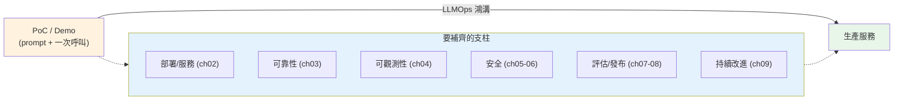

# 從 PoC 到生產:LLMOps 概論

> 做一個「跑得動」的 LLM demo 很快——一個 [prompt](../29-ai-applications/README.md)、一次 [API 呼叫](../28-llm-genai/02-calling-llm-api.md)、一個 [RAG 雛形](../29-ai-applications/01-rag-pipeline.md),下午就能 demo。但把它變成**幾千個真實使用者天天用、不出包、不燒錢、不被攻擊**的生產服務,是完全不同的工程。這中間的鴻溝,就是 **LLMOps** 要填的。這章綜覽這道鴻溝與這一 Part 的地圖。

## Why(為什麼)

「demo 能跑」到「生產可靠」之間,橫著一堆 demo 階段看不到的問題:

- **不確定性(non-determinism)**:同一個輸入,LLM 可能回不同答案(見 [取樣](../28-llm-genai/01-llm-fundamentals.md))。傳統軟體「輸入 → 固定輸出」的假設不成立——你怎麼測試?怎麼保證品質不退化?
- **成本會失控**:每次呼叫[按 token 計費](../28-llm-genai/08-cost-latency-caching.md)。demo 你自己點幾下沒感覺;上線後流量一大、或有人惡意灌爆、或某個 prompt 意外變長,**帳單一夜爆炸**。
- **安全面全新**:使用者輸入會進 prompt——[prompt injection](05-prompt-injection-security.md) 可以綁架你的系統、洩漏資料、繞過限制。傳統的 SQL injection 你懂,但 LLM 的攻擊面是**自然語言**,防法完全不同。
- **品質會漂移**:你改了一句 prompt、換了模型版本、更新了[知識庫](../29-ai-applications/01-rag-pipeline.md)——某些問題悄悄變差了,但沒有[評估](../29-ai-applications/04-rag-evaluation.md)你根本不知道,直到使用者抱怨。
- **可觀測性難**:傳統 APM 看 QPS/延遲/錯誤率;LLM 還要看 **token 用量、成本、品質分數、幻覺率、injection 嘗試**——這些傳統工具不管。

**LLMOps(LLM Operations)** 就是把 [MLOps](../17-data-science/README.md)/DevOps 的思維套到 LLM 應用:**部署、監控、成本控制、安全、評估、版本管理、持續改進**的一整套實踐。沒有它,你的 LLM 應用要嘛不敢上線,要嘛上線後救火不斷。這一 Part 就是這套實踐的地圖。

## Theory(理論:LLMOps 的支柱)

把 LLM 應用推上生產並持續營運,涉及幾根支柱(對應本 Part 各章):

- **部署與服務(serving)**:把 LLM 邏輯包成 [API 服務](02-serving-llm-apps.md)(通常 [FastAPI](../14-web/README.md) + [串流](../28-llm-genai/05-streaming-async.md)),能水平擴展、能[容器化部署](../19-cloud-native/README.md)。
- **可靠性(reliability)**:LLM API 會逾時、會 429、會偶發失敗——要[重試、逾時、fallback、限流](03-reliability.md)才不會一個上游抖動就全掛。
- **可觀測性(observability)**:[記錄每次呼叫、追蹤、監控 token/成本/延遲/品質](04-observability.md)——看不見就管不了。
- **安全(security)**:[prompt injection 防護、OWASP LLM Top 10](05-prompt-injection-security.md)、[輸入輸出護欄、PII](06-guardrails.md)。
- **品質保證(quality)**:[評估進 CI/CD](07-eval-in-cicd.md) 防回歸、[A/B 與版本管理](08-ab-testing-versioning.md) 安全上線改動。
- **持續改進(improvement)**:[資料飛輪](09-data-flywheel.md)——用真實流量與回饋不斷變好。

**核心心態轉變**:傳統軟體是**確定性、可完全測試**的;LLM 應用是**機率性、只能統計性保證**的。所以 LLMOps 重度依賴**評估(量化品質)、監控(即時感知)、護欄(限制壞行為)、漸進發布(降低改動風險)**——用工程手段馴服不確定性。

## Specification(規範:生產就緒檢查)

上線前該問自己的問題(生產就緒清單,分嚴重度):

**Blocker(沒有就別上線)**:

- [ ] **成本護欄**:有 [rate limit + 預算上限](03-reliability.md)嗎?惡意/暴衝流量會不會燒爆帳單?
- [ ] **安全**:使用者輸入有 [injection 防護](05-prompt-injection-security.md)嗎?輸出有[過濾](06-guardrails.md)嗎?知識庫有存取控制嗎?
- [ ] **可靠性**:上游 LLM 逾時/429 有[重試與 fallback](03-reliability.md)嗎?會不會一抖就全掛?
- [ ] **PII / 合規**:會不會把使用者敏感資料送給第三方 LLM 或記進 log?

**Important(強烈建議)**:

- [ ] **可觀測性**:能[追蹤每次呼叫、看 token/成本/延遲](04-observability.md)嗎?
- [ ] **評估回歸**:改 prompt/模型有[自動評估](07-eval-in-cicd.md)防退化嗎?
- [ ] **漸進發布**:改動能[金絲雀/A B](08-ab-testing-versioning.md) 而非一次全量嗎?

**Nice to have**:

- [ ] 串流回應(改善體感延遲)、[語意快取](../28-llm-genai/08-cost-latency-caching.md)(省成本)、[回饋收集](09-data-flywheel.md)。

**規則**:任一 blocker 未過 → **不可上線**。下面範例把這清單做成可計算的就緒度評估。

## Implementation(底層:為何 LLM 生產化不同於傳統服務)

**傳統服務 vs LLM 服務的關鍵差異**:

| 面向 | 傳統服務 | LLM 服務 |
|------|----------|----------|
| 輸出 | 確定(同輸入同輸出) | 機率(同輸入可能不同) |
| 測試 | 斷言精確值 | 統計性評估([eval set](../29-ai-applications/04-rag-evaluation.md)) |
| 成本 | 固定(CPU/RAM) | 隨用量/token 變動,可爆 |
| 延遲 | 毫秒級、穩定 | 秒級、隨輸出長度變動 |
| 安全 | SQLi/XSS 等已知 | + prompt injection(自然語言攻擊) |
| 失敗 | 崩潰/錯誤碼 | + 幻覺(看似正常的錯) |
| 品質 | 二元(對/錯) | 連續(好/普通/差),會漂移 |

這些差異解釋了為何不能只套用傳統 DevOps:**幻覺**是「看起來成功的失敗」,傳統錯誤監控抓不到,要靠[評估](07-eval-in-cicd.md);**成本**隨自然語言輸入浮動,要主動[護欄](03-reliability.md);**不確定性**讓「重跑就好」的除錯失效,要靠[追蹤每次呼叫的完整 context](04-observability.md)。理解這些差異,才知道 LLMOps 的每個實踐在解什麼。下面範例把生產就緒清單做成程式化的評估器——demo 一種「用工程紀律取代拍腦袋」的 LLMOps 心態。

## Code Example(可執行的 Python 範例)

```python
# readiness.py — 生產就緒度評估:blocker 未過則不可上線(純標準庫)
from __future__ import annotations

from dataclasses import dataclass
from typing import Literal

Severity = Literal["blocker", "important", "nice"]


@dataclass
class ReadinessCheck:
    name: str
    passed: bool
    severity: Severity


def assess(checks: list[ReadinessCheck]) -> dict[str, object]:
    """評估生產就緒度:任一 blocker 未過 → 不可上線。"""
    blockers = [c.name for c in checks if c.severity == "blocker" and not c.passed]
    score = sum(c.passed for c in checks) / len(checks) if checks else 0.0
    return {
        "ready": not blockers,  # 有未過的 blocker 就不 ready
        "score": round(score, 2),
        "blockers": blockers,
    }


def main() -> None:
    checks = [
        ReadinessCheck("成本護欄", passed=True, severity="blocker"),
        ReadinessCheck("prompt injection 防護", passed=False, severity="blocker"),
        ReadinessCheck("可觀測性追蹤", passed=True, severity="important"),
        ReadinessCheck("評估回歸測試", passed=False, severity="important"),
        ReadinessCheck("串流回應", passed=True, severity="nice"),
    ]
    result = assess(checks)
    print(f"就緒: {result['ready']}")
    print(f"通過率: {result['score']:.0%}")
    print(f"阻擋項: {result['blockers']}")

    # 修好 blocker 後
    checks[1].passed = True
    print(f"\n修好後就緒: {assess(checks)['ready']}")


if __name__ == "__main__":
    main()
```

**預期輸出**:

```pycon
$ python readiness.py
就緒: False
通過率: 60%
阻擋項: ['prompt injection 防護']
修好後就緒: True
```

逐段解說:

- **`ReadinessCheck`**:每項生產關注點有名稱、是否通過、嚴重度。這把「上線前該檢查什麼」變成**可追蹤的清單**,而非拍腦袋。
- **`assess`**:核心規則是**任一 blocker 未過就不可上線**——即使整體通過率不低(60%),只要有一個 blocker(prompt injection 防護)沒做,`ready=False`。安全與成本這類 blocker **沒有商量餘地**。
- **通過率**:輔助指標,看整體成熟度;但**不能用高通過率掩蓋未過的 blocker**。
- **修好後**:把 blocker 補上,`ready=True`。這示範 LLMOps 的迭代:對照清單、補齊 blocker、才放行。
- **心態**:這正是本 Part 的縮影——把生產化拆成可檢查、可量化、可自動化的關注點,用**工程紀律**取代「感覺應該可以了」。後面各章逐一實作這些關注點。

## Diagram(圖解:PoC 到生產的鴻溝)



## Best Practice(最佳實踐)

- **上線前過生產就緒清單**:blocker(成本護欄/安全/可靠性/PII)全過才放行。
- **從第一天就內建評估與可觀測性**:不是上線後補,而是開發時就有(見 [ch04](04-observability.md)、[ch07](07-eval-in-cicd.md))。
- **把不確定性當設計前提**:用評估(量化)、監控(感知)、護欄(限制)、漸進發布(降風險)馴服它。
- **成本與安全是 blocker,不是 nice-to-have**:LLM 最容易在這兩處出大事。
- **複用既有工程基礎**:LLM 服務仍是[服務](../14-web/README.md)——[容器化](../19-cloud-native/README.md)、CI/CD、[安全](../20-security-system-design/README.md) 的既有實踐都適用,只是多了 LLM 特有面向。
- **漸進推進**:先把 blocker 補到能安全上線,再逐步加 important/nice 項,別追求一步到位。

## Common Mistakes(常見誤解)

- **以為 demo 能跑就能上線**:忽略成本、安全、可靠性、品質漂移一整套生產問題。
- **用傳統確定性思維測 LLM**:斷言精確輸出,一遇不確定性就崩;應改用統計性評估。
- **不設成本護欄就上線**:一波流量或惡意灌爆,帳單爆炸。
- **忽略 prompt injection**:以為輸入驗證跟傳統一樣,結果被自然語言攻擊綁架。
- **沒有評估就改 prompt/換模型**:品質悄悄退化,靠使用者抱怨才發現。
- **只用傳統 APM**:看不到 token/成本/品質/injection,LLM 特有問題全盲。
- **把安全/成本當 nice-to-have**:這兩者是 blocker,出事最慘。
- **想一次做到完美**:應先補齊 blocker 安全上線,再迭代。

## Interview Notes(面試重點)

- **能定義 LLMOps**:把 DevOps/MLOps 套到 LLM 應用——部署、可靠性、可觀測、安全、評估、版本、持續改進。
- **能說明 LLM 生產化的獨特難題**:不確定性、成本失控、prompt injection、幻覺(看似成功的失敗)、品質漂移、可觀測性新維度。
- **能對比傳統服務 vs LLM 服務**:確定 vs 機率、精確測試 vs 統計評估、固定 vs 浮動成本、已知攻擊 vs injection。
- **能列生產就緒的 blocker**:成本護欄、安全、可靠性、PII/合規。
- **能講馴服不確定性的手段**:評估、監控、護欄、漸進發布。
- **知道 LLM 服務仍複用既有工程基礎**(容器/CI/CD/安全),只是多了 LLM 面向。

---

➡️ 下一章:[把 LLM 應用 API 化(FastAPI + 串流)](02-serving-llm-apps.md)

[⬆️ 回 Part 30 索引](README.md)
