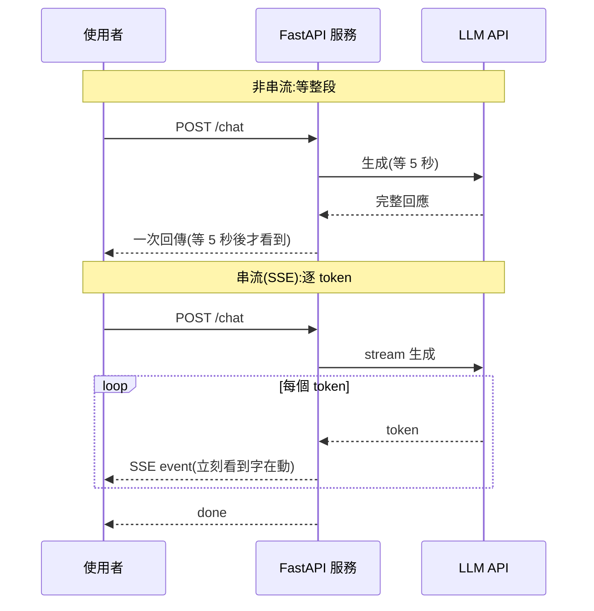

# 把 LLM 應用 API 化(FastAPI + 串流)

> 你的 [RAG](../29-ai-applications/01-rag-pipeline.md) 或 [agent](../29-ai-applications/05-agents-react.md) 邏輯要能被前端、App、其他服務呼叫,就得包成 **API 服務**。但 LLM 服務有個傳統 API 沒有的關鍵需求:**串流(streaming)**——回應要一個字一個字吐出來,而不是讓使用者盯著轉圈等十秒。這章講怎麼用 [FastAPI](../14-web/README.md) 把 LLM 應用做成生產級 API,重點在串流與非同步。

## 💡 白話導讀(建議先讀)

你的 [RAG](../29-ai-applications/01-rag-pipeline.md) 或 [agent](../29-ai-applications/05-agents-react.md)
在筆記本裡跑得好好的,但要讓**真實使用者**用,得包成一個**線上 API 服務**。
這章講怎麼把 LLM 邏輯,變成一個對得起「上線」二字的服務。

第一個非做不可的,是**串流(streaming)**——而且對 LLM 尤其關鍵。
LLM [一個 token 一個 token 生成](../28-llm-genai/01-llm-fundamentals.md),
一段長回應要好幾秒。不串流,使用者**盯著空白畫面乾等 5 秒**;
串流則是文字**邊生成邊冒出來**,使用者零點幾秒就看到第一個字(**TTFT,首字時間**)——
同樣的總時間,體感天差地遠。技術上用 SSE,配上你早學過的
[async](../28-llm-genai/05-streaming-async.md)(LLM 呼叫是極致 I/O-bound,async 主場)。

這章把 LLM 服務的工程細節補齊:

- **FastAPI 包裝**(呼應 [Part 14](../14-web/README.md)):串流端點怎麼寫、
  怎麼把 tool use 的多步循環也串流出去。
- **並發與資源**:一台機器能同時扛多少請求?async 讓你用少少的行程扛大量等待中的請求。
- **超時與取消**:使用者關掉頁面,要能中止背後的生成(別白燒 token)。
- **水平擴展與[容器化](../19-cloud-native/01-docker.md)**:無狀態設計才能多開幾台分攤流量。

一句話:這章把「會呼叫 API」升級成「營運一個 LLM 服務」——
是整個生產化的起點。

## Why(為什麼)

把 LLM 邏輯 API 化,除了「讓別人能呼叫」的一般理由,還有 LLM 特有的考量:

- **回應慢,體感是生死線**:LLM 生成一段回答可能要好幾秒([TTFT + 逐 token 生成](../28-llm-genai/05-streaming-async.md))。若等**整段生成完**才一次回傳,使用者盯著空白轉圈好幾秒——體驗很差,還可能撞上 [HTTP/負載平衡器的逾時](03-reliability.md)。**串流**讓文字**邊生成邊送達**,使用者立刻看到字開始跑(像 ChatGPT/Claude 那樣),體感延遲大幅下降。
- **高 I/O、要非同步**:LLM API 呼叫是**長時間 I/O 等待**(等模型算完)。用[同步](../09-concurrency/README.md)寫法,一個請求會阻塞整個 worker;用 **async**([Part 28 ch05](../28-llm-genai/05-streaming-async.md))能在等待時服務其他請求,大幅提升吞吐。FastAPI 天生 async,是絕配。
- **要能水平擴展、容器化**:生產服務要能[打包成容器、多副本部署](../19-cloud-native/README.md)、無狀態(見 [12-factor](../19-cloud-native/README.md))。LLM 服務的狀態(對話歷史)應[外置](../29-ai-applications/07-memory-context.md),讓服務本身無狀態好擴展。

**FastAPI** 是 Python 生態做 LLM API 的主流選擇:原生 async、[pydantic 驗證](../14-web/README.md)、`StreamingResponse` 支援串流、效能好。這章把這些串起來。

## Theory(理論:串流與 SSE)

**為什麼 LLM 特別需要串流**:LLM [自迴歸生成](../28-llm-genai/01-llm-fundamentals.md)——一個 token 一個 token 產生。非串流時,伺服器等所有 token 生成完,再把整包回傳,使用者的等待 = 全部生成時間。串流時,每生成一個 token 就**立即送出**,使用者的等待 = **第一個 token 的時間(TTFT)**,之後文字持續流出。對數秒級的生成,這是「盯著空白 5 秒」vs「立刻看到字在動」的差別。

**串流的傳輸方式**——最常用 **SSE(Server-Sent Events)**:

- **SSE** 是 HTTP 上的**單向**(伺服器 → 客戶端)串流協定,基於純文字。格式簡單:每則事件是 `event: <類型>\ndata: <內容>\n\n`(空行分隔)。瀏覽器有原生 `EventSource` 支援。
- **為何用 SSE 而非 WebSocket**:LLM 回應是**單向推送**(伺服器吐字給客戶端),SSE 剛好夠用、更輕量、走一般 HTTP、自動重連。WebSocket 是雙向的,對這場景過重。
- **也有用 chunked HTTP / NDJSON**:每行一個 JSON chunk。原理類似,都是「分段送」。

**非同步生成器(async generator)** 是串流的骨架:一個 `async def` + `yield`,每 `yield` 一段就送給客戶端一段(見 [Part 28 ch05](../28-llm-genai/05-streaming-async.md))。FastAPI 的 `StreamingResponse` 直接吃 async generator。

## Specification(規範:FastAPI 串流端點)

**一個生產級 LLM 端點的組成**:

```python
# 概念示意(需 fastapi;真實接 Anthropic 串流 API)
from fastapi import FastAPI
from fastapi.responses import StreamingResponse
from pydantic import BaseModel

app = FastAPI()

class ChatRequest(BaseModel):   # pydantic 驗證輸入
    message: str
    max_tokens: int = 1024

async def generate_sse(message: str):
    # 真實中:async with client.messages.stream(...) as stream:
    #             async for text in stream.text_stream: yield sse(text)
    async for token in mock_llm_stream(message):
        yield f"event: token\ndata: {token}\n\n"
    yield "event: done\ndata: [DONE]\n\n"

@app.post("/chat")
async def chat(req: ChatRequest) -> StreamingResponse:
    return StreamingResponse(
        generate_sse(req.message),
        media_type="text/event-stream",   # SSE 的 MIME type
    )
```

**要點**:

- **`media_type="text/event-stream"`**:告訴客戶端這是 SSE 串流。
- **[pydantic](../14-web/README.md) 驗證輸入**:`message`、`max_tokens` 等,擋掉畸形請求(也是[安全](05-prompt-injection-security.md)的第一道)。
- **async generator**:`generate_sse` 逐段 yield,FastAPI 逐段送出。
- **`[DONE]` 結束事件**:讓客戶端知道串流結束。
- **真實串流**:Anthropic SDK 用 `client.messages.stream(...)` 的 `text_stream`(見 [claude-api](../28-llm-genai/05-streaming-async.md));[長輸出務必串流](../28-llm-genai/05-streaming-async.md)以免撞逾時。

## Implementation(底層:串流如何逐段送達、無狀態設計)

**串流在 HTTP 層怎麼運作**:伺服器回應時不設 `Content-Length`,改用 **chunked transfer encoding**——連線保持開啟,伺服器每 `yield` 一段就寫入一個 chunk 送出,客戶端收到就處理。SSE 在此之上加了 `event:`/`data:` 的文字格式約定。整條鏈路(FastAPI → ASGI server 如 Uvicorn → 反向代理 → 客戶端)都要支援串流不緩衝——**常見坑**:某層(nginx、CDN)開了緩衝,把串流又攢成一整包才送,串流失效(見 Common Mistakes)。

**async 為何提升吞吐**:LLM 呼叫大部分時間在**等模型回應**(I/O bound)。同步 worker 等的時候什麼都不能做,N 個並發請求要 N 個 worker;async 讓單一 worker 在等待時切去服務其他請求([事件迴圈](../09-concurrency/README.md)),同樣資源服務更多並發。這對「每個請求都要等 LLM 好幾秒」的場景收益巨大。

**無狀態設計**:為了[水平擴展](../19-cloud-native/README.md),服務本身別存對話狀態——[對話歷史/記憶](../29-ai-applications/07-memory-context.md)存外部(Redis/DB),每個請求自帶或帶 session id 去取。這樣任何副本都能處理任何請求,負載平衡自由分配。下面範例用純標準庫(asyncio)實作 SSE 串流的核心——async generator + SSE 格式化(不依賴 FastAPI,聚焦串流機制)。

## Code Example(可執行的 Python 範例)

```python
# sse_streaming.py — LLM 串流的核心:async generator + SSE 格式化(純標準庫)
from __future__ import annotations

import asyncio
from collections.abc import AsyncIterator


async def mock_llm_stream(reply: str) -> AsyncIterator[str]:
    """mock LLM 逐 token 串流。真實用 Anthropic 的 stream.text_stream。"""
    for token in reply.split():
        await asyncio.sleep(0)  # 讓出事件迴圈(真實中是等模型的 I/O)
        yield token + " "


def to_sse(event: str, data: str) -> str:
    """格式化成 SSE 事件:event: <類型>\\ndata: <內容>\\n\\n。"""
    return f"event: {event}\ndata: {data}\n\n"


async def sse_endpoint(reply: str) -> AsyncIterator[str]:
    """模擬 FastAPI StreamingResponse 的內容產生器:逐 token 送 SSE,最後送 done。"""
    async for token in mock_llm_stream(reply):
        yield to_sse("token", token.strip())
    yield to_sse("done", "[DONE]")


async def main() -> None:
    # 模擬客戶端逐一收到 SSE 事件
    events = [chunk async for chunk in sse_endpoint("生產級 LLM 服務")]
    for e in events:
        print(repr(e))
    print(f"總事件數: {len(events)}(3 token + 1 done)")


if __name__ == "__main__":
    asyncio.run(main())
```

**預期輸出**:

```pycon
$ python sse_streaming.py
'event: token\ndata: 生產級\n\n'
'event: token\ndata: LLM\n\n'
'event: token\ndata: 服務\n\n'
'event: done\ndata: [DONE]\n\n'
總事件數: 4(3 token + 1 done)
```

逐段解說:

- **`mock_llm_stream`**:async generator,逐 token yield。`await asyncio.sleep(0)` 代表「等模型 I/O」時**讓出事件迴圈**——真實中這段等待可以拿去服務其他請求(async 的吞吐優勢)。
- **`to_sse`**:把每段文字包成 SSE 格式 `event: token\ndata: <內容>\n\n`。空行(`\n\n`)是 SSE 的事件分隔符。瀏覽器 `EventSource` 會逐則觸發 `token` 事件。
- **`sse_endpoint`**:對應 FastAPI 的 `StreamingResponse` 內容——逐 token 送 SSE 事件,結束送 `done` 讓客戶端知道完成。真實中這個 generator 傳給 `StreamingResponse(..., media_type="text/event-stream")`。
- **輸出**:3 個 token 事件 + 1 個 done 事件,**逐個送達**——使用者看到「生產級」立刻出現,不必等整句。這就是串流的價值。
- **從這到 FastAPI**:把 `sse_endpoint` 包進 `StreamingResponse`、加 [pydantic 輸入驗證](../14-web/README.md)、接真實 Anthropic 串流 API,就是生產端點。核心機制(async generator + SSE)就是這裡示範的。

## Diagram(圖解:串流 vs 非串流)



## Best Practice(最佳實踐)

- **LLM 端點一律串流**:大幅降低體感延遲、避開長回應撞 HTTP/LB 逾時([長輸出必串流](../28-llm-genai/05-streaming-async.md))。
- **用 async(FastAPI + Uvicorn)**:I/O bound 場景,async 吞吐遠勝同步。
- **[pydantic 驗證輸入](../14-web/README.md)**:擋畸形請求,是[安全](05-prompt-injection-security.md)第一道。
- **服務無狀態**:對話狀態[外置](../29-ai-applications/07-memory-context.md)(Redis/DB),便於[水平擴展](../19-cloud-native/README.md)。
- **確認全鏈路不緩衝串流**:反向代理/CDN 若緩衝會讓串流失效,關掉相關緩衝。
- **設連線層逾時與取消**:客戶端斷線要能取消上游 LLM 呼叫,別浪費 token/成本。
- **容器化 + 多副本 + 健康檢查**([Part 19](../19-cloud-native/README.md)):LLM 服務仍是服務,套用既有雲原生實踐。
- **串流也要能中止**:偵測到[安全](06-guardrails.md)問題或超預算能中斷串流。

## Common Mistakes(常見誤解)

- **非串流回長回應**:使用者盯空白數秒,還可能撞 HTTP/LB 逾時導致失敗。
- **用同步阻塞寫 LLM 呼叫**:一個請求卡住整個 worker,吞吐極差。
- **反向代理/CDN 緩衝串流**:串流被攢成一整包,失去串流效果(常見部署坑)。
- **服務內存對話狀態**:無法水平擴展(請求被分到別的副本就丟失上下文)。
- **不驗證輸入**:畸形/惡意請求直接進 LLM,成本與[安全](05-prompt-injection-security.md)風險。
- **客戶端斷線不取消上游**:繼續生成沒人要的內容,浪費 token 與錢。
- **忘記送結束事件**:客戶端不知串流何時結束。
- **以為 API 化就是套個 Flask**:忽略串流、async、無狀態、逾時等 LLM 服務特性。

## Interview Notes(面試重點)

- **能說明 LLM 服務為何需要串流**:生成慢,串流把等待從「整段時間」降到「TTFT」,大幅改善體感、避開逾時。
- **能解釋 SSE**:HTTP 上單向文字串流,`event:`/`data:` 格式,瀏覽器原生 `EventSource`;為何比 WebSocket 適合(單向、輕量)。
- **能解釋 async 的吞吐優勢**:LLM 呼叫 I/O bound,async 在等待時服務其他請求。
- **能講無狀態設計**:對話狀態外置,便於水平擴展。
- **知道用 FastAPI + StreamingResponse + async generator + pydantic**,接 Anthropic 串流 API。
- **知道串流的部署坑**:全鏈路不能緩衝、客戶端斷線要取消上游。

---

➡️ 下一章:[可靠性:重試、逾時、fallback、限流](03-reliability.md)

[⬆️ 回 Part 30 索引](README.md)
