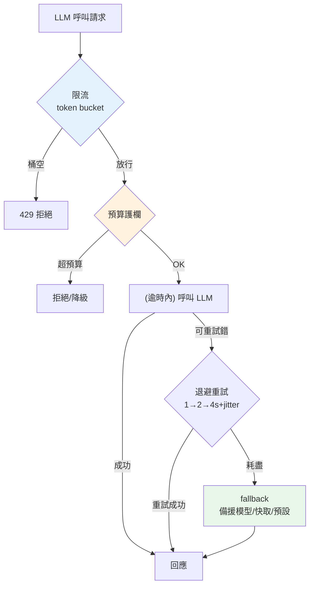

# 可靠性:重試、逾時、fallback、限流

> 你的 LLM 服務依賴一個**外部 API**——它會逾時、會回 429(限流)、會偶發 500、偶爾整個區域抖動。若你天真地「呼叫、拿結果」,一次上游打嗝就讓你的服務跟著掛。這章講讓 LLM 服務**扛得住上游不穩**的四道防線:重試(退避)、逾時、fallback、限流/預算護欄——後兩者同時是**成本 blocker**。

## Why(為什麼)

LLM 服務的可靠性挑戰,比一般 API 更尖銳:

- **上游會失敗且不穩**:LLM API 是重負載的外部服務——**429(rate limited)**、**529(overloaded)**、逾時、偶發 5xx 都是常態,不是異常。你的服務可用性**上限**受制於上游,除非你主動處理這些失敗。
- **回應慢,逾時難拿捏**:LLM 生成要數秒,正常延遲就高([串流](02-serving-llm-apps.md)緩解體感但總時間仍長)。逾時設太短會誤殺正常的慢回應、設太長會讓卡住的請求拖垮資源。
- **成本會失控(這是 blocker)**:每次呼叫[花錢](../28-llm-genai/08-cost-latency-caching.md)。沒有**限流**,一個 bug 迴圈或惡意使用者能瞬間打出上萬次呼叫;沒有**預算上限**,帳單一夜爆表。這不是「可靠性 nice-to-have」,是[上線的 blocker](01-llmops-intro.md)。

**四道防線**:**重試 + 退避**(吸收暫時性失敗)、**逾時**(不讓慢請求無限拖)、**fallback**(主路掛了走備援,如換[更小的模型](../28-llm-genai/08-cost-latency-caching.md)或回快取)、**限流 + 預算護欄**(擋住暴衝、封住成本)。這些多數你在 [Part 21 微服務](../21-microservices/README.md)、[Part 22 分散式](../22-distributed-systems/README.md)學過通用版,這裡是 LLM 語境下的應用與強調。

## Theory(理論:四道防線)

**1. 重試 + 指數退避(exponential backoff)**:暫時性失敗(429/529/逾時)常**重試就好**。但立刻重試會**加劇壅塞**(大家同時重打)。**指數退避**:每次失敗後等待時間**倍增**(1s → 2s → 4s),給上游喘息;再加 **jitter(隨機抖動)** 打散「同時重試」的洪峰(thundering herd)。**只重試可重試的錯**(429/5xx/逾時),別重試 4xx(如 400 壞請求、401 認證錯——重試也沒用)。

**2. 逾時(timeout)**:每次呼叫設**上限時間**,超過就放棄(可能觸發重試/fallback)。避免一個卡死的上游連線**無限佔用**你的資源。LLM 因回應慢,逾時要設得比一般 API 寬,並區分 **連線逾時** 與 **總逾時**;[串流](02-serving-llm-apps.md)可用「首 token 逾時」。

**3. Fallback(降級/備援)**:主路徑失敗時的 Plan B。LLM 場景的 fallback:換**更小/更快的[備援模型](../28-llm-genai/08-cost-latency-caching.md)**(Opus 掛了退 Haiku)、回**快取的近似答案**、回**預設安全回應**(「系統忙碌,請稍後」)。**優雅降級勝過整個失敗**。搭配 **circuit breaker(熔斷)**([Part 21](../21-microservices/README.md)):上游連續失敗就暫時「跳閘」,直接走 fallback 不再打上游,給它恢復時間。

**4. 限流 + 預算護欄**:

- **限流(rate limiting)**:限制單位時間的呼叫數。經典演算法 **token bucket(權杖桶)**:桶裡有權杖、以固定速率補充,每次呼叫耗一個,桶空就擋。允許短時突發(桶容量)又限長期速率。可按使用者/租戶/全域分層。
- **預算護欄(budget guard)**:累計[成本](../28-llm-genai/08-cost-latency-caching.md),超過上限就拒絕/降級。防「成本爆炸」的最後一道閘。

## Specification(規範:各防線的參數)

| 防線 | 關鍵參數 | LLM 場景設定 |
|------|----------|--------------|
| 重試 | max_retries、base_delay、可重試錯誤集 | 重試 429/529/5xx/逾時,不重試 4xx;退避 1→2→4s + jitter |
| 逾時 | 連線逾時、總逾時、首 token 逾時 | 比一般 API 寬(數十秒);串流用首 token 逾時 |
| Fallback | 備援模型、快取、預設回應、熔斷閾值 | Opus→Haiku、回快取、安全預設;連續 N 失敗跳閘 |
| 限流 | 桶容量、補充速率、分層維度 | 按 user/tenant/全域;容量允許突發 |
| 預算 | 每日/每租戶上限 | 累計成本超限即拒絕或降級 |

**組合順序**(一次呼叫的防護鏈):`限流檢查 → 預算檢查 → (逾時內) 呼叫 → 失敗則退避重試 → 重試耗盡則 fallback`。

**冪等性注意**:重試要確保**不重複產生副作用**(見 [Part 22 冪等](../22-distributed-systems/README.md))。純生成通常安全;但若呼叫有副作用([tool use 執行動作](../29-ai-applications/05-agents-react.md)),重試要加冪等鍵。

## Implementation(底層:退避為何有效、token bucket 機制)

**指數退避 + jitter 為何必要**:上游 429 通常代表「你打太快」。若所有失敗的請求**固定間隔**一起重試,會形成同步的重試洪峰,再次打爆上游——惡性循環(thundering herd)。**指數增長**讓重試越來越稀疏給上游恢復空間;**jitter** 把「同時重試」隨機打散到一個時間窗,削平洪峰。兩者缺一不可。

**token bucket 的數學**:桶容量 `C`、補充速率 `r`(個/秒)。任一時刻的權杖數 = `min(C, 上次剩餘 + 經過時間 × r)`。每次請求耗 1(或按成本耗多個),桶 ≥ 需求才放行。**容量 C 決定容忍的突發大小**(瞬間能放 C 個),**速率 r 決定長期平均**。比「固定視窗計數」平滑(不會在視窗邊界爆量)。下面範例的 `TokenBucket` 用**注入時間**(`now` 參數)而非真實時鐘,確保**確定性可測**——生產環境同款邏輯改用真實時間。

**成本護欄放哪**:在呼叫**前**用估計成本檢查(`預估 tokens × 單價`),呼叫**後**用實際 usage 修正累計值。超限時**拒絕新請求或降級**,而非硬花下去。這是[成本 blocker](01-llmops-intro.md) 的實作核心。下面範例實作三道:退避重試、token bucket 限流、預算護欄(注入時間/sleep 以求確定性)。

## Code Example(可執行的 Python 範例)

```python
# reliability.py — 重試退避 + token bucket 限流 + 預算護欄(純標準庫,可測)
from __future__ import annotations

from collections.abc import Callable


class RetryableError(Exception):
    """可重試的錯誤(對應 429/529/5xx/逾時)。"""


def retry_with_backoff(
    func: Callable[[int], str],
    max_retries: int = 3,
    base_delay: float = 1.0,
    sleeper: Callable[[float], None] | None = None,
) -> tuple[str, list[float]]:
    """指數退避重試:只重試 RetryableError;回 (結果, 各次退避秒數)。"""
    delays: list[float] = []
    for attempt in range(max_retries + 1):
        try:
            return func(attempt), delays
        except RetryableError:
            if attempt == max_retries:
                raise
            delay = base_delay * (2**attempt)  # 1 → 2 → 4(真實再加 jitter)
            delays.append(delay)
            if sleeper:
                sleeper(delay)
    raise AssertionError("unreachable")


class TokenBucket:
    """token bucket 限流:容量允許突發,補充速率限長期平均。時間用注入以求可測。"""

    def __init__(self, capacity: float, refill_per_sec: float) -> None:
        self.capacity = capacity
        self.tokens = capacity
        self.refill = refill_per_sec
        self.last = 0.0

    def allow(self, now: float, cost: float = 1) -> bool:
        self.tokens = min(self.capacity, self.tokens + (now - self.last) * self.refill)
        self.last = now
        if self.tokens >= cost:
            self.tokens -= cost
            return True
        return False


class BudgetExceeded(Exception):
    pass


class BudgetGuard:
    """預算護欄:累計成本超上限即拒絕(成本 blocker)。"""

    def __init__(self, limit_usd: float) -> None:
        self.limit = limit_usd
        self.spent = 0.0

    def charge(self, cost: float) -> float:
        if self.spent + cost > self.limit:
            raise BudgetExceeded(f"超出預算 ${self.limit}")
        self.spent += cost
        return self.spent


def main() -> None:
    # 1. 重試:前兩次失敗,第三次成功
    calls = {"n": 0}

    def flaky(attempt: int) -> str:
        calls["n"] += 1
        if attempt < 2:
            raise RetryableError("429")
        return "ok"

    result, delays = retry_with_backoff(flaky, sleeper=lambda _: None)
    print(f"重試: 結果={result} 退避={delays} 呼叫={calls['n']} 次")

    # 2. 限流:容量 2,連打 3 次(第 3 擋),補充後放行
    bucket = TokenBucket(capacity=2, refill_per_sec=1)
    print(f"限流 t=0 連 3 次: {[bucket.allow(now=0) for _ in range(3)]}")
    print(f"限流 t=1 補充後: {bucket.allow(now=1)}")

    # 3. 預算:上限 $0.10
    guard = BudgetGuard(limit_usd=0.10)
    print(f"預算 花 $0.04: 累計 ${guard.charge(0.04):.2f}")
    print(f"預算 花 $0.05: 累計 ${guard.charge(0.05):.2f}")
    try:
        guard.charge(0.05)
    except BudgetExceeded as e:
        print(f"預算 擋下: {e}")


if __name__ == "__main__":
    main()
```

**預期輸出**:

```pycon
$ python reliability.py
重試: 結果=ok 退避=[1.0, 2.0] 呼叫=3 次
限流 t=0 連 3 次: [True, True, False]
限流 t=1 補充後: True
預算 花 $0.04: 累計 $0.04
預算 花 $0.05: 累計 $0.09
預算 擋下: 超出預算 $0.1
```

逐段解說:

- **重試**:`flaky` 前兩次拋 `RetryableError`(模擬 429),第三次成功。退避序列 `[1.0, 2.0]`(1s、2s,倍增),共呼叫 3 次。真實會再加 **jitter**(隨機抖動)打散洪峰。注意用 `sleeper` 注入 sleep——測試時傳 no-op,**不真的等**,確定性可測。
- **限流**:`TokenBucket(capacity=2)` 在 `t=0` 連打:前兩次有權杖 → `True`,第三次桶空 → `False`(擋下)。到 `t=1`,補充了 1 個權杖 → 放行。**容量允許突發、速率限長期**。
- **預算護欄**:上限 $0.10,花 $0.04 + $0.05 = $0.09 OK;再花 $0.05 會到 $0.14 超限 → 擋下。這是**成本 blocker** 的實作——超預算就拒絕,而非硬花。
- **可測性設計**:時間(`now`)與 sleep(`sleeper`)都**注入**,不依賴真實時鐘——所以測試確定、快速。生產環境換成真實時間即可。
- **組合**:真實呼叫鏈是「限流 → 預算 → 逾時內呼叫 → 失敗退避重試 → 耗盡走 fallback」,把四道防線串起來。

## Diagram(圖解:防護鏈)



## Best Practice(最佳實踐)

- **指數退避 + jitter**:重試暫時性失敗,倍增間隔 + 隨機抖動,避免 thundering herd。
- **只重試可重試的錯**:429/529/5xx/逾時要重試;4xx(壞請求/認證)重試無用,別重試。
- **設合理逾時**:LLM 比一般 API 寬,區分連線/總/首 token 逾時;[串流](02-serving-llm-apps.md)用首 token 逾時。
- **一定要有 fallback + 熔斷**:主路掛了走[備援模型](../28-llm-genai/08-cost-latency-caching.md)/快取/安全預設;連續失敗跳閘([Part 21](../21-microservices/README.md))。
- **限流 + 預算護欄是 blocker**:token bucket 擋暴衝、預算上限封成本,上線前必備。
- **分層限流**:按 user/tenant/全域多維度,防單一使用者拖垮全體。
- **重試注意冪等**:有副作用的呼叫([tool use](../29-ai-applications/05-agents-react.md))要加冪等鍵([Part 22](../22-distributed-systems/README.md))。
- **客戶端斷線取消上游**:別為已離開的使用者繼續花 token。

## Common Mistakes(常見誤解)

- **不重試,一次上游打嗝就失敗**:可用性被上游拖累。
- **固定間隔重試(無退避/jitter)**:同步重試洪峰再次打爆上游。
- **重試 4xx**:壞請求/認證錯重試也沒用,徒增延遲與成本。
- **沒有逾時**:卡死的連線無限佔資源,拖垮服務。
- **沒有 fallback**:主路一掛整個功能不可用,而非優雅降級。
- **沒有限流/預算**:一個 bug 迴圈或惡意流量燒爆帳單(成本災難)。
- **限流只有全域**:單一使用者就能耗盡全體額度。
- **有副作用的呼叫盲目重試**:重複執行動作(重複下單/發信)。

## Interview Notes(面試重點)

- **能列 LLM 可靠性的四道防線**:重試退避、逾時、fallback(+熔斷)、限流+預算。
- **能解釋指數退避 + jitter**:倍增間隔給上游恢復、jitter 打散洪峰(thundering herd)。
- **知道只重試可重試錯**(429/5xx/逾時,非 4xx),重試要顧冪等。
- **能解釋 token bucket**:容量允許突發、補充速率限長期,優於固定視窗。
- **知道限流 + 預算是成本 blocker**:防暴衝/惡意流量燒爆帳單。
- **能講 LLM 場景的 fallback**:備援小模型、快取、安全預設 + 熔斷。
- **知道逾時要區分連線/總/首 token,LLM 設得比一般 API 寬。**

---

➡️ 下一章:[可觀測性:logging、tracing、成本與延遲監控](04-observability.md)

[⬆️ 回 Part 30 索引](README.md)
