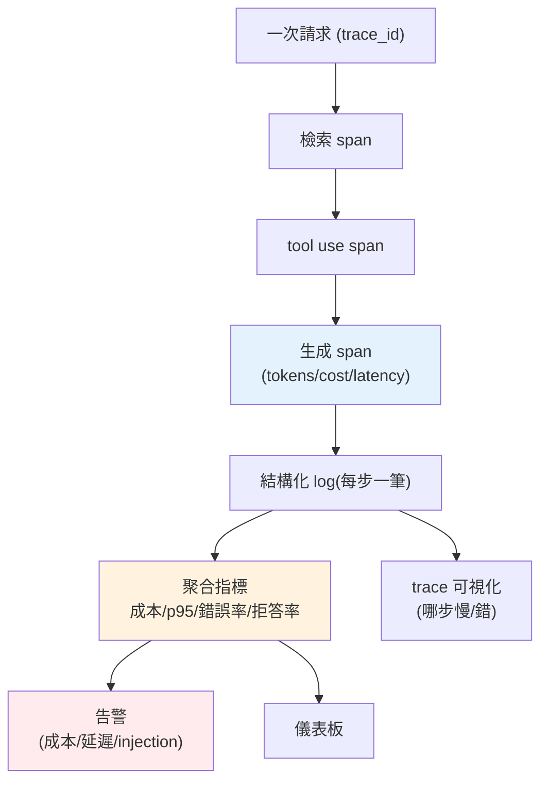

# 可觀測性:logging、tracing、成本與延遲監控

> 你的 LLM 服務上線了。半夜有人回報「答案怪怪的」、帳單比預期高、某些請求很慢——**你怎麼查?** 傳統 APM 看 QPS/延遲/錯誤率,但 LLM 還有一整層它看不到的東西:每次呼叫的完整 prompt、token 用量、成本、品質分數、走了哪些[工具](../29-ai-applications/05-agents-react.md)、是不是[幻覺](../29-ai-applications/04-rag-evaluation.md)。看不見就管不了。這章講 LLM 應用的可觀測性。

## Why(為什麼)

LLM 應用的可觀測性,比傳統服務多幾個**非看不可**的維度:

- **成本要看得到才控得住**:[每次呼叫花多少錢](../28-llm-genai/08-cost-latency-caching.md)、哪個功能/使用者/模型最燒錢、成本趨勢——看不到就無法優化,也無法在[預算爆掉](03-reliability.md)前預警。
- **token 用量是成本與品質的根源**:input/output token 數直接決定成本,也反映 prompt 是否過長、[context 是否臃腫](../29-ai-applications/07-memory-context.md)。要逐次記錄、彙總。
- **不確定性讓「重現」失效**:傳統 bug 可以「重跑一次看看」;LLM 同輸入可能不同輸出,出問題時**當下那次呼叫的完整 context(prompt、檢索到什麼、模型版本、參數)** 若沒記下來,事後根本無法重現與診斷。
- **品質會漂移且無聲**:[幻覺是「看似成功的失敗」](01-llmops-intro.md)——HTTP 200、有回應,但內容錯。傳統錯誤率抓不到,要靠**線上品質訊號**(取樣[評估](07-eval-in-cicd.md)、使用者回饋、拒答率)。
- **agent/RAG 是多步的**:一次請求可能經過[檢索 → 多輪 tool use → 生成](../29-ai-applications/05-agents-react.md)。要**追蹤(tracing)** 才能看到每一步、定位是哪步出錯或慢。

**可觀測性的三根支柱**(logs / metrics / traces)在 LLM 場景要加上 **LLM 專屬欄位**。做好它,你才能除錯、控成本、抓品質、優化延遲。

## Theory(理論:三支柱 + LLM 專屬維度)

**可觀測性三支柱**,套到 LLM:

- **Logs(日誌)**:**結構化**記錄每次 LLM 呼叫——trace_id、model、prompt(或其雜湊/摘要,顧及[PII](06-guardrails.md))、input/output tokens、latency、cost、status、走了哪些工具。結構化(JSON)才能被查詢/聚合。
- **Metrics(指標)**:可聚合的數字時序——請求數、**p50/p95/p99 延遲**、**每分鐘成本**、**token 吞吐**、錯誤率、[快取命中率](../28-llm-genai/08-cost-latency-caching.md)、[限流/預算拒絕數](03-reliability.md)、拒答率。用於儀表板與**告警**。
- **Traces(追蹤)**:一次請求跨多步的**因果鏈**——`trace_id` 串起檢索、每次 LLM 呼叫、每個 tool 執行,每步是一個 **span**(有起訖時間、屬性)。看得到「哪一步慢/錯」。

**為何延遲要看百分位而非平均**:LLM 延遲**分布長尾**(多數快、少數很慢)。平均會被少數極慢的拉高或被多數快的掩蓋;**p95/p99**(95%/99% 的請求快於此值)才反映「大部分使用者的最差體驗」,是 SLO 的基礎。

**LLM 專屬的可觀測平台**:LangSmith、Langfuse、Phoenix 等專為 LLM 設計,能記錄完整 prompt/回應鏈、算成本、掛[評估](07-eval-in-cicd.md)分數、可視化 trace——比通用 APM 更貼合。

## Specification(規範:該記錄什麼)

**每次 LLM 呼叫至少記錄**:

```text
trace_id        串起同一請求的多步
timestamp       時間
model           用了哪個模型(版本漂移追蹤)
input_tokens    輸入 token(成本 + prompt 長度)
output_tokens   輸出 token
latency_ms      延遲(可細分 TTFT / 總時間)
cost_usd        本次成本(由 token × 單價算)
status          ok / error / refusal / timeout
prompt_ref      prompt 的雜湊或摘要(勿存原文 PII;或存於受控處)
tools_used      走了哪些工具(agent)
quality_score   (取樣)線上評估分數,可選
```

**指標聚合**(從 logs 匯出):

```text
count、total_cost、total_tokens
p50/p95/p99 latency
error_rate、refusal_rate、cache_hit_rate
按 model / feature / tenant 分組
```

**告警**(超閾值通知):成本速率、p95 延遲、錯誤率、預算用量、injection 嘗試數。

**⚠️ 隱私**:prompt/回應可能含 [PII](06-guardrails.md)——記錄前**遮蔽/雜湊**,或存於受控、可稽核、有保留期限的位置(見[合規](06-guardrails.md))。

## Implementation(底層:結構化 log、百分位、成本歸因)

**為何結構化 log(JSON)**:純文字 log(`print(f"call took {ms}ms")`)人看得懂但機器難查。**結構化**(每筆一個 JSON 物件,固定欄位)能被 log 系統索引、過濾、聚合——「找出昨天成本 > $0.05 的所有 opus 呼叫」是一句查詢。生產環境把結構化 log 送進集中式系統(如 ELK、Loki、雲端 log),再建儀表板與告警。

**百分位怎麼算**:把延遲排序,p95 = 排在第 95% 位置的值(線性插值處理非整數位置)。這反映長尾——若 p50=1s 但 p95=8s,代表多數快但有一批很慢,值得查(可能是長輸出、上游抖動、[重試](03-reliability.md))。

**成本歸因(cost attribution)**:每筆記 `cost_usd = input_tokens × 單價_in + output_tokens × 單價_out`(見 [Part 28 ch08](../28-llm-genai/08-cost-latency-caching.md))。彙總時按 **feature / tenant / model** 分組,就能回答「哪個功能最燒錢」「哪個租戶用最多」——這是[成本優化](../28-llm-genai/08-cost-latency-caching.md)與計費的基礎。下面範例實作結構化呼叫記錄 + 成本計算 + 指標彙總(含 p95)。

## Code Example(可執行的 Python 範例)

```python
# observability.py — LLM 呼叫的結構化記錄 + 成本 + 指標彙總(純標準庫)
from __future__ import annotations

import json
from dataclasses import asdict, dataclass

# 每 1M token 單價(input, output);見 Part 28 ch08
PRICING: dict[str, tuple[float, float]] = {
    "claude-opus-4-8": (5.0, 25.0),
    "claude-haiku-4-5": (1.0, 5.0),
}


@dataclass
class LLMCallRecord:
    trace_id: str
    model: str
    input_tokens: int
    output_tokens: int
    latency_ms: float
    cost_usd: float
    status: str = "ok"


def record_call(
    trace_id: str, model: str, input_tokens: int, output_tokens: int, latency_ms: float
) -> LLMCallRecord:
    """建立一筆呼叫記錄,順帶算成本。"""
    price_in, price_out = PRICING[model]
    cost = input_tokens / 1e6 * price_in + output_tokens / 1e6 * price_out
    return LLMCallRecord(trace_id, model, input_tokens, output_tokens, latency_ms, round(cost, 6))


def structured_log(record: LLMCallRecord) -> str:
    """輸出結構化(JSON)log,可被 log 系統索引/查詢/聚合。"""
    return json.dumps(asdict(record), ensure_ascii=False, sort_keys=True)


def percentile(values: list[float], p: float) -> float:
    """百分位(線性插值);LLM 延遲長尾,看 p95/p99 而非平均。"""
    s = sorted(values)
    k = (len(s) - 1) * p
    lo = int(k)
    hi = min(lo + 1, len(s) - 1)
    return s[lo] + (s[hi] - s[lo]) * (k - lo)


def aggregate(records: list[LLMCallRecord]) -> dict[str, float]:
    """從記錄匯出指標:成本、token、延遲百分位、錯誤率。"""
    latencies = [r.latency_ms for r in records]
    n = len(records)
    return {
        "count": n,
        "total_cost": round(sum(r.cost_usd for r in records), 6),
        "total_tokens": sum(r.input_tokens + r.output_tokens for r in records),
        "p50_ms": percentile(latencies, 0.5),
        "p95_ms": percentile(latencies, 0.95),
        "error_rate": round(sum(r.status != "ok" for r in records) / n, 3),
    }


def main() -> None:
    records = [
        record_call("t1", "claude-opus-4-8", 1000, 500, 1200),
        record_call("t2", "claude-haiku-4-5", 800, 300, 400),
        record_call("t3", "claude-opus-4-8", 1200, 600, 2000),
    ]
    records[2].status = "error"

    print("一筆結構化 log:")
    print(structured_log(records[0]))
    print("\n指標彙總:")
    print(json.dumps(aggregate(records), ensure_ascii=False))


if __name__ == "__main__":
    main()
```

**預期輸出**:

```pycon
$ python observability.py
一筆結構化 log:
{"cost_usd": 0.0175, "input_tokens": 1000, "latency_ms": 1200, "model": "claude-opus-4-8", "output_tokens": 500, "status": "ok", "trace_id": "t1"}

指標彙總:
{"count": 3, "total_cost": 0.0408, "total_tokens": 4400, "p50_ms": 1200.0, "p95_ms": 1920.0, "error_rate": 0.333}
```

逐段解說:

- **`record_call`**:每次呼叫建一筆記錄,順帶算[成本](../28-llm-genai/08-cost-latency-caching.md)。opus 的 1000 in/500 out = `1000/1M×$5 + 500/1M×$25 = $0.0175`。**成本逐次記錄**,才能事後歸因。
- **`structured_log`**:輸出 JSON——`trace_id` 串起同請求的多步、`model` 追版本漂移、token/cost/latency/status 一應俱全。這種結構化 log 能被查詢聚合(「找出成本 > $0.05 的 opus 呼叫」)。
- **`percentile` / `aggregate`**:p50=1200ms、**p95=1920ms**——p95 反映長尾(最慢那批)。此例 `error_rate=0.333`(3 筆中 1 筆 error)。這些指標上儀表板 + 掛告警。
- **成本歸因**:`total_cost=$0.0408`,真實會按 feature/tenant/model 分組,回答「誰最燒錢」。
- **trace 的價值**:`trace_id` 讓你把「檢索 → 3 次 tool use → 生成」串成一條鏈([agent](../29-ai-applications/05-agents-react.md) 除錯必需)——看到哪步慢/錯。
- **隱私**:此例記了 token/cost 等安全欄位;真實中 prompt 原文要[遮蔽 PII](06-guardrails.md) 或存受控處。

## Diagram(圖解:LLM 可觀測性)



## Best Practice(最佳實踐)

- **結構化 log(JSON)每次呼叫**:trace_id/model/tokens/cost/latency/status,可查詢可聚合。
- **看百分位延遲(p95/p99)**:LLM 長尾,平均會騙人;p95/p99 才反映最差體驗與 SLO。
- **逐次記成本、按 feature/tenant/model 歸因**:知道誰最燒錢才能優化與計費。
- **用 trace 串多步**:agent/RAG 的每步一個 span,定位慢/錯。
- **監控 LLM 專屬指標**:成本速率、token 吞吐、拒答率、[快取命中](../28-llm-genai/08-cost-latency-caching.md)、[injection 嘗試](05-prompt-injection-security.md)。
- **掛告警**:成本、p95、錯誤率、預算用量超閾值即通知。
- **線上品質訊號**:取樣[評估](07-eval-in-cicd.md)、收使用者回饋、監拒答率——抓無聲的品質漂移。
- **顧隱私**:log 前遮蔽 [PII](06-guardrails.md)、存受控處、設保留期限。
- **考慮 LLM 專用可觀測平台**(LangSmith/Langfuse/Phoenix)。

## Common Mistakes(常見誤解)

- **只用傳統 APM**:看不到 token/成本/品質/injection,LLM 問題全盲。
- **非結構化文字 log**:機器難查難聚合,出事撈不出來。
- **只看平均延遲**:長尾被掩蓋,p95 的慢請求看不到。
- **不記成本**:無法歸因、無法優化、預算爆了才知道。
- **出問題才發現沒記 context**:LLM 不可重現,當下沒記完整 context 就無法診斷。
- **不監控品質**:幻覺是 200 成功回應,錯誤率抓不到,靠使用者抱怨。
- **log 原始 prompt 含 PII**:隱私/合規風險。
- **沒有告警**:成本/延遲/攻擊悄悄惡化到爆才發現。

## Interview Notes(面試重點)

- **能列可觀測性三支柱 + LLM 專屬維度**:logs/metrics/traces,加 token/cost/品質/工具鏈。
- **能解釋為何看 p95/p99 而非平均**:LLM 延遲長尾,百分位才反映最差體驗與 SLO。
- **能講成本可觀測與歸因**:逐次記錄、按 feature/tenant/model 分組,支撐優化與計費。
- **能講 trace 對 agent/RAG 的價值**:多步因果鏈,定位哪步慢/錯。
- **知道要監控 LLM 專屬指標與品質訊號**(拒答率、取樣評估、injection 嘗試)。
- **知道記錄要顧 PII/隱私**、可考慮 LLM 專用可觀測平台。

---

➡️ 下一章:[Prompt injection 與 OWASP LLM Top 10](05-prompt-injection-security.md)

[⬆️ 回 Part 30 索引](README.md)
