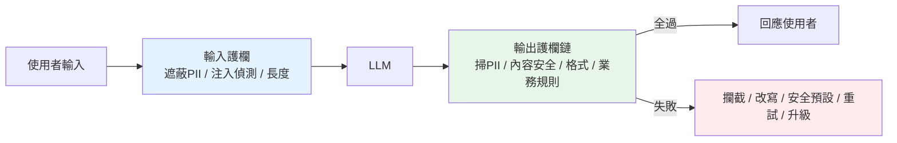

# 護欄:輸入輸出驗證、PII、內容安全

> [上一章](05-prompt-injection-security.md)談攻擊者主動的注入攻擊;這章談更廣的**護欄(guardrails)**——在 LLM 的**輸入端**和**輸出端**架設檢查,擋住不該進去的(PII、惡意內容)和不該出來的(洩漏的 PII、違規內容、幻覺、格式錯誤)。護欄是把「機率性、可能亂來」的 LLM,關進「可控行為」框架裡的圍欄。

## Why(為什麼)

LLM 的輸出**本質上不可完全控制**——它可能洩漏 [PII](#)、產生冒犯/違規內容、[幻覺](../29-ai-applications/04-rag-evaluation.md)出假資訊、回傳格式壞掉的 [JSON](../28-llm-genai/04-structured-output-tools.md)。在生產環境,這些都是真實風險:

- **PII 洩漏(合規 blocker)**:使用者輸入可能含個資(email、電話、身分證、信用卡);這些若被**送進第三方 LLM**、**寫進 [log](04-observability.md)**、或**出現在回應**給錯的人,就是**資料外洩 + 法規violation**(GDPR、個資法)。這是[上線 blocker](01-llmops-intro.md)。
- **內容安全**:面向使用者的 LLM 可能被誘導(或自己)產生仇恨、暴力、違法、對品牌有害的內容。你要為輸出負責。
- **輸出格式/正確性**:下游程式依賴 LLM 回**特定格式**(JSON、列舉值);LLM 偶爾回錯格式或多嘴,不驗證就讓下游崩潰。
- **業務規則**:客服 bot 不該承諾退款、法律 bot 不該給確定性法律意見——輸出要符合業務邊界。

**護欄**就是在 LLM 的兩端加「檢查關卡」:**輸入護欄**(進 LLM 前:遮蔽 PII、擋惡意)、**輸出護欄**(出 LLM 後:掃 PII、內容安全、格式驗證、業務規則)。任一關卡不過就攔截/改寫/退回,不讓壞東西通過。這是把 LLM 產品化的**必要安全網**。

## Theory(理論:輸入護欄 vs 輸出護欄)

護欄分兩端,各有職責:

**輸入護欄(pre-processing,進 LLM 前)**:

- **PII 偵測/遮蔽**:把使用者輸入裡的個資**遮蔽或 tokenize**(`john@x.com` → `[EMAIL]`),避免送第三方、避免入 log。需要時可在最終回應**還原**(用對映表)。
- **[注入偵測](05-prompt-injection-security.md)**、惡意/濫用內容偵測、長度/格式限制。

**輸出護欄(post-processing,出 LLM 後)**:

- **PII 掃描**:輸出**不該**含 PII(尤其不屬於當前使用者的)——掃到就遮蔽/攔截。防模型從 context/記憶洩漏他人資料。
- **內容安全**:仇恨/暴力/違法/自傷等分類器,超標即攔截或改寫。
- **格式驗證**:[pydantic](../14-web/README.md)/JSON schema 驗證結構化輸出;不符就[重試或修復](../29-ai-applications/04-rag-evaluation.md)。
- **業務規則/[幻覺](../29-ai-applications/04-rag-evaluation.md)檢查**:是否越界承諾、是否偏離 [context(忠實度)](../29-ai-applications/04-rag-evaluation.md)。

**護欄的實作手法**:**規則/正則**(PII pattern、禁詞——快、確定、但脆)、**分類器模型**(內容安全、注入——準、但有成本延遲)、**LLM-as-judge**(用另一個 LLM 判斷——彈性、但貴)、**schema 驗證**(格式)。實務**多手法組合**:便宜的規則先擋、貴的模型精判。

## Specification(規範:護欄鏈)

**護欄鏈(guardrail chain)**——把多個檢查串成關卡,**任一失敗即中止**:

```text
輸入 → [遮蔽 PII] → [注入偵測] → [長度檢查] → LLM
LLM → [掃 PII] → [內容安全] → [格式驗證] → [業務規則] → 輸出
                                        ↓ 任一失敗
                              攔截 / 改寫 / 退回安全預設 / 重試
```

**失敗時的處置策略**(依嚴重度):

- **攔截(block)**:回安全預設(「抱歉,我無法協助此請求」)。
- **改寫(redact/rewrite)**:遮蔽違規部分後放行(如遮 PII)。
- **重試(retry)**:格式錯就[要求模型重生成](../29-ai-applications/04-rag-evaluation.md)。
- **升級(escalate)**:高風險轉人工。

**PII 遮蔽 vs tokenize**:純遮蔽(`[EMAIL]`)不可還原;tokenize(`[EMAIL_1]` + 對映表)可在最終回應還原給**本人**——依需求選。

**成熟工具**:NeMo Guardrails、Guardrails AI、Llama Guard、雲廠商的 content moderation API——別全自己刻。

## Implementation(底層:為何兩端都要、規則的局限)

**為何輸入與輸出都要護欄**:輸入護欄防「壞東西進去」(PII 外送、注入);輸出護欄防「壞東西出來」(洩漏、違規、格式錯)。**兩者不可互相取代**——即使輸入乾淨,模型仍可能從[訓練資料/context/記憶](../29-ai-applications/07-memory-context.md)產出 PII 或違規內容;即使輸出檢查了,不遮蔽輸入仍會把 PII 送進第三方與 log。**縱深防禦要兩端夾擊**。

**規則式 PII 偵測的局限**:正則能抓**格式固定**的 PII(email、信用卡、身分證有明確 pattern),快又確定;但抓不到**無固定格式**的(人名、地址、口語提及的敏感事實)。所以規則是**基礎層**,高要求場景要加 **NER(命名實體識別)模型**或專用 PII 服務。下面範例用正則示範格式化 PII 的遮蔽——涵蓋最常見、最高風險的類型(足以當第一道)。

**護欄的成本/延遲權衡**:每加一道護欄(尤其模型式)都增加[延遲與成本](04-observability.md)。策略:**便宜的先擋**(正則 PII、禁詞——微秒級)、**只在必要時上貴的**(內容分類器、LLM-judge)。輸出護欄還要考慮與[串流](02-serving-llm-apps.md)的張力——邊串流邊檢查較難(可分段檢查或對完整輸出檢查後才放行敏感部分)。下面範例實作 PII 遮蔽 + 輸出護欄鏈(任一失敗即攔截)。

## Code Example(可執行的 Python 範例)

```python
# guardrails.py — PII 遮蔽 + 輸出護欄鏈(純標準庫)
from __future__ import annotations

import re
from collections.abc import Callable

# 格式化 PII 的 pattern(規則層;人名/地址等無固定格式者需 NER 模型)
PII_RULES: dict[str, str] = {
    "EMAIL": r"[A-Za-z0-9._%+-]+@[A-Za-z0-9.-]+\.[A-Za-z]{2,}",
    "CREDIT_CARD": r"\b(?:\d[ -]?){13,16}\b",
    "TW_ID": r"\b[A-Z][12]\d{8}\b",
    "PHONE_TW": r"\b09\d{2}[- ]?\d{3}[- ]?\d{3}\b",
}


def redact_pii(text: str) -> tuple[str, dict[str, int]]:
    """遮蔽格式化 PII(email/卡號/身分證/手機),回 (遮蔽後, 各類命中次數)。"""
    found: dict[str, int] = {}
    for label, pattern in PII_RULES.items():

        def repl(_m: re.Match[str], label: str = label) -> str:
            found[label] = found.get(label, 0) + 1
            return f"[{label}]"

        text = re.sub(pattern, repl, text)
    return text, found


class GuardrailViolation(Exception):
    """護欄檢查失敗。"""


def guard_no_pii(text: str) -> None:
    _, found = redact_pii(text)
    if found:
        raise GuardrailViolation(f"輸出含 PII: {sorted(found)}")


def guard_max_length(text: str, limit: int = 500) -> None:
    if len(text) > limit:
        raise GuardrailViolation("輸出過長")


def guard_no_blocklist(text: str, words: tuple[str, ...] = ("暴力", "詐騙")) -> None:
    hits = [w for w in words if w in text]
    if hits:
        raise GuardrailViolation(f"含禁詞: {hits}")


def apply_guardrails(text: str, guards: list[Callable[[str], None]]) -> str:
    """護欄鏈:任一失敗即拋出(由呼叫端決定攔截/改寫/退回安全預設)。"""
    for guard in guards:
        guard(text)
    return "PASS"


def main() -> None:
    dirty = "聯絡 john@example.com 或 0912-345-678,卡號 4111 1111 1111 1111,身分證 A123456789"
    redacted, found = redact_pii(dirty)
    print("PII 遮蔽:")
    print(f"  {redacted}")
    print(f"  命中: {sorted(found)}")

    guards = [guard_no_pii, guard_max_length, guard_no_blocklist]
    print("\n輸出護欄鏈:")
    print(f"  乾淨輸出: {apply_guardrails('這是正常的回答內容', guards)}")
    try:
        apply_guardrails("你的聯絡信箱是 a@b.com", guards)
    except GuardrailViolation as e:
        print(f"  攔截: {e}")


if __name__ == "__main__":
    main()
```

**預期輸出**:

```pycon
$ python guardrails.py
PII 遮蔽:
  聯絡 [EMAIL] 或 [PHONE_TW],卡號 [CREDIT_CARD],身分證 [TW_ID]
  命中: ['CREDIT_CARD', 'EMAIL', 'PHONE_TW', 'TW_ID']
輸出護欄鏈:
  乾淨輸出: PASS
  攔截: 輸出含 PII: ['EMAIL']
```

逐段解說:

- **`redact_pii`**:一句話裡的 email、手機、卡號、身分證**全被遮成標籤**。這用在**輸入端**(進 LLM 前,避免送第三方/入 log)也用在**輸出端**(掃洩漏)。規則層擋掉最高風險、最常見的格式化 PII。
- **護欄鏈**:`guard_no_pii`、`guard_max_length`、`guard_no_blocklist` 串成關卡。乾淨輸出全過 → `PASS`;含 email 的輸出被 `guard_no_pii` 攔下 → `GuardrailViolation`。**任一失敗即中止**,由呼叫端決定攔截/改寫/退安全預設。
- **可組合**:護欄是獨立的 `Callable`,能自由增減、重排、複用——輸入端一組、輸出端一組。真實再加內容安全分類器、[格式 schema 驗證](../14-web/README.md)、[忠實度檢查](../29-ai-applications/04-rag-evaluation.md)。
- **局限誠實說**:正則抓不到人名/地址等無固定格式 PII,高要求要上 NER;內容安全靠禁詞很粗,實務用分類器(Llama Guard 等)。這裡示範**架構(護欄鏈 + 遮蔽)**,元件可換更強的。
- **與注入的關係**:護欄和[注入防禦](05-prompt-injection-security.md)同屬縱深防禦——注入防「行為被綁架」,護欄防「輸入輸出的內容風險」,兩者互補。

## Diagram(圖解:輸入輸出護欄夾擊)



## Best Practice(最佳實踐)

- **輸入輸出兩端都要護欄**:輸入防 PII 外送/注入,輸出防洩漏/違規/格式錯,不可互相取代。
- **PII 遮蔽是合規 blocker**:進 LLM 前遮蔽、[log 前遮蔽](04-observability.md)、輸出掃描——別把個資送第三方或記下來。
- **護欄鏈,任一失敗即處置**:攔截/改寫/退安全預設/重試/升級,依嚴重度。
- **便宜的先擋、貴的後判**:正則/禁詞先過(微秒),再上分類器/LLM-judge(降延遲成本)。
- **格式用 schema 驗證**:[pydantic/JSON schema](../14-web/README.md) 驗結構化輸出,錯就重試。
- **用成熟工具**:NeMo Guardrails、Guardrails AI、Llama Guard、雲 moderation API,別全自刻。
- **高要求 PII 上 NER**:正則抓不到人名/地址,加命名實體識別或專用服務。
- **記錄護欄事件**:哪些被攔、為何——供[稽核與調校](04-observability.md)。

## Common Mistakes(常見誤解)

- **只做輸出護欄不做輸入**:PII 仍被送進第三方 LLM 與 log(合規爆雷)。
- **只做輸入不做輸出**:模型仍可能從 context/記憶洩漏 PII 或產違規內容。
- **把 PII 記進 log**:可觀測性做了,卻把個資存進日誌系統。
- **只靠正則抓所有 PII**:抓不到人名/地址等無格式 PII,漏網。
- **護欄全用 LLM-judge**:又貴又慢;該用規則的地方用規則。
- **格式不驗證**:LLM 偶爾回壞 JSON/多嘴,下游崩潰。
- **攔截後不給替代**:直接報錯,體驗差;應回安全預設或引導。
- **全部自己刻**:重造輪子且不如成熟工具準;內容安全尤其該用專用模型。

## Interview Notes(面試重點)

- **能區分輸入護欄 vs 輸出護欄**:進 LLM 前(遮 PII/注入/長度)vs 出 LLM 後(掃 PII/內容安全/格式/業務規則),兩端夾擊。
- **能講 PII 遮蔽是合規 blocker**:避免送第三方、入 log、洩漏;遮蔽 vs tokenize(可還原)。
- **能講護欄鏈與失敗處置**:任一失敗即攔截/改寫/退預設/重試/升級。
- **能講手法組合**:規則(快脆)、分類器(準有成本)、LLM-judge(彈性貴)、schema(格式);便宜先擋貴的後判。
- **知道規則式 PII 的局限**(無格式 PII 要 NER)、該用成熟工具。
- **能連結注入防禦**:護欄與 injection 防禦同屬縱深防禦,互補。

---

➡️ 下一章:[評估回歸與 CI/CD](07-eval-in-cicd.md)

[⬆️ 回 Part 30 索引](README.md)
