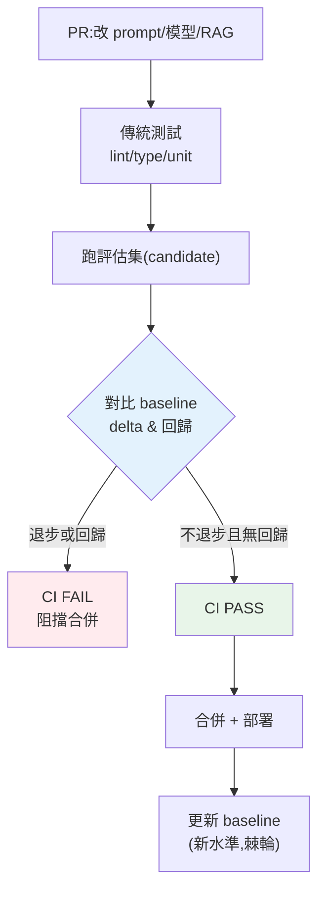

# 評估回歸與 CI/CD

> 傳統程式碼有單元測試把關:改壞了,CI 紅燈,擋下合併。但 LLM 應用的「行為」藏在 [prompt](../29-ai-applications/03-prompt-engineering.md)、模型版本、[RAG 知識庫](../29-ai-applications/01-rag-pipeline.md)裡——你改一句 prompt,某些問題悄悄變差,`pytest` 全綠卻**品質退化**。解法是把 [LLM 評估](../29-ai-applications/04-rag-evaluation.md)搬進 CI/CD,當作「品質的單元測試」:改動若讓評估分數退步或造成回歸,**CI 紅燈擋下**。這章講評估驅動的 CI/CD。

## Why(為什麼)

LLM 應用的品質是**脆弱且無聲**地退化的:

- **改動的影響不可預測**:你把 prompt 從「簡潔回答」改成「詳細回答」想改善 A 類問題,卻沒發現 B 類問題因此變囉嗦、超出格式;你[升級模型版本](08-ab-testing-versioning.md)想更聰明,某些邊角案例反而變差。**LLM 的改動沒有局部性**——動一處,全域行為都可能變。
- **傳統測試抓不到**:`pytest` 斷言的是**確定性邏輯**(函式回傳、API 狀態碼),不是「答案好不好」。LLM 的回答對不對、忠不忠實、有沒有幻覺,傳統測試無能為力。
- **靠人工抽查不可靠**:改完手動試三五題「看起來還行」就合併——這正是[品質漂移](01-llmops-intro.md)的溫床,真實流量的一堆問題悄悄爛掉。

**解法**:把 [Part 29 的 RAG/LLM 評估](../29-ai-applications/04-rag-evaluation.md)自動化,做成 **CI 的一關**。每次改 prompt/換模型/更新知識庫,**自動跑評估集**,和 **baseline 比較**——若整體分數退步超過閾值、或出現**回歸(原本對的變錯了)**,**CI 失敗、阻擋合併**。這把「品質」從「上線後靠使用者抱怨發現」提前到「合併前自動攔截」,是 LLMOps 把品質工程化的核心手段。

## Theory(理論:評估作為 CI 閘門)

**核心概念:eval gate(評估閘門)**——像測試閘門,但把關的是**品質分數**而非**通過/失敗**。

要素:

- **評估集(golden set)**:一組代表性的問題 + 期望(見 [Part 29 ch04](../29-ai-applications/04-rag-evaluation.md))。像測試案例,但評的是品質。要**版本控制**、隨產品演進擴充。
- **評分器(scorer)**:規則(精確/關鍵字匹配)、[LLM-as-judge](../29-ai-applications/04-rag-evaluation.md)、或指標([recall/忠實度](../29-ai-applications/04-rag-evaluation.md))。給每個案例與整體打分。
- **baseline**:目前生產版本(或上次通過)的評估結果,存起來當**比較基準**。
- **閘門規則**:candidate(這次改動)vs baseline——**整體分數不能退步超過閾值**,且**不能有回歸**(原本通過的個案不能變失敗)。違反即 CI fail。

**為何要「比較 baseline」而非「絕對門檻」**:LLM 評估分數不會是 100%(本質機率性),絕對門檻(如「≥90%」)難定且僵化。**相對比較**(別比上次差)更務實——確保**每次改動只進不退**(棘輪效應),同時容忍評分器本身的少量雜訊(閾值)。

**回歸偵測的價值**:整體分數可能持平(有的變好、有的變壞相抵),但**個案回歸**(原本對的變錯)是明確的壞信號——要單獨抓出來檢視,別被平均掩蓋。

## Specification(規範:eval 進 CI 流程)

**CI pipeline 加一關**(概念,接 [Part 13 CI/CD](../13-tooling-packaging/README.md)/[Part 19](../19-cloud-native/README.md)):

```text
PR 觸發 CI:
  1. lint / type-check / 單元測試(傳統,擋程式碼錯)
  2. eval gate:
     a. 跑評估集(candidate 版本的 prompt/模型/RAG)
     b. 對比 baseline:算 delta、找 regressions
     c. delta < -閾值 或 有 regression → CI FAIL(阻擋合併)
  3. 全過 → 可合併 → 部署
部署後:
  4. 更新 baseline(這次成為新基準)
```

**閘門判定**:

```text
passed = (candidate.score - baseline.score >= -threshold)
         AND (沒有 baseline 通過但 candidate 失敗的個案)
```

**實務考量**:

- **成本/時間**:eval 要呼叫 LLM([judge](../29-ai-applications/04-rag-evaluation.md) 或受測系統),CI 每次跑有成本與延遲——用**mock/快取**跑確定性部分、真實 LLM 部分可取樣或用便宜模型當 judge。
- **評分器穩定性**:[LLM-judge 有雜訊](../29-ai-applications/04-rag-evaluation.md),閾值要容忍;固定 judge 模型版本與 prompt。
- **評估集治理**:版本控制、定期擴充(把[線上發現的失敗](09-data-flywheel.md)加進來)、避免過擬合(別只為通過 CI 而調)。

## Implementation(底層:棘輪效應、mock 化評估)

**eval gate 實作「棘輪(ratchet)」**:baseline 是「目前最好」,每次改動必須「不比它差」才能合併,合併後 baseline 更新為新水準。這樣品質**單調不遞減**——就像[覆蓋率棘輪](../12-testing/README.md)不讓覆蓋率下降。少了它,品質會在無數次「這次應該沒差」的小改動中悄悄流失。

**如何讓 eval 在 CI 確定性可跑**:真實評估要呼叫 LLM,不確定又有成本。策略分兩層——**確定性層**:受測邏輯(檢索、[護欄](06-guardrails.md)、格式)用 [mock LLM](../28-llm-genai/02-calling-llm-api.md) 跑,結果確定、可放每次 CI;**取樣層**:真實模型品質用小評估集 + 便宜 judge 定期跑(或 nightly),不卡每個 PR。下面範例的 `run_eval` 與 `eval_gate` 是確定性版(app 用 dict mock),示範閘門邏輯——真實把 app 換成接 LLM 的系統、scorer 換成 [judge/指標](../29-ai-applications/04-rag-evaluation.md)。

**回歸清單怎麼算**:遍歷 baseline 通過的每個個案,檢查 candidate 是否仍通過;變失敗的就是回歸。這比只看整體分數更精準地定位「改壞了什麼」。下面範例實作評估 + 對比 baseline 的 CI 閘門。

## Code Example(可執行的 Python 範例)

```python
# eval_gate.py — 評估回歸閘門:對比 baseline,退步或回歸即 fail CI(純標準庫)
from __future__ import annotations

from dataclasses import dataclass


@dataclass
class EvalResult:
    score: float  # 整體通過率/品質分
    per_case: dict[str, bool]  # 每個案例是否通過


def run_eval(app: dict[str, str], cases: list[dict[str, str]]) -> EvalResult:
    """跑評估集:每題比對期望(真實中 app 是接 LLM 的系統,scorer 可為 LLM-judge)。"""
    per_case = {c["input"]: app.get(c["input"], "") == c["expected"] for c in cases}
    return EvalResult(sum(per_case.values()) / len(per_case), per_case)


def eval_gate(
    baseline: EvalResult, candidate: EvalResult, threshold: float = 0.0
) -> dict[str, object]:
    """CI 閘門:candidate 退步超過 threshold 或出現回歸 → 不通過。"""
    delta = candidate.score - baseline.score
    regressions = [
        case
        for case, passed in baseline.per_case.items()
        if passed and not candidate.per_case.get(case, False)  # 原本過、現在失敗
    ]
    passed = delta >= -threshold and not regressions
    return {"passed": passed, "delta": round(delta, 3), "regressions": regressions}


def main() -> None:
    cases = [
        {"input": "1+1", "expected": "2"},
        {"input": "首都", "expected": "台北"},
        {"input": "顏色", "expected": "紅"},
    ]
    baseline = run_eval({"1+1": "2", "首都": "台北", "顏色": "紅"}, cases)

    # 候選:改了 prompt,「顏色」答錯了(回歸)
    candidate = run_eval({"1+1": "2", "首都": "台北", "顏色": "藍"}, cases)
    result = eval_gate(baseline, candidate)
    print(f"baseline={baseline.score:.2f} candidate={candidate.score:.2f}")
    print(f"閘門: {result}")
    print(f"→ CI {'PASS' if result['passed'] else 'FAIL(阻擋合併)'}")

    # 修好後:恢復正確
    fixed = run_eval({"1+1": "2", "首都": "台北", "顏色": "紅"}, cases)
    print(f"\n修好後閘門: {eval_gate(baseline, fixed)}")


if __name__ == "__main__":
    main()
```

**預期輸出**:

```pycon
$ python eval_gate.py
baseline=1.00 candidate=0.67
閘門: {'passed': False, 'delta': -0.333, 'regressions': ['顏色']}
→ CI FAIL(阻擋合併)

修好後閘門: {'passed': True, 'delta': 0.0, 'regressions': []}
```

逐段解說:

- **`run_eval`**:跑評估集,回整體分數 + 每題通過與否。此 mock 用 dict 當「app」求確定性;真實中 app 是接 [LLM 的 RAG/agent 系統](../29-ai-applications/01-rag-pipeline.md),scorer 可為 [LLM-judge 或忠實度指標](../29-ai-applications/04-rag-evaluation.md)。
- **`eval_gate`**:核心是**對比 baseline**——算 `delta`(分數變化)+ 找 `regressions`(原本通過、現在失敗的個案)。候選改壞了「顏色」:分數 1.0 → 0.67、回歸清單 `['顏色']` → **`passed=False`,CI FAIL 阻擋合併**。這就是品質的「單元測試」。
- **回歸偵測**:即使整體分數只掉一點,只要有**個案回歸**就攔——比只看平均更嚴謹(防「有好有壞相抵」掩蓋退化)。
- **修好後**:恢復正確,`delta=0`、無回歸 → `passed=True`,可合併。品質**只進不退**(棘輪)。
- **threshold 的作用**:設 `threshold=0.05` 可容忍 [judge 雜訊](../29-ai-applications/04-rag-evaluation.md)的小波動(但仍抓明確回歸)。
- **落地**:把這包成 CI 的一個 job(GitHub Actions 等),PR 觸發、fail 就紅燈——[品質工程化](01-llmops-intro.md)。

## Diagram(圖解:eval gate 在 CI)



## Best Practice(最佳實踐)

- **把評估做成 CI 閘門**:改 prompt/模型/RAG 都跑,退步或回歸即紅燈擋合併。
- **對比 baseline(棘輪)而非絕對門檻**:確保每次改動只進不退,容忍評分器雜訊。
- **單獨抓個案回歸**:別讓「有好有壞相抵」的平均掩蓋退化。
- **評估集版本控制 + 持續擴充**:把[線上發現的失敗](09-data-flywheel.md)加進評估集(防同樣的坑再犯)。
- **分層跑**:確定性部分(mock)每個 PR 跑;真實 LLM 品質取樣或 nightly 跑,控 [CI 成本](../28-llm-genai/08-cost-latency-caching.md)。
- **固定 judge 版本與 prompt**:讓[評分穩定可比](../29-ai-applications/04-rag-evaluation.md)。
- **設合理 threshold**:太嚴被雜訊卡、太鬆放過真退化。
- **eval 失敗要能看到細節**:哪些個案回歸、差在哪,方便修。

## Common Mistakes(常見誤解)

- **只有傳統測試沒有 eval**:程式碼對但品質退化,`pytest` 全綠卻爛掉。
- **改 prompt 靠人工抽查就合併**:漏掉沒試到的問題,品質無聲漂移。
- **只看整體分數不抓回歸**:好壞相抵掩蓋了明確退化的個案。
- **用絕對門檻**:機率性分數難定固定門檻,僵化或失效;應比 baseline。
- **評估集不版本控制/不擴充**:蓋不到新問題、防不了舊坑重犯。
- **每個 PR 都跑昂貴真實 LLM 評估**:CI 又慢又貴;該分層(mock + 取樣)。
- **judge 版本浮動**:評分不穩,delta 全是雜訊。
- **threshold 亂設**:太嚴天天紅燈沒人理、太鬆等於沒閘門。

## Interview Notes(面試重點)

- **能說明為何 LLM 需要 eval gate**:改動無局部性、傳統測試抓不到品質、人工抽查不可靠。
- **能解釋 eval gate**:跑評估集、對比 baseline、退步超閾值或有回歸即 fail CI。
- **能講為何比 baseline 而非絕對門檻**:機率性分數難定固定門檻,相對比較保證只進不退(棘輪)。
- **能講回歸偵測的價值**:抓「原本對的變錯」,別被平均掩蓋。
- **能講 CI 成本控制**:分層(確定性 mock 每 PR、真實 LLM 取樣/nightly)。
- **知道評估集要版本控制、持續擴充(納入線上失敗)、固定 judge 版本。**

---

➡️ 下一章:[A/B 測試、金絲雀與版本管理](08-ab-testing-versioning.md)

[⬆️ 回 Part 30 索引](README.md)
