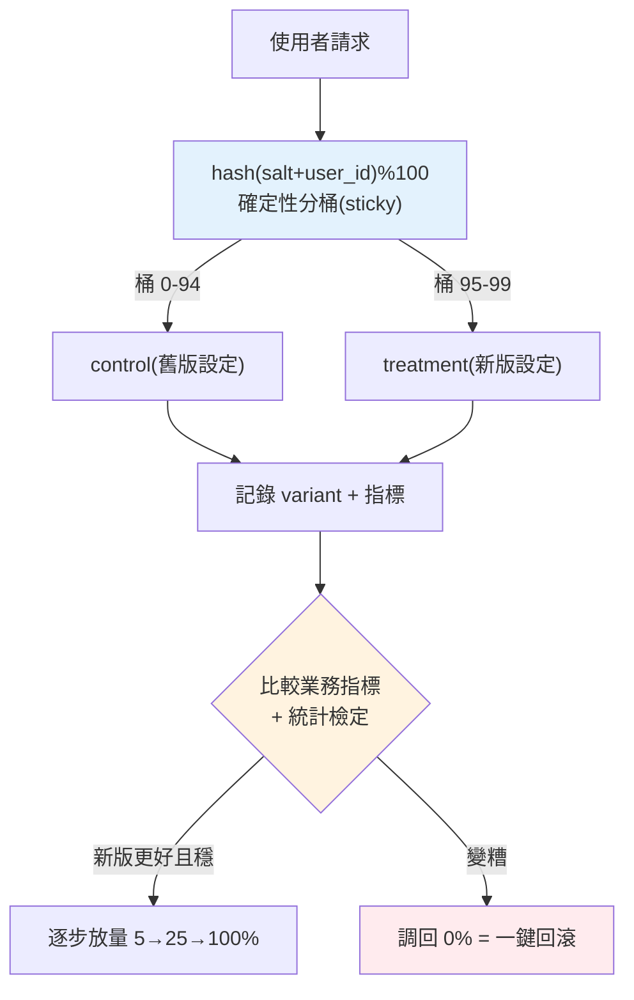

# A/B 測試、金絲雀與版本管理

> [評估閘門](07-eval-in-cicd.md)在**上線前**用固定評估集把關,但評估集不等於真實世界——真正的品質、使用者滿意度、業務指標,只有**真實流量**能驗證。這章講怎麼**安全地**把改動(新 prompt、新模型、新 [RAG 設定](../29-ai-applications/01-rag-pipeline.md))推上生產:金絲雀(小流量試水)、A/B 測試(對照比較)、版本管理(可追溯、可回滾)。

## 💡 白話導讀(建議先讀)

[評估閘門](07-eval-in-cicd.md)在**上線前**用固定評估集把關,但它有個天生局限:
**評估集不等於真實世界**。真正的品質、使用者買不買單,只有**真實流量**說了算。
這章講怎麼在生產環境裡**安全地發新版、並科學地判斷新版是不是真的更好**。

兩個常被混為一談、其實目的不同的機制:

- **金絲雀發布(canary)＝派礦工帶金絲雀下礦坑探氣**:
  新版先只放給 **1% 的流量**,緊盯「有沒有變糟」(錯誤率、延遲、成本、投訴)——
  沒爆就 5%、20%、100% 逐步放大。目的是**降低發布風險**,是一種**安全機制**。
- **A/B 測試＝做對照實驗**:新舊版各固定分一半流量**長跑**,
  用[統計檢定](../24-business-analytics/04-ab-test-statistics.md)判斷業務指標差異**是否顯著**。
  目的是**證明哪個更好**,是一種**決策機制**。

兩者常**接力使用**:先金絲雀確認新版「不會爆」,再 A/B 確認新版「真的更好」。

而要能做這些,前提是**版本化**——這章的另一半重點:
不只模型有版本,**prompt、檢索設定、參數**全都要版本化、可追溯、可**一鍵回滾**。
你得能回答「這個怪答案是哪個版本產生的」、「出事了怎麼立刻退回上一版」。
還有 LLM 特有的坑:**A/B 統計要小心**——
[新奇效應](../24-business-analytics/04-ab-test-statistics.md)(使用者只是好奇新版)、
指標怎麼選(別只看點擊,要看真正的價值)。這章把安全發布與科學決策的整套做法講清楚。

## Why(為什麼)

就算[離線評估](07-eval-in-cicd.md)過了,直接把改動**一次全量**推上生產仍很危險:

- **評估集蓋不到真實世界**:你的 [golden set](../29-ai-applications/04-rag-evaluation.md) 是有限樣本;真實使用者的問法千奇百怪,離線分數好不代表線上不出包。**只有真實流量能驗證真實品質**。
- **要看的是業務指標,不只評估分**:離線評估看「答案對不對」;但生產要看**使用者滿意度、任務完成率、留存、成本、延遲**——這些只有上線才量得到。一個離線分數高的新 prompt,可能讓回答變囉嗦而降低使用者滿意。
- **全量發布 = 全量風險**:新版有隱藏問題(某類問題爛掉、成本暴增、延遲上升),全量推出就是**所有使用者一起遭殃**,且出事要緊急回滾、影響面大。

**解法是漸進發布(progressive rollout)**:

- **金絲雀(canary)**:先讓**一小撮流量**(5%)走新版,盯著[指標](04-observability.md);沒問題再逐步放大(5% → 25% → 100%)。像礦坑金絲雀,小範圍先探雷。
- **A/B 測試**:把流量**分成對照組(control,舊版)與實驗組(treatment,新版)**,同時跑,**統計比較**兩組的業務指標,用數據決定新版是否真的更好。
- **版本管理**:每個 prompt/模型/設定版本可**追溯、可比較、可一鍵回滾**——出事能快速退回已知良好版本。

這讓改動的風險**可控**:小步、觀測、數據決策、可回滾。

## Theory(理論:金絲雀 vs A/B、分流)

**金絲雀 vs A/B——目的不同**:

- **金絲雀**:目的是**降低發布風險**。逐步放量,主要盯**有沒有變糟**(錯誤率、延遲、成本、投訴),沒變糟就繼續放大。是一種**安全發布機制**。
- **A/B 測試**:目的是**比較哪個更好**。固定比例(常 50/50 或多臂)長跑,**統計檢定**兩組業務指標差異是否顯著。是一種**實驗/決策機制**。

兩者常搭配:先金絲雀確認新版「不會爆」,再 A/B 確認新版「真的更好」。

**流量分流的關鍵:確定性 + sticky(黏著)**:

- **確定性(deterministic)**:用 `hash(salt + user_id) % 100` 決定使用者落哪個桶——**同一使用者永遠落同一組**。不能每次請求隨機分,否則同一使用者一下舊版一下新版,**體驗不一致**且**污染實驗**(無法歸因)。
- **salt(實驗鹽)**:每個實驗用不同 salt,讓同一使用者在**不同實驗**間的分組**獨立**(不會所有實驗都把同批人分到 treatment,造成交互污染)。
- **按比例分桶**:100 個桶按權重切給各 variant(95 桶 control、5 桶 treatment),hash 落哪桶決定 variant。

**統計顯著性**:A/B 的結論要有**統計檢定**(樣本量足夠、p-value、信賴區間),別看到「treatment 好一點」就下結論——可能是雜訊。需要足夠樣本與時間。

## Specification(規範:分流與版本)

**確定性分流**:

```text
bucket(user_id) = int(sha256(salt + ":" + user_id)[:8], 16) % 100
variant = 依累積權重找 bucket 落在哪個 variant 區間
```

**版本管理要素**:

- **版本化的 artifact**:prompt、模型 id、[RAG 參數](../29-ai-applications/02-chunking-strategies.md)、[護欄設定](06-guardrails.md)——都當**設定**版本控制(prompt 別 hardcode 在程式,存可版本化、可切換的配置)。
- **關聯[可觀測性](04-observability.md)**:每次呼叫記**版本 id**,才能按版本分組看指標、做 A/B 比較。
- **一鍵回滾**:出事能立刻切回上一個良好版本(feature flag / 設定切換,不必重新部署)。
- **漸進放量計畫**:金絲雀比例的推進步驟與**回滾觸發條件**(如錯誤率 > X% 自動回滾)。

**A/B 決策流程**:設假設 → 定主要指標(滿意度/完成率)+ 護欄指標(成本/延遲不能惡化)→ 分流跑足樣本 → 統計檢定 → 顯著更好才全量、否則回退。

## Implementation(底層:為何 hash 分流、prompt 當設定)

**為何用 hash 而非隨機或計數器**:分流要滿足「確定性 + 均勻 + 無狀態」。`hash(salt+user_id)` 完美符合——**確定性**(同輸入同輸出,sticky 免存狀態)、**均勻**(好的 hash 輸出均勻分布,分桶比例準)、**無狀態**(任何服務副本都算出同結果,不需查中央分組表)。用隨機會破壞 sticky;用計數器(第 1 個 user 給 A、第 2 個給 B)需共享狀態且易有順序偏差。下面範例的 `bucket` 用 SHA-256,10000 個使用者分 5% 得到 5.27%(接近 5%,hash 分布的正常波動),且同一 user 多次分流**完全一致**。

**為何 prompt/模型要當「設定」而非寫死程式**:若 prompt 硬編在程式碼裡,換 prompt = 改程式 + 重新部署 + 無法即時回滾 + 難以 A/B(要同時跑兩版程式)。把 prompt/模型 id/RAG 參數抽成**版本化設定**(config/feature flag/prompt registry),就能:**不改程式碼切換版本**、**同一份程式依 variant 載不同設定**、**一鍵回滾**、**每次呼叫記版本供[歸因](04-observability.md)**。這是 LLMOps 版本管理的基礎。下面範例實作確定性分流(金絲雀 + A/B)。

## Code Example(可執行的 Python 範例)

```python
# ab_testing.py — 確定性流量分流:金絲雀 + A/B(sticky,純標準庫)
from __future__ import annotations

import hashlib
from collections import Counter


def bucket(user_id: str, salt: str, buckets: int = 100) -> int:
    """確定性分桶:同一 user + salt 永遠落同一桶(sticky,無需存狀態)。"""
    digest = hashlib.sha256(f"{salt}:{user_id}".encode()).hexdigest()
    return int(digest[:8], 16) % buckets


def assign_variant(user_id: str, experiment: dict[str, object]) -> str:
    """依實驗權重分流。variants: list[(name, weight)],weight 加總 = 100。"""
    variants: list[tuple[str, int]] = experiment["variants"]  # type: ignore[assignment]
    salt: str = experiment["salt"]  # type: ignore[assignment]
    b = bucket(user_id, salt)
    cumulative = 0
    for name, weight in variants:
        cumulative += weight
        if b < cumulative:
            return name
    return variants[-1][0]


def main() -> None:
    # 金絲雀:5% 走新版 prompt,95% 走舊版
    canary: dict[str, object] = {
        "salt": "prompt-v2",
        "variants": [("control", 95), ("treatment", 5)],
    }
    counts = Counter(assign_variant(f"user{i}", canary) for i in range(10000))
    print(f"金絲雀 10000 人分流: {dict(counts)}")
    print(f"treatment 比例: {counts['treatment'] / 10000:.4f}(目標 0.05)")

    # sticky:同一 user 多次分流一致
    same = {assign_variant("user42", canary) for _ in range(5)}
    print(f"user42 五次分流(應一致): {same}")

    # 50/50 A/B(不同 salt,分組獨立)
    ab: dict[str, object] = {"salt": "model-test", "variants": [("A", 50), ("B", 50)]}
    ab_counts = Counter(assign_variant(f"u{i}", ab) for i in range(10000))
    print(f"A/B 50/50: {dict(ab_counts)}")


if __name__ == "__main__":
    main()
```

**預期輸出**:

```pycon
$ python ab_testing.py
金絲雀 10000 人分流: {'control': 9473, 'treatment': 527}
treatment 比例: 0.0527(目標 0.05)
user42 五次分流(應一致): {'control'}
A/B 50/50: {'B': 5014, 'A': 4986}
```

逐段解說:

- **`bucket`**:用 SHA-256 把 `salt:user_id` 雜湊成一個數,`% 100` 分到 0–99 桶。**確定性**(同輸入同輸出)、**均勻**(hash 分布均勻)、**無狀態**(任何副本算出同結果,不需中央分組表)。
- **金絲雀分流**:95 桶 control、5 桶 treatment。10000 人實際 5.27% 進 treatment——接近目標 5%(hash 分布的正常波動,樣本越大越準)。這讓新版只影響一小撮,盯[指標](04-observability.md)沒問題再放大。
- **sticky**:`user42` 五次分流**全是 control**——同一使用者永遠同組,**體驗一致**且**不污染實驗**(可正確歸因)。這是分流不能用隨機的原因。
- **獨立 salt**:A/B 用不同 salt(`model-test`),讓使用者在此實驗的分組與金絲雀實驗**獨立**(避免交互污染)。50/50 得到 49.86/50.14,很均衡。
- **從這到生產**:variant 決定載哪個**版本化 prompt/模型設定**(不改程式),每次呼叫[記 variant](04-observability.md),事後按 variant 比較業務指標 + 統計檢定。出事把 treatment 比例調回 0 即**一鍵回滾**。

## Diagram(圖解:漸進發布)



## Best Practice(最佳實踐)

- **改動漸進發布,別全量**:先金絲雀小流量探雷,再逐步放大。
- **確定性 + sticky 分流**:`hash(salt+user_id)`,同一使用者固定同組(體驗一致、實驗不污染)。
- **每個實驗獨立 salt**:避免不同實驗的分組交互污染。
- **prompt/模型/RAG 當版本化設定**:不改程式即可切換、A/B、一鍵回滾(別 hardcode)。
- **每次呼叫記 variant**([可觀測性](04-observability.md)):才能按版本分組比較指標。
- **A/B 看業務指標 + 護欄指標**:滿意度/完成率要漲,成本/延遲不能惡化;要**統計顯著**才下結論。
- **設自動回滾條件**:錯誤率/成本/延遲超閾值自動退回良好版本。
- **金絲雀先確認不爆,A/B 再確認更好**:兩者搭配。

## Common Mistakes(常見誤解)

- **直接全量發布**:新版隱藏問題讓所有使用者一起遭殃,回滾影響大。
- **隨機分流(非 sticky)**:同一使用者一下舊版一下新版,體驗亂、實驗無法歸因。
- **所有實驗用同一 salt**:同批人總被分到 treatment,實驗交互污染。
- **prompt hardcode 在程式**:換版本要改碼重部署,無法即時回滾/A B。
- **不記 variant**:無法按版本比較指標,A/B 形同虛設。
- **只看離線評估就全量**:評估集蓋不到真實世界與業務指標。
- **看到一點差異就下結論**:沒做統計檢定/樣本不足,把雜訊當訊號。
- **只看主要指標不看護欄**:滿意度漲了但成本/延遲爆了也不行。

## Interview Notes(面試重點)

- **能區分金絲雀 vs A/B**:金絲雀是安全發布(逐步放量盯有沒有變糟),A/B 是實驗決策(統計比較誰更好),常搭配。
- **能解釋確定性 sticky 分流**:`hash(salt+user_id)%100`,同一使用者固定同組,體驗一致、可歸因、無狀態。
- **能講 salt 的作用**:讓不同實驗分組獨立,避免交互污染。
- **能講 prompt/模型當版本化設定**:不改程式切換、A/B、一鍵回滾、記版本供歸因。
- **能講 A/B 要看業務 + 護欄指標且要統計顯著**,別把雜訊當訊號。
- **知道要設自動回滾條件**、漸進放量計畫。

---

➡️ 下一章:[資料飛輪與持續改進](09-data-flywheel.md)

[⬆️ 回 Part 30 索引](README.md)
