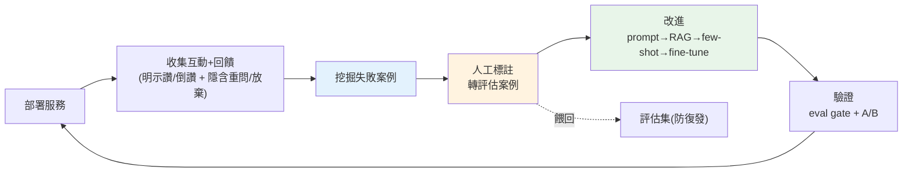

# 資料飛輪與持續改進

> 到這裡,你的 LLM 服務已經[能部署](02-serving-llm-apps.md)、[可靠](03-reliability.md)、[可觀測](04-observability.md)、[安全](05-prompt-injection-security.md)、[有品質閘門](07-eval-in-cicd.md)、[能安全發布](08-ab-testing-versioning.md)。但生產不是終點——**上線後才是持續改進的開始**。這章講**資料飛輪(data flywheel)**:用真實流量與使用者回饋,形成一個「越用越好」的自我強化迴圈,並談 RAG vs fine-tune 的改進決策。

## Why(為什麼)

一次性做好的 LLM 產品會**逐漸落後**:使用者的問法在變、世界的知識在變、競品在進步、你的[知識庫](../29-ai-applications/01-rag-pipeline.md)會過時。若沒有持續改進的機制,產品品質**停滯甚至退化**。

但持續改進**最寶貴的燃料**,恰恰是產品上線後才有的:**真實使用資料**。

- **真實流量暴露真問題**:使用者實際問的問題、實際踩的坑、實際不滿的地方——這些是你[離線評估集](../29-ai-applications/04-rag-evaluation.md)永遠想不全的。**線上的失敗案例是最珍貴的改進線索**。
- **使用者回饋是免費的標註**:讚/倒讚、重問、放棄、轉人工——這些訊號告訴你**哪些答案不好**,等於使用者幫你標了資料。
- **越多使用 → 越多資料 → 越好的產品 → 越多使用**:這就是**飛輪**——一個自我強化的正向循環。做對了,產品會**越用越好**,形成競爭護城河(別人沒有你的使用資料)。

**資料飛輪**就是把這個循環**工程化**:系統性地收集回饋、挖出失敗、轉成改進(擴充[評估集](07-eval-in-cicd.md)、優化 [prompt/RAG](../29-ai-applications/03-prompt-engineering.md)、必要時 fine-tune)、驗證、再上線——周而復始。這是 LLMOps 從「把系統跑起來」邁向「讓系統持續變強」的關鍵。

## Theory(理論:飛輪的循環)

資料飛輪是一個閉環(對應前面各章):

```text
1. 部署          → 服務真實使用者(ch02)
2. 收集          → 記錄互動 + 回饋(ch04 可觀測 + 明示/隱含訊號)
3. 挖掘          → 從線上找失敗案例(負評、重問、低信心、拒答)
4. 標註/整理     → 補正確答案,轉成新評估案例
5. 改進          → 擴充評估集 → 優化 prompt/RAG/(必要時)fine-tune
6. 驗證          → eval gate(ch07) + A/B(ch08)確認真的變好
7. 回到 1        → 上線,循環
```

**回饋訊號的種類**:

- **明示(explicit)**:使用者主動給的——讚/倒讚、評分、回報。準,但量少(多數人不點)。
- **隱含(implicit)**:從行為推斷——重問同一問題(暗示上次沒答好)、放棄/離開、複製答案(暗示有用)、轉人工客服(暗示 LLM 沒解決)。量大,但需解讀。

**閉環的關鍵:把線上失敗餵回[評估集](07-eval-in-cicd.md)**。這是飛輪最重要的一環——每個真實失敗變成一個評估案例後,**同樣的錯就再也不會悄悄復發**([eval gate](07-eval-in-cicd.md) 會擋),且評估集越來越貼近真實分布。

## Specification(規範:改進手段的選擇)

拿到失敗案例後,**怎麼改**有優先序(從便宜/快到貴/慢):

| 手段 | 適用 | 成本 |
|------|------|------|
| **改 prompt** | 指令不清、格式不對、遺漏規則 | 最低,先試 |
| **改 [RAG](../29-ai-applications/01-rag-pipeline.md)** | 答案錯因於檢索不到/知識過時 → 改 [chunking/檢索](../29-ai-applications/03-hybrid-retrieval-rerank.md)、更新知識庫 | 低—中 |
| **加 few-shot / 範例** | 特定類型答不好 → 給[範例](../29-ai-applications/03-prompt-engineering.md) | 低 |
| **換更強模型** | 推理/能力不足 | 中(成本升) |
| **fine-tune(微調)** | 需固定風格/格式/領域技能,且 prompt/RAG 都不夠 | 高(要資料、訓練、維運) |

**RAG vs fine-tune 的決策**(常見面試題,見 [Part 29 ch01](../29-ai-applications/01-rag-pipeline.md)):

- **要「新知識/最新/私有資料」→ RAG**:知識放外部易更新、可溯源、便宜。**多數「答不對」是知識問題,先 RAG。**
- **要「風格/格式/領域語氣/壓縮 prompt」→ fine-tune**:把重複的指令/風格訓進模型。但**貴、要標註資料、更新要重訓、不可溯源**——是最後手段,不是第一步。
- **常常兩者結合**:fine-tune 教「怎麼講」,RAG 供「講什麼」。

**原則:先窮盡便宜手段(prompt → RAG → few-shot),再考慮 fine-tune。**

## Implementation(底層:飛輪為何是護城河、避免回饋偏誤)

**為何飛輪是護城河**:LLM/模型本身大家都能用(都能呼叫 [Claude API](../28-llm-genai/02-calling-llm-api.md)),真正難複製的是**你累積的、針對你場景的使用資料與失敗案例**。競品可以抄你的功能,但抄不到你三年來收集的、涵蓋你使用者真實問法的[評估集](07-eval-in-cicd.md)與改進。飛輪轉得越久,這個資料資產越厚,護城河越深。這也是為何**盡早開始收集回饋**(即使還沒用到)如此重要。

**回饋的偏誤要當心**:

- **選擇偏誤**:主動給回饋的使用者不代表全體(通常極滿意或極不滿才會點讚/倒讚)。別把明示回饋當全貌,要結合隱含訊號與[取樣評估](04-observability.md)。
- **隱含訊號的歧義**:「重問」可能是上次沒答好,也可能是使用者換了個問法問新東西——要謹慎解讀,別過度自動化。
- **回饋不能無腦進訓練**:直接把「讚」的回答拿去 fine-tune 可能放大偏誤、甚至被[惡意回饋投毒](05-prompt-injection-security.md)。要**篩選、人工審核、驗證**。

**閉環的自動化程度**:挖掘失敗、彙總指標可自動;但**標註正確答案、決定改進方向、放進訓練**應保留**人工審核**——飛輪是「人機協作」的持續改進,不是全自動(全自動易累積偏誤與漂移)。下面範例實作飛輪的核心一環:從線上互動挖失敗、轉成評估案例、算滿意度。

## Code Example(可執行的 Python 範例)

```python
# data_flywheel.py — 資料飛輪:回饋統計 + 挖失敗 + 轉評估案例(純標準庫)
from __future__ import annotations

from dataclasses import dataclass


@dataclass
class Interaction:
    query: str
    answer: str
    feedback: str | None = None  # "up" | "down" | None(明示回饋)
    expected: str | None = None  # 人工標註的正確答案(挖掘後補)


def feedback_stats(logs: list[Interaction]) -> dict[str, float]:
    """彙總明示回饋:滿意度 = 讚 / (讚 + 倒讚)。"""
    up = sum(1 for i in logs if i.feedback == "up")
    down = sum(1 for i in logs if i.feedback == "down")
    total = up + down
    return {"up": up, "down": down, "satisfaction": round(up / total, 3) if total else 0.0}


def mine_failures(logs: list[Interaction]) -> list[Interaction]:
    """從線上互動挖失敗案例(此處用倒讚;真實也用重問/放棄/轉人工等隱含訊號)。"""
    return [i for i in logs if i.feedback == "down"]


def build_eval_cases(failures: list[Interaction]) -> list[dict[str, str]]:
    """把失敗案例轉成評估案例(補正確答案),餵回 eval 集(ch07)防復發。"""
    return [{"input": f.query, "expected": f.expected or "<待人工標註>"} for f in failures]


def main() -> None:
    logs = [
        Interaction("退貨政策?", "7 天內可退", feedback="up"),
        Interaction("運費多少?", "免運", feedback="down", expected="滿千免運,未滿收 100"),
        Interaction("營業時間?", "24 小時", feedback="down", expected="週一至五 9-18 點"),
        Interaction("付款方式?", "信用卡", feedback="up"),
    ]

    print(f"回饋統計: {feedback_stats(logs)}")

    failures = mine_failures(logs)
    print(f"挖到失敗案例: {len(failures)} 個")

    new_cases = build_eval_cases(failures)
    print("轉成新評估案例(餵回 eval 集):")
    for case in new_cases:
        print(f"  {case}")


if __name__ == "__main__":
    main()
```

**預期輸出**:

```pycon
$ python data_flywheel.py
回饋統計: {'up': 2, 'down': 2, 'satisfaction': 0.5}
挖到失敗案例: 2 個
轉成新評估案例(餵回 eval 集):
  {'input': '運費多少?', 'expected': '滿千免運,未滿收 100'}
  {'input': '營業時間?', 'expected': '週一至五 9-18 點'}
```

逐段解說:

- **`feedback_stats`**:彙總明示回饋,滿意度 50%(2 讚 2 倒讚)——這是**線上品質訊號**(呼應 [ch04](04-observability.md)),比離線評估更真實地反映使用者感受。
- **`mine_failures`**:挖出倒讚的互動(「運費」「營業時間」答錯了)。真實中還會用**隱含訊號**(重問、放棄、轉人工)挖更多——這些是**最珍貴的改進線索**(離線評估集想不到的真實失敗)。
- **`build_eval_cases`**:把失敗轉成**新評估案例**(補上正確答案,此處標記 `<待人工標註>` 代表需人工介入)。**這是飛輪最關鍵的一環**——餵回 [eval 集](07-eval-in-cicd.md)後,修好且[閘門](07-eval-in-cicd.md)會確保**同樣的錯不再復發**。
- **閉環**:挖到「運費」答錯 → 發現是[知識庫](../29-ai-applications/01-rag-pipeline.md)沒有運費規則(知識問題)→ **先更新 RAG 知識庫**(而非 fine-tune)→ eval gate 驗證 → [A/B](08-ab-testing-versioning.md) 上線 → 下次同類問題答對。飛輪轉一圈,產品變好一點。
- **人工在環**:標註正確答案、決定改進方向保留人工審核——飛輪是人機協作,非全自動(防偏誤累積)。

## Diagram(圖解:資料飛輪)



## Best Practice(最佳實踐)

- **盡早收集回饋**:即使還沒用到——使用資料是護城河,越早累積越厚。
- **明示 + 隱含訊號並用**:讚/倒讚量少,結合重問/放棄/轉人工等行為訊號。
- **把線上失敗餵回[評估集](07-eval-in-cicd.md)**:飛輪最關鍵一環,確保同樣的錯不復發、評估集貼近真實。
- **改進按成本優先序**:prompt → RAG → few-shot → 換模型 → fine-tune(先窮盡便宜的)。
- **知識問題先 RAG,別急著 fine-tune**:多數「答不對」是知識/檢索問題,RAG 便宜可溯源。
- **改進必經[驗證](07-eval-in-cicd.md)才上線**:eval gate + [A/B](08-ab-testing-versioning.md),別憑感覺。
- **當心回饋偏誤**:選擇偏誤、隱含訊號歧義;別無腦把回饋進訓練(篩選 + 人工審核)。
- **保留人工在環**:標註與改進決策要人審,飛輪是人機協作非全自動。

## Common Mistakes(常見誤解)

- **不收集回饋**:失去最珍貴的改進燃料,產品停滯落後。
- **收了回饋不餵回評估集**:同樣的失敗一再復發,沒有累積。
- **只看明示回饋**:選擇偏誤(只有極端使用者發聲),誤判整體品質。
- **一遇問題就想 fine-tune**:多數是知識/prompt 問題,fine-tune 貴又不可溯源,是最後手段。
- **把回饋無腦進訓練**:放大偏誤、可能被投毒;要篩選 + 人工審核。
- **隱含訊號過度解讀**:「重問」不一定是答錯,別過度自動化。
- **改進不驗證直接上線**:可能改壞別的(要 eval gate + A/B)。
- **全自動閉環無人審**:偏誤與漂移累積,品質失控。

## Interview Notes(面試重點)

- **能描述資料飛輪**:部署→收集回饋→挖失敗→標註→改進→驗證→再上線的自我強化閉環。
- **能講飛輪為何是護城河**:模型人人能用,你的使用資料/失敗案例難複製,越用越厚。
- **能講最關鍵一環**:把線上失敗餵回評估集,防復發、貼近真實分布。
- **能區分明示 vs 隱含回饋**:讚/倒讚(準少)vs 重問/放棄/轉人工(多需解讀)。
- **能講改進的成本優先序 + RAG vs fine-tune 決策**:先 prompt/RAG,fine-tune 是最後手段;知識問題用 RAG。
- **能講回饋偏誤與人工在環**:選擇偏誤、投毒風險,改進決策保留人審。

---

➡️ 下一章:[🏗️ Capstone:生產級 LLM 服務](10-capstone-llm-service.md)

[⬆️ 回 Part 30 索引](README.md)
